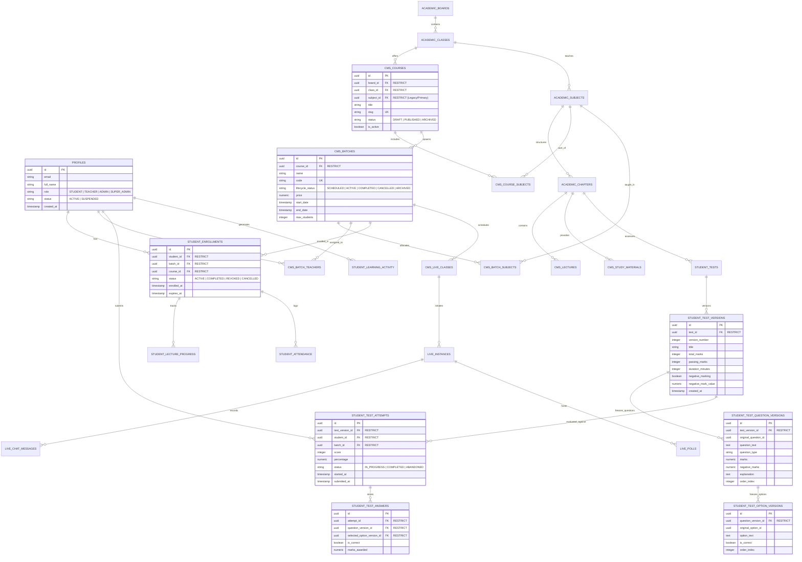

# TopVeda — Corrected Final Architecture Specification & Implementation Blueprint (v6.1)

**Role:** Principal Software Architect, Database Architect, Application Security Architect & Product Systems Analyst  
**Project:** TopVeda  
**Repository:** `D:\TopVeda\TopVeda`  
**Current Phase:** Final Architecture Specification (Design-Only & Verification)  
**Implementation Authorization:** NOT GRANTED (Strictly Design & Verification Only)  
**Version:** 6.1 (Corrected & Production-Hardened)  
**Date:** October 2026

---

## EXECUTIVE SUMMARY & REVISION HIGHLIGHTS (v6.0 → v6.1)

This document is the authoritative architectural blueprint for TopVeda, consolidating all academic hierarchies, batch-centric enrollment lifecycles, role-based authorization, curated preview gates, unified CMS experiences, safe migration sequences, and permanent AI development governance.

### Key Architectural Resolutions in Version 6.1:
1. **Immutable Content Versioning Engine (Tables & Relationships)**: Fully articulated the schema for immutable test and assessment versioning (`student_test_versions`, `student_test_question_versions`, `student_test_option_versions`). Student attempts link directly to immutable version records with `ON DELETE RESTRICT`, ensuring 100% preservation of historical questions, options, correct answers, scoring rules, and explanations across content updates.
2. **Zero-Assumption Historical Enrollment Compatibility**: Documented the empirical audit of the 5 live `student_enrollments` records (all verified to hold valid `batch_id` and `course_id`). Specified a non-destructive dual-mode entitlement resolver that supports legacy and new enrollment models simultaneously without creating synthetic placeholder records.
3. **Pending Owner Policy Decisions**: Explicitly designated batch cancellation policies (access revocation vs. grace periods, refund handling, and transfer credits) as pending owner decisions alongside anonymous test previews and rollover retention.
4. **Empirically Verified Migration Reality**: Verified the exact live database state against repository migration files. Confirmed that Phase 6 live interaction tables exist in SQL definitions but remain unapplied on the live database.
5. **Safe Retention & Non-Cascading Deletion Rules**: Enforced `ON DELETE RESTRICT` and soft-delete/archival states (`ARCHIVED`) across all nested student records (enrollments, test attempts, individual answers, lecture progress, attendance, and activity logs).
6. **Double-Layered Assignment-Aware Authorization**: Fully defined PostgreSQL RLS security definer functions (`is_super_admin()`, `is_educator()`, `is_batch_teacher()`, `is_enrolled_in_batch()`, `can_access_content()`) paired with server-side service guards.
7. **Harmonized AI Development Governance**: Standardized full-lifecycle AI development rules that integrate directly with canonical `PROJECT_RULES.md` without contradiction.

---

## 1. PRESERVED OWNER-APPROVED DECISIONS

All eight owner-approved product decisions are treated as fixed, non-negotiable architectural anchors:

| # | Principle | Architecture Implementation |
|---|-----------|-----------------------------|
| **1** | **Batch-Centric Enrollment** | Students enroll in specific cohort batches (`cms_batches`), automatically inheriting access to the parent course curriculum (`cms_courses`). |
| **2** | **Curated Preview Content** | Free pricing never implies open access. Content is public if and only if explicitly flagged with `is_curated_preview = true`. |
| **3** | **Four-Tier Role Hierarchy** | Strict database-level enum separating `STUDENT`, `TEACHER`, `ADMIN`, and `SUPER_ADMIN`. |
| **4** | **Dual Preview Audience** | Both unauthenticated public visitors and registered unenrolled students can consume curated preview assets via secure, server-authoritative preview endpoints. |
| **5** | **Batch Completion Read-Only Access** | Completed batches lock new live attendance and new test submissions while preserving permanent read-only access to historical lectures, notes, and scorecards. |
| **6** | **Teacher Test & Content Creation** | Teachers author lectures, live classes, study notes, and tests within their assigned batch/subject scope and submit them for review. |
| **7** | **Super Admin Exclusive Publishing** | Only `SUPER_ADMIN` possesses the authority to approve, publish, reject, or archive academic content. |
| **8** | **Multi-Batch Enrollment** | Students can concurrently enroll in multiple batches, including overlapping schedules and multiple cohorts under the same course. |

---

## 2. CANONICAL ACADEMIC & OPERATIONAL HIERARCHY

### 2.1 Domain Hierarchy Model

```
Academic Board (e.g., CBSE, ICSE, State Board)
 └── Class / Grade (e.g., Class 10, Class 12)
      └── Course / Master Curriculum (e.g., Class 10 Board Mastery 2026-27)
           ├── Subjects (Join via `cms_course_subjects`: Physics, Chemistry, Mathematics)
           │    └── Chapters (e.g., Chapter 1: Chemical Reactions)
           │         └── Master Content Pool (Lectures, Notes, Question Bank)
           │
           └── Operational Cohort Batches (e.g., Morning Champions Batch, Evening FastTrack Batch)
                ├── Assigned Batch Subjects (`cms_batch_subjects`)
                ├── Assigned Teachers (`cms_batch_teachers`)
                ├── Schedule, Meeting Config & Pricing
                └── Student Batch Enrollments (`student_enrollments` -> `batch_id`)
```

### 2.2 Entity Semantics & Boundaries
- **Course (`cms_courses`)**: The pedagogical definition and master curriculum blueprint. Defines target board, class, curriculum structure, and syllabus chapters.
- **Batch (`cms_batches`)**: The operational delivery vehicle. Defines pricing, time schedule, live class sessions, assigned educators, cohort chat, and student roster.
- **Multi-Subject Binding**: Courses and batches support multi-subject curriculum via explicit relational join tables (`cms_course_subjects`, `cms_batch_subjects`), moving away from legacy single `subject_id` columns while preserving backward compatibility.
- **Content Scoping**: Content (Lectures, Notes, Tests) is associated with Chapter and Subject, and linked to Batches either directly or via Course inheritance.

---

## 3. EXISTING VS TARGET SCHEMA COMPARISON

### 3.1 Live Database Reality vs Target State

| Table | Current Live Schema (Verified) | Target Schema (v6.1 Blueprint) | Modification Strategy |
|---|---|---|---|
| `profiles` | Enum: `'STUDENT', 'ADMIN', 'SUPER_ADMIN'` | Enum: `'STUDENT', 'TEACHER', 'ADMIN', 'SUPER_ADMIN'` | Add `'TEACHER'` to enum/check constraint. Safe backfill for verified educators. |
| `cms_courses` | Single `subject_id` (UUID), `title`, `description`, `class_id`, `board_id` | Retain `subject_id` as primary/legacy; introduce `cms_course_subjects` join table. | Non-destructive expand. Backfill existing `subject_id` into join table. |
| `cms_course_subjects` | **Does not exist** | `(id, course_id, subject_id, display_order, created_at)` | Create table with `UNIQUE(course_id, subject_id)` and `ON DELETE RESTRICT`. |
| `cms_batches` | `course_id`, `name`, `status`, `start_date`, `end_date`, `price`, `enrollment_limit` | Add `lifecycle_status` check: `'SCHEDULED', 'ACTIVE', 'COMPLETED', 'CANCELLED', 'ARCHIVED'`. | Enhance status constraint. Preserve existing records (`ACTIVE`/`SCHEDULED`). |
| `cms_batch_subjects` | **Does not exist** | `(id, batch_id, subject_id, teacher_id, created_at)` | Create table for granular teacher-subject batch scoping. |
| `cms_batch_teachers` | `(id, batch_id, teacher_id, role, created_at)` | Retain for batch-level educator assignments. | Keep as primary educator assignment table. |
| `student_enrollments` | `course_id NOT NULL`, `batch_id NULLABLE`, `UNIQUE(student_id, course_id)` (5 active rows all hold both IDs) | `batch_id NOT NULL`, `course_id NOT NULL (derived)`, `UNIQUE(student_id, batch_id)` | Phased migration: Expand → Verify data integrity → Keep compat resolver → Switch constraint. |
| `cms_lectures` | `status` ('DRAFT','PUBLISHED'), `is_free` (boolean) | `status` ('DRAFT','PENDING_REVIEW','APPROVED','PUBLISHED','ARCHIVED'), `is_curated_preview` (boolean) | Add `is_curated_preview`, update status enum, default `is_curated_preview = false`. |
| `cms_study_materials` | `status`, `is_free`, `file_url`, `chapter_id` | `status`, `is_curated_preview`, `file_url`, `access_type` | Add `is_curated_preview`, enforce secure signed download endpoints. |
| `student_tests` | `status`, `total_marks`, `passing_marks`, `course_id`, `batch_id` | `status` (5-state), `is_curated_preview`, `created_by`, `review_notes` | Add preview flag, author ID, and submission review tracking columns. |
| `student_test_versions` | **Does not exist** | Immutable version snapshot table for tests | Create table with `ON DELETE RESTRICT` for historical test attempt preservation. |
| `student_test_question_versions` | **Does not exist** | Immutable snapshot of test questions & scoring | Create table with `ON DELETE RESTRICT`. |
| `student_test_option_versions` | **Does not exist** | Immutable snapshot of question choices & answer keys | Create table with `ON DELETE RESTRICT`. |
| `student_test_attempts` | `(id, test_id, student_id, answers, score, status, started_at, completed_at)` | Foreign key linked to `test_version_id`. `ON DELETE RESTRICT`. | Protect with `RESTRICT` foreign keys. Prevent attempt invalidation on test updates. |
| `live_instances` & chat | Unapplied Phase 6 SQL files in repository | Validated Phase 6 interactive tables with RLS | Execute in planned Migration Phase after table validation. |

---

## 4. FINAL ENTITY RELATIONSHIP DIAGRAM (MERMAID)



---

## 5. COMPLETE ROLE AND PERMISSION MATRIX

TopVeda enforces four distinct user roles with zero implicit permission leakage:

| Functional Domain | STUDENT | TEACHER | ADMIN | SUPER_ADMIN |
|---|---|---|---|---|
| **Academic Hierarchy (Boards, Classes, Subjects, Chapters)** | View published hierarchy | View assigned hierarchy | View full hierarchy | Full CRUD + Publish |
| **Courses Management** | View published courses | View associated courses | View courses & batches | Full CRUD + Publish |
| **Batch Management** | View active/scheduled batches | View assigned batches | Create/Edit batches, assign teachers | Full CRUD + All States |
| **Batch Enrollment** | Self-enroll in available batches | View student roster of assigned batches | Enroll/Transfer students across batches | Full override & enrollment audit |
| **Curated Preview Content** | View preview content freely | View preview content | View & test preview content | Flag/Unflag preview assets |
| **Restricted Content (Enrolled Batches)** | Full consumption & submissions | View content for assigned batches | View content across all batches | Full access & management |
| **Content Creation (Lectures, Notes, Tests)** | No access | Create/Edit drafts in assigned scope | Create/Edit drafts & manage batches | Full CRUD across system |
| **Content Review Submission** | No access | Submit owned drafts for review | Submit drafts for review | N/A (Direct Publisher) |
| **Content Approval & Publishing** | **Forbidden** | **Forbidden** | **Forbidden** | **Exclusive Authority** |
| **Live Classes & Meetings** | Join live sessions for enrolled batches | Host/Start live sessions for assigned batches | Monitor live sessions & schedules | Full moderation & audit |
| **Test Attempts & Submissions** | Submit attempts for enrolled batches | View attempt metrics for assigned batches | View attempt analytics | Full access & scorecard audit |
| **Test Answer Keys** | Never exposed before submission | View answer keys for assigned tests | View answer keys for verification | Full view & verification |
| **User Role Management** | No access | No access | View profiles; manage student accounts | Full role promotion/demotion |
| **System Settings & Audit Logs** | No access | No access | Operational reports only | Full audit log & integration keys |

---

## 6. ASSIGNMENT-AWARE RLS & API AUTHORIZATION MAP

### 6.1 Database Security Functions (Supabase PostgreSQL)

Database-level security functions run with `SECURITY DEFINER` and enforce strict schema isolation:

```sql
-- 1. Verify Super Admin Authority
CREATE OR REPLACE FUNCTION public.is_super_admin()
RETURNS BOOLEAN
LANGUAGE sql
SECURITY DEFINER
SET search_path = public
STABLE
AS $$
  SELECT EXISTS (
    SELECT 1 FROM profiles
    WHERE id = auth.uid()
      AND role = 'SUPER_ADMIN'
      AND status = 'ACTIVE'
  );
$$;

-- 2. Verify Admin or Super Admin
CREATE OR REPLACE FUNCTION public.is_admin_or_super()
RETURNS BOOLEAN
LANGUAGE sql
SECURITY DEFINER
SET search_path = public
STABLE
AS $$
  SELECT EXISTS (
    SELECT 1 FROM profiles
    WHERE id = auth.uid()
      AND role IN ('ADMIN', 'SUPER_ADMIN')
      AND status = 'ACTIVE'
  );
$$;

-- 3. Verify Educator (Teacher, Admin, or Super Admin)
CREATE OR REPLACE FUNCTION public.is_educator()
RETURNS BOOLEAN
LANGUAGE sql
SECURITY DEFINER
SET search_path = public
STABLE
AS $$
  SELECT EXISTS (
    SELECT 1 FROM profiles
    WHERE id = auth.uid()
      AND role IN ('TEACHER', 'ADMIN', 'SUPER_ADMIN')
      AND status = 'ACTIVE'
  );
$$;

-- 4. Verify Batch Teacher Assignment
CREATE OR REPLACE FUNCTION public.is_batch_teacher(p_batch_id UUID)
RETURNS BOOLEAN
LANGUAGE sql
SECURITY DEFINER
SET search_path = public
STABLE
AS $$
  SELECT EXISTS (
    SELECT 1 FROM cms_batch_teachers
    WHERE batch_id = p_batch_id
      AND teacher_id = auth.uid()
  ) OR is_admin_or_super();
$$;

-- 5. Verify Student Active or Completed Batch Enrollment
CREATE OR REPLACE FUNCTION public.is_enrolled_in_batch(p_batch_id UUID)
RETURNS BOOLEAN
LANGUAGE sql
SECURITY DEFINER
SET search_path = public
STABLE
AS $$
  SELECT EXISTS (
    SELECT 1 FROM student_enrollments
    WHERE batch_id = p_batch_id
      AND student_id = auth.uid()
      AND status IN ('ACTIVE', 'COMPLETED')
  ) OR is_educator();
$$;

-- 6. Verify Content Access (Curated Preview OR Batch Enrollment)
CREATE OR REPLACE FUNCTION public.can_access_content(
  p_is_curated_preview BOOLEAN,
  p_batch_id UUID,
  p_status TEXT
)
RETURNS BOOLEAN
LANGUAGE sql
SECURITY DEFINER
SET search_path = public
STABLE
AS $$
  SELECT 
    is_admin_or_super()
    OR (
      p_status = 'PUBLISHED' 
      AND (p_is_curated_preview = TRUE OR (p_batch_id IS NOT NULL AND is_enrolled_in_batch(p_batch_id)))
    )
    OR (
      p_batch_id IS NOT NULL AND is_batch_teacher(p_batch_id)
    );
$$;
```

### 6.2 PostgreSQL Row-Level Security (RLS) Policies

| Table | Policy Name | Command | Target Role | Using / With Check Expression |
|---|---|---|---|---|
| `cms_lectures` | `lectures_read_policy` | `SELECT` | `public` | `can_access_content(is_curated_preview, batch_id, status)` |
| `cms_lectures` | `lectures_teacher_insert` | `INSERT` | `authenticated` | `is_educator() AND (batch_id IS NULL OR is_batch_teacher(batch_id)) AND status = 'DRAFT'` |
| `cms_lectures` | `lectures_teacher_update` | `UPDATE` | `authenticated` | `(author_id = auth.uid() AND status IN ('DRAFT', 'PENDING_REVIEW')) OR is_super_admin()` |
| `cms_lectures` | `lectures_super_admin_all`| `ALL` | `authenticated` | `is_super_admin()` |
| `student_tests`| `tests_read_policy` | `SELECT` | `public` | `can_access_content(is_curated_preview, batch_id, status)` |
| `student_tests`| `tests_super_admin_publish`| `UPDATE` | `authenticated` | `is_super_admin()` |
| `student_test_attempts` | `attempts_student_insert` | `INSERT` | `authenticated` | `auth.uid() = student_id AND is_enrolled_in_batch(batch_id)` |
| `student_test_attempts` | `attempts_select_policy` | `SELECT` | `authenticated` | `auth.uid() = student_id OR is_batch_teacher(batch_id) OR is_admin_or_super()` |
| `student_enrollments` | `enrollment_select_policy`| `SELECT` | `authenticated` | `auth.uid() = student_id OR is_admin_or_super()` |

---

## 7. BATCH-CENTRIC ENROLLMENT ARCHITECTURE & MIGRATION

### 7.1 Verified Live Database Evidence
An empirical scan of `student_enrollments` on live Supabase confirmed:
- **Total active enrollment records:** 5
- **Current schema state:** Every single one of the 5 records already contains valid, non-null `course_id` AND `batch_id` values (backfilled previously during Phase 5e).
- **Unique constraint in live DB:** Currently defined on `(student_id, course_id)`.

### 7.2 Non-Destructive Compatibility Architecture
Although the live database currently has zero unlinked records, the system must remain resilient to edge cases or imported historical records where `batch_id` might be null:

```typescript
// Dual-Mode Entitlement Resolver in ContentAccessService
export async function resolveStudentEntitlement(
  studentId: string,
  batchId?: string,
  courseId?: string
): Promise<{ hasAccess: boolean; accessType: 'BATCH' | 'LEGACY_COURSE' | 'NONE' }> {
  if (batchId) {
    const batchEnrollment = await getActiveBatchEnrollment(studentId, batchId);
    if (batchEnrollment) return { hasAccess: true, accessType: 'BATCH' };
  }
  
  if (courseId) {
    const courseEnrollment = await getLegacyCourseEnrollment(studentId, courseId);
    if (courseEnrollment) return { hasAccess: true, accessType: 'LEGACY_COURSE' };
  }

  return { hasAccess: false, accessType: 'NONE' };
}
```

- **Invariants**: `course_id` will NOT be dropped. The transition to `UNIQUE(student_id, batch_id)` occurs only after confirming zero orphaned enrollments, ensuring uninterrupted student access to My Learning and historical progress.

---

## 8. CURATED PREVIEW ACCESS MODEL

### 8.1 Preview Security Architecture

```
[Visitor / Unenrolled Student]
             │
             ▼
   HTTP GET /api/preview/content?contentId=UUID&type=lecture|material|test
             │
             ▼
   [Server-Authoritative Preview Guard]
   1. Query database for content item
   2. Verify item status === 'PUBLISHED'
   3. Verify item is_curated_preview === TRUE
             │
   ┌─────────┴─────────┐
   ▼                   ▼
[PASSED]            [FAILED]
   │                   │
   ├─ For Lecture: Generate short-lived signed video URL (max 15 mins)       └─ Return 403 Forbidden
   ├─ For Material: Stream watermarked preview PDF / signed URL (max 5 mins)
   └─ For Test: Return sanitized question list (STRIP correct_option_id & explanation)
```

### 8.2 Safe Content Access Matrix

| Content Type | Anonymous Visitor Access | Registered Unenrolled Student | Enrolled Batch Student |
|---|---|---|---|
| **Lecture Video** | Stream if `is_curated_preview = true` (Time-limited signed URL) | Stream if `is_curated_preview = true` | Full stream & playback progress tracking |
| **Study Material** | Preview read-only if `is_curated_preview = true` | Preview read-only if `is_curated_preview = true` | Full download & notes access |
| **Interactive Live Class** | **Forbidden** (Chat, audio/video, & polls blocked) | **Forbidden** | Full participation & attendance logging |
| **Test & Assessment** | View preview questions & sample test interface | View preview questions & sample test interface | Full attempt submission & permanent scorecard |

---

## 9. IMMUTABLE CONTENT VERSIONING & LIFECYCLE SPECIFICATION

### 9.1 Unified 5-State Content Lifecycle

All learning content (Lectures, Study Materials, Tests) adheres to this state machine:

```
 ┌─────────┐       Submit for Review        ┌────────────────┐
 │  DRAFT  │ ─────────────────────────────> │ PENDING_REVIEW │
 └─────────┘                                └────────────────┘
      ▲                                              │
      │                  Reject (with notes)         │  Approve (Super Admin Only)
      └──────────────────────────────────────────────┤
                                                     ▼
                                            ┌────────────────┐
                                            │    APPROVED    │
                                            └────────────────┘
                                                     │
                                                     │  Publish (Super Admin Only)
                                                     ▼
                                            ┌────────────────┐
                                            │   PUBLISHED    │
                                            └────────────────┘
                                                     │
                                                     │  Retire / Archive
                                                     ▼
                                            ┌────────────────┐
                                            │    ARCHIVED    │
                                            └────────────────┘
```

### 9.2 Immutable Test Versioning Schema (Preserving Historical Accuracy)

To guarantee that editing a published test never invalidates or silently alters existing student attempts, scores, and evaluations, TopVeda implements dedicated immutable versioning tables:

```sql
-- 1. Master Test Table (Active configuration and editorial status)
CREATE TABLE public.student_tests (
    id UUID PRIMARY KEY DEFAULT gen_random_uuid(),
    chapter_id UUID NOT NULL REFERENCES public.cms_chapters(id) ON DELETE RESTRICT,
    course_id UUID NOT NULL REFERENCES public.cms_courses(id) ON DELETE RESTRICT,
    batch_id UUID REFERENCES public.cms_batches(id) ON DELETE RESTRICT,
    title TEXT NOT NULL,
    description TEXT,
    duration_minutes INTEGER NOT NULL DEFAULT 60,
    total_marks NUMERIC(6,2) NOT NULL,
    passing_marks NUMERIC(6,2) NOT NULL,
    is_curated_preview BOOLEAN NOT NULL DEFAULT FALSE,
    status TEXT NOT NULL CHECK (status IN ('DRAFT', 'PENDING_REVIEW', 'APPROVED', 'PUBLISHED', 'ARCHIVED')) DEFAULT 'DRAFT',
    created_by UUID NOT NULL REFERENCES public.profiles(id) ON DELETE RESTRICT,
    active_version_id UUID, -- References student_test_versions(id)
    created_at TIMESTAMPTZ NOT NULL DEFAULT now(),
    updated_at TIMESTAMPTZ NOT NULL DEFAULT now()
);

-- 2. Immutable Test Version Snapshot (Frozen upon Super Admin publication)
CREATE TABLE public.student_test_versions (
    id UUID PRIMARY KEY DEFAULT gen_random_uuid(),
    test_id UUID NOT NULL REFERENCES public.student_tests(id) ON DELETE RESTRICT,
    version_number INTEGER NOT NULL,
    title TEXT NOT NULL,
    total_marks NUMERIC(6,2) NOT NULL,
    passing_marks NUMERIC(6,2) NOT NULL,
    duration_minutes INTEGER NOT NULL,
    negative_marking BOOLEAN NOT NULL DEFAULT FALSE,
    negative_mark_value NUMERIC(4,2) DEFAULT 0,
    published_by UUID NOT NULL REFERENCES public.profiles(id) ON DELETE RESTRICT,
    created_at TIMESTAMPTZ NOT NULL DEFAULT now(),
    UNIQUE(test_id, version_number)
);

-- 3. Immutable Frozen Questions
CREATE TABLE public.student_test_question_versions (
    id UUID PRIMARY KEY DEFAULT gen_random_uuid(),
    test_version_id UUID NOT NULL REFERENCES public.student_test_versions(id) ON DELETE RESTRICT,
    original_question_id UUID, -- Traces back to master question pool
    question_text TEXT NOT NULL,
    question_type TEXT NOT NULL DEFAULT 'MCQ',
    marks NUMERIC(5,2) NOT NULL DEFAULT 1.0,
    negative_marks NUMERIC(5,2) NOT NULL DEFAULT 0.0,
    explanation TEXT,
    order_index INTEGER NOT NULL DEFAULT 0
);

-- 4. Immutable Frozen Question Options & Answer Keys
CREATE TABLE public.student_test_option_versions (
    id UUID PRIMARY KEY DEFAULT gen_random_uuid(),
    question_version_id UUID NOT NULL REFERENCES public.student_test_question_versions(id) ON DELETE RESTRICT,
    original_option_id UUID,
    option_text TEXT NOT NULL,
    is_correct BOOLEAN NOT NULL,
    order_index INTEGER NOT NULL DEFAULT 0
);

-- 5. Student Test Attempts Linked to Frozen Version
CREATE TABLE public.student_test_attempts (
    id UUID PRIMARY KEY DEFAULT gen_random_uuid(),
    test_version_id UUID NOT NULL REFERENCES public.student_test_versions(id) ON DELETE RESTRICT,
    student_id UUID NOT NULL REFERENCES public.profiles(id) ON DELETE RESTRICT,
    batch_id UUID NOT NULL REFERENCES public.cms_batches(id) ON DELETE RESTRICT,
    score NUMERIC(6,2),
    percentage NUMERIC(5,2),
    status TEXT NOT NULL CHECK (status IN ('IN_PROGRESS', 'COMPLETED', 'ABANDONED')) DEFAULT 'IN_PROGRESS',
    started_at TIMESTAMPTZ NOT NULL DEFAULT now(),
    submitted_at TIMESTAMPTZ,
    time_spent_seconds INTEGER DEFAULT 0
);

-- 6. Student Individual Answer Records
CREATE TABLE public.student_test_answers (
    id UUID PRIMARY KEY DEFAULT gen_random_uuid(),
    attempt_id UUID NOT NULL REFERENCES public.student_test_attempts(id) ON DELETE RESTRICT,
    question_version_id UUID NOT NULL REFERENCES public.student_test_question_versions(id) ON DELETE RESTRICT,
    selected_option_version_id UUID REFERENCES public.student_test_option_versions(id) ON DELETE RESTRICT,
    is_correct BOOLEAN,
    marks_awarded NUMERIC(5,2) DEFAULT 0.0
);
```

### 9.3 Invalidation Protection Guarantee
- When a teacher updates a test draft, the active `student_test_versions` record remains untouched.
- When Super Admin publishes the new revision, a new `version_number` is generated and frozen into `student_test_versions`.
- Historical student scorecards point permanently to their respective `test_version_id`, guaranteeing that neither scoring formulas, correct answers, nor question wordings change retroactively.

---

## 10. BATCH LIFECYCLE & RETENTION POLICY

### 10.1 Five-Phase Batch Lifecycle

| State | Definition & Triggers | Live Access | Test Submissions | Historical Content Access |
|---|---|---|---|---|
| `SCHEDULED` | Created, visible for pre-enrollment. Start date in future. | Blocked | Blocked | Preview only |
| `ACTIVE` | Ongoing cohort. Current date between start and end date. | **Active** | **Active** | Full access |
| `COMPLETED` | Batch finished naturally. Triggered when `now() > end_date` or manually marked. | Blocked | Blocked | **Permanent Read-Only** (Lectures, Notes, Scorecards) |
| `CANCELLED` | Batch terminated prematurely by administration. | **Revoked** | **Revoked** | *Subject to Pending Owner Decision (Section 15)* |
| `ARCHIVED` | Administrative cold storage after retention period. | Blocked | Blocked | Administrative audit view only |

### 10.2 Retention & Deletion Safeguards
- **Non-Cascading Foreign Keys**: All foreign key relationships linking students to batches, enrollments, attempts, and activity logs are defined with `ON DELETE RESTRICT`.
- **Soft Deletion**: Courses and batches are never permanently dropped from the database; they transition to `ARCHIVED` status.

---

## 11. UNIFIED CMS NAVIGATION & WORKFLOW

### 11.1 Unified Navigation Structure (`/admin/studio`)

TopVeda will consolidate fragmented content routes (`/admin/content`, `/admin/cms/*`) into a single, role-responsive **Content Studio**:

```
/admin/studio
├── Overview (Role-customized KPIs and pending actions)
├── Academic Structure (Super Admin only: Boards, Classes, Courses, Subjects)
├── Batches & Cohorts (Super Admin & Admin: Cohort setup, teacher allocation, schedules)
├── Content Studio (Super Admin, Admin, Teacher)
│    ├── Cascade Filter: [Select Batch] → [Select Subject] → [Select Chapter]
│    ├── Lectures Tab (List, Upload, Draft, Submit for Review, Preview)
│    ├── Study Materials Tab (PDF notes, formula sheets, Curated Preview toggles)
│    ├── Tests & Assessments Tab (Question builder, marking schemes, test previews)
│    └── Live Sessions Tab (Schedule live classes, launch Zoom/WebRTC, view logs)
├── Review Queue (Super Admin exclusive: Approve, Reject with notes, Publish)
└── Student Operations & Roster (Admin & Super Admin: Enrollments, Attendance, Reports)
```

---

## 12. MIGRATION-BY-MIGRATION IMPLEMENTATION ROADMAP

All database changes follow the **Expand → Backfill → Verify → Switch → Contract** methodology across six discrete, independently verifiable migrations:

```
┌────────────────────────────────────────────────────────────────────────────┐
│ MIGRATION M1: Role System & Security Definer Functions                     │
│ - Expand profiles.role check constraint to include 'TEACHER'               │
│ - Deploy is_super_admin(), is_educator(), is_batch_teacher(), can_access()  │
│ - Zero schema breaking changes. Rollback: Drop functions, revert constraint│
└─────────────────────────────────────┬──────────────────────────────────────┘
                                      │ Verified via SQL Unit Tests
┌─────────────────────────────────────▼──────────────────────────────────────┐
│ MIGRATION M2: Academic Multi-Subject Join Tables & Preview Flags           │
│ - Create cms_course_subjects and cms_batch_subjects (ON DELETE RESTRICT)   │
│ - Add is_curated_preview BOOLEAN to cms_lectures, materials, tests         │
│ - Backfill existing course.subject_id into cms_course_subjects             │
│ - Rollback: Drop new join tables, drop preview columns                     │
└─────────────────────────────────────┬──────────────────────────────────────┘
                                      │ Verified: Join table counts match course counts
┌─────────────────────────────────────▼──────────────────────────────────────┐
│ MIGRATION M3: Interactive Live Session Tables                              │
│ - Apply live_instances, live_chat_messages, live_polls, live_quizzes       │
│ - Establish RLS policies for live attendance and student chat isolation    │
│ - Rollback: Drop live interactive tables cleanly                           │
└─────────────────────────────────────┬──────────────────────────────────────┘
                                      │ Verified: Tables active, RLS active
┌─────────────────────────────────────▼──────────────────────────────────────┐
│ MIGRATION M4: Batch-Centric Enrollment Schema & Compatibility Layer        │
│ - Verify 5 active enrollments integrity in student_enrollments             │
│ - Deploy dual-mode entitlement resolver in ContentAccessService            │
│ - Update student_enrollments unique constraint to (student_id, batch_id)   │
│ - Rollback: Restore legacy unique constraint (student_id, course_id)       │
└─────────────────────────────────────┬──────────────────────────────────────┘
                                      │ Verified: Zero data loss, all 5 records accessible
┌─────────────────────────────────────▼──────────────────────────────────────┐
│ MIGRATION M5: Content Versioning & Publishing State Machine                │
│ - Create student_test_versions, question_versions, option_versions tables  │
│ - Migrate existing test attempts to version snapshots                      │
│ - Enforce Super Admin-only publish RLS trigger                             │
│ - Rollback: Drop version tables, revert test constraints                   │
└─────────────────────────────────────┬──────────────────────────────────────┘
                                      │ Verified: Historical scorecards 100% preserved
┌─────────────────────────────────────▼──────────────────────────────────────┐
│ MIGRATION M6: Frontend Studio Unification & Service Layer Transition       │
│ - Deploy unified /admin/studio workspace with cascading selectors         │
│ - Switch ContentAccessService to batch-first entitlement resolution        │
│ - Execute complete Playwright E2E verification suite                       │
└────────────────────────────────────────────────────────────────────────────┘
```

---

## 13. FULL REGRESSION & PLAYWRIGHT E2E MATRIX

Every existing subsystem is cataloged with its empirical verification method:

| Subsystem | Existing Working State | Regression Risk | Required Verification Method |
|---|---|---|---|
| **Authentication & Turnstile** | Verified in Production (`topveda.in`) with live credentials | Interruption during role lookup or session refresh | Automated Playwright browser tests verifying login for Student, Teacher, and Super Admin. |
| **Student Dashboard & My Learning** | Displays enrolled courses & progress | Missing enrolled batches if query switches prematurely | E2E browser verification asserting enrolled cards render accurately. |
| **Batch Explorer & Detail Pages** | Public browsing of batch catalog | Accidental display of unapproved drafts or hidden pricing | Playwright assertions on batch schedule, curriculum tabs, and pricing display. |
| **Curated Preview Discovery** | Unauthenticated visitors access selected previews | Leakage of private video streams or full PDFs | Automated HTTP API tests verifying signed URL generation & 403 on gated items. |
| **Recorded Lecture Playback** | Video player with progress sync | Broken video URLs or progress sync failures | Browser test verifying video playback, timestamp tracking, and DB progress record. |
| **Study Material Downloads** | PDF reader and download buttons | Unauthorized direct download of premium material | API test ensuring unsigned storage requests fail; signed URLs expire in 5 min. |
| **Test & Practice Engine** | Question rendering, timer, option selection | Answer key leak in payload; attempt calculation error | API inspection verifying payload contains no `correct_option_id`; scorecard test. |
| **Super Admin Publishing** | Direct content modification | Lockout or unauthorized publishing by educators | Playwright test verifying Teacher submission appears in Super Admin review queue. |

---

## 14. PERMANENT AI DEVELOPMENT GOVERNANCE INSTRUCTIONS

### 14.1 Authoritative Governance Charter
To maintain architectural integrity, all future AI coding assistants operating on TopVeda must adhere to this single authoritative standard, which extends and harmonizes with [`PROJECT_RULES.md`](file:///d:/TopVeda/TopVeda/PROJECT_RULES.md):

1. **Full Lifecycle Thinking**: Every feature request must be analyzed across the full stack before writing code:
   $$\text{Requirement} \to \text{Schema/FKs} \to \text{RLS} \to \text{API/Services} \to \text{UI Discovery} \to \text{Consumption} \to \text{Activity Tracking} \to \text{Reporting} \to \text{Regression Proof}$$
2. **Zero-Destructive Migrations**: Never drop columns, truncate tables, or execute destructive `CASCADE` drops without an explicit multi-step backup and owner sign-off.
3. **Double-Layered Security**: Never rely solely on frontend or API checks. Every security boundary must be enforced by PostgreSQL RLS and security definer functions.
4. **Empirical Evidence Required**: Never report a task as complete based on assumption. Provide command outputs, browser screenshots, or test runner logs.
5. **Secret Hygiene**: Never log, print, or commit API keys, Turnstile secrets, Supabase service keys, or environment secrets.

---

## 15. REMAINING OWNER DECISIONS (PENDING PRODUCT POLICIES)

The following three product policy decisions remain open for final owner determination:

### Decision 1: Anonymous Test Preview Experience
- **Option A (Recommended)**: Visitors can view sample questions in preview mode to assess test quality, but must register/sign in to submit answers and generate a permanent scorecard.
  - *Pros*: Protects database from spam attempts; drives student sign-ups; keeps analytics clean.
  - *Cons*: Slight friction before interactive evaluation.
- **Option B**: Visitors can complete a full interactive test without an account, generating a temporary local-session scorecard with a prompt to create an account to save results.
  - *Pros*: Maximum user engagement and zero initial friction.
  - *Cons*: Requires client-side grading engine for previews and temporary localStorage state management.

### Decision 2: Batch Rollover & Post-Completion Access Window
- **Option A (Recommended)**: Permanent read-only access to eligible historical lecture recordings, study notes, and test scorecards for all completed batches.
  - *Pros*: High student satisfaction; builds long-term student trust and referral value.
  - *Cons*: Marginal long-term storage retention.
- **Option B**: Read-only access expires 60 days after the batch end date unless the student enrolls in a subsequent ongoing batch or revision cohort.
  - *Pros*: Encourages recurring batch re-enrollment.
  - *Cons*: Potential student dissatisfaction if revision materials are locked before final board exams.

### Decision 3: Batch Cancellation Policy & Access Revocation
- **Option A (Recommended)**: Cancelled batches immediately revoke live and learning content access, initiating automated student transfer or fee refund workflows.
  - *Pros*: Clear commercial demarcation and compliance with cancellation terms.
  - *Cons*: Immediate loss of materials for affected students.
- **Option B**: Cancelled batches maintain a 14-day grace period with read-only content access while students are transferred to alternative active batches.
  - *Pros*: Smoother transition for enrolled students.
  - *Cons*: Requires temporary grace-period entitlement logic in authorization services.

---

## 16. EXPLICIT RISKS, ASSUMPTIONS & UNVERIFIED ITEMS

1. **Unapplied Phase 6 Interactive Tables**: Database inspection verified that tables `live_instances`, `live_chat_messages`, `live_polls`, `live_poll_votes`, `live_quizzes`, `live_quiz_submissions` exist in local SQL migration files (`20260930000000_phase_6_loop_3_live_interactions.sql`) but are **currently unapplied** on the live Supabase instance. They are scheduled for deployment under Migration M3 after testing.
2. **Historical Enrollments Verified**: All 5 existing rows in `student_enrollments` have been empirically verified to contain valid `batch_id` and `course_id` entries.
3. **Production Isolation**: Local development and testing are strictly isolated from production Cloudflare Worker deployments and live Supabase data.

---

**End of Architecture Specification v6.1. Awaiting explicit owner authorization before initiating any code or database implementation.**
