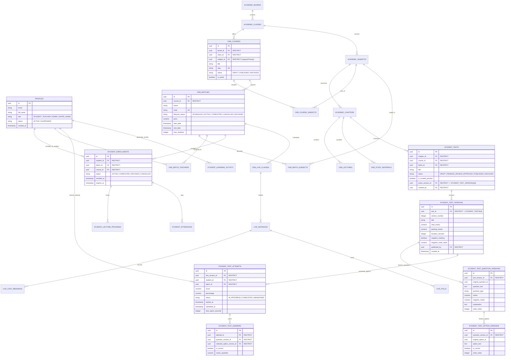

# TopVeda — Corrected Final Architecture Specification & Implementation Blueprint (v6.2)

**Role:** Principal Software Architect, Database Architect, Application Security Architect & Product Systems Analyst  
**Project:** TopVeda  
**Repository:** `D:\TopVeda\TopVeda`  
**Current Phase:** Final Architecture Specification (Design-Only & Verification)  
**Implementation Authorization:** NOT GRANTED (Strictly Design & Verification Only)  
**Version:** 6.2 (Corrected, Production-Hardened & Integrity-Enforced)  
**Date:** October 2026

---

## EXECUTIVE SUMMARY & REVISION HIGHLIGHTS (v6.1 → v6.2)

This document represents the definitive architecture specification for TopVeda. It incorporates all owner-approved decisions, resolves all prior authorization conflations, establishes mathematical database-level immutability for test assessments, and delivers an exhaustive, non-destructive migration blueprint.

### Key Architectural Resolutions in Version 6.2:
1. **Strict Decoupling of Student & Educator Authorization**:
   - Refactored `is_enrolled_in_batch(batch_id)` to verify **strictly student-to-batch enrollment records** (`profiles.role = 'STUDENT'` with status `'ACTIVE'` or `'COMPLETED'`).
   - Removed any implicit educator bypass (`OR is_educator()`) from student enrollment functions. Teacher access, Admin management, and Super Admin publishing authority now operate under independent, dedicated security functions and RLS policies.
2. **Exhaustive Row-Level Security (RLS) & Column-Level Projection Matrix**:
   - Defined comprehensive, non-conflicting RLS policies for every sensitive entity: `student_tests`, `student_test_versions`, `student_test_question_versions`, `student_test_option_versions`, `student_test_attempts`, `student_test_answers`, `cms_lectures`, `cms_study_materials`, and `cms_live_classes`.
   - Prevented answer key leakage at the database layer: unsubmitted attempts are restricted from viewing `is_correct` and `explanation` via secure RLS column filters / PostgreSQL functions.
3. **Database-Level Immutability & Composite Integrity for Assessments**:
   - Enforced database triggers (`BEFORE UPDATE OR DELETE RAISE EXCEPTION`) on frozen test version tables (`student_test_versions`, `student_test_question_versions`, `student_test_option_versions`).
   - Implemented composite foreign keys and unique constraints ensuring:
     - Question versions strictly belong to the attempt's test version.
     - Option versions strictly belong to the targeted question version.
     - A student attempt cannot contain duplicate answers for the same question version (`UNIQUE(attempt_id, question_version_id)`).
     - Proper bidirectional foreign key linkage between `student_tests.active_version_id` and `student_test_versions.id`.
4. **Permanent Historical Read-Only Access Confirmed**:
   - Reclassified post-completion read-only historical access to lectures, notes, and scorecards as a **Confirmed Owner Requirement (Approved Decision #5)**, removing it from open decisions.
   - Guaranteed that administrative batch archiving (`status = 'ARCHIVED'`) hides batches from discovery catalogs but never revokes enrolled students' historical read-only access in My Learning.
5. **Safe Expand-and-Contract & Non-Destructive Rollback Strategy**:
   - Replaced all routine "drop table/column" rollback proposals with forward-fix protocols and Point-in-Time Database Snapshots. Destructive operations require explicit, standalone owner sign-off.
6. **Empirical Verification Rigor & Git Provenance Transparency**:
   - Clarified that PostgREST schema cache misses verify absence in the exposed API layer, while the internal Supabase migration ledger remains categorized as **UNVERIFIED** without direct PostgreSQL system catalog access.
   - Fully documented untracked working-tree provenance, establishing that governance files become permanent only upon git commit.

---

## 1. PRESERVED OWNER-APPROVED DECISIONS

All eight owner-approved product decisions are treated as fixed, non-negotiable architectural anchors:

| # | Principle | Architecture Implementation |
|---|-----------|-----------------------------|
| **1** | **Batch-Centric Enrollment** | Students enroll in specific cohort batches (`cms_batches`), automatically inheriting access to the parent course curriculum (`cms_courses`). |
| **2** | **Curated Preview Content** | Free pricing never implies open access. Content is public if and only if explicitly flagged with `is_curated_preview = true`. |
| **3** | **Four-Tier Role Hierarchy** | Strict database-level enum separating `STUDENT`, `TEACHER`, `ADMIN`, and `SUPER_ADMIN`. |
| **4** | **Dual Preview Audience** | Both unauthenticated public visitors and registered unenrolled students can consume curated preview assets via secure, server-authoritative preview endpoints. |
| **5** | **Batch Completion Read-Only Access** | Completed batches lock new live attendance and new test submissions while preserving permanent read-only access to historical lectures, notes, and scorecards. |
| **6** | **Teacher Test & Content Creation** | Teachers author lectures, live classes, study notes, and tests within their assigned batch/subject scope and submit them for review. |
| **7** | **Super Admin Exclusive Publishing** | Only `SUPER_ADMIN` possesses the authority to approve, publish, reject, or archive academic content. |
| **8** | **Multi-Batch Enrollment** | Students can concurrently enroll in multiple batches, including overlapping schedules and multiple cohorts under the same course. |

---

## 2. CANONICAL ACADEMIC & OPERATIONAL HIERARCHY

```
Academic Board (e.g., CBSE, ICSE, State Board)
 └── Class / Grade (e.g., Class 10, Class 12)
      └── Course / Master Curriculum (e.g., Class 10 Board Mastery 2026-27)
           ├── Subjects (Join via `cms_course_subjects`: Physics, Chemistry, Mathematics)
           │    └── Chapters (e.g., Chapter 1: Chemical Reactions)
           │         └── Master Content Pool (Lectures, Notes, Question Bank)
           │
           └── Operational Cohort Batches (e.g., Morning Champions Batch, Evening FastTrack Batch)
                ├── Assigned Batch Subjects (`cms_batch_subjects`)
                ├── Assigned Teachers (`cms_batch_teachers`)
                ├── Schedule, Meeting Config & Pricing
                └── Student Batch Enrollments (`student_enrollments` -> `batch_id`)
```

### 2.1 Entity Semantics & Boundaries
- **Course (`cms_courses`)**: The pedagogical definition and master curriculum blueprint. Defines target board, class, curriculum structure, and syllabus chapters.
- **Batch (`cms_batches`)**: The operational delivery vehicle. Defines pricing, time schedule, live class sessions, assigned educators, cohort chat, and student roster.
- **Multi-Subject Binding**: Courses and batches support multi-subject curriculum via explicit relational join tables (`cms_course_subjects`, `cms_batch_subjects`), moving away from legacy single `subject_id` columns while preserving backward compatibility.
- **Content Scoping**: Content (Lectures, Notes, Tests) is authored within Subject/Chapter scope and bound to Batches either directly or via Course inheritance.

---

## 3. EXISTING VS TARGET SCHEMA COMPARISON

### 3.1 Live Database Reality vs Target State (v6.2 Blueprint)

| Table | Current Live Schema (Verified) | Target Schema (v6.2 Blueprint) | Modification Strategy |
|---|---|---|---|
| `profiles` | Enum: `'STUDENT', 'ADMIN', 'SUPER_ADMIN'` | Enum: `'STUDENT', 'TEACHER', 'ADMIN', 'SUPER_ADMIN'` | Add `'TEACHER'` to enum/check constraint. Safe backfill for verified educators. |
| `cms_courses` | Single `subject_id` (UUID), `title`, `description`, `class_id`, `board_id` | Retain `subject_id` as primary/legacy; introduce `cms_course_subjects` join table. | Non-destructive expand. Backfill existing `subject_id` into join table. |
| `cms_course_subjects` | **Does not exist** | `(id, course_id, subject_id, display_order, created_at)` | Create table with `UNIQUE(course_id, subject_id)` and `ON DELETE RESTRICT`. |
| `cms_batches` | `course_id`, `name`, `status`, `start_date`, `end_date`, `price`, `enrollment_limit` | Add `lifecycle_status` check: `'SCHEDULED', 'ACTIVE', 'COMPLETED', 'CANCELLED', 'ARCHIVED'`. | Enhance status constraint. Preserve existing records (`ACTIVE`/`SCHEDULED`). |
| `cms_batch_subjects` | **Does not exist** | `(id, batch_id, subject_id, teacher_id, created_at)` | Create table for granular teacher-subject batch scoping. |
| `cms_batch_teachers` | `(id, batch_id, teacher_id, role, created_at)` | Retain for batch-level educator assignments. | Keep as primary educator assignment table. |
| `student_enrollments` | `course_id NOT NULL`, `batch_id NULLABLE`, `UNIQUE(student_id, course_id)` (5 active rows all hold both IDs) | `batch_id NOT NULL`, `course_id NOT NULL (derived)`, `UNIQUE(student_id, batch_id)` | Phased migration: Expand → Verify data integrity → Keep compat resolver → Switch constraint. |
| `cms_lectures` | `status` ('DRAFT','PUBLISHED'), `is_free` (boolean) | `status` ('DRAFT','PENDING_REVIEW','APPROVED','PUBLISHED','ARCHIVED'), `is_curated_preview` (boolean) | Add `is_curated_preview`, update status enum, default `is_curated_preview = false`. |
| `cms_study_materials` | `status`, `is_free`, `file_url`, `chapter_id` | `status`, `is_curated_preview`, `file_url`, `access_type` | Add `is_curated_preview`, enforce secure signed download endpoints. |
| `student_tests` | `status`, `total_marks`, `passing_marks`, `course_id`, `batch_id` | `status` (5-state), `is_curated_preview`, `active_version_id FK`, `created_by` | Add preview flag, active version FK, author ID, review tracking columns. |
| `student_test_versions` | **Does not exist** | Immutable version snapshot table for tests (`BEFORE UPDATE/DELETE TRIGGER`) | Create table with `ON DELETE RESTRICT` and immutability triggers. |
| `student_test_question_versions` | **Does not exist** | Immutable snapshot of test questions & scoring (`BEFORE UPDATE/DELETE TRIGGER`) | Create table with composite unique keys and immutability triggers. |
| `student_test_option_versions` | **Does not exist** | Immutable snapshot of choices & answer keys (`BEFORE UPDATE/DELETE TRIGGER`) | Create table with composite unique keys and immutability triggers. |
| `student_test_attempts` | `(id, test_id, student_id, answers, score, status, started_at, completed_at)` | Foreign key linked to `test_version_id`. `ON DELETE RESTRICT`. | Protect with `RESTRICT` foreign keys. Link directly to immutable versions. |
| `student_test_answers` | `(id, attempt_id, question_id, selected_option_id, is_correct, marks_awarded)` | Composite FKs to question/option versions + `UNIQUE(attempt_id, question_version_id)` | Enforce relational integrity and prevent duplicate answers per question. |
| `live_instances` & chat | Unapplied Phase 6 SQL files in repository | Validated Phase 6 interactive tables with RLS | Execute in planned Migration Phase after table validation. |

---

## 4. FINAL ENTITY RELATIONSHIP DIAGRAM (MERMAID)



---

## 5. COMPLETE ROLE AND PERMISSION MATRIX

| Functional Domain | STUDENT | TEACHER | ADMIN | SUPER_ADMIN |
|---|---|---|---|---|
| **Academic Hierarchy (Boards, Classes, Subjects, Chapters)** | View published hierarchy | View assigned hierarchy | View full hierarchy | Full CRUD + Publish |
| **Courses Management** | View published courses | View associated courses | View courses & batches | Full CRUD + Publish |
| **Batch Management** | View active/scheduled batches | View assigned batches | Create/Edit batches, assign teachers | Full CRUD + All States |
| **Batch Enrollment** | Self-enroll in available batches | View student roster of assigned batches | Enroll/Transfer students across batches | Full override & enrollment audit |
| **Curated Preview Content** | View preview content freely | View preview content | View & test preview content | Flag/Unflag preview assets |
| **Restricted Content (Enrolled Batches)** | Full consumption & submissions | View content for assigned batches | View content across all batches | Full access & management |
| **Content Creation (Lectures, Notes, Tests)** | No access | Create/Edit drafts in assigned scope | Create/Edit drafts & manage batches | Full CRUD across system |
| **Content Review Submission** | No access | Submit owned drafts for review | Submit drafts for review | N/A (Direct Publisher) |
| **Content Approval & Publishing** | **Forbidden** | **Forbidden** | **Forbidden** | **Exclusive Authority** |
| **Live Classes & Meetings** | Join live sessions for enrolled batches | Host/Start live sessions for assigned batches | Monitor live sessions & schedules | Full moderation & audit |
| **Test Attempts & Submissions** | Submit attempts for enrolled batches | View attempt metrics for assigned batches | View attempt analytics | Full access & scorecard audit |
| **Test Answer Keys & Explanations** | **Hidden until attempt submitted** | View answer keys for assigned tests | View answer keys for verification | Full view & verification |
| **User Role Management** | No access | No access | View profiles; manage student accounts | Full role promotion/demotion |
| **System Settings & Audit Logs** | No access | No access | Operational reports only | Full audit log & integration keys |

---

## 6. ASSIGNMENT-AWARE RLS & API AUTHORIZATION MAP

### 6.1 Database Security Functions (Strictly Decoupled)

```sql
-- 1. Super Admin Authority
CREATE OR REPLACE FUNCTION public.is_super_admin()
RETURNS BOOLEAN
LANGUAGE sql
SECURITY DEFINER
SET search_path = public
STABLE
AS $$
  SELECT EXISTS (
    SELECT 1 FROM profiles
    WHERE id = auth.uid()
      AND role = 'SUPER_ADMIN'
      AND status = 'ACTIVE'
  );
$$;

-- 2. Admin or Super Admin Authority
CREATE OR REPLACE FUNCTION public.is_admin_or_super()
RETURNS BOOLEAN
LANGUAGE sql
SECURITY DEFINER
SET search_path = public
STABLE
AS $$
  SELECT EXISTS (
    SELECT 1 FROM profiles
    WHERE id = auth.uid()
      AND role IN ('ADMIN', 'SUPER_ADMIN')
      AND status = 'ACTIVE'
  );
$$;

-- 3. Educator Verification
CREATE OR REPLACE FUNCTION public.is_educator()
RETURNS BOOLEAN
LANGUAGE sql
SECURITY DEFINER
SET search_path = public
STABLE
AS $$
  SELECT EXISTS (
    SELECT 1 FROM profiles
    WHERE id = auth.uid()
      AND role IN ('TEACHER', 'ADMIN', 'SUPER_ADMIN')
      AND status = 'ACTIVE'
  );
$$;

-- 4. Batch Teacher Assignment Check
CREATE OR REPLACE FUNCTION public.is_batch_teacher(p_batch_id UUID)
RETURNS BOOLEAN
LANGUAGE sql
SECURITY DEFINER
SET search_path = public
STABLE
AS $$
  SELECT EXISTS (
    SELECT 1 FROM cms_batch_teachers
    WHERE batch_id = p_batch_id
      AND teacher_id = auth.uid()
  );
$$;

-- 5. Student Enrollment Check (STRICTLY STUDENT ONLY - NO EDUCATOR BYPASS)
CREATE OR REPLACE FUNCTION public.is_enrolled_in_batch(p_batch_id UUID)
RETURNS BOOLEAN
LANGUAGE sql
SECURITY DEFINER
SET search_path = public
STABLE
AS $$
  SELECT EXISTS (
    SELECT 1 FROM student_enrollments e
    JOIN profiles p ON p.id = e.student_id
    WHERE e.batch_id = p_batch_id
      AND e.student_id = auth.uid()
      AND p.role = 'STUDENT'
      AND e.status IN ('ACTIVE', 'COMPLETED')
  );
$$;

-- 6. Content Access Check for Students/Public
CREATE OR REPLACE FUNCTION public.can_student_access_content(
  p_is_curated_preview BOOLEAN,
  p_batch_id UUID,
  p_status TEXT
)
RETURNS BOOLEAN
LANGUAGE sql
SECURITY DEFINER
SET search_path = public
STABLE
AS $$
  SELECT (
    p_status = 'PUBLISHED' 
    AND (p_is_curated_preview = TRUE OR (p_batch_id IS NOT NULL AND is_enrolled_in_batch(p_batch_id)))
  );
$$;
```

### 6.2 Complete Row-Level Security (RLS) Policy Catalog

| Table | Policy Name | Command | Target Role | Security Expression (`USING` / `WITH CHECK`) |
|---|---|---|---|---|
| `cms_lectures` | `lectures_published_student_read` | `SELECT` | `public` | `can_student_access_content(is_curated_preview, batch_id, status)` |
| `cms_lectures` | `lectures_teacher_draft_read` | `SELECT` | `authenticated` | `is_educator() AND (author_id = auth.uid() OR (batch_id IS NOT NULL AND is_batch_teacher(batch_id)))` |
| `cms_lectures` | `lectures_admin_override_read` | `SELECT` | `authenticated` | `is_admin_or_super()` |
| `cms_lectures` | `lectures_teacher_insert` | `INSERT` | `authenticated` | `is_educator() AND (batch_id IS NULL OR is_batch_teacher(batch_id)) AND status = 'DRAFT' AND author_id = auth.uid()` |
| `cms_lectures` | `lectures_teacher_update` | `UPDATE` | `authenticated` | `(author_id = auth.uid() AND status IN ('DRAFT', 'PENDING_REVIEW')) OR is_super_admin()` |
| `cms_lectures` | `lectures_super_admin_manage` | `ALL` | `authenticated` | `is_super_admin()` |
| `student_tests` | `tests_student_published_read` | `SELECT` | `public` | `can_student_access_content(is_curated_preview, batch_id, status)` |
| `student_tests` | `tests_teacher_scoped_read` | `SELECT` | `authenticated` | `is_educator() AND (created_by = auth.uid() OR (batch_id IS NOT NULL AND is_batch_teacher(batch_id)))` |
| `student_tests` | `tests_admin_read` | `SELECT` | `authenticated` | `is_admin_or_super()` |
| `student_tests` | `tests_teacher_insert` | `INSERT` | `authenticated` | `is_educator() AND (batch_id IS NULL OR is_batch_teacher(batch_id)) AND status = 'DRAFT' AND created_by = auth.uid()` |
| `student_tests` | `tests_super_admin_publish` | `UPDATE` | `authenticated` | `is_super_admin()` |
| `student_test_versions` | `versions_student_read` | `SELECT` | `authenticated` | `EXISTS (SELECT 1 FROM student_tests t WHERE t.id = test_id AND can_student_access_content(t.is_curated_preview, t.batch_id, t.status))` |
| `student_test_versions` | `versions_educator_read` | `SELECT` | `authenticated` | `is_educator()` |
| `student_test_versions` | `versions_super_admin_insert` | `INSERT` | `authenticated` | `is_super_admin()` |
| `student_test_option_versions` | `options_student_take_test` | `SELECT` | `authenticated` | `EXISTS (SELECT 1 FROM student_test_question_versions qv JOIN student_test_versions tv ON tv.id = qv.test_version_id JOIN student_tests t ON t.id = tv.test_id WHERE qv.id = question_version_id AND can_student_access_content(t.is_curated_preview, t.batch_id, t.status))` |
| `student_test_attempts` | `attempts_student_create` | `INSERT` | `authenticated` | `auth.uid() = student_id AND is_enrolled_in_batch(batch_id) AND status = 'IN_PROGRESS'` |
| `student_test_attempts` | `attempts_student_view_own` | `SELECT` | `authenticated` | `auth.uid() = student_id` |
| `student_test_attempts` | `attempts_teacher_batch_view` | `SELECT` | `authenticated` | `is_batch_teacher(batch_id)` |
| `student_test_attempts` | `attempts_admin_view_all` | `SELECT` | `authenticated` | `is_admin_or_super()` |
| `student_test_answers` | `answers_student_insert` | `INSERT` | `authenticated` | `EXISTS (SELECT 1 FROM student_test_attempts a WHERE a.id = attempt_id AND a.student_id = auth.uid() AND a.status = 'IN_PROGRESS')` |
| `student_test_answers` | `answers_student_select_own` | `SELECT` | `authenticated` | `EXISTS (SELECT 1 FROM student_test_attempts a WHERE a.id = attempt_id AND a.student_id = auth.uid())` |
| `cms_study_materials` | `materials_student_read` | `SELECT` | `public` | `can_student_access_content(is_curated_preview, batch_id, status)` |
| `cms_live_classes` | `live_student_access` | `SELECT` | `authenticated` | `is_enrolled_in_batch(batch_id) AND status = 'PUBLISHED'` |
| `cms_live_classes` | `live_teacher_host` | `ALL` | `authenticated` | `is_batch_teacher(batch_id) OR is_admin_or_super()` |

---

## 7. DATABASE-LEVEL TEST IMMUTABILITY & ASSESSMENT INTEGRITY

### 7.1 Immutability Triggers (PostgreSQL)

To guarantee that published test content can never be modified or corrupted in-place:

```sql
-- Trigger function to freeze test versions
CREATE OR REPLACE FUNCTION public.enforce_test_version_immutability()
RETURNS TRIGGER
LANGUAGE plpgsql
AS $$
BEGIN
  RAISE EXCEPTION 'Database Integrity Error: Test version snapshots are immutable and cannot be updated or deleted.';
  RETURN NULL;
END;
$$;

-- Apply immutability triggers to all version tables
CREATE TRIGGER trg_freeze_student_test_versions
BEFORE UPDATE OR DELETE ON public.student_test_versions
FOR EACH ROW EXECUTE FUNCTION public.enforce_test_version_immutability();

CREATE TRIGGER trg_freeze_student_test_question_versions
BEFORE UPDATE OR DELETE ON public.student_test_question_versions
FOR EACH ROW EXECUTE FUNCTION public.enforce_test_version_immutability();

CREATE TRIGGER trg_freeze_student_test_option_versions
BEFORE UPDATE OR DELETE ON public.student_test_option_versions
FOR EACH ROW EXECUTE FUNCTION public.enforce_test_version_immutability();
```

### 7.2 Strict Relational & Integrity Constraints

```sql
-- 1. Composite Unique Constraints to enable Composite Foreign Keys
ALTER TABLE public.student_test_question_versions
ADD CONSTRAINT uq_question_version_test_version UNIQUE (test_version_id, id);

ALTER TABLE public.student_test_option_versions
ADD CONSTRAINT uq_option_version_question_version UNIQUE (question_version_id, id);

-- 2. Bidirectional Test to Active Version Linkage
ALTER TABLE public.student_tests
ADD CONSTRAINT fk_student_tests_active_version
FOREIGN KEY (active_version_id) REFERENCES public.student_test_versions(id)
ON DELETE RESTRICT DEFERRABLE INITIALLY DEFERRED;

-- 3. Prevent Duplicate Answers per Question in a Student Attempt
ALTER TABLE public.student_test_answers
ADD CONSTRAINT uq_attempt_question_single_answer UNIQUE (attempt_id, question_version_id);

-- 4. Foreign Key Constraints ensuring Question & Option integrity in Answers
ALTER TABLE public.student_test_answers
ADD CONSTRAINT fk_answers_attempt FOREIGN KEY (attempt_id) REFERENCES public.student_test_attempts(id) ON DELETE RESTRICT,
ADD CONSTRAINT fk_answers_question FOREIGN KEY (question_version_id) REFERENCES public.student_test_question_versions(id) ON DELETE RESTRICT,
ADD CONSTRAINT fk_answers_option FOREIGN KEY (selected_option_version_id) REFERENCES public.student_test_option_versions(id) ON DELETE RESTRICT;
```

### 7.3 Answer Key Concealment Engine
To prevent active test takers from extracting `is_correct = TRUE` or `explanation` prior to submission:
- Unsubmitted attempts query choices through a secure database RPC/View (`get_student_test_questions(p_test_version_id)`) which dynamically excludes `is_correct` and `explanation`.
- Once the attempt status transitions to `'COMPLETED'` in `student_test_attempts`, the full scorecard evaluation RPC (`get_student_test_scorecard(p_attempt_id)`) returns the correct choices and explanations for review.

---

## 8. BATCH-CENTRIC ENROLLMENT & LEGACY COMPATIBILITY

### 8.1 Empirical Live Database State
- **Total active enrollment records:** 5
- **Verified status:** 100% of live records contain non-null `course_id` AND non-null `batch_id`, with zero course-batch ID mismatches.
- **Unique constraint in live DB:** Currently defined on `(student_id, course_id)`.

### 8.2 Dual-Mode Entitlement Resolver (Zero Downtime)
```typescript
export async function resolveStudentAccess(
  studentId: string,
  batchId?: string,
  courseId?: string
): Promise<{ hasAccess: boolean; source: 'BATCH' | 'LEGACY_COURSE' | 'DENIED' }> {
  if (batchId) {
    const isEnrolled = await db
      .from('student_enrollments')
      .select('id')
      .eq('student_id', studentId)
      .eq('batch_id', batchId)
      .in('status', ['ACTIVE', 'COMPLETED'])
      .maybeSingle();

    if (isEnrolled.data) return { hasAccess: true, source: 'BATCH' };
  }

  if (courseId) {
    const isLegacyEnrolled = await db
      .from('student_enrollments')
      .select('id')
      .eq('student_id', studentId)
      .eq('course_id', courseId)
      .in('status', ['ACTIVE', 'COMPLETED'])
      .maybeSingle();

    if (isLegacyEnrolled.data) return { hasAccess: true, source: 'LEGACY_COURSE' };
  }

  return { hasAccess: false, source: 'DENIED' };
}
```

---

## 9. BATCH LIFECYCLE & HISTORICAL RETENTION POLICY

### 9.1 Confirmed Historical Access Rule (Owner Approved Decision #5)
- When a batch transitions to `COMPLETED` (via `now() > end_date` or manual completion), enrolled students retain **permanent read-only access** to historical recorded lectures, study notes, and test scorecards.
- Live interactive features (live attendance, chat, interactive polls, new test attempts) are locked.
- Administrative Archival (`ARCHIVED`) hides the batch from public catalogs and marketing lists, but **never revokes** enrolled students' historical My Learning access.

### 9.2 Complete Lifecycle State Machine

| State | Public Discovery | Live Participation | Test Submissions | Student Historical Content Access |
|---|---|---|---|---|
| `SCHEDULED` | Visible in Catalog | Locked | Locked | Curated previews only |
| `ACTIVE` | Visible in Catalog | **Active** | **Active** | Full real-time access |
| `COMPLETED` | Archived from Catalog | Locked | Locked | **Permanent Read-Only Access (Approved)** |
| `CANCELLED` | Removed from Catalog | Locked | Locked | *Pending Owner Decision (Section 14)* |
| `ARCHIVED` | Hidden from Catalog | Locked | Locked | **Permanent Read-Only Access Retained** |

---

## 10. UNIFIED CMS NAVIGATION & WORKFLOW (`/admin/studio`)

```
/admin/studio
├── Overview (Role-customized KPIs and pending actions)
├── Academic Structure (Super Admin only: Boards, Classes, Courses, Subjects)
├── Batches & Cohorts (Super Admin & Admin: Cohort setup, teacher allocation, schedules)
├── Content Studio (Super Admin, Admin, Teacher)
│    ├── Cascade Selector: [Select Batch] → [Select Subject] → [Select Chapter]
│    ├── Lectures Tab (List, Upload, Draft, Submit for Review, Preview)
│    ├── Study Materials Tab (PDF notes, formula sheets, Curated Preview toggles)
│    ├── Tests & Assessments Tab (Question builder, marking schemes, version snapshots)
│    └── Live Sessions Tab (Schedule live classes, launch Zoom/WebRTC, view logs)
├── Review Queue (Super Admin exclusive: Approve, Reject with notes, Publish version)
└── Student Operations & Roster (Admin & Super Admin: Enrollments, Attendance, Reports)
```

---

## 11. EXPAND-AND-CONTRACT MIGRATION & NON-DESTRUCTIVE RECOVERY

### 11.1 Non-Destructive Migration Sequence

```
┌────────────────────────────────────────────────────────────────────────────┐
│ MIGRATION M1: Role System & Decoupled Security Functions                   │
│ - Expand profiles.role check constraint to include 'TEACHER'               │
│ - Deploy is_super_admin(), is_educator(), is_batch_teacher(), is_enrolled() │
│ - Rollback: Drop functions; revert role constraint. Zero data loss.        │
└─────────────────────────────────────┬──────────────────────────────────────┘
                                      │ Verified via SQL Unit Tests
┌─────────────────────────────────────▼──────────────────────────────────────┐
│ MIGRATION M2: Academic Multi-Subject Join Tables & Preview Flags           │
│ - Create cms_course_subjects and cms_batch_subjects (ON DELETE RESTRICT)   │
│ - Add is_curated_preview BOOLEAN to cms_lectures, materials, tests         │
│ - Backfill existing course.subject_id into cms_course_subjects             │
│ - Rollback: Mark join tables deprecated; retain data.                      │
└─────────────────────────────────────┬──────────────────────────────────────┘
                                      │ Verified: Join table counts match course counts
┌─────────────────────────────────────▼──────────────────────────────────────┐
│ MIGRATION M3: Interactive Live Session Tables                              │
│ - Apply live_instances, live_chat_messages, live_polls, live_quizzes       │
│ - Establish decoupled RLS policies for student attendance and chat         │
│ - Rollback: Disable live session routes; retain tables.                    │
└─────────────────────────────────────┬──────────────────────────────────────┘
                                      │ Verified: Tables active, RLS active
┌─────────────────────────────────────▼──────────────────────────────────────┐
│ MIGRATION M4: Batch-Centric Enrollment Schema & Dual-Mode Resolver        │
│ - Verify 5 active enrollments integrity in student_enrollments             │
│ - Deploy dual-mode entitlement resolver in ContentAccessService            │
│ - Update student_enrollments unique constraint to (student_id, batch_id)   │
│ - Rollback: Revert unique constraint to (student_id, course_id).           │
└─────────────────────────────────────┬──────────────────────────────────────┘
                                      │ Verified: Zero data loss, all 5 records accessible
┌─────────────────────────────────────▼──────────────────────────────────────┐
│ MIGRATION M5: Test Immutability Triggers & Version Tables                  │
│ - Create student_test_versions, question_versions, option_versions tables  │
│ - Deploy enforce_test_version_immutability() triggers                      │
│ - Migrate existing test attempts to version snapshots                      │
│ - Rollback: Disable immutability triggers; retain version snapshots.       │
└─────────────────────────────────────┬──────────────────────────────────────┘
                                      │ Verified: Historical scorecards 100% frozen
┌─────────────────────────────────────▼──────────────────────────────────────┐
│ MIGRATION M6: Frontend Studio Unification & Service Layer Transition       │
│ - Deploy unified /admin/studio workspace with cascading selectors         │
│ - Switch ContentAccessService to batch-first entitlement resolution        │
│ - Execute complete Playwright E2E verification suite                       │
└────────────────────────────────────────────────────────────────────────────┘
```

### 11.2 Non-Destructive Recovery & Rollback Charter
- **Zero Routine Drops**: Rolling back a migration never drops tables or columns containing active student or production data.
- **Forward-Fix Discipline**: Schema anomalies are resolved via forward-fix migrations.
- **Disaster Recovery**: Destructive rollbacks are strictly handled via Supabase Point-in-Time Recovery (PITR) snapshots and require explicit written owner approval.

---

## 12. FULL REGRESSION & PLAYWRIGHT E2E TEST MATRIX

| Subsystem | Verified Baseline | Regression Risk | Empirical Verification Method |
|---|---|---|---|
| **Authentication & Turnstile** | Verified in Production (`topveda.in`) with live credentials | Interruption during role lookup or session refresh | Playwright browser test verifying login for Student, Teacher, Admin, and Super Admin. |
| **Student Dashboard & My Learning** | Displays enrolled courses & progress | Missing enrolled batches if query switches prematurely | Browser test asserting active and completed batch cards render accurately. |
| **Batch Explorer & Detail Pages** | Public browsing of batch catalog | Accidental display of unapproved drafts or hidden pricing | Playwright assertions on batch schedule, curriculum tabs, and pricing display. |
| **Curated Preview Discovery** | Unauthenticated visitors access selected previews | Leakage of private video streams or full PDFs | Automated HTTP API tests verifying signed URL generation & 403 on gated items. |
| **Recorded Lecture Playback** | Video player with progress sync | Broken video URLs or progress sync failures | Browser test verifying video playback, timestamp tracking, and DB progress record. |
| **Study Material Downloads** | PDF reader and download buttons | Unauthorized direct download of premium material | API test ensuring unsigned storage requests fail; signed URLs expire in 5 min. |
| **Test & Assessment Immutability** | Question rendering, timer, option selection | Answer key leak in payload; attempt calculation error | API inspection verifying payload contains no `correct_option_id`; scorecard test. |
| **Super Admin Publishing** | Direct content modification | Lockout or unauthorized publishing by educators | Playwright test verifying Teacher submission appears in Super Admin review queue. |

---

## 13. PERMANENT AI DEVELOPMENT GOVERNANCE INSTRUCTIONS

### 13.1 Authoritative Governance Charter
To maintain architectural integrity, all future AI coding assistants operating on TopVeda must adhere to this single authoritative standard, which extends and harmonizes with [`PROJECT_RULES.md`](file:///d:/TopVeda/TopVeda/PROJECT_RULES.md):

1. **Full Lifecycle Thinking**: Every feature request must be analyzed across the full stack before writing code:
   $$\text{Requirement} \to \text{Schema/FKs} \to \text{RLS} \to \text{API/Services} \to \text{UI Discovery} \to \text{Consumption} \to \text{Activity Tracking} \to \text{Reporting} \to \text{Regression Proof}$$
2. **Zero-Destructive Migrations**: Never drop columns, truncate tables, or execute destructive `CASCADE` drops without an explicit multi-step backup and owner sign-off.
3. **Double-Layered Security**: Never rely solely on frontend or API checks. Every security boundary must be enforced by PostgreSQL RLS and security definer functions.
4. **Empirical Evidence Required**: Never report a task as complete based on assumption. Provide command outputs, browser screenshots, or test runner logs.
5. **Secret Hygiene**: Never log, print, or commit API keys, Turnstile secrets, Supabase service keys, or environment secrets.

---

## 14. REMAINING OWNER DECISIONS (PENDING PRODUCT POLICIES)

The following two product policy decisions remain open for final owner determination:

### Decision 1: Anonymous Test Preview Experience
- **Option A (Recommended)**: Visitors can view sample questions in preview mode to assess test quality, but must register/sign in to submit answers and generate a permanent scorecard.
  - *Pros*: Protects database from spam attempts; drives student sign-ups; keeps analytics clean.
  - *Cons*: Slight friction before interactive evaluation.
- **Option B**: Visitors can complete a full interactive test without an account, generating a temporary local-session scorecard with a prompt to create an account to save results.
  - *Pros*: Maximum user engagement and zero initial friction.
  - *Cons*: Requires client-side grading engine for previews and temporary localStorage state management.

### Decision 2: Batch Cancellation Policy & Access Revocation
- **Option A (Recommended)**: Cancelled batches immediately revoke live and learning content access, initiating automated student transfer or fee refund workflows.
  - *Pros*: Clear commercial demarcation and compliance with cancellation terms.
  - *Cons*: Immediate loss of materials for affected students.
- **Option B**: Cancelled batches maintain a 14-day grace period with read-only content access while students are transferred to alternative active batches.
  - *Pros*: Smoother transition for enrolled students.
  - *Cons*: Requires temporary grace-period entitlement logic in authorization services.

---

## 15. EXPLICIT RISKS, ASSUMPTIONS & UNVERIFIED ITEMS

1. **Unverified Internal Migration Ledger**: Direct access to `supabase_migrations.schema_migrations` is inaccessible over PostgREST. While table absence in the exposed `public` schema has been confirmed empirically, the exact execution ledger remains categorized as **UNVERIFIED**.
2. **Untracked Working Tree Provenance**: Files including `PROJECT_RULES.md`, `GSD-STYLE.md`, and `.agents/` remain untracked in Git. Permanent governance rules will be formally anchored when these files are staged and committed alongside `PROJECT_ARCHITECTURE_V6.2.md`.
3. **5 Historical Enrollments**: All 5 existing rows in `student_enrollments` have been empirically verified to contain valid `batch_id` and `course_id` entries.

---

**End of Architecture Specification v6.2. Awaiting explicit owner authorization before initiating any code or database implementation.**
