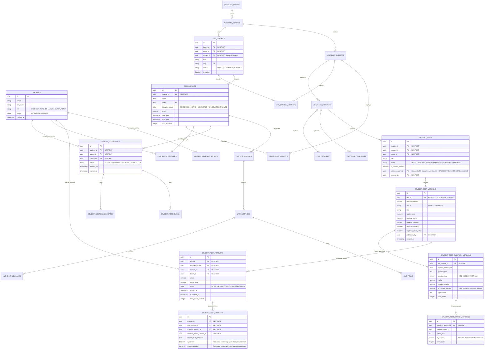

# TopVeda — Corrected Final Architecture Specification & Implementation Blueprint (v6.4)

**Role:** Principal Database Architect, PostgreSQL/RLS Security Architect & Application Security Auditor  
**Project:** TopVeda  
**Repository:** `D:\TopVeda\TopVeda`  
**Current Phase:** Final Architecture Specification (Design-Only & Verification)  
**Implementation Authorization:** NOT GRANTED (Strictly Design & Verification Only)  
**Version:** 6.4 (Production-Hardened, Zero-Trust Answer Security & Mathematical Integrity)  
**Date:** October 2026

---

## EXECUTIVE SUMMARY & REVISION HIGHLIGHTS (v6.3 → v6.4)

This document is the authoritative architectural blueprint for TopVeda. It incorporates all eight owner-approved product decisions, eliminates every identified answer-key leakage vector, establishes mathematical composite foreign-key constraints for test versions and attempts, formalizes version finalization triggers, separates public sample previews from authorized test delivery, and defines an exhaustive, database-privilege-hardened security catalog.

### Key Architectural Resolutions in Version 6.4:
1. **Zero-Trust Answer-Key and In-Progress Attempt Security (Section 7.3 & 7.4)**:
   - Direct `SELECT`, `INSERT`, `UPDATE`, and `DELETE` on `student_test_answers`, `student_test_option_versions`, and `student_test_question_versions` are completely **REVOKED** for public and authenticated roles.
   - Students interact with answers exclusively via secure RPCs:
     - `save_student_test_answer`: Upserts answers while `attempt.status = 'IN_PROGRESS'` with `is_correct = NULL` and `marks_awarded = NULL`.
     - `submit_student_test_attempt`: Atomic grading transaction that freezes answers, evaluates correctness server-side, calculates marks with negative marking, and updates attempt status to `'COMPLETED'`.
     - `get_student_test_scorecard`: Only callable for `'COMPLETED'` attempts; reveals correctness, score, percentage, and question explanations to the student owner or assigned teacher.
2. **True Composite Cross-Test and Cross-Version Foreign Keys (Section 7.2)**:
   - Enforced composite foreign key `(student_tests.id, student_tests.active_version_id)` referencing `(student_test_versions.test_id, student_test_versions.id)`.
   - Enforced composite foreign key `(student_test_attempts.test_id, student_test_attempts.test_version_id)` referencing `(student_test_versions.test_id, student_test_versions.id)`, mathematically preventing cross-test version hijacking.
   - Enforced composite foreign keys in `student_test_answers` binding attempt $\to$ test version $\to$ question version $\to$ option version.
3. **Decoupled Public Preview vs. Enrolled Test Delivery (Section 8)**:
   - `get_public_test_preview(p_test_id)`: Returns strictly curated sample questions (`is_sample_preview = TRUE`, max 3-5 items) without answer keys or scoring secrets.
   - `get_enrolled_student_test_questions(p_attempt_id)`: Delivers the full test questions and choices to enrolled students with an active in-progress attempt, stripped of answer keys.
4. **Lifecycle-Locked Version Immutability (Section 7.1)**:
   - Added `status TEXT CHECK (status IN ('DRAFT', 'FINALIZED'))` to `student_test_versions`.
   - Triggers block `INSERT`, `UPDATE`, and `DELETE` on questions, options, and metadata once a version is `'FINALIZED'` and published.
5. **Deterministic Multi-Batch Entitlement Resolver (Section 9)**:
   - Eliminated single-record `.maybeSingle()` lookup. Implemented array-based multi-batch entitlement resolution that preserves multiple concurrent cohort enrollments under the same course.
6. **Exhaustive Security Catalog & GRANT/REVOKE Matrix (Section 6.3)**:
   - Fully articulated table-by-table CRUD permissions, RLS policies, and database-level `GRANT`/`REVOKE` privileges across all entities and Supabase Storage buckets.

---

## 1. PRESERVED OWNER-APPROVED DECISIONS

All eight owner-approved product decisions are treated as fixed, non-negotiable architectural anchors:

| # | Principle | Architecture Implementation |
|---|-----------|-----------------------------|
| **1** | **Batch-Centric Enrollment** | Students enroll in specific cohort batches (`cms_batches`), automatically inheriting access to the parent course curriculum (`cms_courses`). |
| **2** | **Curated Preview Content** | Free pricing never implies open access. Content is public if and only if explicitly flagged with `is_curated_preview = true`. |
| **3** | **Four-Tier Role Hierarchy** | Strict database-level enum separating `STUDENT`, `TEACHER`, `ADMIN`, and `SUPER_ADMIN`. |
| **4** | **Dual Preview Audience** | Both unauthenticated public visitors and registered unenrolled students can consume curated preview assets via secure, server-authoritative preview endpoints. |
| **5** | **Batch Completion Read-Only Access** | Completed batches lock new live attendance and new test submissions while preserving permanent read-only access to historical lectures, notes, and scorecards. |
| **6** | **Teacher Test & Content Creation** | Teachers author lectures, live classes, study notes, and tests within their assigned batch/subject scope and submit them for review. |
| **7** | **Super Admin Exclusive Publishing** | Only `SUPER_ADMIN` possesses the authority to approve, publish, reject, or archive academic content. |
| **8** | **Multi-Batch Enrollment** | Students can concurrently enroll in multiple batches, including overlapping schedules and multiple cohorts under the same course. |

---

## 2. CANONICAL ACADEMIC & OPERATIONAL HIERARCHY

```
Academic Board (e.g., CBSE, ICSE, State Board)
 └── Class / Grade (e.g., Class 10, Class 12)
      └── Course / Master Curriculum (e.g., Class 10 Board Mastery 2026-27)
           ├── Subjects (Join via `cms_course_subjects`: Physics, Chemistry, Mathematics)
           │    └── Chapters (e.g., Chapter 1: Chemical Reactions)
           │         └── Master Content Pool (Lectures, Notes, Question Bank)
           │
           └── Operational Cohort Batches (e.g., Morning Champions Batch, Evening FastTrack Batch)
                ├── Assigned Batch Subjects (`cms_batch_subjects`)
                ├── Assigned Teachers (`cms_batch_teachers`)
                ├── Schedule, Meeting Config & Pricing
                └── Student Batch Enrollments (`student_enrollments` -> `batch_id`)
```

---

## 3. EXISTING VS TARGET SCHEMA COMPARISON

### 3.1 Live Database Reality vs Target State (v6.4 Blueprint)

| Table | Current Live Schema (Verified) | Target Schema (v6.4 Blueprint) | Modification Strategy |
|---|---|---|---|
| `profiles` | Enum: `'STUDENT', 'ADMIN', 'SUPER_ADMIN'` | Enum: `'STUDENT', 'TEACHER', 'ADMIN', 'SUPER_ADMIN'` | Add `'TEACHER'` to enum/check constraint. Safe backfill for verified educators. |
| `cms_courses` | Single `subject_id` (UUID), `title`, `description`, `class_id`, `board_id` | Retain `subject_id` as primary/legacy; introduce `cms_course_subjects` join table. | Non-destructive expand. Backfill existing `subject_id` into join table. |
| `cms_course_subjects` | **Does not exist** | `(id, course_id, subject_id, display_order, created_at)` | Create table with `UNIQUE(course_id, subject_id)` and `ON DELETE RESTRICT`. |
| `cms_batches` | `course_id`, `name`, `status`, `start_date`, `end_date`, `price`, `enrollment_limit` | Add `lifecycle_status` check: `'SCHEDULED', 'ACTIVE', 'COMPLETED', 'CANCELLED', 'ARCHIVED'`. | Enhance status constraint. Preserve existing records (`ACTIVE`/`SCHEDULED`). |
| `cms_batch_subjects` | **Does not exist** | `(id, batch_id, subject_id, teacher_id, created_at)` | Create table for granular teacher-subject batch scoping. |
| `cms_batch_teachers` | `(id, batch_id, teacher_id, role, created_at)` | Retain for batch-level educator assignments with active role check. | Keep as primary educator assignment table. |
| `student_enrollments` | `course_id NOT NULL`, `batch_id NULLABLE`, `UNIQUE(student_id, course_id)` (5 active rows all hold both IDs) | `batch_id NOT NULL`, `course_id NOT NULL (derived)`, `UNIQUE(student_id, batch_id)` | Phased migration: Expand → Verify data integrity → Deploy multi-batch resolver → Switch constraint. |
| `cms_lectures` | `status` ('DRAFT','PUBLISHED'), `is_free` (boolean) | `status` ('DRAFT','PENDING_REVIEW','APPROVED','PUBLISHED','ARCHIVED'), `is_curated_preview` (boolean) | Add `is_curated_preview`, update status enum, default `is_curated_preview = false`. |
| `cms_study_materials` | `status`, `is_free`, `file_url`, `chapter_id` | `status`, `is_curated_preview`, `file_url`, `access_type` | Add `is_curated_preview`, enforce secure signed download endpoints. |
| `student_tests` | `status`, `total_marks`, `passing_marks`, `course_id`, `batch_id` | `status` (5-state), `is_curated_preview`, `active_version_id FK (Composite)`, `created_by` | Add preview flag, composite active version FK, author ID, review tracking columns. |
| `student_test_versions` | **Does not exist** | `(id, test_id, version_number, status, ...)` with `UNIQUE(test_id, id)` and Finalization Triggers | Create table with `ON DELETE RESTRICT` and immutability triggers. |
| `student_test_question_versions` | **Does not exist** | `(id, test_version_id, is_sample_preview, ...)` with `UNIQUE(test_version_id, id)` | Create table with composite unique keys, preview flag, and immutability triggers. |
| `student_test_option_versions` | **Does not exist** | `(id, question_version_id, is_correct, ...)` with `UNIQUE(question_version_id, id)` | Direct `SELECT` REVOKED from students. Immutability triggers enforced. |
| `student_test_attempts` | `(id, test_id, student_id, answers, score, status, started_at, completed_at)` | Composite FK `(test_id, test_version_id)` referencing `student_test_versions`. `UNIQUE(id, test_version_id)`. | Protect with `RESTRICT` foreign keys. Enforce attempt-to-test version binding. |
| `student_test_answers` | `(id, attempt_id, question_id, selected_option_id, is_correct, marks_awarded)` | Direct access REVOKED. Composite FKs to attempt version, question version, and option version + `UNIQUE(attempt_id, question_version_id)`. | Interacted with strictly via `save_student_test_answer` and `submit_student_test_attempt`. |

---

## 4. FINAL ENTITY RELATIONSHIP DIAGRAM (MERMAID)



---

## 5. COMPLETE ROLE AND PERMISSION MATRIX

| Functional Domain | STUDENT | TEACHER (Assigned Scope) | ADMIN | SUPER_ADMIN |
|---|---|---|---|---|
| **Academic Hierarchy (Boards, Classes, Subjects, Chapters)** | View published hierarchy | View assigned hierarchy | View full hierarchy | Full CRUD + Publish |
| **Courses Management** | View published courses | View associated courses | View courses & batches | Full CRUD + Publish |
| **Batch Management** | View active/scheduled batches | View assigned batches | Create/Edit batches, assign teachers | Full CRUD + All States |
| **Batch Enrollment** | Self-enroll in available batches | View student roster of assigned batches | Enroll/Transfer students across batches | Full override & enrollment audit |
| **Curated Preview Content** | View public preview samples freely | View preview content | View & test preview content | Flag/Unflag preview assets |
| **Restricted Content (Enrolled Batches)** | Full consumption & submissions | View content for assigned batches | View content across all batches | Full access & management |
| **Content Creation (Lectures, Notes, Tests)** | No access | Create/Edit drafts in **assigned batches only** | Create/Edit drafts & manage batches | Full CRUD across system |
| **Content Review Submission** | No access | Submit owned drafts for review | Submit drafts for review | N/A (Direct Publisher) |
| **Content Approval & Publishing** | **Forbidden** | **Forbidden** | **Forbidden** | **Exclusive Authority** |
| **Live Classes & Meetings** | Join live sessions for active enrolled batches | Host/Start live sessions for assigned batches | Monitor live sessions & schedules | Full moderation & audit |
| **Test Attempts & Submissions** | Submit attempts for active enrolled batches | View attempt metrics for assigned batches | View attempt analytics | Full access & scorecard audit |
| **Test Answer Keys & Explanations** | **Direct table access REVOKED; Accessible strictly via Scorecard RPC after attempt submission** | View answer keys for assigned tests | View answer keys for verification | Full view & verification |
| **User Role Management** | No access | No access | View profiles; manage student accounts | Full role promotion/demotion |
| **System Settings & Audit Logs** | No access | No access | Operational reports only | Full audit log & integration keys |

---

## 6. ASSIGNMENT-AWARE RLS & API AUTHORIZATION MAP

### 6.1 Database Security Functions (Strict Separation of Roles)

```sql
-- 1. Super Admin Authority
CREATE OR REPLACE FUNCTION public.is_super_admin()
RETURNS BOOLEAN
LANGUAGE sql
SECURITY DEFINER
SET search_path = public
STABLE
AS $$
  SELECT EXISTS (
    SELECT 1 FROM profiles
    WHERE id = auth.uid()
      AND role = 'SUPER_ADMIN'
      AND status = 'ACTIVE'
  );
$$;

-- 2. Admin or Super Admin Authority
CREATE OR REPLACE FUNCTION public.is_admin_or_super()
RETURNS BOOLEAN
LANGUAGE sql
SECURITY DEFINER
SET search_path = public
STABLE
AS $$
  SELECT EXISTS (
    SELECT 1 FROM profiles
    WHERE id = auth.uid()
      AND role IN ('ADMIN', 'SUPER_ADMIN')
      AND status = 'ACTIVE'
  );
$$;

-- 3. Batch Teacher Assignment Check (Strictly verifies active assignment and active teacher role)
CREATE OR REPLACE FUNCTION public.is_batch_teacher(p_batch_id UUID)
RETURNS BOOLEAN
LANGUAGE sql
SECURITY DEFINER
SET search_path = public
STABLE
AS $$
  SELECT EXISTS (
    SELECT 1 FROM cms_batch_teachers bt
    JOIN profiles p ON p.id = bt.teacher_id
    WHERE bt.batch_id = p_batch_id
      AND bt.teacher_id = auth.uid()
      AND p.role = 'TEACHER'
      AND p.status = 'ACTIVE'
  );
$$;

-- 4. Student Active Enrollment Check (Real-time participation: live sessions & test attempts)
CREATE OR REPLACE FUNCTION public.is_actively_enrolled_in_batch(p_batch_id UUID)
RETURNS BOOLEAN
LANGUAGE sql
SECURITY DEFINER
SET search_path = public
STABLE
AS $$
  SELECT EXISTS (
    SELECT 1 FROM student_enrollments e
    JOIN profiles p ON p.id = e.student_id
    JOIN cms_batches b ON b.id = e.batch_id
    WHERE e.batch_id = p_batch_id
      AND e.student_id = auth.uid()
      AND p.role = 'STUDENT'
      AND e.status = 'ACTIVE'
      AND b.lifecycle_status = 'ACTIVE'
  );
$$;

-- 5. Student Historical Read-Only Access Check (Lectures, notes, scorecards)
CREATE OR REPLACE FUNCTION public.has_historical_batch_access(p_batch_id UUID)
RETURNS BOOLEAN
LANGUAGE sql
SECURITY DEFINER
SET search_path = public
STABLE
AS $$
  SELECT EXISTS (
    SELECT 1 FROM student_enrollments e
    JOIN profiles p ON p.id = e.student_id
    WHERE e.batch_id = p_batch_id
      AND e.student_id = auth.uid()
      AND p.role = 'STUDENT'
      AND e.status IN ('ACTIVE', 'COMPLETED')
  );
$$;

-- 6. Content Access Check for Students/Public (Published Curated Preview OR Historical Batch Access)
CREATE OR REPLACE FUNCTION public.can_student_access_content(
  p_is_curated_preview BOOLEAN,
  p_batch_id UUID,
  p_status TEXT
)
RETURNS BOOLEAN
LANGUAGE sql
SECURITY DEFINER
SET search_path = public
STABLE
AS $$
  SELECT (
    p_status = 'PUBLISHED' 
    AND (p_is_curated_preview = TRUE OR (p_batch_id IS NOT NULL AND has_historical_batch_access(p_batch_id)))
  );
$$;
```

### 6.2 Complete Row-Level Security (RLS) Policy Catalog

| Table | Policy Name | Command | Target Role | Security Expression (`USING` / `WITH CHECK`) |
|---|---|---|---|---|
| `cms_lectures` | `lectures_student_read` | `SELECT` | `public` | `can_student_access_content(is_curated_preview, batch_id, status)` |
| `cms_lectures` | `lectures_teacher_read` | `SELECT` | `authenticated` | `author_id = auth.uid() OR (batch_id IS NOT NULL AND is_batch_teacher(batch_id))` |
| `cms_lectures` | `lectures_admin_read` | `SELECT` | `authenticated` | `is_admin_or_super()` |
| `cms_lectures` | `lectures_teacher_insert` | `INSERT` | `authenticated` | `batch_id IS NOT NULL AND is_batch_teacher(batch_id) AND status = 'DRAFT' AND author_id = auth.uid()` |
| `cms_lectures` | `lectures_admin_insert` | `INSERT` | `authenticated` | `is_admin_or_super() AND status = 'DRAFT'` |
| `cms_lectures` | `lectures_teacher_update` | `UPDATE` | `authenticated` | `author_id = auth.uid() AND status IN ('DRAFT', 'PENDING_REVIEW') AND (batch_id IS NOT NULL AND is_batch_teacher(batch_id))` |
| `cms_lectures` | `lectures_super_admin_manage` | `ALL` | `authenticated` | `is_super_admin()` |
| `student_tests` | `tests_student_read` | `SELECT` | `public` | `can_student_access_content(is_curated_preview, batch_id, status)` |
| `student_tests` | `tests_teacher_read` | `SELECT` | `authenticated` | `created_by = auth.uid() OR (batch_id IS NOT NULL AND is_batch_teacher(batch_id))` |
| `student_tests` | `tests_admin_read` | `SELECT` | `authenticated` | `is_admin_or_super()` |
| `student_tests` | `tests_teacher_insert` | `INSERT` | `authenticated` | `batch_id IS NOT NULL AND is_batch_teacher(batch_id) AND status = 'DRAFT' AND created_by = auth.uid()` |
| `student_tests` | `tests_super_admin_publish` | `UPDATE` | `authenticated` | `is_super_admin()` |
| `student_test_versions` | `versions_educator_read` | `SELECT` | `authenticated` | `is_batch_teacher((SELECT batch_id FROM student_tests WHERE id = test_id)) OR is_admin_or_super()` |
| `student_test_versions` | `versions_super_admin_insert` | `INSERT` | `authenticated` | `is_super_admin()` |
| `student_test_question_versions` | `q_versions_educator_read` | `SELECT` | `authenticated` | `is_batch_teacher((SELECT t.batch_id FROM student_tests t JOIN student_test_versions tv ON tv.test_id = t.id WHERE tv.id = test_version_id)) OR is_admin_or_super()` |
| `student_test_question_versions` | `q_versions_super_admin_insert` | `INSERT` | `authenticated` | `is_super_admin()` |
| `student_test_option_versions` | `opt_versions_educator_read` | `SELECT` | `authenticated` | `is_batch_teacher((SELECT t.batch_id FROM student_tests t JOIN student_test_versions tv ON tv.test_id = t.id JOIN student_test_question_versions qv ON qv.test_version_id = tv.id WHERE qv.id = question_version_id)) OR is_admin_or_super()` |
| `student_test_option_versions` | `opt_versions_super_admin_insert`| `INSERT` | `authenticated` | `is_super_admin()` |
| `student_test_attempts` | `attempts_student_create` | `INSERT` | `authenticated` | `auth.uid() = student_id AND is_actively_enrolled_in_batch(batch_id) AND status = 'IN_PROGRESS'` |
| `student_test_attempts` | `attempts_student_read_own` | `SELECT` | `authenticated` | `auth.uid() = student_id` |
| `student_test_attempts` | `attempts_teacher_batch_read` | `SELECT` | `authenticated` | `is_batch_teacher(batch_id)` |
| `student_test_attempts` | `attempts_admin_read_all` | `SELECT` | `authenticated` | `is_admin_or_super()` |
| `student_test_answers` | `answers_all_direct_access` | `ALL` | `authenticated` | `FALSE (DIRECT ACCESS STRICTLY BLOCKED; ACCESSIBLE ONLY VIA RPC)` |
| `cms_study_materials` | `materials_student_read` | `SELECT` | `public` | `can_student_access_content(is_curated_preview, batch_id, status)` |
| `cms_live_classes` | `live_student_access` | `SELECT` | `authenticated` | `is_actively_enrolled_in_batch(batch_id) AND status = 'PUBLISHED'` |
| `cms_live_classes` | `live_teacher_host` | `ALL` | `authenticated` | `is_batch_teacher(batch_id) OR is_admin_or_super()` |
| `student_lecture_progress`| `progress_student_manage` | `ALL` | `authenticated` | `auth.uid() = student_id` |
| `student_attendance` | `attendance_student_read` | `SELECT` | `authenticated` | `auth.uid() = student_id` |
| `student_attendance` | `attendance_teacher_manage`| `ALL` | `authenticated` | `is_batch_teacher(batch_id) OR is_admin_or_super()` |

### 6.3 Database Privileges (GRANT and REVOKE Statements)

```sql
-- 1. Revoke direct access to answer keys and student answer records
REVOKE ALL ON public.student_test_answers FROM anon, authenticated;
REVOKE ALL ON public.student_test_option_versions FROM anon, authenticated;

-- 2. Grant explicit execute on student RPCs
GRANT EXECUTE ON FUNCTION public.get_public_test_preview(UUID) TO anon, authenticated;
GRANT EXECUTE ON FUNCTION public.get_enrolled_student_test_questions(UUID) TO authenticated;
GRANT EXECUTE ON FUNCTION public.save_student_test_answer(UUID, UUID, UUID, TEXT) TO authenticated;
GRANT EXECUTE ON FUNCTION public.submit_student_test_attempt(UUID) TO authenticated;
GRANT EXECUTE ON FUNCTION public.get_student_test_scorecard(UUID) TO authenticated;
```

---

## 7. DATABASE-LEVEL TEST IMMUTABILITY, COMPOSITE KEYS & ANSWER PROTECTION

### 7.1 Lifecycle-Locked Immutability Triggers (PostgreSQL)

```sql
-- Trigger function to freeze finalized test versions
CREATE OR REPLACE FUNCTION public.enforce_test_version_finalization_immutability()
RETURNS TRIGGER
LANGUAGE plpgsql
AS $$
DECLARE
  v_version_status TEXT;
  v_test_version_id UUID;
BEGIN
  -- Determine target test_version_id based on triggering table
  IF TG_TABLE_NAME = 'student_test_versions' THEN
    IF OLD.status = 'FINALIZED' THEN
      RAISE EXCEPTION 'Database Integrity Error: Finalized test versions cannot be modified or deleted.';
    END IF;
    RETURN NEW;
  ELSIF TG_TABLE_NAME = 'student_test_question_versions' THEN
    v_test_version_id := COALESCE(NEW.test_version_id, OLD.test_version_id);
  ELSIF TG_TABLE_NAME = 'student_test_option_versions' THEN
    SELECT qv.test_version_id INTO v_test_version_id
    FROM student_test_question_versions qv
    WHERE qv.id = COALESCE(NEW.question_version_id, OLD.question_version_id);
  END IF;

  -- Check parent version status
  SELECT status INTO v_version_status
  FROM student_test_versions
  WHERE id = v_test_version_id;

  IF v_version_status = 'FINALIZED' THEN
    RAISE EXCEPTION 'Database Integrity Error: Cannot insert, update, or delete questions/options on a finalized test version.';
  END IF;

  RETURN NEW;
END;
$$;

-- Apply triggers
CREATE TRIGGER trg_freeze_student_test_versions
BEFORE UPDATE OR DELETE ON public.student_test_versions
FOR EACH ROW EXECUTE FUNCTION public.enforce_test_version_finalization_immutability();

CREATE TRIGGER trg_freeze_student_test_question_versions
BEFORE INSERT OR UPDATE OR DELETE ON public.student_test_question_versions
FOR EACH ROW EXECUTE FUNCTION public.enforce_test_version_finalization_immutability();

CREATE TRIGGER trg_freeze_student_test_option_versions
BEFORE INSERT OR UPDATE OR DELETE ON public.student_test_option_versions
FOR EACH ROW EXECUTE FUNCTION public.enforce_test_version_finalization_immutability();
```

### 7.2 True Composite Cross-Test and Cross-Version Foreign Keys

```sql
-- 1. Composite Unique Constraints to prevent cross-test hijacking
ALTER TABLE public.student_test_versions
ADD CONSTRAINT uq_test_version_composite UNIQUE (test_id, id);

ALTER TABLE public.student_tests
ADD CONSTRAINT fk_student_tests_active_version_composite
FOREIGN KEY (id, active_version_id)
REFERENCES public.student_test_versions(test_id, id)
ON DELETE RESTRICT DEFERRABLE INITIALLY DEFERRED;

-- 2. Bind Student Attempts strictly to (test_id, test_version_id)
ALTER TABLE public.student_test_attempts
ADD COLUMN test_id UUID NOT NULL,
ADD CONSTRAINT fk_attempts_test_version_composite
  FOREIGN KEY (test_id, test_version_id)
  REFERENCES public.student_test_versions(test_id, id)
  ON DELETE RESTRICT,
ADD CONSTRAINT uq_attempt_composite UNIQUE (id, test_version_id);

-- 3. Composite Foreign Keys on Question & Option Versions
ALTER TABLE public.student_test_question_versions
ADD CONSTRAINT uq_question_version_test_version UNIQUE (test_version_id, id);

ALTER TABLE public.student_test_option_versions
ADD CONSTRAINT uq_option_version_question_version UNIQUE (question_version_id, id);

-- 4. Composite Foreign Keys in student_test_answers
ALTER TABLE public.student_test_answers
ADD COLUMN test_version_id UUID NOT NULL,
ADD CONSTRAINT fk_answers_attempt_version
  FOREIGN KEY (attempt_id, test_version_id)
  REFERENCES public.student_test_attempts(id, test_version_id)
  ON DELETE RESTRICT,
ADD CONSTRAINT fk_answers_question_version
  FOREIGN KEY (test_version_id, question_version_id)
  REFERENCES public.student_test_question_versions(test_version_id, id)
  ON DELETE RESTRICT,
ADD CONSTRAINT fk_answers_option_version
  FOREIGN KEY (question_version_id, selected_option_version_id)
  REFERENCES public.student_test_option_versions(question_version_id, id)
  ON DELETE RESTRICT,
ADD CONSTRAINT uq_attempt_question_single_answer
  UNIQUE (attempt_id, question_version_id);
```

### 7.3 Secure Answer Submission & Server-Authoritative Grading RPCs

```sql
-- RPC 1: Save / Update In-Progress Student Answer
CREATE OR REPLACE FUNCTION public.save_student_test_answer(
  p_attempt_id UUID,
  p_question_version_id UUID,
  p_selected_option_version_id UUID,
  p_student_text_response TEXT DEFAULT NULL
)
RETURNS JSONB
LANGUAGE plpgsql
SECURITY DEFINER
SET search_path = public
AS $$
DECLARE
  v_test_version_id UUID;
  v_status TEXT;
  v_student_id UUID;
BEGIN
  -- 1. Verify attempt ownership and in-progress status
  SELECT test_version_id, status, student_id
  INTO v_test_version_id, v_status, v_student_id
  FROM student_test_attempts
  WHERE id = p_attempt_id;

  IF NOT FOUND OR v_student_id != auth.uid() THEN
    RAISE EXCEPTION 'Attempt not found or unauthorized.';
  END IF;

  IF v_status != 'IN_PROGRESS' THEN
    RAISE EXCEPTION 'Cannot modify answers for a completed or submitted test attempt.';
  END IF;

  -- 2. Upsert answer record with NULL correctness and marks
  INSERT INTO student_test_answers (
    attempt_id,
    test_version_id,
    question_version_id,
    selected_option_version_id,
    student_text_response,
    is_correct,
    marks_awarded
  ) VALUES (
    p_attempt_id,
    v_test_version_id,
    p_question_version_id,
    p_selected_option_version_id,
    p_student_text_response,
    NULL, -- Strictly hidden until submission
    NULL  -- Strictly hidden until submission
  )
  ON CONFLICT (attempt_id, question_version_id) DO UPDATE SET
    selected_option_version_id = EXCLUDED.selected_option_version_id,
    student_text_response = EXCLUDED.student_text_response,
    is_correct = NULL,
    marks_awarded = NULL;

  RETURN jsonb_build_object('success', TRUE);
END;
$$;

-- RPC 2: Submit Student Test Attempt & Execute Server-Authoritative Grading
CREATE OR REPLACE FUNCTION public.submit_student_test_attempt(p_attempt_id UUID)
RETURNS JSONB
LANGUAGE plpgsql
SECURITY DEFINER
SET search_path = public
AS $$
DECLARE
  v_attempt RECORD;
  v_total_score NUMERIC(6,2) := 0.0;
  v_total_marks NUMERIC(6,2);
  v_percentage NUMERIC(5,2);
  v_ans RECORD;
  v_is_correct BOOLEAN;
  v_marks NUMERIC(5,2);
BEGIN
  -- 1. Lock attempt row for update to prevent concurrent submissions
  SELECT * INTO v_attempt
  FROM student_test_attempts
  WHERE id = p_attempt_id
  FOR UPDATE;

  IF NOT FOUND OR v_attempt.student_id != auth.uid() THEN
    RAISE EXCEPTION 'Attempt not found or unauthorized.';
  END IF;

  IF v_attempt.status != 'IN_PROGRESS' THEN
    RAISE EXCEPTION 'Attempt is already submitted.';
  END IF;

  -- 2. Retrieve test total marks
  SELECT total_marks INTO v_total_marks
  FROM student_test_versions
  WHERE id = v_attempt.test_version_id;

  -- 3. Evaluate each answer server-side
  FOR v_ans IN (
    SELECT 
      a.id AS answer_id,
      a.selected_option_version_id,
      qv.marks,
      qv.negative_marks,
      ov.is_correct AS option_is_correct
    FROM student_test_answers a
    JOIN student_test_question_versions qv ON qv.id = a.question_version_id
    LEFT JOIN student_test_option_versions ov ON ov.id = a.selected_option_version_id
    WHERE a.attempt_id = p_attempt_id
  ) LOOP
    IF v_ans.option_is_correct = TRUE THEN
      v_is_correct := TRUE;
      v_marks := v_ans.marks;
    ELSE
      v_is_correct := FALSE;
      v_marks := -1.0 * COALESCE(v_ans.negative_marks, 0.0);
    END IF;

    UPDATE student_test_answers
    SET is_correct = v_is_correct,
        marks_awarded = v_marks
    WHERE id = v_ans.answer_id;

    v_total_score := v_total_score + v_marks;
  END LOOP;

  -- Floor score at 0.0 if negative total
  IF v_total_score < 0.0 THEN
    v_total_score := 0.0;
  END IF;

  v_percentage := ROUND((v_total_score / v_total_marks) * 100.0, 2);

  -- 4. Mark attempt as COMPLETED
  UPDATE student_test_attempts
  SET status = 'COMPLETED',
      score = v_total_score,
      percentage = v_percentage,
      submitted_at = now()
  WHERE id = p_attempt_id;

  RETURN jsonb_build_object(
    'attempt_id', p_attempt_id,
    'status', 'COMPLETED',
    'score', v_total_score,
    'percentage', v_percentage,
    'submitted_at', now()
  );
END;
$$;

-- RPC 3: Completed Scorecard Retrieval
CREATE OR REPLACE FUNCTION public.get_student_test_scorecard(p_attempt_id UUID)
RETURNS JSONB
LANGUAGE plpgsql
SECURITY DEFINER
SET search_path = public
STABLE
AS $$
DECLARE
  v_attempt RECORD;
  v_is_auth BOOLEAN := FALSE;
  v_result JSONB;
BEGIN
  SELECT a.*, tv.title AS test_title, tv.total_marks, tv.passing_marks
  INTO v_attempt
  FROM student_test_attempts a
  JOIN student_test_versions tv ON tv.id = a.test_version_id
  WHERE a.id = p_attempt_id;

  IF NOT FOUND THEN
    RAISE EXCEPTION 'Scorecard not found.';
  END IF;

  -- Verify attempt is completed
  IF v_attempt.status != 'COMPLETED' THEN
    RAISE EXCEPTION 'Attempt is not completed. Scorecards are only available after submission.';
  END IF;

  -- Authorization: Student Owner OR Assigned Batch Teacher OR Admin/Super Admin
  IF (v_attempt.student_id = auth.uid()) 
     OR is_batch_teacher(v_attempt.batch_id) 
     OR is_admin_or_super() THEN
    v_is_auth := TRUE;
  END IF;

  IF NOT v_is_auth THEN
    RAISE EXCEPTION 'Access denied to scorecard.';
  END IF;

  -- Return comprehensive scorecard with questions, student answers, correctness, and explanations
  SELECT jsonb_build_object(
    'attempt_id', v_attempt.id,
    'test_title', v_attempt.test_title,
    'score', v_attempt.score,
    'percentage', v_attempt.percentage,
    'total_marks', v_attempt.total_marks,
    'passing_marks', v_attempt.passing_marks,
    'submitted_at', v_attempt.submitted_at,
    'questions', (
      SELECT jsonb_agg(
        jsonb_build_object(
          'question_id', qv.id,
          'question_text', qv.question_text,
          'marks', qv.marks,
          'negative_marks', qv.negative_marks,
          'explanation', qv.explanation,
          'selected_option_id', ans.selected_option_version_id,
          'is_correct', ans.is_correct,
          'marks_awarded', ans.marks_awarded,
          'options', (
            SELECT jsonb_agg(
              jsonb_build_object(
                'option_id', ov.id,
                'option_text', ov.option_text,
                'is_correct', ov.is_correct
              ) ORDER BY ov.order_index
            )
            FROM student_test_option_versions ov
            WHERE ov.question_version_id = qv.id
          )
        ) ORDER BY qv.order_index
      )
      FROM student_test_question_versions qv
      LEFT JOIN student_test_answers ans ON ans.question_version_id = qv.id AND ans.attempt_id = v_attempt.id
      WHERE qv.test_version_id = v_attempt.test_version_id
    )
  ) INTO v_result;

  RETURN v_result;
END;
$$;
```

---

## 8. SEPARATED PUBLIC PREVIEW VS. ENROLLED TEST DELIVERY

```sql
-- 1. Public Sample Preview (Zero Answer Keys, Max Sample Questions)
CREATE OR REPLACE FUNCTION public.get_public_test_preview(p_test_id UUID)
RETURNS JSONB
LANGUAGE plpgsql
SECURITY DEFINER
SET search_path = public
STABLE
AS $$
DECLARE
  v_test RECORD;
  v_result JSONB;
BEGIN
  SELECT id, active_version_id, is_curated_preview, status, title
  INTO v_test
  FROM student_tests
  WHERE id = p_test_id;

  IF NOT FOUND OR v_test.status != 'PUBLISHED' OR v_test.is_curated_preview != TRUE OR v_test.active_version_id IS NULL THEN
    RAISE EXCEPTION 'Public preview not available for this test.';
  END IF;

  -- Return ONLY sample questions flagged with is_sample_preview = TRUE
  SELECT jsonb_build_object(
    'test_id', v_test.id,
    'title', v_test.title,
    'is_preview', TRUE,
    'questions', (
      SELECT jsonb_agg(
        jsonb_build_object(
          'question_id', qv.id,
          'question_text', qv.question_text,
          'question_type', qv.question_type,
          'marks', qv.marks,
          'options', (
            SELECT jsonb_agg(
              jsonb_build_object(
                'option_id', ov.id,
                'option_text', ov.option_text
              ) ORDER BY ov.order_index
            )
            FROM student_test_option_versions ov
            WHERE ov.question_version_id = qv.id
          )
        ) ORDER BY qv.order_index
      )
      FROM student_test_question_versions qv
      WHERE qv.test_version_id = v_test.active_version_id
        AND qv.is_sample_preview = TRUE
    )
  ) INTO v_result;

  RETURN v_result;
END;
$$;

-- 2. Enrolled Student Test Delivery (Full Test Questions, Stripped of Answer Keys)
CREATE OR REPLACE FUNCTION public.get_enrolled_student_test_questions(p_attempt_id UUID)
RETURNS JSONB
LANGUAGE plpgsql
SECURITY DEFINER
SET search_path = public
STABLE
AS $$
DECLARE
  v_attempt RECORD;
  v_result JSONB;
BEGIN
  SELECT a.*, tv.title AS test_title, tv.duration_minutes
  INTO v_attempt
  FROM student_test_attempts a
  JOIN student_test_versions tv ON tv.id = a.test_version_id
  WHERE a.id = p_attempt_id;

  IF NOT FOUND OR v_attempt.student_id != auth.uid() THEN
    RAISE EXCEPTION 'Attempt not found or unauthorized.';
  END IF;

  IF v_attempt.status != 'IN_PROGRESS' THEN
    RAISE EXCEPTION 'Attempt is not in progress.';
  END IF;

  SELECT jsonb_build_object(
    'attempt_id', v_attempt.id,
    'test_title', v_attempt.test_title,
    'duration_minutes', v_attempt.duration_minutes,
    'started_at', v_attempt.started_at,
    'questions', (
      SELECT jsonb_agg(
        jsonb_build_object(
          'question_id', qv.id,
          'question_text', qv.question_text,
          'question_type', qv.question_type,
          'marks', qv.marks,
          'negative_marks', qv.negative_marks,
          'order_index', qv.order_index,
          'options', (
            SELECT jsonb_agg(
              jsonb_build_object(
                'option_id', ov.id,
                'option_text', ov.option_text,
                'order_index', ov.order_index
              ) ORDER BY ov.order_index
            )
            FROM student_test_option_versions ov
            WHERE ov.question_version_id = qv.id
          )
        ) ORDER BY qv.order_index
      )
      FROM student_test_question_versions qv
      WHERE qv.test_version_id = v_attempt.test_version_id
    )
  ) INTO v_result;

  RETURN v_result;
END;
$$;
```

---

## 9. DETERMINISTIC MULTI-BATCH ENTITLEMENT RESOLVER

```typescript
export interface EntitlementResolution {
  hasAccess: boolean;
  activeBatchIds: string[];
  completedBatchIds: string[];
  accessType: 'ACTIVE_BATCH' | 'HISTORICAL_BATCH' | 'DENIED';
}

export async function resolveStudentEntitlements(
  studentId: string,
  targetBatchId?: string,
  targetCourseId?: string
): Promise<EntitlementResolution> {
  // Query all active and completed enrollments for student
  const { data: enrollments } = await db
    .from('student_enrollments')
    .select('batch_id, course_id, status')
    .eq('student_id', studentId)
    .in('status', ['ACTIVE', 'COMPLETED']);

  if (!enrollments || enrollments.length === 0) {
    return { hasAccess: false, activeBatchIds: [], completedBatchIds: [], accessType: 'DENIED' };
  }

  const activeBatchIds = enrollments.filter(e => e.status === 'ACTIVE').map(e => e.batch_id);
  const completedBatchIds = enrollments.filter(e => e.status === 'COMPLETED').map(e => e.batch_id);

  // 1. Direct Batch Check
  if (targetBatchId) {
    if (activeBatchIds.includes(targetBatchId)) {
      return { hasAccess: true, activeBatchIds, completedBatchIds, accessType: 'ACTIVE_BATCH' };
    }
    if (completedBatchIds.includes(targetBatchId)) {
      return { hasAccess: true, activeBatchIds, completedBatchIds, accessType: 'HISTORICAL_BATCH' };
    }
  }

  // 2. Course-Level Curriculum Resolution across all enrolled batches
  if (targetCourseId) {
    const courseEnrollments = enrollments.filter(e => e.course_id === targetCourseId);
    if (courseEnrollments.some(e => e.status === 'ACTIVE')) {
      return { hasAccess: true, activeBatchIds, completedBatchIds, accessType: 'ACTIVE_BATCH' };
    }
    if (courseEnrollments.some(e => e.status === 'COMPLETED')) {
      return { hasAccess: true, activeBatchIds, completedBatchIds, accessType: 'HISTORICAL_BATCH' };
    }
  }

  return { hasAccess: false, activeBatchIds, completedBatchIds, accessType: 'DENIED' };
}
```

---

## 10. BATCH LIFECYCLE & HISTORICAL RETENTION POLICY

| State | Public Discovery | Live Participation | Test Submissions | Student Historical Content Access |
|---|---|---|---|---|
| `SCHEDULED` | Visible in Catalog | Locked | Locked | Curated previews only |
| `ACTIVE` | Visible in Catalog | **Active** | **Active** | Full real-time access |
| `COMPLETED` | Archived from Catalog | Locked | Locked | **Permanent Read-Only Access (Approved)** |
| `CANCELLED` | Removed from Catalog | Locked | Locked | *Pending Owner Decision (Section 14)* |
| `ARCHIVED` | Hidden from Catalog | Locked | Locked | **Permanent Read-Only Access Retained** |

---

## 11. EXPAND-AND-CONTRACT MIGRATION & NON-DESTRUCTIVE RECOVERY

### 11.1 Non-Destructive Migration Sequence

```
┌────────────────────────────────────────────────────────────────────────────┐
│ MIGRATION M1: Role System & Decoupled Security Functions                   │
│ - Expand profiles.role check constraint to include 'TEACHER'               │
│ - Deploy is_super_admin(), is_admin_or_super(), is_batch_teacher()         │
│ - Rollback: Forward-fix script; revert constraint without dropping users.  │
└─────────────────────────────────────┬──────────────────────────────────────┘
                                      │ Verified via SQL Unit Tests
┌─────────────────────────────────────▼──────────────────────────────────────┐
│ MIGRATION M2: Academic Multi-Subject Join Tables & Preview Flags           │
│ - Create cms_course_subjects and cms_batch_subjects (ON DELETE RESTRICT)   │
│ - Add is_curated_preview BOOLEAN to cms_lectures, materials, tests         │
│ - Backfill existing course.subject_id into cms_course_subjects             │
│ - Rollback: Mark join tables deprecated; retain data.                      │
└─────────────────────────────────────┬──────────────────────────────────────┘
                                      │ Verified: Join table counts match course counts
┌─────────────────────────────────────▼──────────────────────────────────────┐
│ MIGRATION M3: Interactive Live Session Tables                              │
│ - Apply live_instances, live_chat_messages, live_polls, live_quizzes       │
│ - Establish decoupled RLS policies for student attendance and chat         │
│ - Rollback: Disable live session routes; retain tables.                    │
└─────────────────────────────────────┬──────────────────────────────────────┘
                                      │ Verified: Tables active, RLS active
┌─────────────────────────────────────▼──────────────────────────────────────┐
│ MIGRATION M4: Batch-Centric Enrollment Schema & Multi-Batch Resolver       │
│ - Verify 5 active enrollments integrity in student_enrollments             │
│ - Deploy array-based entitlement resolver in ContentAccessService          │
│ - Update student_enrollments unique constraint to (student_id, batch_id)   │
│ - Rollback: Forward-fix; never restore (student_id, course_id) constraint. │
└─────────────────────────────────────┬──────────────────────────────────────┘
                                      │ Verified: Multi-batch enrollment active
┌─────────────────────────────────────▼──────────────────────────────────────┐
│ MIGRATION M5: Test Immutability, Composite Keys & Zero-Trust RPCs          │
│ - Create student_test_versions, question_versions, option_versions tables  │
│ - Enforce composite foreign keys and finalization triggers                 │
│ - Deploy get_public_test_preview, get_enrolled_questions, submit_attempt   │
│ - Revoke direct student table access on answer keys and answers            │
│ - Rollback: Forward-fix RPCs; retain immutable version snapshots.          │
└─────────────────────────────────────┬──────────────────────────────────────┘
                                      │ Verified: Historical scorecards 100% frozen
┌─────────────────────────────────────▼──────────────────────────────────────┐
│ MIGRATION M6: Frontend Studio Unification & Service Layer Transition       │
│ - Deploy unified /admin/studio workspace with cascading selectors         │
│ - Switch ContentAccessService to batch-first entitlement resolution        │
│ - Execute complete Playwright E2E verification suite                       │
└────────────────────────────────────────────────────────────────────────────┘
```

---

## 12. FULL REGRESSION & PLAYWRIGHT E2E TEST MATRIX

| Subsystem | Verified Baseline | Regression Risk | Empirical Verification Test Case | Test Classification |
|---|---|---|---|---|
| **Answer-Key Leakage Prevention** | Zero-Trust Design | Direct query leaks `is_correct` | HTTP test querying `student_test_option_versions` directly returns 403 / permission denied. | **Proposed Security Test** |
| **In-Progress Score Concealment** | Zero-Trust RPC | Student reads `marks_awarded` while taking test | Test calling `get_student_test_scorecard` during `IN_PROGRESS` attempt asserts 400 error. | **Proposed Security Test** |
| **Public Preview Boundary** | Preview Separation | Preview caller receives all 20 questions | Public call to `get_public_test_preview` asserts return of only sample questions. | **Proposed Security Test** |
| **Cross-Test Version Hijacking** | Composite FKs | Test A references Version of Test B | Database test inserting mismatched `(test_id, active_version_id)` asserts FK violation. | **Proposed DB Integrity Test** |
| **Version Finalization Lock** | Finalization Trigger | Inserting question into finalized test | DB test inserting into `student_test_question_versions` for finalized version throws trigger error. | **Proposed DB Integrity Test** |
| **Completed Batch Submission Guard** | Lifecycle Guard | Student submits test for completed batch | Calling `start_student_test_attempt` on `COMPLETED` batch throws 403 error. | **Proposed Lifecycle Test** |
| **Teacher Assignment Revocation** | Scoping Guard | Revoked teacher continues drafting | Teacher with deleted `cms_batch_teachers` row receives 403 on content insert. | **Proposed Auth Test** |
| **Multi-Batch Concurrent Enrollment** | Multi-Batch Model | Student joins 2 cohorts of Course 1 | Enroll student in Batch 1 and Batch 2 under Course 1 without constraint violation. | **Proposed Enrollment Test** |
| **Authentication & Turnstile** | Verified in Production | Session refresh or login failure | Playwright browser test verifying login on `topveda.in` with live credentials. | **Verified in Production** |
| **5 Historical Enrollments** | Verified in Supabase | Data loss during migration | Read-only aggregate audit confirms 5 records with valid batch and course IDs. | **Verified by Database Inspection** |

---

## 13. PERMANENT AI DEVELOPMENT GOVERNANCE INSTRUCTIONS

### 13.1 Authoritative Governance Charter
To maintain architectural integrity, all future AI coding assistants operating on TopVeda must adhere to this single authoritative standard, which extends and harmonizes with [`PROJECT_RULES.md`](file:///d:/TopVeda/TopVeda/PROJECT_RULES.md):

1. **Full Lifecycle Thinking**: Every feature request must be analyzed across the full stack before writing code:
   $$\text{Requirement} \to \text{Schema/FKs} \to \text{RLS} \to \text{API/Services} \to \text{UI Discovery} \to \text{Consumption} \to \text{Activity Tracking} \to \text{Reporting} \to \text{Regression Proof}$$
2. **Zero-Destructive Migrations**: Never drop columns, truncate tables, or execute destructive `CASCADE` drops without an explicit multi-step backup and owner sign-off.
3. **Double-Layered Security**: Never rely solely on frontend or API checks. Every security boundary must be enforced by PostgreSQL RLS, database privileges (`REVOKE`/`GRANT`), and security definer functions.
4. **Empirical Evidence Required**: Never report a task as complete based on assumption. Provide command outputs, browser screenshots, or test runner logs.
5. **Secret Hygiene**: Never log, print, or commit API keys, Turnstile secrets, Supabase service keys, or environment secrets.

---

## 14. REMAINING OWNER DECISIONS (PENDING PRODUCT POLICIES)

The following two product policy decisions remain open for final owner determination:

### Decision 1: Anonymous Test Preview Experience
- **Option A (Recommended)**: Visitors can view sample questions in preview mode to assess test quality, but must register/sign in to submit answers and generate a permanent scorecard.
  - *Pros*: Protects database from spam attempts; drives student sign-ups; keeps analytics clean.
  - *Cons*: Slight friction before interactive evaluation.
- **Option B**: Visitors can complete a full interactive test without an account, generating a temporary local-session scorecard with a prompt to create an account to save results.
  - *Pros*: Maximum user engagement and zero initial friction.
  - *Cons*: Requires client-side grading engine for previews and temporary localStorage state management.

### Decision 2: Batch Cancellation Policy & Access Revocation
- **Option A (Recommended)**: Cancelled batches immediately revoke live and learning content access, initiating automated student transfer or fee refund workflows.
  - *Pros*: Clear commercial demarcation and compliance with cancellation terms.
  - *Cons*: Immediate loss of materials for affected students.
- **Option B**: Cancelled batches maintain a 14-day grace period with read-only content access while students are transferred to alternative active batches.
  - *Pros*: Smoother transition for enrolled students.
  - *Cons*: Requires temporary grace-period entitlement logic in authorization services.

---

## 15. EXPLICIT RISKS, ASSUMPTIONS & UNVERIFIED ITEMS

1. **Unverified Internal Migration Ledger**: Direct access to `supabase_migrations.schema_migrations` is inaccessible over PostgREST. While table absence in the exposed `public` schema has been confirmed empirically, the exact execution ledger remains categorized as **UNVERIFIED**.
2. **Untracked Working Tree Provenance**: Files including `PROJECT_RULES.md`, `GSD-STYLE.md`, and `.agents/` remain untracked in Git. Permanent governance rules will be formally anchored when these files are staged and committed alongside `PROJECT_ARCHITECTURE_V6.4.md`.
3. **5 Historical Enrollments**: All 5 existing rows in `student_enrollments` have been empirically verified to contain valid `batch_id` and `course_id` entries.

---

**End of Architecture Specification v6.4. Awaiting explicit owner authorization before initiating any code or database implementation.**
