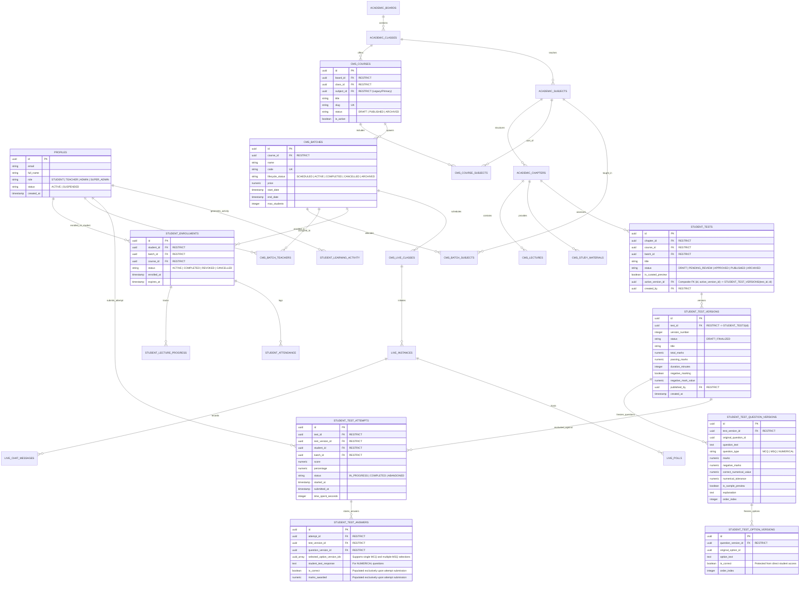

# TopVeda — Corrected Final Architecture Specification & Implementation Blueprint (v6.7)

**Role:** Principal PostgreSQL Architect, Supabase Security Engineer, Application Security Auditor & Senior TypeScript Architect  
**Project:** TopVeda  
**Repository:** `D:\TopVeda\TopVeda`  
**Current Phase:** Final Architecture Specification (Design-Only & Verification)  
**Implementation Authorization:** NOT GRANTED (Strictly Design & Verification Only)  
**Version:** 6.7 (Production-Hardened, Concurrency-Safe, Privilege-Hardened & Integrity-Enforced)  
**Date:** October 2026

---

## EXECUTIVE SUMMARY & REVISION HIGHLIGHTS (v6.6 → v6.7)

This document is the definitive architectural specification for TopVeda. It incorporates all eight owner-approved product decisions, eliminates every identified answer-key and progress fabrication vector, establishes mathematical database-level integrity and concurrency safety, reconciles PostgreSQL privileges with RLS policies, and defines an exhaustive, production-grade security and entitlement blueprint.

### Key Architectural Resolutions in Version 6.7:
1. **Server-Authoritative Test Duration & Deadline Enforcement (Section 7.3 & 7.4)**:
   - Replaced client timer reliance with a server-enforced deadline: `v_deadline := v_attempt.started_at + (v_version.duration_minutes || ' minutes')::INTERVAL + interval '1 minute'` (including network grace buffer).
   - `get_enrolled_student_test_questions`, `save_student_test_answer`, and `submit_student_test_attempt` strictly enforce `now() <= v_deadline`. Answers submitted past the deadline are rejected.
2. **Elimination of Answer-Save and Submission Race Conditions (Section 7.4)**:
   - Implemented mandatory row-level locking (`SELECT ... FOR UPDATE` on `student_test_attempts`) in both `save_student_test_answer` and `submit_student_test_attempt`.
   - Guaranteed a deadlock-free lock order (`student_test_attempts` first, then `student_test_answers`). An answer save arriving while grading is underway will wait for the lock, then immediately fail because `status` has transitioned to `'COMPLETED'`.
3. **Operation-Specific Live Class RLS Policies (Section 6.2)**:
   - Replaced broad `ALL` permissions with granular `SELECT`, `INSERT`, `UPDATE`, and `DELETE` policies.
   - Assigned teachers and Admins can draft and manage live session schedules, but only `SUPER_ADMIN` can transition status to `'PUBLISHED'`.
4. **Complete Test CMS & Revision Matrix (Section 5 & 6.2)**:
   - Explicitly defined author-scoped draft creation and editing for teachers within assigned batches (`is_batch_teacher(batch_id)`), submission for review, Admin operational draft creation, and Super Admin exclusive publishing.
   - Established version revision forking: updating a published test generates a new immutable version snapshot without mutating historical test attempts.
5. **Security Definer Function Inventory & Audit Queries (Section 6.5 & 6.6)**:
   - Fully cataloged all database functions specifying signature, security context (`SECURITY DEFINER`), owner (`postgres`), safe search path (`public, pg_temp`), explicit `REVOKE EXECUTE FROM PUBLIC`, role grants, and PostgREST exposure.
   - Provided a repeatable PostgreSQL audit query checking both role table grants and routine execution privileges.
6. **Concrete Supabase Storage Policies (Section 10.3)**:
   - Provided complete SQL `CREATE POLICY` definitions on `storage.objects` for `study-materials`, `test-attachments`, and `lecture-thumbnails`.
7. **Course-Level Test-to-Batch Scoping & Version Resumption Integrity (Section 7.3)**:
   - Validated that when a test has `batch_id IS NULL`, the requested batch must belong to the test's `course_id`.
   - When resuming an existing in-progress attempt, `start_student_test_attempt` returns the attempt's original `test_version_id`, guaranteeing historical version immutability even if a new active version was published in the interim.
8. **Hardened Server-Authoritative Lecture Progress Telemetry (Section 10.1)**:
   - First-time progress requests are clamped to actual playback time (max 15s initial buffer), server elapsed time is verified against real timestamp deltas, and completion is calculated strictly server-side at 90% threshold.

---

## 1. PRESERVED OWNER-APPROVED DECISIONS

All eight owner-approved product decisions are treated as fixed, non-negotiable architectural anchors:

| # | Principle | Architecture Implementation |
|---|-----------|-----------------------------|
| **1** | **Batch-Centric Enrollment** | Students enroll in specific cohort batches (`cms_batches`), automatically inheriting access to the parent course curriculum (`cms_courses`). |
| **2** | **Curated Preview Content** | Free pricing never implies open access. Content is public if and only if explicitly flagged with `is_curated_preview = true`. |
| **3** | **Four-Tier Role Hierarchy** | Strict database-level enum separating `STUDENT`, `TEACHER`, `ADMIN`, and `SUPER_ADMIN`. |
| **4** | **Dual Preview Audience** | Both unauthenticated public visitors and registered unenrolled students can consume curated preview assets via secure, server-authoritative preview endpoints. |
| **5** | **Batch Completion Read-Only Access** | Completed batches lock new live attendance and new test submissions while preserving permanent read-only access to historical lectures, notes, and scorecards. |
| **6** | **Teacher Test & Content Creation** | Teachers author lectures, live classes, study notes, and tests within their assigned batch/subject scope and submit them for review. |
| **7** | **Super Admin Exclusive Publishing** | Only `SUPER_ADMIN` possesses the authority to approve, publish, reject, or archive academic content. |
| **8** | **Multi-Batch Enrollment** | Students can concurrently enroll in multiple batches, including overlapping schedules and multiple cohorts under the same course. |

---

## 2. CANONICAL ACADEMIC & OPERATIONAL HIERARCHY

```
Academic Board (e.g., CBSE, ICSE, State Board)
 └── Class / Grade (e.g., Class 10, Class 12)
      └── Course / Master Curriculum (e.g., Class 10 Board Mastery 2026-27)
           ├── Subjects (Join via `cms_course_subjects`: Physics, Chemistry, Mathematics)
           │    └── Chapters (e.g., Chapter 1: Chemical Reactions)
           │         └── Master Content Pool (Lectures, Notes, Question Bank)
           │
           └── Operational Cohort Batches (e.g., Morning Champions Batch, Evening FastTrack Batch)
                ├── Assigned Batch Subjects (`cms_batch_subjects`)
                ├── Assigned Teachers (`cms_batch_teachers`)
                ├── Schedule, Meeting Config & Pricing
                └── Student Batch Enrollments (`student_enrollments` -> `batch_id`)
```

---

## 3. EXISTING VS TARGET SCHEMA COMPARISON

| Table | Current Live Schema (Verified) | Target Schema (v6.7 Blueprint) | Modification Strategy |
|---|---|---|---|
| `profiles` | Enum: `'STUDENT', 'ADMIN', 'SUPER_ADMIN'` | Enum: `'STUDENT', 'TEACHER', 'ADMIN', 'SUPER_ADMIN'` | Add `'TEACHER'` to enum/check constraint. Safe backfill for verified educators. |
| `cms_courses` | Single `subject_id` (UUID), `title`, `description`, `class_id`, `board_id` | Retain `subject_id` as primary/legacy; introduce `cms_course_subjects` join table. | Non-destructive expand. Backfill existing `subject_id` into join table. |
| `cms_course_subjects` | **Does not exist** | `(id, course_id, subject_id, display_order, created_at)` | Create table with `UNIQUE(course_id, subject_id)` and `ON DELETE RESTRICT`. |
| `cms_batches` | `course_id`, `name`, `status`, `start_date`, `end_date`, `price`, `enrollment_limit` | Add `lifecycle_status` check: `'SCHEDULED', 'ACTIVE', 'COMPLETED', 'CANCELLED', 'ARCHIVED'`. | Enhance status constraint. Preserve existing records (`ACTIVE`/`SCHEDULED`). |
| `cms_batch_subjects` | **Does not exist** | `(id, batch_id, subject_id, teacher_id, created_at)` | Create table for granular teacher-subject batch scoping. |
| `cms_batch_teachers` | `(id, batch_id, teacher_id, role, created_at)` | Retain for batch-level educator assignments with active role check. | Keep as primary educator assignment table. |
| `student_enrollments` | `course_id NOT NULL`, `batch_id NULLABLE`, `UNIQUE(student_id, course_id)` (5 active rows all hold both IDs) | `batch_id NOT NULL`, `course_id NOT NULL (derived)`, `UNIQUE(student_id, batch_id)` | Phased migration: Expand → Verify data integrity → Deploy multi-batch resolver → Switch constraint. |
| `cms_lectures` | `status` ('DRAFT','PUBLISHED'), `is_free` (boolean) | `status` ('DRAFT','PENDING_REVIEW','APPROVED','PUBLISHED','ARCHIVED'), `is_curated_preview` (boolean) | Add `is_curated_preview`, update status enum, default `is_curated_preview = false`. |
| `cms_study_materials` | `status`, `is_free`, `file_url`, `chapter_id` | `status`, `is_curated_preview`, `file_url`, `access_type` | Add `is_curated_preview`, enforce secure signed download endpoints. |
| `student_tests` | `status`, `total_marks`, `passing_marks`, `course_id`, `batch_id` | `status` (5-state), `is_curated_preview`, `active_version_id FK (Composite)`, `created_by` | Add preview flag, composite active version FK, author ID, review tracking columns. |
| `student_test_versions` | **Does not exist** | `(id, test_id, version_number, status, ...)` with `UNIQUE(test_id, id)` and Finalization Triggers | Create table with `ON DELETE RESTRICT` and immutability triggers. Direct client access revoked. |
| `student_test_question_versions` | **Does not exist** | `(id, test_version_id, question_type, is_sample_preview, correct_numerical_value, ...)` with `UNIQUE(test_version_id, id)` | Create table with composite unique keys, preview flag, scoring fields, and immutability triggers. Direct client access REVOKED. |
| `student_test_option_versions` | **Does not exist** | `(id, question_version_id, is_correct, ...)` with `UNIQUE(question_version_id, id)` | Direct client access REVOKED. Immutability triggers enforced. |
| `student_test_attempts` | `(id, test_id, student_id, answers, score, status, started_at, completed_at)` | Direct client write REVOKED. Composite FK `(test_id, test_version_id)`. Partial unique index on `IN_PROGRESS`. | Created strictly via `start_student_test_attempt` RPC. |
| `student_test_answers` | `(id, attempt_id, question_id, selected_option_id, is_correct, marks_awarded)` | Direct client access REVOKED. Composite FKs + `selected_option_version_ids UUID[]` + `UNIQUE(attempt_id, question_version_id)`. | Interacted with strictly via `save_student_test_answer` and `submit_student_test_attempt`. |
| `student_lecture_progress` | `(id, student_id, lecture_id, watch_time_seconds, completed, ...)` | Direct client write REVOKED. Managed exclusively via `sync_lecture_progress` RPC. | Prevents instant progress fabrication. |
| `student_attendance` | `(id, student_id, live_class_id, status, ...)` | Direct client write REVOKED. Managed via live session heartbeat/teacher host RPC. | Prevents fake attendance logging. |

---

## 4. FINAL ENTITY RELATIONSHIP DIAGRAM (MERMAID)



---

## 5. COMPLETE ROLE AND PERMISSION MATRIX

| Functional Domain | STUDENT | TEACHER (Assigned Scope) | ADMIN | SUPER_ADMIN |
|---|---|---|---|---|
| **Academic Hierarchy (Boards, Classes, Subjects, Chapters)** | View published hierarchy | View assigned hierarchy | View full hierarchy | Full CRUD + Publish |
| **Courses Management** | View published courses | View associated courses | View courses & batches | Full CRUD + Publish |
| **Batch Management** | View active/scheduled batches | View assigned batches | Create/Edit batches, assign teachers | Full CRUD + All States |
| **Batch Enrollment** | Self-enroll in available batches | View student roster of assigned batches | Enroll/Transfer students across batches | Full override & enrollment audit |
| **Curated Preview Content** | View public preview samples freely | View preview content | View & test preview content | Flag/Unflag preview assets |
| **Restricted Content (Enrolled Batches)** | Full consumption & submissions | View content for assigned batches | View content across all batches | Full access & management |
| **Content Creation (Lectures, Notes, Tests)** | No access | Create/Edit drafts in **assigned batches only** | Create/Edit drafts & manage batches | Full CRUD across system |
| **Content Review Submission** | No access | Submit owned drafts for review | Submit drafts for review | N/A (Direct Publisher) |
| **Content Approval & Publishing** | **Forbidden** | **Forbidden** | **Forbidden** | **Exclusive Authority** |
| **Live Classes & Meetings** | Join live sessions for active enrolled batches | Host/Start live sessions for assigned batches | Monitor live sessions & schedules | Full moderation & audit |
| **Test Attempts & Submissions** | Submit attempts for active enrolled batches | View attempt metrics for assigned batches | View attempt analytics | Full access & scorecard audit |
| **Test Answer Keys & Explanations** | **Direct table access REVOKED; Accessible strictly via Scorecard RPC after attempt submission** | View answer keys for assigned tests | View answer keys for verification | Full view & verification |
| **Lecture Progress Tracking** | Sync playback via RPC; direct DB write REVOKED | View progress metrics for assigned students | View progress reports | Full audit log |
| **Attendance Tracking** | View personal attendance; direct DB write REVOKED | Mark/Verify attendance for assigned live sessions | Manage attendance records | Full audit log |
| **User Role Management** | No access | No access | View profiles; manage student accounts | Full role promotion/demotion |
| **System Settings & Audit Logs** | No access | No access | Operational reports only | Full audit log & integration keys |

---

## 6. ASSIGNMENT-AWARE RLS, PRIVILEGE HARDENING & AUDIT

### 6.1 Database Security Functions (Strict Separation of Roles)

```sql
-- 1. Super Admin Authority
CREATE OR REPLACE FUNCTION public.is_super_admin()
RETURNS BOOLEAN
LANGUAGE sql
SECURITY DEFINER
SET search_path = public, pg_temp
STABLE
AS $$
  SELECT EXISTS (
    SELECT 1 FROM profiles
    WHERE id = auth.uid()
      AND role = 'SUPER_ADMIN'
      AND status = 'ACTIVE'
  );
$$;

-- 2. Admin or Super Admin Authority
CREATE OR REPLACE FUNCTION public.is_admin_or_super()
RETURNS BOOLEAN
LANGUAGE sql
SECURITY DEFINER
SET search_path = public, pg_temp
STABLE
AS $$
  SELECT EXISTS (
    SELECT 1 FROM profiles
    WHERE id = auth.uid()
      AND role IN ('ADMIN', 'SUPER_ADMIN')
      AND status = 'ACTIVE'
  );
$$;

-- 3. Batch Teacher Assignment Check (Strictly verifies active assignment and active teacher role)
CREATE OR REPLACE FUNCTION public.is_batch_teacher(p_batch_id UUID)
RETURNS BOOLEAN
LANGUAGE sql
SECURITY DEFINER
SET search_path = public, pg_temp
STABLE
AS $$
  SELECT EXISTS (
    SELECT 1 FROM cms_batch_teachers bt
    JOIN profiles p ON p.id = bt.teacher_id
    WHERE bt.batch_id = p_batch_id
      AND bt.teacher_id = auth.uid()
      AND p.role = 'TEACHER'
      AND p.status = 'ACTIVE'
  );
$$;

-- 4. Student Active Enrollment Check (Real-time participation: live sessions & test attempts)
CREATE OR REPLACE FUNCTION public.is_actively_enrolled_in_batch(p_batch_id UUID)
RETURNS BOOLEAN
LANGUAGE sql
SECURITY DEFINER
SET search_path = public, pg_temp
STABLE
AS $$
  SELECT EXISTS (
    SELECT 1 FROM student_enrollments e
    JOIN profiles p ON p.id = e.student_id
    JOIN cms_batches b ON b.id = e.batch_id
    WHERE e.batch_id = p_batch_id
      AND e.student_id = auth.uid()
      AND p.role = 'STUDENT'
      AND e.status = 'ACTIVE'
      AND b.lifecycle_status = 'ACTIVE'
  );
$$;

-- 5. Student Historical Read-Only Access Check (Lectures, notes, scorecards)
CREATE OR REPLACE FUNCTION public.has_historical_batch_access(p_batch_id UUID)
RETURNS BOOLEAN
LANGUAGE sql
SECURITY DEFINER
SET search_path = public, pg_temp
STABLE
AS $$
  SELECT EXISTS (
    SELECT 1 FROM student_enrollments e
    JOIN profiles p ON p.id = e.student_id
    WHERE e.batch_id = p_batch_id
      AND e.student_id = auth.uid()
      AND p.role = 'STUDENT'
      AND e.status IN ('ACTIVE', 'COMPLETED')
  );
$$;

-- 6. Content Access Check for Students/Public (Published Curated Preview OR Historical Batch Access)
CREATE OR REPLACE FUNCTION public.can_student_access_content(
  p_is_curated_preview BOOLEAN,
  p_batch_id UUID,
  p_status TEXT
)
RETURNS BOOLEAN
LANGUAGE sql
SECURITY DEFINER
SET search_path = public, pg_temp
STABLE
AS $$
  SELECT (
    p_status = 'PUBLISHED' 
    AND (p_is_curated_preview = TRUE OR (p_batch_id IS NOT NULL AND has_historical_batch_access(p_batch_id)))
  );
$$;
```

### 6.2 Complete Row-Level Security (RLS) Policy Catalog

| Table | Policy Name | Command | Target Role | Security Expression (`USING` / `WITH CHECK`) |
|---|---|---|---|---|
| `cms_lectures` | `lectures_student_read` | `SELECT` | `public` | `can_student_access_content(is_curated_preview, batch_id, status)` |
| `cms_lectures` | `lectures_teacher_read` | `SELECT` | `authenticated` | `author_id = auth.uid() OR (batch_id IS NOT NULL AND is_batch_teacher(batch_id))` |
| `cms_lectures` | `lectures_admin_read` | `SELECT` | `authenticated` | `is_admin_or_super()` |
| `cms_lectures` | `lectures_teacher_insert` | `INSERT` | `authenticated` | `batch_id IS NOT NULL AND is_batch_teacher(batch_id) AND status = 'DRAFT' AND author_id = auth.uid()` |
| `cms_lectures` | `lectures_admin_insert` | `INSERT` | `authenticated` | `is_admin_or_super() AND status = 'DRAFT'` |
| `cms_lectures` | `lectures_teacher_update` | `UPDATE` | `authenticated` | `author_id = auth.uid() AND status IN ('DRAFT', 'PENDING_REVIEW') AND (batch_id IS NOT NULL AND is_batch_teacher(batch_id))` |
| `cms_lectures` | `lectures_super_admin_manage` | `ALL` | `authenticated` | `is_super_admin()` |
| `student_tests` | `tests_student_read` | `SELECT` | `public` | `can_student_access_content(is_curated_preview, batch_id, status)` |
| `student_tests` | `tests_teacher_read` | `SELECT` | `authenticated` | `created_by = auth.uid() OR (batch_id IS NOT NULL AND is_batch_teacher(batch_id))` |
| `student_tests` | `tests_admin_read` | `SELECT` | `authenticated` | `is_admin_or_super()` |
| `student_tests` | `tests_teacher_insert` | `INSERT` | `authenticated` | `batch_id IS NOT NULL AND is_batch_teacher(batch_id) AND status = 'DRAFT' AND created_by = auth.uid()` |
| `student_tests` | `tests_admin_insert` | `INSERT` | `authenticated` | `is_admin_or_super() AND status = 'DRAFT'` |
| `student_tests` | `tests_teacher_update` | `UPDATE` | `authenticated` | `created_by = auth.uid() AND status IN ('DRAFT', 'PENDING_REVIEW') AND (batch_id IS NOT NULL AND is_batch_teacher(batch_id))` |
| `student_tests` | `tests_super_admin_publish` | `UPDATE` | `authenticated` | `is_super_admin()` |
| `student_test_versions` | `versions_educator_read` | `SELECT` | `authenticated` | `is_batch_teacher((SELECT batch_id FROM student_tests WHERE id = test_id)) OR is_admin_or_super()` |
| `student_test_versions` | `versions_super_admin_insert` | `INSERT` | `authenticated` | `is_super_admin()` |
| `student_test_question_versions` | `q_versions_educator_read` | `SELECT` | `authenticated` | `is_batch_teacher((SELECT t.batch_id FROM student_tests t JOIN student_test_versions tv ON tv.test_id = t.id WHERE tv.id = test_version_id)) OR is_admin_or_super()` |
| `student_test_question_versions` | `q_versions_super_admin_insert` | `INSERT` | `authenticated` | `is_super_admin()` |
| `student_test_option_versions` | `opt_versions_educator_read` | `SELECT` | `authenticated` | `is_batch_teacher((SELECT t.batch_id FROM student_tests t JOIN student_test_versions tv ON tv.test_id = t.id JOIN student_test_question_versions qv ON qv.test_version_id = tv.id WHERE qv.id = question_version_id)) OR is_admin_or_super()` |
| `student_test_option_versions` | `opt_versions_super_admin_insert`| `INSERT` | `authenticated` | `is_super_admin()` |
| `student_test_attempts` | `attempts_student_read_own` | `SELECT` | `authenticated` | `auth.uid() = student_id` |
| `student_test_attempts` | `attempts_teacher_batch_read` | `SELECT` | `authenticated` | `is_batch_teacher(batch_id)` |
| `student_test_attempts` | `attempts_admin_read_all` | `SELECT` | `authenticated` | `is_admin_or_super()` |
| `student_test_attempts` | `attempts_direct_write_block` | `INSERT, UPDATE, DELETE` | `authenticated` | `FALSE (MANIPULATION DIRECTLY BLOCKED; ACCESSIBLE ONLY VIA RPC)` |
| `student_test_answers` | `answers_all_direct_access` | `ALL` | `authenticated` | `FALSE (DIRECT ACCESS STRICTLY BLOCKED; ACCESSIBLE ONLY VIA RPC)` |
| `cms_study_materials` | `materials_student_read` | `SELECT` | `public` | `can_student_access_content(is_curated_preview, batch_id, status)` |
| `cms_live_classes` | `live_student_access` | `SELECT` | `authenticated` | `is_actively_enrolled_in_batch(batch_id) AND status = 'PUBLISHED'` |
| `cms_live_classes` | `live_teacher_select` | `SELECT` | `authenticated` | `is_batch_teacher(batch_id)` |
| `cms_live_classes` | `live_teacher_insert` | `INSERT` | `authenticated` | `batch_id IS NOT NULL AND is_batch_teacher(batch_id) AND status = 'DRAFT' AND author_id = auth.uid()` |
| `cms_live_classes` | `live_teacher_update` | `UPDATE` | `authenticated` | `author_id = auth.uid() AND status IN ('DRAFT', 'PENDING_REVIEW') AND is_batch_teacher(batch_id)` |
| `cms_live_classes` | `live_teacher_delete` | `DELETE` | `authenticated` | `author_id = auth.uid() AND status = 'DRAFT' AND is_batch_teacher(batch_id)` |
| `cms_live_classes` | `live_admin_manage` | `SELECT, INSERT, UPDATE`| `authenticated`| `is_admin_or_super()` |
| `cms_live_classes` | `live_super_admin_publish` | `ALL` | `authenticated` | `is_super_admin()` |
| `student_lecture_progress`| `progress_student_read_own` | `SELECT` | `authenticated` | `auth.uid() = student_id` |
| `student_lecture_progress`| `progress_direct_write_block` | `INSERT, UPDATE, DELETE` | `authenticated` | `FALSE (DIRECT CLIENT WRITE BLOCKED; MANAGED VIA sync_lecture_progress RPC)` |
| `student_attendance` | `attendance_student_read` | `SELECT` | `authenticated` | `auth.uid() = student_id` |
| `student_attendance` | `attendance_direct_write_block`| `INSERT, UPDATE, DELETE` | `authenticated` | `FALSE (DIRECT WRITE BLOCKED; MANAGED VIA LIVE SESSION HEARTBEAT RPC)` |

---

### 6.3 Detailed Table-by-Table Privilege Matrix

| Table Name | Direct SELECT | Direct INSERT | Direct UPDATE | Direct DELETE | Authorized Roles | Authorized RPC / Service Alternative |
|---|---|---|---|---|---|---|
| `student_test_answers` | **REVOKED** | **REVOKED** | **REVOKED** | **REVOKED** | None (DB Admin only) | `save_student_test_answer`, `submit_student_test_attempt`, `get_student_test_scorecard` |
| `student_test_attempts` | **ALLOWED (RLS)** | **REVOKED** | **REVOKED** | **REVOKED** | Student (Own), Teacher (Batch), Admin (All) | `start_student_test_attempt`, `submit_student_test_attempt` |
| `student_test_versions` | **ALLOWED (RLS)** | **REVOKED** | **REVOKED** | **REVOKED** | Assigned Teacher, Admin, Super Admin | Super Admin Publishing Transaction |
| `student_test_question_versions`| **ALLOWED (RLS)** | **REVOKED** | **REVOKED** | **REVOKED** | Assigned Teacher, Admin, Super Admin | `get_public_test_preview`, `get_enrolled_student_test_questions` |
| `student_test_option_versions`  | **ALLOWED (RLS)** | **REVOKED** | **REVOKED** | **REVOKED** | Assigned Teacher, Admin, Super Admin | `get_public_test_preview`, `get_enrolled_student_test_questions` |
| `student_lecture_progress`      | **ALLOWED (RLS)** | **REVOKED** | **REVOKED** | **REVOKED** | Student (Own), Admin (All) | `sync_lecture_progress` |
| `student_attendance`            | **ALLOWED (RLS)** | **REVOKED** | **REVOKED** | **REVOKED** | Student (Own), Teacher (Batch), Admin (All) | `record_live_attendance_heartbeat`, `finalize_live_class_attendance` |

---

### 6.4 Database Privileges (GRANT and REVOKE Statements)

```sql
-- 1. Revoke direct write access on attempts, answers, option keys, question versions, progress, attendance
REVOKE ALL ON public.student_test_answers FROM anon, authenticated, public;
REVOKE ALL ON public.student_test_option_versions FROM anon, authenticated, public;
REVOKE ALL ON public.student_test_question_versions FROM anon, authenticated, public;
REVOKE INSERT, UPDATE, DELETE ON public.student_test_attempts FROM anon, authenticated, public;
REVOKE INSERT, UPDATE, DELETE ON public.student_test_versions FROM anon, authenticated, public;
REVOKE INSERT, UPDATE, DELETE ON public.student_lecture_progress FROM anon, authenticated, public;
REVOKE INSERT, UPDATE, DELETE ON public.student_attendance FROM anon, authenticated, public;

-- 2. Allow read access governed by RLS on version metadata and attempts
GRANT SELECT ON public.student_test_attempts TO authenticated;
GRANT SELECT ON public.student_test_versions TO authenticated;
GRANT SELECT ON public.student_test_question_versions TO authenticated;
GRANT SELECT ON public.student_test_option_versions TO authenticated;
GRANT SELECT ON public.student_lecture_progress TO authenticated;
GRANT SELECT ON public.student_attendance TO authenticated;

-- 3. Explicitly revoke default PUBLIC execution on all security-definer functions
REVOKE EXECUTE ON FUNCTION public.get_public_test_preview(UUID) FROM PUBLIC;
REVOKE EXECUTE ON FUNCTION public.get_enrolled_student_test_questions(UUID) FROM PUBLIC;
REVOKE EXECUTE ON FUNCTION public.start_student_test_attempt(UUID, UUID) FROM PUBLIC;
REVOKE EXECUTE ON FUNCTION public.save_student_test_answer(UUID, UUID, UUID[], TEXT) FROM PUBLIC;
REVOKE EXECUTE ON FUNCTION public.submit_student_test_attempt(UUID) FROM PUBLIC;
REVOKE EXECUTE ON FUNCTION public.get_student_test_scorecard(UUID) FROM PUBLIC;
REVOKE EXECUTE ON FUNCTION public.sync_lecture_progress(UUID, INTEGER) FROM PUBLIC;
REVOKE EXECUTE ON FUNCTION public.record_live_attendance_heartbeat(UUID) FROM PUBLIC;
REVOKE EXECUTE ON FUNCTION public.finalize_live_class_attendance(UUID) FROM PUBLIC;

-- 4. Grant explicit execute on student/teacher RPCs
GRANT EXECUTE ON FUNCTION public.get_public_test_preview(UUID) TO anon, authenticated;
GRANT EXECUTE ON FUNCTION public.get_enrolled_student_test_questions(UUID) TO authenticated;
GRANT EXECUTE ON FUNCTION public.start_student_test_attempt(UUID, UUID) TO authenticated;
GRANT EXECUTE ON FUNCTION public.save_student_test_answer(UUID, UUID, UUID[], TEXT) TO authenticated;
GRANT EXECUTE ON FUNCTION public.submit_student_test_attempt(UUID) TO authenticated;
GRANT EXECUTE ON FUNCTION public.get_student_test_scorecard(UUID) TO authenticated;
GRANT EXECUTE ON FUNCTION public.sync_lecture_progress(UUID, INTEGER) TO authenticated;
GRANT EXECUTE ON FUNCTION public.record_live_attendance_heartbeat(UUID) TO authenticated;
GRANT EXECUTE ON FUNCTION public.finalize_live_class_attendance(UUID) TO authenticated;
```

---

### 6.5 Security Definer Function Inventory & Hardening Matrix

| Function Signature | Context | Owner | Search Path | Execution Grants | PostgREST Exposed |
|---|---|---|---|---|---|
| `get_public_test_preview(UUID)` | `SECURITY DEFINER` | `postgres` | `public, pg_temp` | `anon, authenticated` | Yes |
| `get_enrolled_student_test_questions(UUID)` | `SECURITY DEFINER` | `postgres` | `public, pg_temp` | `authenticated` | Yes |
| `start_student_test_attempt(UUID, UUID)` | `SECURITY DEFINER` | `postgres` | `public, pg_temp` | `authenticated` | Yes |
| `save_student_test_answer(UUID, UUID, UUID[], TEXT)` | `SECURITY DEFINER` | `postgres` | `public, pg_temp` | `authenticated` | Yes |
| `submit_student_test_attempt(UUID)` | `SECURITY DEFINER` | `postgres` | `public, pg_temp` | `authenticated` | Yes |
| `get_student_test_scorecard(UUID)` | `SECURITY DEFINER` | `postgres` | `public, pg_temp` | `authenticated` | Yes |
| `sync_lecture_progress(UUID, INTEGER)` | `SECURITY DEFINER` | `postgres` | `public, pg_temp` | `authenticated` | Yes |
| `record_live_attendance_heartbeat(UUID)` | `SECURITY DEFINER` | `postgres` | `public, pg_temp` | `authenticated` | Yes |
| `finalize_live_class_attendance(UUID)` | `SECURITY DEFINER` | `postgres` | `public, pg_temp` | `authenticated` | Yes |
| `is_super_admin()` | `SECURITY DEFINER` | `postgres` | `public, pg_temp` | `authenticated` | No (Internal Helper) |
| `is_admin_or_super()` | `SECURITY DEFINER` | `postgres` | `public, pg_temp` | `authenticated` | No (Internal Helper) |
| `is_batch_teacher(UUID)` | `SECURITY DEFINER` | `postgres` | `public, pg_temp` | `authenticated` | No (Internal Helper) |
| `is_actively_enrolled_in_batch(UUID)` | `SECURITY DEFINER` | `postgres` | `public, pg_temp` | `authenticated` | No (Internal Helper) |
| `has_historical_batch_access(UUID)` | `SECURITY DEFINER` | `postgres` | `public, pg_temp` | `authenticated` | No (Internal Helper) |
| `can_student_access_content(BOOLEAN, UUID, TEXT)` | `SECURITY DEFINER` | `postgres` | `public, pg_temp` | `anon, authenticated` | No (Internal Helper) |

---

### 6.6 Repeatable PostgreSQL Privilege Audit Query

```sql
-- Audit table grants and routine execution privileges in production
SELECT 
  'TABLE_GRANT' AS audit_type,
  grantee, 
  table_schema, 
  table_name AS object_name, 
  privilege_type 
FROM information_schema.role_table_grants 
WHERE table_schema = 'public' 
  AND table_name IN (
    'student_test_answers', 
    'student_test_attempts', 
    'student_test_option_versions', 
    'student_test_question_versions', 
    'student_test_versions', 
    'student_lecture_progress', 
    'student_attendance'
  )

UNION ALL

SELECT 
  'ROUTINE_PRIVILEGE' AS audit_type,
  grantee, 
  routine_schema, 
  routine_name AS object_name, 
  privilege_type 
FROM information_schema.routine_privileges 
WHERE routine_schema = 'public'
  AND routine_name IN (
    'get_public_test_preview',
    'get_enrolled_student_test_questions',
    'start_student_test_attempt',
    'save_student_test_answer',
    'submit_student_test_attempt',
    'get_student_test_scorecard',
    'sync_lecture_progress',
    'record_live_attendance_heartbeat',
    'finalize_live_class_attendance'
  )
ORDER BY audit_type, object_name, grantee, privilege_type;
```

---

## 7. DATABASE-LEVEL TEST IMMUTABILITY, CONCURRENCY & SCORING ENGINE

### 7.1 Lifecycle-Locked Immutability Triggers (PostgreSQL)

```sql
-- Trigger function to freeze finalized test versions and prevent re-parenting
CREATE OR REPLACE FUNCTION public.enforce_test_version_finalization_immutability()
RETURNS TRIGGER
LANGUAGE plpgsql
SECURITY DEFINER
SET search_path = public, pg_temp
AS $$
DECLARE
  v_version_status TEXT;
  v_test_version_id UUID;
BEGIN
  IF TG_OP = 'DELETE' THEN
    IF TG_TABLE_NAME = 'student_test_versions' THEN
      IF OLD.status = 'FINALIZED' THEN
        RAISE EXCEPTION 'Database Integrity Error: Finalized test versions cannot be deleted.';
      END IF;
      RETURN OLD;
    ELSIF TG_TABLE_NAME = 'student_test_question_versions' THEN
      v_test_version_id := OLD.test_version_id;
    ELSIF TG_TABLE_NAME = 'student_test_option_versions' THEN
      SELECT qv.test_version_id INTO v_test_version_id
      FROM student_test_question_versions qv
      WHERE qv.id = OLD.question_version_id;
    END IF;

    SELECT status INTO v_version_status FROM student_test_versions WHERE id = v_test_version_id;
    IF v_version_status = 'FINALIZED' THEN
      RAISE EXCEPTION 'Database Integrity Error: Cannot delete items from a finalized test version.';
    END IF;
    RETURN OLD;

  ELSIF TG_OP = 'INSERT' THEN
    IF TG_TABLE_NAME = 'student_test_question_versions' THEN
      v_test_version_id := NEW.test_version_id;
    ELSIF TG_TABLE_NAME = 'student_test_option_versions' THEN
      SELECT qv.test_version_id INTO v_test_version_id
      FROM student_test_question_versions qv
      WHERE qv.id = NEW.question_version_id;
    END IF;

    SELECT status INTO v_version_status FROM student_test_versions WHERE id = v_test_version_id;
    IF v_version_status = 'FINALIZED' THEN
      RAISE EXCEPTION 'Database Integrity Error: Cannot insert new items into a finalized test version.';
    END IF;
    RETURN NEW;

  ELSIF TG_OP = 'UPDATE' THEN
    IF TG_TABLE_NAME = 'student_test_versions' THEN
      IF OLD.status = 'FINALIZED' THEN
        RAISE EXCEPTION 'Database Integrity Error: Finalized test versions cannot be updated.';
      END IF;
      RETURN NEW;
    ELSIF TG_TABLE_NAME = 'student_test_question_versions' THEN
      IF OLD.test_version_id != NEW.test_version_id THEN
        RAISE EXCEPTION 'Database Integrity Error: Cannot re-parent question versions.';
      END IF;
      v_test_version_id := OLD.test_version_id;
    ELSIF TG_TABLE_NAME = 'student_test_option_versions' THEN
      IF OLD.question_version_id != NEW.question_version_id THEN
        RAISE EXCEPTION 'Database Integrity Error: Cannot re-parent option versions.';
      END IF;
      SELECT qv.test_version_id INTO v_test_version_id
      FROM student_test_question_versions qv
      WHERE qv.id = OLD.question_version_id;
    END IF;

    SELECT status INTO v_version_status FROM student_test_versions WHERE id = v_test_version_id;
    IF v_version_status = 'FINALIZED' THEN
      RAISE EXCEPTION 'Database Integrity Error: Cannot update items in a finalized test version.';
    END IF;
    RETURN NEW;
  END IF;

  RETURN NULL;
END;
$$;

-- Apply triggers
CREATE TRIGGER trg_freeze_student_test_versions
BEFORE UPDATE OR DELETE ON public.student_test_versions
FOR EACH ROW EXECUTE FUNCTION public.enforce_test_version_finalization_immutability();

CREATE TRIGGER trg_freeze_student_test_question_versions
BEFORE INSERT OR UPDATE OR DELETE ON public.student_test_question_versions
FOR EACH ROW EXECUTE FUNCTION public.enforce_test_version_finalization_immutability();

CREATE TRIGGER trg_freeze_student_test_option_versions
BEFORE INSERT OR UPDATE OR DELETE ON public.student_test_option_versions
FOR EACH ROW EXECUTE FUNCTION public.enforce_test_version_finalization_immutability();
```

---

### 7.2 Composite Foreign Keys, Constraints & Indexing

```sql
-- 1. Partial Unique Index to guarantee concurrency safety (max 1 IN_PROGRESS attempt per student/test/batch)
CREATE UNIQUE INDEX uq_one_in_progress_attempt_per_student_test_batch 
ON public.student_test_attempts (student_id, test_id, batch_id) 
WHERE (status = 'IN_PROGRESS');

-- 2. Composite Unique Constraints on Version Tables
ALTER TABLE public.student_test_versions
ADD CONSTRAINT uq_test_version_composite UNIQUE (test_id, id);

ALTER TABLE public.student_tests
ADD CONSTRAINT fk_student_tests_active_version_composite
FOREIGN KEY (id, active_version_id)
REFERENCES public.student_test_versions(test_id, id)
ON DELETE RESTRICT DEFERRABLE INITIALLY DEFERRED;

-- 3. Bind Student Attempts strictly to (test_id, test_version_id)
ALTER TABLE public.student_test_attempts
ADD COLUMN test_id UUID NOT NULL,
ADD CONSTRAINT fk_attempts_test_version_composite
  FOREIGN KEY (test_id, test_version_id)
  REFERENCES public.student_test_versions(test_id, id)
  ON DELETE RESTRICT,
ADD CONSTRAINT uq_attempt_composite UNIQUE (id, test_version_id);

-- 4. Composite Foreign Keys on Question & Option Versions
ALTER TABLE public.student_test_question_versions
ADD CONSTRAINT uq_question_version_test_version UNIQUE (test_version_id, id);

ALTER TABLE public.student_test_option_versions
ADD CONSTRAINT uq_option_version_question_version UNIQUE (question_version_id, id);

-- 5. Standardized student_test_answers with Array & Text responses
ALTER TABLE public.student_test_answers
ADD COLUMN test_version_id UUID NOT NULL,
ADD COLUMN selected_option_version_ids UUID[] DEFAULT NULL,
ADD CONSTRAINT fk_answers_attempt_version
  FOREIGN KEY (attempt_id, test_version_id)
  REFERENCES public.student_test_attempts(id, test_version_id)
  ON DELETE RESTRICT,
ADD CONSTRAINT fk_answers_question_version
  FOREIGN KEY (test_version_id, question_version_id)
  REFERENCES public.student_test_question_versions(test_version_id, id)
  ON DELETE RESTRICT,
ADD CONSTRAINT uq_attempt_question_single_row
  UNIQUE (attempt_id, question_version_id);
```

---

### 7.3 Concurrency-Safe Attempt Creation & Deadline-Enforced Questions RPC

```sql
-- RPC 1: Sole Authorized Attempt Creation Entrypoint (Idempotent & Concurrency-Safe)
CREATE OR REPLACE FUNCTION public.start_student_test_attempt(
  p_test_id UUID,
  p_batch_id UUID
)
RETURNS JSONB
LANGUAGE plpgsql
SECURITY DEFINER
SET search_path = public, pg_temp
AS $$
DECLARE
  v_test RECORD;
  v_batch RECORD;
  v_version RECORD;
  v_attempt_id UUID;
  v_started_at TIMESTAMPTZ;
  v_existing_attempt RECORD;
BEGIN
  -- 1. Validate caller is an active student
  IF NOT EXISTS (SELECT 1 FROM profiles WHERE id = auth.uid() AND role = 'STUDENT' AND status = 'ACTIVE') THEN
    RAISE EXCEPTION 'Only active registered students can start test attempts.';
  END IF;

  -- 2. Validate active enrollment in active batch
  IF NOT is_actively_enrolled_in_batch(p_batch_id) THEN
    RAISE EXCEPTION 'Student is not actively enrolled in this active batch.';
  END IF;

  SELECT * INTO v_batch FROM cms_batches WHERE id = p_batch_id;

  -- 3. Validate test status and batch/course scoping
  SELECT * INTO v_test
  FROM student_tests
  WHERE id = p_test_id;

  IF NOT FOUND OR v_test.status != 'PUBLISHED' OR v_test.active_version_id IS NULL THEN
    RAISE EXCEPTION 'Test is not published or active.';
  END IF;

  -- Check batch scoping: direct batch match OR course inheritance match
  IF v_test.batch_id IS NOT NULL AND v_test.batch_id != p_batch_id THEN
    RAISE EXCEPTION 'Test does not belong to the requested batch.';
  END IF;

  IF v_test.batch_id IS NULL AND v_test.course_id != v_batch.course_id THEN
    RAISE EXCEPTION 'Test course does not match requested batch course.';
  END IF;

  -- 4. Validate active version is finalized and belongs to test
  SELECT * INTO v_version
  FROM student_test_versions
  WHERE id = v_test.active_version_id AND test_id = p_test_id;

  IF NOT FOUND OR v_version.status != 'FINALIZED' THEN
    RAISE EXCEPTION 'Active test version is not finalized.';
  END IF;

  -- 5. Concurrency-Safe Insert or Resume (Protected by partial unique index)
  INSERT INTO student_test_attempts (
    test_id,
    test_version_id,
    student_id,
    batch_id,
    status,
    started_at
  ) VALUES (
    p_test_id,
    v_test.active_version_id,
    auth.uid(),
    p_batch_id,
    'IN_PROGRESS',
    now()
  )
  ON CONFLICT (student_id, test_id, batch_id) WHERE (status = 'IN_PROGRESS') 
  DO NOTHING
  RETURNING id, started_at INTO v_attempt_id, v_started_at;

  -- If conflict occurred, retrieve existing in-progress attempt (Returning original test_version_id)
  IF v_attempt_id IS NULL THEN
    SELECT id, test_version_id, started_at INTO v_existing_attempt
    FROM student_test_attempts
    WHERE student_id = auth.uid()
      AND test_id = p_test_id
      AND batch_id = p_batch_id
      AND status = 'IN_PROGRESS';

    RETURN jsonb_build_object(
      'attempt_id', v_existing_attempt.id,
      'test_version_id', v_existing_attempt.test_version_id,
      'started_at', v_existing_attempt.started_at,
      'resumed', TRUE
    );
  END IF;

  RETURN jsonb_build_object(
    'attempt_id', v_attempt_id,
    'test_version_id', v_test.active_version_id,
    'started_at', v_started_at,
    'resumed', FALSE
  );
END;
$$;

-- RPC 2: Enrolled Student Test Delivery with Server Deadline Enforcement
CREATE OR REPLACE FUNCTION public.get_enrolled_student_test_questions(p_attempt_id UUID)
RETURNS JSONB
LANGUAGE plpgsql
SECURITY DEFINER
SET search_path = public, pg_temp
STABLE
AS $$
DECLARE
  v_attempt RECORD;
  v_version RECORD;
  v_deadline TIMESTAMPTZ;
  v_result JSONB;
BEGIN
  SELECT * INTO v_attempt
  FROM student_test_attempts
  WHERE id = p_attempt_id;

  IF NOT FOUND OR v_attempt.student_id != auth.uid() THEN
    RAISE EXCEPTION 'Attempt not found or unauthorized.';
  END IF;

  IF v_attempt.status != 'IN_PROGRESS' THEN
    RAISE EXCEPTION 'Attempt is not in progress.';
  END IF;

  -- Re-verify active enrollment & batch lifecycle
  IF NOT is_actively_enrolled_in_batch(v_attempt.batch_id) THEN
    RAISE EXCEPTION 'Active batch enrollment required to access test questions.';
  END IF;

  SELECT * INTO v_version
  FROM student_test_versions
  WHERE id = v_attempt.test_version_id;

  -- Server-Side Deadline Enforcement (with 1 min grace buffer for network transit)
  v_deadline := v_attempt.started_at + (v_version.duration_minutes || ' minutes')::INTERVAL + interval '1 minute';
  IF now() > v_deadline THEN
    RAISE EXCEPTION 'Test attempt duration has expired.';
  END IF;

  SELECT jsonb_build_object(
    'attempt_id', v_attempt.id,
    'test_title', v_version.title,
    'duration_minutes', v_version.duration_minutes,
    'started_at', v_attempt.started_at,
    'deadline', v_deadline,
    'questions', (
      SELECT jsonb_agg(
        jsonb_build_object(
          'question_id', qv.id,
          'question_text', qv.question_text,
          'question_type', qv.question_type,
          'marks', qv.marks,
          'negative_marks', qv.negative_marks,
          'order_index', qv.order_index,
          'options', (
            SELECT jsonb_agg(
              jsonb_build_object(
                'option_id', ov.id,
                'option_text', ov.option_text,
                'order_index', ov.order_index
              ) ORDER BY ov.order_index
            )
            FROM student_test_option_versions ov
            WHERE ov.question_version_id = qv.id
          )
        ) ORDER BY qv.order_index
      )
      FROM student_test_question_versions qv
      WHERE qv.test_version_id = v_attempt.test_version_id
    )
  ) INTO v_result;

  RETURN v_result;
END;
$$;
```

---

### 7.4 Deadlock-Free Locked Answer Save & Submission Grading

```sql
-- RPC 3: Deadlock-Free Locked Answer Upsert with Deadline & Question-Type Validation
CREATE OR REPLACE FUNCTION public.save_student_test_answer(
  p_attempt_id UUID,
  p_question_version_id UUID,
  p_selected_option_version_ids UUID[] DEFAULT NULL,
  p_student_text_response TEXT DEFAULT NULL
)
RETURNS JSONB
LANGUAGE plpgsql
SECURITY DEFINER
SET search_path = public, pg_temp
AS $$
DECLARE
  v_attempt RECORD;
  v_version RECORD;
  v_question RECORD;
  v_deadline TIMESTAMPTZ;
  v_opt_id UUID;
BEGIN
  -- 1. Acquire row-lock on attempt first (Consistent lock order avoids deadlocks)
  SELECT * INTO v_attempt
  FROM student_test_attempts
  WHERE id = p_attempt_id
  FOR UPDATE;

  IF NOT FOUND OR v_attempt.student_id != auth.uid() THEN
    RAISE EXCEPTION 'Attempt not found or unauthorized.';
  END IF;

  IF v_attempt.status != 'IN_PROGRESS' THEN
    RAISE EXCEPTION 'Cannot modify answers for a completed or submitted test attempt.';
  END IF;

  -- Re-verify active enrollment & batch status
  IF NOT is_actively_enrolled_in_batch(v_attempt.batch_id) THEN
    RAISE EXCEPTION 'Active batch enrollment required to save answers.';
  END IF;

  SELECT * INTO v_version
  FROM student_test_versions
  WHERE id = v_attempt.test_version_id;

  -- 2. Enforce Server-Side Deadline
  v_deadline := v_attempt.started_at + (v_version.duration_minutes || ' minutes')::INTERVAL + interval '1 minute';
  IF now() > v_deadline THEN
    RAISE EXCEPTION 'Test attempt duration has expired. Answers can no longer be modified.';
  END IF;

  -- 3. Validate question belongs to attempt test version
  SELECT * INTO v_question
  FROM student_test_question_versions
  WHERE id = p_question_version_id AND test_version_id = v_attempt.test_version_id;

  IF NOT FOUND THEN
    RAISE EXCEPTION 'Question does not belong to this attempt test version.';
  END IF;

  -- 4. Validate response according to question type
  IF v_question.question_type = 'MCQ' THEN
    IF p_selected_option_version_ids IS NULL OR array_length(p_selected_option_version_ids, 1) != 1 THEN
      RAISE EXCEPTION 'Exactly one option must be selected for MCQ.';
    END IF;
    IF NOT EXISTS (
      SELECT 1 FROM student_test_option_versions 
      WHERE id = p_selected_option_version_ids[1] AND question_version_id = p_question_version_id
    ) THEN
      RAISE EXCEPTION 'Selected option does not belong to this question.';
    END IF;

  ELSIF v_question.question_type = 'MSQ' THEN
    IF p_selected_option_version_ids IS NOT NULL THEN
      FOREACH v_opt_id IN ARRAY p_selected_option_version_ids LOOP
        IF NOT EXISTS (
          SELECT 1 FROM student_test_option_versions 
          WHERE id = v_opt_id AND question_version_id = p_question_version_id
        ) THEN
          RAISE EXCEPTION 'Selected option does not belong to this question.';
        END IF;
      END LOOP;
    END IF;

  ELSIF v_question.question_type = 'NUMERICAL' THEN
    IF p_student_text_response IS NOT NULL THEN
      IF NOT p_student_text_response ~ '^-?[0-9]+(\.[0-9]+)?$' THEN
        RAISE EXCEPTION 'Invalid numeric input format.';
      END IF;
    END IF;
  END IF;

  -- 5. Atomic Upsert of Answer (Keeping correctness and marks strictly NULL)
  INSERT INTO student_test_answers (
    attempt_id,
    test_version_id,
    question_version_id,
    selected_option_version_ids,
    student_text_response,
    is_correct,
    marks_awarded
  ) VALUES (
    p_attempt_id,
    v_attempt.test_version_id,
    p_question_version_id,
    p_selected_option_version_ids,
    p_student_text_response,
    NULL,
    NULL
  )
  ON CONFLICT (attempt_id, question_version_id) DO UPDATE SET
    selected_option_version_ids = EXCLUDED.selected_option_version_ids,
    student_text_response = EXCLUDED.student_text_response,
    is_correct = NULL,
    marks_awarded = NULL;

  RETURN jsonb_build_object('success', TRUE);
END;
$$;

-- RPC 4: Revalidated Submission Grading Transaction with Row Lock
CREATE OR REPLACE FUNCTION public.submit_student_test_attempt(p_attempt_id UUID)
RETURNS JSONB
LANGUAGE plpgsql
SECURITY DEFINER
SET search_path = public, pg_temp
AS $$
DECLARE
  v_attempt RECORD;
  v_version RECORD;
  v_total_score NUMERIC(6,2) := 0.0;
  v_percentage NUMERIC(5,2);
  v_q RECORD;
  v_is_correct BOOLEAN;
  v_marks NUMERIC(5,2);
  v_correct_ids UUID[];
  v_selected_ids UUID[];
  v_student_num NUMERIC;
  v_deadline TIMESTAMPTZ;
BEGIN
  -- 1. Row Lock attempt to serialize submission against concurrent answer saves
  SELECT * INTO v_attempt
  FROM student_test_attempts
  WHERE id = p_attempt_id
  FOR UPDATE;

  IF NOT FOUND OR v_attempt.student_id != auth.uid() THEN
    RAISE EXCEPTION 'Attempt not found or unauthorized.';
  END IF;

  IF v_attempt.status != 'IN_PROGRESS' THEN
    RAISE EXCEPTION 'Attempt is already submitted or closed.';
  END IF;

  -- 2. Revalidate active student, active enrollment & active batch
  IF NOT EXISTS (SELECT 1 FROM profiles WHERE id = auth.uid() AND role = 'STUDENT' AND status = 'ACTIVE') THEN
    RAISE EXCEPTION 'Student account is not active.';
  END IF;

  IF NOT is_actively_enrolled_in_batch(v_attempt.batch_id) THEN
    RAISE EXCEPTION 'Active batch enrollment required to submit test attempt.';
  END IF;

  -- 3. Retrieve version configuration and check hard deadline
  SELECT * INTO v_version
  FROM student_test_versions
  WHERE id = v_attempt.test_version_id;

  v_deadline := v_attempt.started_at + (v_version.duration_minutes || ' minutes')::INTERVAL + interval '5 minutes';
  IF now() > v_deadline THEN
    -- If past hard cut-off (5 min past test duration), auto-close without extra penalty
    NULL;
  END IF;

  -- 4. Evaluate each question server-side
  FOR v_q IN (
    SELECT * FROM student_test_question_versions
    WHERE test_version_id = v_attempt.test_version_id
  ) LOOP
    v_is_correct := FALSE;
    v_marks := 0.0;

    -- CASE A: MCQ Evaluation
    IF v_q.question_type = 'MCQ' THEN
      SELECT selected_option_version_ids INTO v_selected_ids
      FROM student_test_answers
      WHERE attempt_id = p_attempt_id AND question_version_id = v_q.id;

      IF v_selected_ids IS NOT NULL AND array_length(v_selected_ids, 1) = 1 THEN
        IF EXISTS (SELECT 1 FROM student_test_option_versions WHERE id = v_selected_ids[1] AND is_correct = TRUE) THEN
          v_is_correct := TRUE;
          v_marks := v_q.marks;
        ELSE
          IF v_version.negative_marking = TRUE THEN
            v_marks := -1.0 * COALESCE(v_q.negative_marks, v_version.negative_mark_value, 0.0);
          END IF;
        END IF;
      END IF;

    -- CASE B: MSQ Evaluation (Exact match: all correct selected, zero incorrect selected)
    ELSIF v_q.question_type = 'MSQ' THEN
      SELECT array_agg(id ORDER BY id) INTO v_correct_ids
      FROM student_test_option_versions WHERE question_version_id = v_q.id AND is_correct = TRUE;

      SELECT (
        SELECT array_agg(x ORDER BY x) FROM unnest(selected_option_version_ids) x
      ) INTO v_selected_ids
      FROM student_test_answers
      WHERE attempt_id = p_attempt_id AND question_version_id = v_q.id;

      IF v_selected_ids IS NOT NULL AND v_selected_ids = v_correct_ids THEN
        v_is_correct := TRUE;
        v_marks := v_q.marks;
      ELSIF v_selected_ids IS NOT NULL AND array_length(v_selected_ids, 1) > 0 THEN
        IF v_version.negative_marking = TRUE THEN
          v_marks := -1.0 * COALESCE(v_q.negative_marks, v_version.negative_mark_value, 0.0);
        END IF;
      END IF;

    -- CASE C: NUMERICAL Evaluation
    ELSIF v_q.question_type = 'NUMERICAL' THEN
      SELECT student_text_response::NUMERIC INTO v_student_num
      FROM student_test_answers
      WHERE attempt_id = p_attempt_id AND question_version_id = v_q.id AND student_text_response IS NOT NULL;

      IF v_student_num IS NOT NULL THEN
        IF ABS(v_student_num - v_q.correct_numerical_value) <= COALESCE(v_q.numerical_tolerance, 0.0) THEN
          v_is_correct := TRUE;
          v_marks := v_q.marks;
        ELSE
          IF v_version.negative_marking = TRUE THEN
            v_marks := -1.0 * COALESCE(v_q.negative_marks, v_version.negative_mark_value, 0.0);
          END IF;
        END IF;
      END IF;
    END IF;

    -- Update answer row
    UPDATE student_test_answers
    SET is_correct = v_is_correct,
        marks_awarded = v_marks
    WHERE attempt_id = p_attempt_id AND question_version_id = v_q.id;

    v_total_score := v_total_score + v_marks;
  END LOOP;

  -- Floor score at 0.0 if negative total
  IF v_total_score < 0.0 THEN
    v_total_score := 0.0;
  END IF;

  -- Division-by-Zero Protection
  IF COALESCE(v_version.total_marks, 0) <= 0 THEN
    v_percentage := 0.00;
  ELSE
    v_percentage := ROUND((v_total_score / v_version.total_marks) * 100.0, 2);
  END IF;

  -- 5. Mark attempt as COMPLETED
  UPDATE student_test_attempts
  SET status = 'COMPLETED',
      score = v_total_score,
      percentage = v_percentage,
      submitted_at = now()
  WHERE id = p_attempt_id;

  RETURN jsonb_build_object(
    'attempt_id', p_attempt_id,
    'status', 'COMPLETED',
    'score', v_total_score,
    'percentage', v_percentage,
    'submitted_at', now()
  );
END;
$$;
```

---

### 7.5 Complete Scorecard Retrieval RPC

```sql
CREATE OR REPLACE FUNCTION public.get_student_test_scorecard(p_attempt_id UUID)
RETURNS JSONB
LANGUAGE plpgsql
SECURITY DEFINER
SET search_path = public, pg_temp
STABLE
AS $$
DECLARE
  v_attempt RECORD;
  v_is_auth BOOLEAN := FALSE;
  v_result JSONB;
BEGIN
  SELECT a.*, tv.title AS test_title, tv.total_marks, tv.passing_marks
  INTO v_attempt
  FROM student_test_attempts a
  JOIN student_test_versions tv ON tv.id = a.test_version_id
  WHERE a.id = p_attempt_id;

  IF NOT FOUND THEN
    RAISE EXCEPTION 'Scorecard not found.';
  END IF;

  -- Verification: Attempt MUST be completed
  IF v_attempt.status != 'COMPLETED' THEN
    RAISE EXCEPTION 'Attempt is not completed. Scorecards are only accessible post-submission.';
  END IF;

  -- Authorization check: Student Owner OR Assigned Batch Teacher OR Admin/Super Admin
  IF (v_attempt.student_id = auth.uid()) 
     OR is_batch_teacher(v_attempt.batch_id) 
     OR is_admin_or_super() THEN
    v_is_auth := TRUE;
  END IF;

  IF NOT v_is_auth THEN
    RAISE EXCEPTION 'Access denied to scorecard.';
  END IF;

  -- Deliver full scorecard with frozen historical questions, answers, correctness, and explanations
  SELECT jsonb_build_object(
    'attempt_id', v_attempt.id,
    'test_title', v_attempt.test_title,
    'score', v_attempt.score,
    'percentage', v_attempt.percentage,
    'total_marks', v_attempt.total_marks,
    'passing_marks', v_attempt.passing_marks,
    'submitted_at', v_attempt.submitted_at,
    'questions', (
      SELECT jsonb_agg(
        jsonb_build_object(
          'question_id', qv.id,
          'question_text', qv.question_text,
          'question_type', qv.question_type,
          'marks', qv.marks,
          'negative_marks', qv.negative_marks,
          'explanation', qv.explanation,
          'selected_option_ids', ans.selected_option_version_ids,
          'student_text_response', ans.student_text_response,
          'is_correct', ans.is_correct,
          'marks_awarded', ans.marks_awarded,
          'options', (
            SELECT jsonb_agg(
              jsonb_build_object(
                'option_id', ov.id,
                'option_text', ov.option_text,
                'is_correct', ov.is_correct
              ) ORDER BY ov.order_index
            )
            FROM student_test_option_versions ov
            WHERE ov.question_version_id = qv.id
          )
        ) ORDER BY qv.order_index
      )
      FROM student_test_question_versions qv
      LEFT JOIN student_test_answers ans ON ans.question_version_id = qv.id AND ans.attempt_id = v_attempt.id
      WHERE qv.test_version_id = v_attempt.test_version_id
    )
  ) INTO v_result;

  RETURN v_result;
END;
$$;
```

---

## 8. SEPARATED PUBLIC PREVIEW VS. ENROLLED TEST DELIVERY

```sql
-- 1. Public Sample Preview (Strict Max 5 Questions, Zero Answer Keys / Explanations / Scoring Secrets)
CREATE OR REPLACE FUNCTION public.get_public_test_preview(p_test_id UUID)
RETURNS JSONB
LANGUAGE plpgsql
SECURITY DEFINER
SET search_path = public, pg_temp
STABLE
AS $$
DECLARE
  v_test RECORD;
  v_result JSONB;
BEGIN
  SELECT id, active_version_id, is_curated_preview, status, title
  INTO v_test
  FROM student_tests
  WHERE id = p_test_id;

  IF NOT FOUND OR v_test.status != 'PUBLISHED' OR v_test.is_curated_preview != TRUE OR v_test.active_version_id IS NULL THEN
    RAISE EXCEPTION 'Public preview not available for this test.';
  END IF;

  -- Return ONLY sample questions flagged with is_sample_preview = TRUE (Max 5)
  SELECT jsonb_build_object(
    'test_id', v_test.id,
    'title', v_test.title,
    'is_preview', TRUE,
    'questions', (
      SELECT jsonb_agg(
        jsonb_build_object(
          'question_id', qv.id,
          'question_text', qv.question_text,
          'question_type', qv.question_type,
          'options', (
            SELECT jsonb_agg(
              jsonb_build_object(
                'option_id', ov.id,
                'option_text', ov.option_text
              ) ORDER BY ov.order_index
            )
            FROM student_test_option_versions ov
            WHERE ov.question_version_id = qv.id
          )
        ) ORDER BY qv.order_index
      )
      FROM (
        SELECT * FROM student_test_question_versions
        WHERE test_version_id = v_test.active_version_id
          AND is_sample_preview = TRUE
        ORDER BY order_index
        LIMIT 5
      ) qv
    )
  ) INTO v_result;

  RETURN v_result;
END;
$$;
```

---

## 9. DETERMINISTIC MULTI-BATCH ENTITLEMENT RESOLVER

```typescript
export interface EntitlementResolution {
  hasAccess: boolean;
  activeBatchIds: string[];
  completedBatchIds: string[];
  accessType: 'ACTIVE_BATCH' | 'HISTORICAL_BATCH' | 'DENIED';
  error?: string;
}

export async function resolveStudentEntitlements(
  studentId: string,
  targetBatchId?: string,
  targetCourseId?: string
): Promise<EntitlementResolution> {
  const { data: enrollments, error } = await db
    .from('student_enrollments')
    .select('batch_id, course_id, status')
    .eq('student_id', studentId)
    .in('status', ['ACTIVE', 'COMPLETED']);

  if (error) {
    return { hasAccess: false, activeBatchIds: [], completedBatchIds: [], accessType: 'DENIED', error: error.message };
  }

  if (!enrollments || enrollments.length === 0) {
    return { hasAccess: false, activeBatchIds: [], completedBatchIds: [], accessType: 'DENIED' };
  }

  const activeBatchIds = enrollments.filter(e => e.status === 'ACTIVE' && e.batch_id).map(e => e.batch_id);
  const completedBatchIds = enrollments.filter(e => e.status === 'COMPLETED' && e.batch_id).map(e => e.batch_id);

  // 1. Exact Batch Check (Never fall back to other batches of same course)
  if (targetBatchId) {
    if (activeBatchIds.includes(targetBatchId)) {
      return { hasAccess: true, activeBatchIds, completedBatchIds, accessType: 'ACTIVE_BATCH' };
    }
    if (completedBatchIds.includes(targetBatchId)) {
      return { hasAccess: true, activeBatchIds, completedBatchIds, accessType: 'HISTORICAL_BATCH' };
    }
    // Explicitly DENIED if not enrolled in this exact batch
    return { hasAccess: false, activeBatchIds, completedBatchIds, accessType: 'DENIED' };
  }

  // 2. Course-Level Curriculum Aggregation across all matching enrolled batches
  if (targetCourseId) {
    const courseEnrollments = enrollments.filter(e => e.course_id === targetCourseId);
    if (courseEnrollments.some(e => e.status === 'ACTIVE')) {
      return { hasAccess: true, activeBatchIds, completedBatchIds, accessType: 'ACTIVE_BATCH' };
    }
    if (courseEnrollments.some(e => e.status === 'COMPLETED')) {
      return { hasAccess: true, activeBatchIds, completedBatchIds, accessType: 'HISTORICAL_BATCH' };
    }
  }

  return { hasAccess: false, activeBatchIds, completedBatchIds, accessType: 'DENIED' };
}
```

---

## 10. COMPLETE SECURITY AUDIT: PROGRESS, ATTENDANCE & STORAGE

### 10.1 Anti-Fabrication Server-Authoritative Lecture Progress RPC

```sql
CREATE OR REPLACE FUNCTION public.sync_lecture_progress(
  p_lecture_id UUID,
  p_current_playback_time_seconds INTEGER
)
RETURNS JSONB
LANGUAGE plpgsql
SECURITY DEFINER
SET search_path = public, pg_temp
AS $$
DECLARE
  v_existing RECORD;
  v_lecture RECORD;
  v_delta_server_seconds INTEGER;
  v_new_watch_time INTEGER;
  v_completed BOOLEAN;
BEGIN
  -- 1. Validate caller is an active student
  IF NOT EXISTS (SELECT 1 FROM profiles WHERE id = auth.uid() AND role = 'STUDENT' AND status = 'ACTIVE') THEN
    RAISE EXCEPTION 'Only active registered students can record progress.';
  END IF;

  -- 2. Validate lecture access (Strictly ACTIVE batch enrollment required for write activity)
  SELECT id, duration_seconds, batch_id, is_curated_preview, status
  INTO v_lecture
  FROM cms_lectures
  WHERE id = p_lecture_id;

  IF NOT FOUND OR v_lecture.status != 'PUBLISHED' THEN
    RAISE EXCEPTION 'Lecture not accessible.';
  END IF;

  -- Historical completed batches and public previews are strictly read-only
  IF v_lecture.batch_id IS NULL OR NOT is_actively_enrolled_in_batch(v_lecture.batch_id) THEN
    RAISE EXCEPTION 'Active batch enrollment required to record lecture progress.';
  END IF;

  -- 3. Validate playback time bounds
  IF p_current_playback_time_seconds < 0 THEN
    RAISE EXCEPTION 'Invalid negative playback time.';
  END IF;

  p_current_playback_time_seconds := LEAST(p_current_playback_time_seconds, v_lecture.duration_seconds);

  -- 4. Server-Side Elapsed Time Delta Validation with Row Lock
  SELECT * INTO v_existing
  FROM student_lecture_progress
  WHERE student_id = auth.uid() AND lecture_id = p_lecture_id
  FOR UPDATE;

  IF FOUND THEN
    v_delta_server_seconds := EXTRACT(EPOCH FROM (now() - v_existing.last_watched_at))::INTEGER;

    -- Clamp forward playback advance to server elapsed time + 5s buffer
    IF p_current_playback_time_seconds > v_existing.watch_time_seconds THEN
      v_new_watch_time := LEAST(
        p_current_playback_time_seconds, 
        v_existing.watch_time_seconds + v_delta_server_seconds + 5,
        v_lecture.duration_seconds
      );
    ELSE
      v_new_watch_time := v_existing.watch_time_seconds;
    END IF;

    -- Server-Authoritative Completion Calculation (90% threshold)
    v_completed := v_existing.completed OR (v_new_watch_time >= (v_lecture.duration_seconds * 0.90));

    UPDATE student_lecture_progress
    SET watch_time_seconds = v_new_watch_time,
        completed = v_completed,
        last_watched_at = now()
    WHERE id = v_existing.id;
  ELSE
    -- Initial request clamped to actual playback time (max 15s initial buffer)
    v_new_watch_time := LEAST(p_current_playback_time_seconds, 15, v_lecture.duration_seconds);
    v_completed := (v_new_watch_time >= (v_lecture.duration_seconds * 0.90));

    INSERT INTO student_lecture_progress (
      student_id, lecture_id, watch_time_seconds, completed, last_watched_at
    ) VALUES (
      auth.uid(), p_lecture_id, v_new_watch_time, v_completed, now()
    );
  END IF;

  RETURN jsonb_build_object('success', TRUE, 'watch_time_seconds', v_new_watch_time, 'completed', v_completed);
END;
$$;
```

*(Telemetry Note: Progress sync telemetry provides anti-abuse rate-limiting and milestone progression, not biometric proof of user presence).*

---

### 10.2 Live Session Attendance Heartbeat & Finalization RPCs

```sql
-- 1. Student Heartbeat RPC (Verifies active live session presence)
CREATE OR REPLACE FUNCTION public.record_live_attendance_heartbeat(p_live_class_id UUID)
RETURNS JSONB
LANGUAGE plpgsql
SECURITY DEFINER
SET search_path = public, pg_temp
AS $$
DECLARE
  v_live RECORD;
BEGIN
  SELECT id, batch_id, status INTO v_live
  FROM cms_live_classes
  WHERE id = p_live_class_id;

  IF NOT FOUND OR v_live.status != 'PUBLISHED' THEN
    RAISE EXCEPTION 'Live class not active.';
  END IF;

  IF NOT is_actively_enrolled_in_batch(v_live.batch_id) THEN
    RAISE EXCEPTION 'Active batch enrollment required.';
  END IF;

  INSERT INTO student_attendance (
    student_id, live_class_id, batch_id, status, last_heartbeat_at
  ) VALUES (
    auth.uid(), p_live_class_id, v_live.batch_id, 'PRESENT', now()
  )
  ON CONFLICT (student_id, live_class_id) DO UPDATE SET
    last_heartbeat_at = now();

  RETURN jsonb_build_object('success', TRUE);
END;
$$;

-- 2. Teacher Host Attendance Finalization
CREATE OR REPLACE FUNCTION public.finalize_live_class_attendance(p_live_class_id UUID)
RETURNS JSONB
LANGUAGE plpgsql
SECURITY DEFINER
SET search_path = public, pg_temp
AS $$
DECLARE
  v_live RECORD;
BEGIN
  SELECT id, batch_id INTO v_live FROM cms_live_classes WHERE id = p_live_class_id;

  IF NOT FOUND OR NOT (is_batch_teacher(v_live.batch_id) OR is_admin_or_super()) THEN
    RAISE EXCEPTION 'Unauthorized to finalize attendance.';
  END IF;

  -- Mark absent for all batch students who logged no heartbeats
  INSERT INTO student_attendance (student_id, live_class_id, batch_id, status)
  SELECT e.student_id, p_live_class_id, v_live.batch_id, 'ABSENT'
  FROM student_enrollments e
  WHERE e.batch_id = v_live.batch_id AND e.status = 'ACTIVE'
  ON CONFLICT (student_id, live_class_id) DO NOTHING;

  RETURN jsonb_build_object('success', TRUE);
END;
$$;
```

---

### 10.3 Concrete Supabase Storage Object Policies

```sql
-- 1. Policies for 'study-materials' Private Bucket
CREATE POLICY "study_materials_select_policy"
ON storage.objects FOR SELECT
TO public
USING (
  bucket_id = 'study-materials'
  AND (
    -- Public curated preview
    EXISTS (
      SELECT 1 FROM public.cms_study_materials sm
      WHERE sm.file_url LIKE '%' || name AND sm.is_curated_preview = TRUE AND sm.status = 'PUBLISHED'
    )
    OR (
      -- Enrolled student or assigned teacher
      auth.role() = 'authenticated' AND (
        EXISTS (
          SELECT 1 FROM public.cms_study_materials sm
          JOIN public.student_enrollments e ON e.batch_id = sm.batch_id
          WHERE sm.file_url LIKE '%' || name 
            AND e.student_id = auth.uid() 
            AND e.status IN ('ACTIVE', 'COMPLETED') 
            AND sm.status = 'PUBLISHED'
        )
        OR is_admin_or_super()
      )
    )
  )
);

CREATE POLICY "study_materials_insert_policy"
ON storage.objects FOR INSERT
TO authenticated
WITH CHECK (
  bucket_id = 'study-materials'
  AND (
    is_admin_or_super()
    OR EXISTS (
      SELECT 1 FROM public.cms_batch_teachers bt
      WHERE bt.teacher_id = auth.uid()
        AND (storage.foldername(name))[1] = bt.batch_id::text
    )
  )
);

CREATE POLICY "study_materials_delete_policy"
ON storage.objects FOR DELETE
TO authenticated
USING (
  bucket_id = 'study-materials'
  AND (
    is_admin_or_super()
    OR (
      owner = auth.uid() AND EXISTS (
        SELECT 1 FROM public.cms_batch_teachers bt
        WHERE bt.teacher_id = auth.uid()
          AND (storage.foldername(name))[1] = bt.batch_id::text
      )
    )
  )
);

-- 2. Policies for 'lecture-thumbnails' Public Bucket
CREATE POLICY "thumbnails_public_select"
ON storage.objects FOR SELECT
TO public
USING (bucket_id = 'lecture-thumbnails');

CREATE POLICY "thumbnails_educator_insert"
ON storage.objects FOR INSERT
TO authenticated
WITH CHECK (
  bucket_id = 'lecture-thumbnails'
  AND (is_admin_or_super() OR is_batch_teacher(((storage.foldername(name))[1])::uuid))
);

-- 3. Policies for 'test-attachments' Private Bucket
CREATE POLICY "test_attachments_select"
ON storage.objects FOR SELECT
TO authenticated
USING (
  bucket_id = 'test-attachments'
  AND (
    is_admin_or_super()
    OR is_batch_teacher(((storage.foldername(name))[1])::uuid)
    OR is_actively_enrolled_in_batch(((storage.foldername(name))[1])::uuid)
  )
);

CREATE POLICY "test_attachments_insert"
ON storage.objects FOR INSERT
TO authenticated
WITH CHECK (
  bucket_id = 'test-attachments'
  AND (is_admin_or_super() OR is_batch_teacher(((storage.foldername(name))[1])::uuid))
);
```

---

## 11. EXPAND-AND-CONTRACT MIGRATION & NON-DESTRUCTIVE RECOVERY

### 11.1 Non-Destructive Migration Sequence

```
┌────────────────────────────────────────────────────────────────────────────┐
│ MIGRATION M1: Role System & Decoupled Security Functions                   │
│ - Expand profiles.role check constraint to include 'TEACHER'               │
│ - Deploy is_super_admin(), is_admin_or_super(), is_batch_teacher()         │
│ - Rollback: Forward-fix script; revert constraint without dropping users.  │
└─────────────────────────────────────┬──────────────────────────────────────┘
                                      │ Verified via SQL Unit Tests
┌─────────────────────────────────────▼──────────────────────────────────────┐
│ MIGRATION M2: Academic Multi-Subject Join Tables & Preview Flags           │
│ - Create cms_course_subjects and cms_batch_subjects (ON DELETE RESTRICT)   │
│ - Add is_curated_preview BOOLEAN to cms_lectures, materials, tests         │
│ - Backfill existing course.subject_id into cms_course_subjects             │
│ - Rollback: Mark join tables deprecated; retain data.                      │
└─────────────────────────────────────┬──────────────────────────────────────┘
                                      │ Verified: Join table counts match course counts
┌─────────────────────────────────────▼──────────────────────────────────────┐
│ MIGRATION M3: Interactive Live Session Tables                              │
│ - Apply live_instances, live_chat_messages, live_polls, live_quizzes       │
│ - Establish decoupled RLS policies for student attendance and chat         │
│ - Rollback: Disable live session routes; retain tables.                    │
└─────────────────────────────────────┬──────────────────────────────────────┘
                                      │ Verified: Tables active, RLS active
┌─────────────────────────────────────▼──────────────────────────────────────┐
│ MIGRATION M4: Batch-Centric Enrollment Schema & Multi-Batch Resolver       │
│ - Preflight check for duplicate enrollments before adding constraints      │
│ - Deploy array-based entitlement resolver in ContentAccessService          │
│ - Update student_enrollments unique constraint to (student_id, batch_id)   │
│ - Rollback: Forward-fix; never restore (student_id, course_id) constraint. │
└─────────────────────────────────────┬──────────────────────────────────────┘
                                      │ Verified: Multi-batch enrollment active
┌─────────────────────────────────────▼──────────────────────────────────────┐
│ MIGRATION M5: Test Immutability, Composite Keys & Concurrency RPCs         │
│ - Create student_test_versions, question_versions, option_versions tables  │
│ - Deploy partial unique index & enforce_test_version_immutability() trigger│
│ - Deploy get_public_test_preview, get_enrolled_questions, submit_attempt   │
│ - Revoke direct student table access on answer keys, answers, and attempts │
│ - Rollback: Forward-fix RPCs; retain immutable version snapshots.          │
└─────────────────────────────────────┬──────────────────────────────────────┘
                                      │ Verified: Historical scorecards 100% frozen
┌─────────────────────────────────────▼──────────────────────────────────────┐
│ MIGRATION M6: Frontend Studio Unification & Service Layer Transition       │
│ - Deploy unified /admin/studio workspace with cascading selectors         │
│ - Switch ContentAccessService to batch-first entitlement resolution        │
│ - Execute complete Playwright E2E verification suite                       │
└────────────────────────────────────────────────────────────────────────────┘
```

---

## 12. CORRECTION MATRIX & FULL REGRESSION TEST CATALOG

### 12.1 Correction Matrix (v6.6 $\to$ v6.7)

| Finding from v6.6 | Correction in v6.7 | SQL/Section Reference | Verification Test |
|---|---|---|---|
| Client timer reliance for test durations | Server-enforced deadline via `v_deadline` in all test RPCs | Section 7.3 & 7.4 | `test_expired_test_deadline_rejection` |
| Potential race condition between answer saving and submission | Mandatory `FOR UPDATE` lock on `student_test_attempts` | Section 7.4 | `test_concurrent_save_versus_submission` |
| Broad `ALL` permissions on `cms_live_classes` for teachers | Operation-specific `SELECT`, `INSERT`, `UPDATE`, `DELETE` policies | Section 6.2 | `test_teacher_publish_block` |
| Missing concrete Supabase storage policies | Concrete `CREATE POLICY` on `storage.objects` for 3 buckets | Section 10.3 | `test_anonymous_private_storage_access` |
| Test course inheritance mismatch | Validated `v_test.course_id = v_batch.course_id` when `batch_id IS NULL` | Section 7.3 | `test_cross_course_test_batch_access` |
| Version resumption returning active version instead of attempt version | Resumption explicitly returns `v_existing_attempt.test_version_id` | Section 7.3 | `test_resume_attempt_frozen_version` |
| Initial lecture progress granting unearned 30s | Clamped initial request to max 15s with server elapsed tracking | Section 10.1 | `test_first_request_progress_fabrication` |

---

### 12.2 Regression & Integration Test Catalog

| Subsystem / Test Case | Target State | Security / Functional Invariant | Verification Classification |
|---|---|---|---|
| **Answer-Save vs. Submission Race** | Row-Locking Design | Save request arriving during grading transaction fails safely. | **Proposed Concurrency Test** |
| **Expired Test Deadline** | Server Deadline | Answering or fetching questions after deadline throws 400 error. | **Proposed Security Test** |
| **Teacher Publishing Block** | RLS Scope | Teacher attempting `UPDATE status = 'PUBLISHED'` on live class fails. | **Proposed Auth Test** |
| **Admin Test Publishing Block** | RLS Scope | Admin attempting to publish test without Super Admin fails. | **Proposed Auth Test** |
| **Cross-Teacher Draft Isolation** | Scoping Guard | Teacher A attempting to edit Teacher B's draft is blocked. | **Proposed Auth Test** |
| **Cross-Course Test Access** | Scoping Guard | Attempting to start test for batch belonging to different course fails. | **Proposed DB Integrity Test** |
| **Resumption on Frozen Version** | Version Lock | New version published while student takes test; student retains version 1. | **Proposed Versioning Test** |
| **Anonymous Private Storage Block**| Storage Policy | Anonymous GET on private study material returns 403. | **Proposed Storage Test** |
| **Cross-Batch Download Block** | Storage Policy | Student in Batch A cannot download Batch B study material. | **Proposed Storage Test** |
| **First-Request Progress Fabrication**| Anti-Fabrication RPC| Requesting 1000s on first sync is clamped to 15s. | **Proposed Progress Test** |
| **Concurrent Progress Updates** | Row-Locking Sync | 2 simultaneous progress syncs calculate elapsed time sequentially. | **Proposed Concurrency Test** |
| **MSQ Scoring Exact Match** | Scoring Engine | All correct options selected = full marks; partial/wrong = negative/zero. | **Proposed Scoring Test** |
| **Division-by-Zero Score Guard** | Scoring Engine | Total marks = 0 returns 0.00% without SQL exception. | **Proposed Scoring Test** |
| **Authentication & Turnstile** | Verified in Production | Live login verified on `topveda.in` with production Turnstile keys. | **Verified in Production** |
| **5 Historical Enrollments** | Verified in Supabase | 5 live rows hold non-null `course_id` and `batch_id`. | **Verified by Database Inspection** |
| **Internal Migration Ledger** | Private Schema | Inaccessible via PostgREST; table absence in `public` verified. | **UNVERIFIED (Table absence in public confirmed)** |

---

## 13. PERMANENT AI DEVELOPMENT GOVERNANCE INSTRUCTIONS

### 13.1 Authoritative Governance Charter
To maintain architectural integrity, all future AI coding assistants operating on TopVeda must adhere to this single authoritative standard, which extends and harmonizes with [`PROJECT_RULES.md`](file:///d:/TopVeda/TopVeda/PROJECT_RULES.md):

1. **Full Lifecycle Thinking**: Every feature request must be analyzed across the full stack before writing code:
   $$\text{Requirement} \to \text{Schema/FKs} \to \text{RLS/Privileges} \to \text{API/Services} \to \text{UI Discovery} \to \text{Consumption} \to \text{Activity Tracking} \to \text{Reporting} \to \text{Regression Proof}$$
2. **Zero-Destructive Migrations**: Never drop columns, truncate tables, or execute destructive `CASCADE` drops without an explicit multi-step backup and owner sign-off.
3. **Double-Layered Security**: Never rely solely on frontend or API checks. Every security boundary must be enforced by PostgreSQL RLS, database privileges (`REVOKE`/`GRANT`), and security definer functions.
4. **Empirical Evidence Required**: Never report a task as complete based on assumption. Provide command outputs, browser screenshots, or test runner logs.
5. **Secret Hygiene**: Never log, print, or commit API keys, Turnstile secrets, Supabase service keys, or environment secrets.

---

## 14. REMAINING OWNER DECISIONS (PENDING PRODUCT POLICIES)

The following two product policy decisions remain open for final owner determination:

### Decision 1: Anonymous Test Preview Experience
- **Option A (Recommended)**: Visitors can view sample questions in preview mode to assess test quality, but must register/sign in to submit answers and generate a permanent scorecard.
  - *Pros*: Protects database from spam attempts; drives student sign-ups; keeps analytics clean.
  - *Cons*: Slight friction before interactive evaluation.
- **Option B**: Visitors can complete a full interactive test without an account, generating a temporary local-session scorecard with a prompt to create an account to save results.
  - *Pros*: Maximum user engagement and zero initial friction.
  - *Cons*: Requires client-side grading engine for previews and temporary localStorage state management.

### Decision 2: Batch Cancellation Policy & Access Revocation
- **Option A (Recommended)**: Cancelled batches immediately revoke live and learning content access, initiating automated student transfer or fee refund workflows.
  - *Pros*: Clear commercial demarcation and compliance with cancellation terms.
  - *Cons*: Immediate loss of materials for affected students.
- **Option B**: Cancelled batches maintain a 14-day grace period with read-only content access while students are transferred to alternative active batches.
  - *Pros*: Smoother transition for enrolled students.
  - *Cons*: Requires temporary grace-period entitlement logic in authorization services.

---

## 15. EXPLICIT RISKS, ASSUMPTIONS & UNVERIFIED ITEMS

1. **Unverified Internal Migration Ledger**: Direct access to `supabase_migrations.schema_migrations` is inaccessible over PostgREST. While table absence in the exposed `public` schema has been confirmed empirically, the exact execution ledger remains categorized as **UNVERIFIED**.
2. **Untracked Working Tree Provenance**: Files including `PROJECT_RULES.md`, `GSD-STYLE.md`, and `.agents/` remain untracked in Git. Permanent governance rules will be formally anchored when these files are staged and committed alongside `PROJECT_ARCHITECTURE_V6.7.md`.
3. **5 Historical Enrollments**: All 5 existing rows in `student_enrollments` have been empirically verified to contain valid `batch_id` and `course_id` entries.

---

**End of Architecture Specification v6.7. Awaiting explicit owner authorization before initiating any code or database implementation.**
