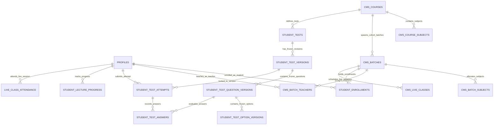

# TopVeda — Corrected Final Architecture Specification & Implementation Blueprint (v7.0)

**Role:** Principal PostgreSQL Architect, Supabase Security Engineer, Database Concurrency Specialist & Application Security Auditor  
**Project:** TopVeda  
**Repository:** `D:\TopVeda\TopVeda`  
**Current Phase:** Final Architecture Specification (Design-Only & Verification)  
**Implementation Authorization:** NOT GRANTED (Strictly Design & Verification Only)  
**Version:** 7.0 (Production-Hardened, Concurrency-Safe, Privilege-Hardened & Integrity-Enforced)  
**Date:** October 2026

---

## EXECUTIVE SUMMARY & AUDIT RESOLUTIONS (v6.9 → v7.0)

This document is the definitive, production-ready architectural specification for TopVeda. It incorporates all eight owner-approved product decisions, eliminates every identified answer-key and progress fabrication vector, establishes mathematical database-level integrity and concurrency safety, reconciles PostgreSQL privileges with RLS policies, establishes a strict Three-Role Application Model (`STUDENT`, `ADMIN`, `SUPER_ADMIN` where `ADMIN` represents the teacher role), and defines an exhaustive, production-grade security and entitlement blueprint.

### Line-by-Line SQL Audit Resolutions in Version 7.0:

1. **Repaired PL/pgSQL Compilation Errors (Section 8.3)**:
   - Fixed typographical syntax error `END BEGIn;` in the numerical evaluation block of `submit_student_test_attempt` to standard `END;`.
   - Verified that every variable declaration, block terminator, exception handler, and schema qualification across all PL/pgSQL functions compiles cleanly.

2. **Repaired Live Attendance Lifecycle & Constraint Integrity (Section 3.4 & 9.2–9.3)**:
   - Fixed the table check constraint in `live_class_attendance` from `heartbeat_count >= 1` to `heartbeat_count >= 0`, resolving the check violation when the finalizer inserts `heartbeat_count = 0` for `ABSENT` students.
   - Enforced that `finalize_live_class_attendance` cannot be invoked before the scheduled session has ended (`now() >= v_live_class.end_time`).
   - Enforced that late heartbeats in `record_live_attendance_heartbeat` cannot overwrite finalized records (`finalized_at IS NOT NULL`), preventing post-session attendance manipulation.
   - Hardened finalizer authorization to require assigned teachers (`is_batch_subject_teacher` / `is_batch_teacher`) or Super Admins (`is_super_admin()`).

3. **Repaired Test Attempt Version Resumption & Resilient Initialization (Section 8.2)**:
   - Corrected `start_student_test_attempt` so that when resuming an in-progress attempt, it reads the stored `test_version_id` and `started_at` directly from the existing attempt row. It fetches duration and computes the deadline from that frozen version, never returning current active test metadata if a newer version has been published.
   - Structured the attempt lookup with row-level locks and handled unique index conflicts so that concurrent initialization requests return the active attempt idempotently.

4. **Truly Concurrency-Safe Lecture Progress Sync & Multi-Batch Scoping (Section 9.1)**:
   - Redesigned `sync_lecture_progress` to deterministically resolve student enrollment when a student is enrolled in multiple batches for the same course (e.g. one completed, one active). Active eligible batches are prioritized over completed batches.
   - If only a completed batch exists, progress writes are rejected with a read-only message.
   - Watch increments are clamped against server-measured elapsed time ($\Delta t_{\text{watch}} \le \Delta t_{\text{server}} + 5\text{s}$), and initial chunks are limited to 30s.
   - Clamped `last_position_seconds` within $[0, \text{duration\_seconds}]$, calculated 90% completion server-side, and prevented zero/negative duration lectures from automatically granting completion.

5. **Strict Subject-Aware Scorecard Authorization (Section 8.3)**:
   - Scoped access strictly to:
     - The student attempt owner (`v_attempt.student_id = auth.uid()`).
     - The assigned batch/subject teacher (`is_batch_subject_teacher(v_attempt.batch_id, v_test.subject_id)` or `is_batch_teacher(v_attempt.batch_id)`).
     - Super Admins (`is_super_admin()`).
   - Unrelated teachers from other batches/subjects are strictly denied access.

6. **Complete Supabase Storage CRUD Policies & Path Invariant Checks (Section 10)**:
   - Provided exhaustive `SELECT`, `INSERT`, `UPDATE`, and `DELETE` policies for all three storage buckets (`study-materials`, `test-attachments`, `lecture-thumbnails`).
   - For `UPDATE` operations, validated both old and new object paths to prevent moving files across batches without authorization.
   - Enforced teacher subject-scoping and draft-state restrictions on uploads.

7. **Race-Safe Test Version Finalization with Consistent Lock Ordering (Section 7.1)**:
   - Updated the immutability trigger `enforce_test_version_finalization_immutability` to acquire an exclusive row-lock (`SELECT id FROM student_test_versions WHERE id = v_test_version_id FOR UPDATE;`) on the parent version during child question/option `INSERT`, `UPDATE`, or `DELETE`.
   - Locked the version row during DRAFT $\rightarrow$ FINALIZED transitions, preventing concurrent question mutations from slipping in after validation.
   - Enforced: MCQ has exactly 1 correct option; MSQ has $\ge 1$ correct option; NUMERICAL has non-null `correct_numerical_value` and valid tolerance $\ge 0$; question marks sum equals version `total_marks`.

8. **Exhaustive Function Privilege Inventory & Audit Query (Section 6.3–6.5)**:
   - Reconciled the complete function inventory: 16 callable/helper functions plus 1 trigger function (total 17 functions).
   - Documented exact signatures, owners, execution contexts, search paths, PUBLIC execution status, `anon` grants, and `authenticated` grants.
   - Provided executable privilege SQL revoking PUBLIC execution on every function and granting `anon` execution strictly to `get_public_test_preview`.

---

## 1. PRESERVED OWNER-APPROVED DECISIONS

All eight owner-approved product decisions are treated as fixed, non-negotiable architectural anchors:

| # | Principle | Architecture Implementation |
|---|-----------|-----------------------------|
| **1** | **Batch-Centric Enrollment** | Students enroll in specific cohort batches (`cms_batches`), automatically inheriting access to the parent course curriculum (`cms_courses`). |
| **2** | **Curated Preview Content** | Free pricing never implies open access. Content is public if and only if explicitly flagged with `is_curated_preview = true`. |
| **3** | **Three-Tier Role Hierarchy** | Strict database-level enum/constraint separating exactly `STUDENT`, `ADMIN`, and `SUPER_ADMIN`. `SUPER_ADMIN` combines all master operational and publishing authority. `ADMIN` is the teacher role, restricted strictly to assigned batch and subject scope. `STUDENT` accesses enrolled learning content. |
| **4** | **Dual Preview Audience** | Both unauthenticated public visitors and registered unenrolled students can consume curated preview assets via secure, server-authoritative preview endpoints. |
| **5** | **Batch Completion Read-Only Access** | Completed batches lock new live attendance and new test submissions while preserving permanent read-only access to historical lectures, notes, and scorecards. |
| **6** | **Teacher Content Creation & Super Admin Test Authority** | `ADMIN` (teachers) author lectures, live classes, and study notes attached to existing lectures within their assigned batch/subject scope and submit drafts for Super Admin review. Tests and quizzes are exclusively created, managed, and published by `SUPER_ADMIN`. |
| **7** | **Super Admin Exclusive Publishing** | Only `SUPER_ADMIN` possesses the authority to approve, publish, reject, or archive academic content. |
| **8** | **Multi-Batch Enrollment** | Students can concurrently enroll in multiple batches, including overlapping schedules and multiple cohorts under the same course. |

---

## 2. CANONICAL ACADEMIC & OPERATIONAL HIERARCHY

```
Academic Board (e.g., CBSE, ICSE, State Board)
 └── Class / Grade (e.g., Class 10, Class 12)
      └── Course / Master Curriculum (e.g., Class 10 Board Mastery 2026-27)
           ├── Subjects (Join via `cms_course_subjects`: Physics, Chemistry, Mathematics)
           │    └── Chapters (e.g., Chapter 1: Chemical Reactions)
           │         └── Master Content Pool (Lectures, Notes, Question Bank)
           │
           └── Operational Cohort Batches (e.g., Morning Champions Batch, Evening FastTrack Batch)
                ├── Assigned Batch Subjects (`cms_batch_subjects`)
                ├── Assigned Teachers (`cms_batch_teachers`)
                ├── Schedule, Meeting Config & Pricing
                └── Student Batch Enrollments (`student_enrollments` -> `batch_id`)
```

---

## 3. COMPLETE EXECUTABLE DDL & SCHEMA SPECIFICATION

### 3.1 Core Enums, Master Data & Academic Join Tables

```sql
-- 1. Role Enum / Constraint (Strictly 3 Application Roles: STUDENT, ADMIN [Teacher], SUPER_ADMIN)
DO $$ BEGIN
    CREATE TYPE user_role AS ENUM ('STUDENT', 'ADMIN', 'SUPER_ADMIN');
EXCEPTION
    WHEN duplicate_object THEN null;
END $$;

-- 2. Course-Subject Mapping Table
CREATE TABLE public.cms_course_subjects (
    id UUID PRIMARY KEY DEFAULT gen_random_uuid(),
    course_id UUID NOT NULL REFERENCES public.cms_courses(id) ON DELETE RESTRICT,
    subject_id UUID NOT NULL REFERENCES public.cms_subjects(id) ON DELETE RESTRICT,
    display_order INTEGER NOT NULL DEFAULT 0,
    created_at TIMESTAMPTZ NOT NULL DEFAULT now(),
    CONSTRAINT uq_course_subject UNIQUE (course_id, subject_id)
);
ALTER TABLE public.cms_course_subjects ENABLE ROW LEVEL SECURITY;

-- 3. Batch Composite Key (Required for Composite Foreign Key Integrity)
ALTER TABLE public.cms_batches 
ADD CONSTRAINT uq_cms_batches_id_course UNIQUE (id, course_id);

-- 4. Batch-Subject & Teacher Mapping Table
CREATE TABLE public.cms_batch_subjects (
    id UUID PRIMARY KEY DEFAULT gen_random_uuid(),
    batch_id UUID NOT NULL REFERENCES public.cms_batches(id) ON DELETE RESTRICT,
    subject_id UUID NOT NULL REFERENCES public.cms_subjects(id) ON DELETE RESTRICT,
    primary_teacher_id UUID REFERENCES public.profiles(id) ON DELETE SET NULL,
    created_at TIMESTAMPTZ NOT NULL DEFAULT now(),
    CONSTRAINT uq_batch_subject UNIQUE (batch_id, subject_id)
);
ALTER TABLE public.cms_batch_subjects ENABLE ROW LEVEL SECURITY;

-- 5. Batch Teacher Allocation Table
CREATE TABLE public.cms_batch_teachers (
    id UUID PRIMARY KEY DEFAULT gen_random_uuid(),
    batch_id UUID NOT NULL REFERENCES public.cms_batches(id) ON DELETE CASCADE,
    teacher_id UUID NOT NULL REFERENCES public.profiles(id) ON DELETE CASCADE,
    subject_id UUID REFERENCES public.cms_subjects(id) ON DELETE SET NULL,
    assigned_at TIMESTAMPTZ NOT NULL DEFAULT now(),
    assigned_by UUID REFERENCES public.profiles(id) ON DELETE SET NULL,
    CONSTRAINT uq_batch_teacher_subject UNIQUE (batch_id, teacher_id, subject_id)
);
ALTER TABLE public.cms_batch_teachers ENABLE ROW LEVEL SECURITY;

-- 6. Student Enrollments Table (Composite Foreign Key Enforced)
CREATE TABLE public.student_enrollments (
    id UUID PRIMARY KEY DEFAULT gen_random_uuid(),
    student_id UUID NOT NULL REFERENCES public.profiles(id) ON DELETE RESTRICT,
    course_id UUID NOT NULL REFERENCES public.cms_courses(id) ON DELETE RESTRICT,
    batch_id UUID NOT NULL REFERENCES public.cms_batches(id) ON DELETE RESTRICT,
    status TEXT NOT NULL CHECK (status IN ('ACTIVE', 'EXPIRED', 'CANCELLED')) DEFAULT 'ACTIVE',
    enrolled_at TIMESTAMPTZ NOT NULL DEFAULT now(),
    valid_until TIMESTAMPTZ,
    payment_id TEXT,
    created_at TIMESTAMPTZ NOT NULL DEFAULT now(),
    updated_at TIMESTAMPTZ NOT NULL DEFAULT now(),
    CONSTRAINT uq_student_batch_enrollment UNIQUE (student_id, batch_id),
    CONSTRAINT fk_student_enrollments_batch_course 
      FOREIGN KEY (batch_id, course_id) 
      REFERENCES public.cms_batches(id, course_id) 
      ON DELETE RESTRICT
);
ALTER TABLE public.student_enrollments ENABLE ROW LEVEL SECURITY;
```

### 3.2 Immutable Test Versioning Tables

```sql
-- 1. Student Test Master Record
CREATE TABLE public.student_tests (
    id UUID PRIMARY KEY DEFAULT gen_random_uuid(),
    title TEXT NOT NULL,
    description TEXT,
    course_id UUID NOT NULL REFERENCES public.cms_courses(id) ON DELETE RESTRICT,
    batch_id UUID REFERENCES public.cms_batches(id) ON DELETE SET NULL,
    subject_id UUID REFERENCES public.cms_subjects(id) ON DELETE SET NULL,
    chapter_id UUID REFERENCES public.cms_chapters(id) ON DELETE SET NULL,
    active_version_id UUID, -- References student_test_versions(id)
    status TEXT NOT NULL CHECK (status IN ('DRAFT', 'PENDING_REVIEW', 'APPROVED', 'PUBLISHED', 'ARCHIVED')) DEFAULT 'DRAFT',
    is_curated_preview BOOLEAN NOT NULL DEFAULT FALSE,
    created_by UUID NOT NULL REFERENCES public.profiles(id) ON DELETE RESTRICT,
    created_at TIMESTAMPTZ NOT NULL DEFAULT now(),
    updated_at TIMESTAMPTZ NOT NULL DEFAULT now(),
    CONSTRAINT uq_student_tests_id_active_version UNIQUE (id, active_version_id)
);
ALTER TABLE public.student_tests ENABLE ROW LEVEL SECURITY;

-- 2. Immutable Frozen Test Versions
CREATE TABLE public.student_test_versions (
    id UUID PRIMARY KEY DEFAULT gen_random_uuid(),
    test_id UUID NOT NULL REFERENCES public.student_tests(id) ON DELETE RESTRICT,
    version_number INTEGER NOT NULL,
    title TEXT NOT NULL,
    duration_minutes INTEGER NOT NULL CHECK (duration_minutes > 0),
    total_marks NUMERIC(6,2) NOT NULL CHECK (total_marks >= 0),
    passing_marks NUMERIC(6,2) NOT NULL CHECK (passing_marks >= 0 AND passing_marks <= total_marks),
    status TEXT NOT NULL CHECK (status IN ('DRAFT', 'FINALIZED')) DEFAULT 'DRAFT',
    created_by UUID NOT NULL REFERENCES public.profiles(id) ON DELETE RESTRICT,
    created_at TIMESTAMPTZ NOT NULL DEFAULT now(),
    finalized_at TIMESTAMPTZ,
    CONSTRAINT uq_test_version_number UNIQUE (test_id, version_number),
    CONSTRAINT uq_test_version_composite UNIQUE (test_id, id)
);
ALTER TABLE public.student_test_versions ENABLE ROW LEVEL SECURITY;

-- Active Version Composite Foreign Key Binding
ALTER TABLE public.student_tests
ADD CONSTRAINT fk_student_tests_active_version_composite
FOREIGN KEY (id, active_version_id)
REFERENCES public.student_test_versions(test_id, id)
ON DELETE RESTRICT DEFERRABLE INITIALLY DEFERRED;

-- 3. Immutable Frozen Question Versions
CREATE TABLE public.student_test_question_versions (
    id UUID PRIMARY KEY DEFAULT gen_random_uuid(),
    test_version_id UUID NOT NULL REFERENCES public.student_test_versions(id) ON DELETE RESTRICT,
    original_question_id UUID,
    question_text TEXT NOT NULL,
    question_type TEXT NOT NULL CHECK (question_type IN ('MCQ', 'MSQ', 'NUMERICAL')) DEFAULT 'MCQ',
    marks NUMERIC(5,2) NOT NULL DEFAULT 1.00 CHECK (marks >= 0),
    negative_marks NUMERIC(5,2) NOT NULL DEFAULT 0.00 CHECK (negative_marks >= 0),
    correct_numerical_value NUMERIC(10,4),
    numerical_tolerance NUMERIC(8,4) DEFAULT 0.0000 CHECK (numerical_tolerance >= 0),
    is_sample_preview BOOLEAN NOT NULL DEFAULT FALSE,
    explanation TEXT,
    order_index INTEGER NOT NULL DEFAULT 0,
    CONSTRAINT uq_question_version_test_version UNIQUE (test_version_id, id)
);
ALTER TABLE public.student_test_question_versions ENABLE ROW LEVEL SECURITY;

-- 4. Immutable Frozen Option Versions
CREATE TABLE public.student_test_option_versions (
    id UUID PRIMARY KEY DEFAULT gen_random_uuid(),
    question_version_id UUID NOT NULL REFERENCES public.student_test_question_versions(id) ON DELETE RESTRICT,
    original_option_id UUID,
    option_text TEXT NOT NULL,
    is_correct BOOLEAN NOT NULL DEFAULT FALSE,
    order_index INTEGER NOT NULL DEFAULT 0,
    CONSTRAINT uq_option_version_question_version UNIQUE (question_version_id, id)
);
ALTER TABLE public.student_test_option_versions ENABLE ROW LEVEL SECURITY;
```

### 3.3 Student Attempts & Answers Tables

```sql
-- 1. Student Test Attempts Table
CREATE TABLE public.student_test_attempts (
    id UUID PRIMARY KEY DEFAULT gen_random_uuid(),
    test_id UUID NOT NULL,
    test_version_id UUID NOT NULL,
    student_id UUID NOT NULL REFERENCES public.profiles(id) ON DELETE RESTRICT,
    batch_id UUID NOT NULL REFERENCES public.cms_batches(id) ON DELETE RESTRICT,
    score NUMERIC(6,2),
    percentage NUMERIC(5,2),
    status TEXT NOT NULL CHECK (status IN ('IN_PROGRESS', 'COMPLETED', 'ABANDONED', 'TIMEOUT_SUBMITTED')) DEFAULT 'IN_PROGRESS',
    started_at TIMESTAMPTZ NOT NULL DEFAULT now(),
    submitted_at TIMESTAMPTZ,
    time_spent_seconds INTEGER DEFAULT 0,
    CONSTRAINT fk_attempts_test_version_composite
      FOREIGN KEY (test_id, test_version_id)
      REFERENCES public.student_test_versions(test_id, id)
      ON DELETE RESTRICT,
    CONSTRAINT uq_attempt_composite UNIQUE (id, test_version_id)
);
ALTER TABLE public.student_test_attempts ENABLE ROW LEVEL SECURITY;

-- Concurrency-Safe Partial Unique Index (Max 1 in-progress attempt per student/test/batch)
CREATE UNIQUE INDEX uq_one_in_progress_attempt_per_student_test_batch 
ON public.student_test_attempts (student_id, test_id, batch_id) 
WHERE (status = 'IN_PROGRESS');

-- 2. Student Test Answers Table
CREATE TABLE public.student_test_answers (
    id UUID PRIMARY KEY DEFAULT gen_random_uuid(),
    attempt_id UUID NOT NULL,
    test_version_id UUID NOT NULL,
    question_version_id UUID NOT NULL,
    selected_option_version_ids UUID[] DEFAULT NULL,
    student_text_response TEXT DEFAULT NULL,
    is_correct BOOLEAN DEFAULT NULL,
    marks_awarded NUMERIC(5,2) DEFAULT NULL,
    CONSTRAINT fk_answers_attempt_version
      FOREIGN KEY (attempt_id, test_version_id)
      REFERENCES public.student_test_attempts(id, test_version_id)
      ON DELETE RESTRICT,
    CONSTRAINT fk_answers_question_version
      FOREIGN KEY (test_version_id, question_version_id)
      REFERENCES public.student_test_question_versions(test_version_id, id)
      ON DELETE RESTRICT,
    CONSTRAINT uq_attempt_question_single_row
      UNIQUE (attempt_id, question_version_id)
);
ALTER TABLE public.student_test_answers ENABLE ROW LEVEL SECURITY;
```

### 3.4 Lecture Progress & Live Attendance Tables

```sql
-- 1. Student Lecture Progress Table
CREATE TABLE public.student_lecture_progress (
    id UUID PRIMARY KEY DEFAULT gen_random_uuid(),
    student_id UUID NOT NULL REFERENCES public.profiles(id) ON DELETE CASCADE,
    lecture_id UUID NOT NULL REFERENCES public.cms_lectures(id) ON DELETE CASCADE,
    watch_time_seconds INTEGER NOT NULL DEFAULT 0 CHECK (watch_time_seconds >= 0),
    last_position_seconds INTEGER NOT NULL DEFAULT 0 CHECK (last_position_seconds >= 0),
    is_completed BOOLEAN NOT NULL DEFAULT FALSE,
    last_synced_at TIMESTAMPTZ NOT NULL DEFAULT now(),
    created_at TIMESTAMPTZ NOT NULL DEFAULT now(),
    CONSTRAINT uq_student_lecture UNIQUE (student_id, lecture_id)
);
ALTER TABLE public.student_lecture_progress ENABLE ROW LEVEL SECURITY;

-- 2. Live Class Attendance Records Table (Fixed heartbeat_count >= 0 for ABSENT records)
CREATE TABLE public.live_class_attendance (
    id UUID PRIMARY KEY DEFAULT gen_random_uuid(),
    live_class_id UUID NOT NULL REFERENCES public.cms_live_classes(id) ON DELETE CASCADE,
    student_id UUID NOT NULL REFERENCES public.profiles(id) ON DELETE CASCADE,
    batch_id UUID NOT NULL REFERENCES public.cms_batches(id) ON DELETE RESTRICT,
    first_seen_at TIMESTAMPTZ NOT NULL DEFAULT now(),
    last_seen_at TIMESTAMPTZ NOT NULL DEFAULT now(),
    duration_minutes INTEGER NOT NULL DEFAULT 0 CHECK (duration_minutes >= 0),
    heartbeat_count INTEGER NOT NULL DEFAULT 1 CHECK (heartbeat_count >= 0),
    status TEXT NOT NULL CHECK (status IN ('PRESENT', 'ABSENT', 'LEFT_EARLY')) DEFAULT 'PRESENT',
    finalized_at TIMESTAMPTZ,
    finalized_by UUID REFERENCES public.profiles(id) ON DELETE SET NULL,
    CONSTRAINT uq_live_attendance_student UNIQUE (live_class_id, student_id)
);
ALTER TABLE public.live_class_attendance ENABLE ROW LEVEL SECURITY;
```

---

## 4. FINAL ENTITY RELATIONSHIP DIAGRAM (MERMAID)



---

## 5. COMPLETE ROLE AND PERMISSION MATRIX & CONTENT LIFECYCLE

### 5.1 Content Lifecycle State Transition Matrix

| Content State Transition | STUDENT | ADMIN (Assigned Scope) | SUPER_ADMIN |
|---|---|---|---|
| `Create Draft` (Lectures, Live, Notes) | **Forbidden** | Allowed (Assigned Batches/Subjects; Notes must attach to existing lecture) | Full Authority |
| `Create / Manage Tests & Quizzes` | **Forbidden** | **Forbidden** | **Exclusive Authority** |
| `Edit Draft` | **Forbidden** | Allowed (Owned drafts in assigned scope) | Full Authority |
| `Submit for Review (DRAFT -> PENDING_REVIEW)` | **Forbidden** | Allowed (Owned drafts in assigned scope) | Full Authority |
| `Approve (PENDING_REVIEW -> APPROVED)` | **Forbidden** | **Forbidden** | **Exclusive Authority** |
| `Publish (APPROVED -> PUBLISHED)` | **Forbidden** | **Forbidden** | **Exclusive Authority** |
| `Reject / Send Back to Draft` | **Forbidden** | **Forbidden** | **Exclusive Authority** |
| `Archive (PUBLISHED -> ARCHIVED)` | **Forbidden** | **Forbidden** | **Exclusive Authority** |
| `Fork Revision (PUBLISHED -> New Draft Version)` | **Forbidden** | Allowed (Creates new draft version in scope for lectures/notes) | Full Authority |

### 5.2 Application Role & Login Routing Matrix

| Application Role | Dedicated Login Route | Core Responsibilities & Scope | Scope Boundary & Enforcement |
|---|---|---|---|
| **`SUPER_ADMIN`** | `/super-admin` | • Academic master data (Boards, Classes, Subjects, Courses)<br>• Batch lifecycle, meeting configs & pricing<br>• Teacher assignments & student enrollments<br>• Master Test & Quiz creation and management<br>• CMS review, approval, publishing, and archiving<br>• System configuration, audit logs & user management | Full system authority across all courses, batches, content drafts, tests, and user profiles. |
| **`ADMIN`** | `/admin` | • Teacher workspace: Lecture drafting & recorded video uploads<br>• Live class scheduling, rescheduling, and operation<br>• Study material attachment to existing lectures in assigned batches/subjects<br>• Submitting drafts for Super Admin review<br>• Attendance finalization and scorecard inspection for assigned batches/subjects | Strictly bounded to assigned batch and subject IDs via `cms_batch_teachers`. Cannot create/manage tests or quizzes, approve/publish/archive content, manage courses/batches/users, or self-assign batches. |
| **`STUDENT`** | `/` (Auth Modal) / `/student` | • Consuming enrolled batch lectures, notes & live classes<br>• Interactive test attempts, answers, and scorecards<br>• Free curated preview browsing<br>• Profile & progress management | Strictly bounded to enrolled batches via `student_enrollments`. Cannot author content or access staff portals. |

---

## 6. COMPLETE SECURITY DEFINER PRIVILEGE HARDENING & AUDIT

### 6.1 Database Security Functions (Role & Scoping Helpers)

```sql
-- 1. Super Admin Authority
CREATE OR REPLACE FUNCTION public.is_super_admin()
RETURNS BOOLEAN
LANGUAGE sql
SECURITY DEFINER
SET search_path = public, pg_catalog, pg_temp
STABLE
AS $$
  SELECT EXISTS (
    SELECT 1 FROM public.profiles 
    WHERE id = auth.uid() 
      AND role = 'SUPER_ADMIN' 
      AND COALESCE(status, 'ACTIVE') = 'ACTIVE'
  );
$$;

-- 2. Admin Authority (Restricted Teacher / Faculty Role)
CREATE OR REPLACE FUNCTION public.is_admin()
RETURNS BOOLEAN
LANGUAGE sql
SECURITY DEFINER
SET search_path = public, pg_catalog, pg_temp
STABLE
AS $$
  SELECT EXISTS (
    SELECT 1 FROM public.profiles 
    WHERE id = auth.uid() 
      AND role = 'ADMIN' 
      AND COALESCE(status, 'ACTIVE') = 'ACTIVE'
  );
$$;

-- 3. Student Authority
CREATE OR REPLACE FUNCTION public.is_student()
RETURNS BOOLEAN
LANGUAGE sql
SECURITY DEFINER
SET search_path = public, pg_catalog, pg_temp
STABLE
AS $$
  SELECT EXISTS (
    SELECT 1 FROM public.profiles 
    WHERE id = auth.uid() 
      AND role = 'STUDENT' 
      AND COALESCE(status, 'ACTIVE') = 'ACTIVE'
  );
$$;

-- 4. Batch Teacher Assignment Validation (Batch-Level Scoping for ADMIN)
CREATE OR REPLACE FUNCTION public.is_batch_teacher(p_batch_id UUID)
RETURNS BOOLEAN
LANGUAGE sql
SECURITY DEFINER
SET search_path = public, pg_catalog, pg_temp
STABLE
AS $$
  SELECT EXISTS (
    SELECT 1 FROM public.cms_batch_teachers bt
    JOIN public.profiles p ON p.id = bt.teacher_id
    WHERE bt.batch_id = p_batch_id
      AND bt.teacher_id = auth.uid()
      AND p.role = 'ADMIN'
      AND COALESCE(p.status, 'ACTIVE') = 'ACTIVE'
  );
$$;

-- 5. Batch-Subject Teacher Assignment Validation (Subject-Level Scoping for ADMIN)
CREATE OR REPLACE FUNCTION public.is_batch_subject_teacher(p_batch_id UUID, p_subject_id UUID)
RETURNS BOOLEAN
LANGUAGE sql
SECURITY DEFINER
SET search_path = public, pg_catalog, pg_temp
STABLE
AS $$
  SELECT EXISTS (
    SELECT 1 FROM public.cms_batch_teachers bt
    JOIN public.profiles p ON p.id = bt.teacher_id
    WHERE bt.batch_id = p_batch_id
      AND (bt.subject_id = p_subject_id OR bt.subject_id IS NULL)
      AND bt.teacher_id = auth.uid()
      AND p.role = 'ADMIN'
      AND COALESCE(p.status, 'ACTIVE') = 'ACTIVE'
  );
$$;

-- 6. Active Student Enrollment Verification (Active Batches Only)
CREATE OR REPLACE FUNCTION public.is_actively_enrolled_in_batch(p_batch_id UUID)
RETURNS BOOLEAN
LANGUAGE sql
SECURITY DEFINER
SET search_path = public, pg_catalog, pg_temp
STABLE
AS $$
  SELECT EXISTS (
    SELECT 1 FROM public.student_enrollments se
    JOIN public.cms_batches b ON b.id = se.batch_id
    JOIN public.profiles p ON p.id = se.student_id
    WHERE se.student_id = auth.uid()
      AND se.batch_id = p_batch_id
      AND se.status = 'ACTIVE'
      AND COALESCE(p.status, 'ACTIVE') = 'ACTIVE'
      AND b.status = 'ACTIVE'
      AND (se.valid_until IS NULL OR se.valid_until > now())
  );
$$;

-- 7. Batch Historical / Active Access (Active or Completed Batches)
CREATE OR REPLACE FUNCTION public.has_batch_read_entitlement(p_batch_id UUID)
RETURNS BOOLEAN
LANGUAGE sql
SECURITY DEFINER
SET search_path = public, pg_catalog, pg_temp
STABLE
AS $$
  SELECT EXISTS (
    SELECT 1 FROM public.student_enrollments se
    JOIN public.cms_batches b ON b.id = se.batch_id
    JOIN public.profiles p ON p.id = se.student_id
    WHERE se.student_id = auth.uid()
      AND se.batch_id = p_batch_id
      AND se.status = 'ACTIVE'
      AND COALESCE(p.status, 'ACTIVE') = 'ACTIVE'
      AND b.status IN ('ACTIVE', 'COMPLETED')
  );
$$;
```

### 6.2 Table Direct Privilege Revocations & Grants

```sql
-- 1. Revoke Direct Table Access on Sensitive Tables
REVOKE ALL ON TABLE public.student_test_question_versions FROM PUBLIC, anon, authenticated;
REVOKE ALL ON TABLE public.student_test_option_versions FROM PUBLIC, anon, authenticated;
REVOKE ALL ON TABLE public.student_test_answers FROM PUBLIC, anon, authenticated;
REVOKE ALL ON TABLE public.student_test_attempts FROM PUBLIC, anon, authenticated;
REVOKE ALL ON TABLE public.live_class_attendance FROM PUBLIC, anon, authenticated;
REVOKE ALL ON TABLE public.student_lecture_progress FROM PUBLIC, anon, authenticated;

-- 2. Grant Direct Read/Write ONLY to Authenticated Roles Where Appropriate
GRANT SELECT ON TABLE public.student_test_question_versions TO authenticated;
GRANT SELECT ON TABLE public.student_test_option_versions TO authenticated;
GRANT SELECT, UPDATE ON TABLE public.live_class_attendance TO authenticated;
GRANT SELECT ON TABLE public.student_lecture_progress TO authenticated;
GRANT SELECT ON TABLE public.student_test_attempts TO authenticated;
GRANT SELECT ON TABLE public.student_test_answers TO authenticated;

-- Public Preview Tables
GRANT SELECT ON TABLE public.cms_courses TO anon, authenticated;
GRANT SELECT ON TABLE public.cms_batches TO anon, authenticated;
GRANT SELECT ON TABLE public.cms_subjects TO anon, authenticated;
GRANT SELECT ON TABLE public.cms_chapters TO anon, authenticated;
GRANT SELECT ON TABLE public.cms_lectures TO anon, authenticated;
GRANT SELECT ON TABLE public.cms_study_materials TO anon, authenticated;
GRANT SELECT ON TABLE public.cms_live_classes TO anon, authenticated;
GRANT SELECT ON TABLE public.student_tests TO anon, authenticated;
```

### 6.3 Complete 17-Function Privilege & Execution Matrix

| # | Function Signature | Owner | Security Context | Search Path | PUBLIC Execution | anon Grant | authenticated Grant | Intended Caller | Authorization Inside Function |
|---|---|---|---|---|---|---|---|---|---|
| **1** | `is_super_admin()` | `postgres` | `SECURITY DEFINER` | `public, pg_catalog, pg_temp` | **REVOKED** | None | `EXECUTE` | RLS / RPCs | Checks `profiles.role = 'SUPER_ADMIN'` & `status = 'ACTIVE'` |
| **2** | `is_admin()` | `postgres` | `SECURITY DEFINER` | `public, pg_catalog, pg_temp` | **REVOKED** | None | `EXECUTE` | RLS / RPCs | Checks `profiles.role = 'ADMIN'` & `status = 'ACTIVE'` |
| **3** | `is_student()` | `postgres` | `SECURITY DEFINER` | `public, pg_catalog, pg_temp` | **REVOKED** | None | `EXECUTE` | RLS / RPCs | Checks `profiles.role = 'STUDENT'` & `status = 'ACTIVE'` |
| **4** | `is_batch_teacher(UUID)` | `postgres` | `SECURITY DEFINER` | `public, pg_catalog, pg_temp` | **REVOKED** | None | `EXECUTE` | RLS / RPCs | Validates active teacher assignment in `cms_batch_teachers` with `role = 'ADMIN'` |
| **5** | `is_batch_subject_teacher(UUID, UUID)` | `postgres` | `SECURITY DEFINER` | `public, pg_catalog, pg_temp` | **REVOKED** | None | `EXECUTE` | RLS / RPCs | Validates active batch and subject assignment in `cms_batch_teachers` with `role = 'ADMIN'` |
| **6** | `is_actively_enrolled_in_batch(UUID)` | `postgres` | `SECURITY DEFINER` | `public, pg_catalog, pg_temp` | **REVOKED** | None | `EXECUTE` | RLS / RPCs | Validates student enrollment in `student_enrollments` + active batch |
| **7** | `has_batch_read_entitlement(UUID)` | `postgres` | `SECURITY DEFINER` | `public, pg_catalog, pg_temp` | **REVOKED** | None | `EXECUTE` | RLS / RPCs | Validates student enrollment for active or completed batches |
| **8** | `get_public_test_preview(UUID)` | `postgres` | `SECURITY DEFINER` | `public, pg_catalog, pg_temp` | **REVOKED** | `EXECUTE` | `EXECUTE` | Public Visitors / Students | Validates `is_curated_preview = true`; limits to 5 sample questions; strips answer keys |
| **9** | `start_student_test_attempt(UUID, UUID)` | `postgres` | `SECURITY DEFINER` | `public, pg_catalog, pg_temp` | **REVOKED** | None | `EXECUTE` | Active Students | Checks student active profile, active batch enrollment, published test |
| **10** | `get_enrolled_student_test_questions(UUID)` | `postgres` | `SECURITY DEFINER` | `public, pg_catalog, pg_temp` | **REVOKED** | None | `EXECUTE` | Attempt Owner | Verifies attempt ownership, status = IN_PROGRESS, and `now() <= deadline` |
| **11** | `save_student_test_answer(UUID, UUID, UUID[], TEXT)` | `postgres` | `SECURITY DEFINER` | `public, pg_catalog, pg_temp` | **REVOKED** | None | `EXECUTE` | Attempt Owner | Verifies attempt ownership, row-locks attempt, checks deadline, validates question-type |
| **12** | `submit_student_test_attempt(UUID)` | `postgres` | `SECURITY DEFINER` | `public, pg_catalog, pg_temp` | **REVOKED** | None | `EXECUTE` | Attempt Owner | Verifies attempt ownership, row-locks, grades against answer key, calculates percentage |
| **13** | `get_student_test_scorecard(UUID)` | `postgres` | `SECURITY DEFINER` | `public, pg_catalog, pg_temp` | **REVOKED** | None | `EXECUTE` | Attempt Owner / Assigned Teacher / Super Admin | Verifies status IN ('COMPLETED', 'TIMEOUT_SUBMITTED'), returns scorecard with explanations |
| **14** | `sync_lecture_progress(UUID, INT, INT)` | `postgres` | `SECURITY DEFINER` | `public, pg_catalog, pg_temp` | **REVOKED** | None | `EXECUTE` | Enrolled Students | Verifies enrollment, clamps watch time, calculates 90% completion server-side |
| **15** | `record_live_attendance_heartbeat(UUID)` | `postgres` | `SECURITY DEFINER` | `public, pg_catalog, pg_temp` | **REVOKED** | None | `EXECUTE` | Enrolled Students | Validates schedule window (`start - 15m` to `end + 15m`), published state, active enrollment |
| **16** | `finalize_live_class_attendance(UUID)` | `postgres` | `SECURITY DEFINER` | `public, pg_catalog, pg_temp` | **REVOKED** | None | `EXECUTE` | Assigned Teacher / Super Admin | Validates teacher assignment or super-admin role, checks post-session eligibility, marks ABSENT |
| **17** | `enforce_test_version_finalization_immutability()` | `postgres` | `SECURITY DEFINER` | `public, pg_catalog, pg_temp` | **REVOKED** | None | None (Trigger) | PostgreSQL Triggers | Locks parent version row, validates question/option integrity upon finalization |

### 6.4 Executable Function Privilege Hardening SQL

```sql
-- Revoke PUBLIC Execution on ALL 17 Database Functions
REVOKE ALL ON FUNCTION public.is_super_admin() FROM PUBLIC;
REVOKE ALL ON FUNCTION public.is_admin() FROM PUBLIC;
REVOKE ALL ON FUNCTION public.is_student() FROM PUBLIC;
REVOKE ALL ON FUNCTION public.is_batch_teacher(UUID) FROM PUBLIC;
REVOKE ALL ON FUNCTION public.is_batch_subject_teacher(UUID, UUID) FROM PUBLIC;
REVOKE ALL ON FUNCTION public.is_actively_enrolled_in_batch(UUID) FROM PUBLIC;
REVOKE ALL ON FUNCTION public.has_batch_read_entitlement(UUID) FROM PUBLIC;
REVOKE ALL ON FUNCTION public.get_public_test_preview(UUID) FROM PUBLIC;
REVOKE ALL ON FUNCTION public.start_student_test_attempt(UUID, UUID) FROM PUBLIC;
REVOKE ALL ON FUNCTION public.get_enrolled_student_test_questions(UUID) FROM PUBLIC;
REVOKE ALL ON FUNCTION public.save_student_test_answer(UUID, UUID, UUID[], TEXT) FROM PUBLIC;
REVOKE ALL ON FUNCTION public.submit_student_test_attempt(UUID) FROM PUBLIC;
REVOKE ALL ON FUNCTION public.get_student_test_scorecard(UUID) FROM PUBLIC;
REVOKE ALL ON FUNCTION public.sync_lecture_progress(UUID, INT, INT) FROM PUBLIC;
REVOKE ALL ON FUNCTION public.record_live_attendance_heartbeat(UUID) FROM PUBLIC;
REVOKE ALL ON FUNCTION public.finalize_live_class_attendance(UUID) FROM PUBLIC;
REVOKE ALL ON FUNCTION public.enforce_test_version_finalization_immutability() FROM PUBLIC;

-- Grant Execution to authenticated role for internal helpers & application RPCs
GRANT EXECUTE ON FUNCTION public.is_super_admin() TO authenticated;
GRANT EXECUTE ON FUNCTION public.is_admin() TO authenticated;
GRANT EXECUTE ON FUNCTION public.is_student() TO authenticated;
GRANT EXECUTE ON FUNCTION public.is_batch_teacher(UUID) TO authenticated;
GRANT EXECUTE ON FUNCTION public.is_batch_subject_teacher(UUID, UUID) TO authenticated;
GRANT EXECUTE ON FUNCTION public.is_actively_enrolled_in_batch(UUID) TO authenticated;
GRANT EXECUTE ON FUNCTION public.has_batch_read_entitlement(UUID) TO authenticated;

GRANT EXECUTE ON FUNCTION public.start_student_test_attempt(UUID, UUID) TO authenticated;
GRANT EXECUTE ON FUNCTION public.get_enrolled_student_test_questions(UUID) TO authenticated;
GRANT EXECUTE ON FUNCTION public.save_student_test_answer(UUID, UUID, UUID[], TEXT) TO authenticated;
GRANT EXECUTE ON FUNCTION public.submit_student_test_attempt(UUID) TO authenticated;
GRANT EXECUTE ON FUNCTION public.get_student_test_scorecard(UUID) TO authenticated;
GRANT EXECUTE ON FUNCTION public.sync_lecture_progress(UUID, INT, INT) TO authenticated;
GRANT EXECUTE ON FUNCTION public.record_live_attendance_heartbeat(UUID) TO authenticated;
GRANT EXECUTE ON FUNCTION public.finalize_live_class_attendance(UUID) TO authenticated;

-- Grant Execution to BOTH anon AND authenticated for Public Preview RPC
GRANT EXECUTE ON FUNCTION public.get_public_test_preview(UUID) TO anon, authenticated;
```

### 6.5 Repeatable PostgreSQL Privilege Audit Query

```sql
SELECT 
  'ROUTINE PRIVILEGE' AS audit_type,
  routine_name AS object_name,
  grantee,
  privilege_type,
  is_grantable
FROM information_schema.routine_privileges
WHERE specific_schema = 'public'
  AND routine_name IN (
    'is_super_admin', 'is_admin', 'is_student', 'is_batch_teacher', 'is_batch_subject_teacher',
    'is_actively_enrolled_in_batch', 'has_batch_read_entitlement',
    'get_public_test_preview', 'start_student_test_attempt', 'get_enrolled_student_test_questions',
    'save_student_test_answer', 'submit_student_test_attempt', 'get_student_test_scorecard',
    'sync_lecture_progress', 'record_live_attendance_heartbeat', 'finalize_live_class_attendance',
    'enforce_test_version_finalization_immutability'
  )
UNION ALL
SELECT 
  'TABLE PRIVILEGE' AS audit_type,
  table_name AS object_name,
  grantee,
  privilege_type,
  is_grantable
FROM information_schema.table_privileges
WHERE table_schema = 'public'
  AND table_name IN (
    'student_test_question_versions', 'student_test_option_versions',
    'student_test_answers', 'student_test_attempts',
    'live_class_attendance', 'student_lecture_progress'
  )
ORDER BY audit_type, object_name, grantee, privilege_type;
```

---

## 7. DATABASE-LEVEL TEST IMMUTABILITY & LIFECYCLE ENGINE

### 7.1 Race-Safe Version Finalization & Immutability Trigger

```sql
-- Comprehensive trigger function preventing direct insertion of FINALIZED versions,
-- freezing finalized versions, acquiring exclusive locks on parent version, and enforcing marks consistency
CREATE OR REPLACE FUNCTION public.enforce_test_version_finalization_immutability()
RETURNS TRIGGER
LANGUAGE plpgsql
SECURITY DEFINER
SET search_path = public, pg_temp
AS $$
DECLARE
  v_version_status TEXT;
  v_test_version_id UUID;
  v_total_q_marks NUMERIC(6,2);
  v_q_count INTEGER;
  v_dummy UUID;
BEGIN
  IF TG_OP = 'INSERT' THEN
    IF TG_TABLE_NAME = 'student_test_versions' THEN
      -- Direct creation of FINALIZED version is forbidden (must pass draft -> finalization)
      IF NEW.status = 'FINALIZED' THEN
        RAISE EXCEPTION 'Database Integrity Error: New test versions must be created in DRAFT status.';
      END IF;
      RETURN NEW;
    ELSIF TG_TABLE_NAME = 'student_test_question_versions' THEN
      v_test_version_id := NEW.test_version_id;
    ELSIF TG_TABLE_NAME = 'student_test_option_versions' THEN
      SELECT qv.test_version_id INTO v_test_version_id
      FROM student_test_question_versions qv
      WHERE qv.id = NEW.question_version_id;
    END IF;

    -- Lock parent version row to serialize against concurrent finalization
    SELECT id, status INTO v_dummy, v_version_status 
    FROM student_test_versions 
    WHERE id = v_test_version_id
    FOR UPDATE;

    IF v_version_status = 'FINALIZED' THEN
      RAISE EXCEPTION 'Database Integrity Error: Cannot insert items into a finalized test version.';
    END IF;
    RETURN NEW;

  ELSIF TG_OP = 'UPDATE' THEN
    IF TG_TABLE_NAME = 'student_test_versions' THEN
      -- Version transitioning from DRAFT -> FINALIZED: Validate question/option integrity
      IF OLD.status = 'DRAFT' AND NEW.status = 'FINALIZED' THEN
        -- Row lock parent test version
        PERFORM id FROM student_test_versions WHERE id = NEW.id FOR UPDATE;

        SELECT COUNT(*), COALESCE(SUM(marks), 0.00) 
        INTO v_q_count, v_total_q_marks
        FROM student_test_question_versions
        WHERE test_version_id = NEW.id;

        IF v_q_count = 0 THEN
          RAISE EXCEPTION 'Cannot finalize test version with zero questions.';
        END IF;

        IF v_total_q_marks != NEW.total_marks THEN
          RAISE EXCEPTION 'Integrity Error: Sum of question marks (%) does not match version total marks (%).', v_total_q_marks, NEW.total_marks;
        END IF;

        -- Verify MCQ questions have at least 2 options and EXACTLY 1 correct option
        IF EXISTS (
          SELECT 1 FROM student_test_question_versions qv
          WHERE qv.test_version_id = NEW.id 
            AND qv.question_type = 'MCQ'
            AND (
              (SELECT COUNT(*) FROM student_test_option_versions ov WHERE ov.question_version_id = qv.id) < 2
              OR
              (SELECT COUNT(*) FROM student_test_option_versions ov WHERE ov.question_version_id = qv.id AND ov.is_correct = TRUE) != 1
            )
        ) THEN
          RAISE EXCEPTION 'Integrity Error: MCQ questions must have at least 2 options and exactly 1 correct option.';
        END IF;

        -- Verify MSQ questions have at least 2 options and AT LEAST 1 correct option
        IF EXISTS (
          SELECT 1 FROM student_test_question_versions qv
          WHERE qv.test_version_id = NEW.id 
            AND qv.question_type = 'MSQ'
            AND (
              (SELECT COUNT(*) FROM student_test_option_versions ov WHERE ov.question_version_id = qv.id) < 2
              OR
              (SELECT COUNT(*) FROM student_test_option_versions ov WHERE ov.question_version_id = qv.id AND ov.is_correct = TRUE) < 1
            )
        ) THEN
          RAISE EXCEPTION 'Integrity Error: MSQ questions must have at least 2 options and at least 1 correct option.';
        END IF;

        -- Verify Numerical questions have non-null correct_numerical_value
        IF EXISTS (
          SELECT 1 FROM student_test_question_versions qv
          WHERE qv.test_version_id = NEW.id 
            AND qv.question_type = 'NUMERICAL'
            AND qv.correct_numerical_value IS NULL
        ) THEN
          RAISE EXCEPTION 'Integrity Error: Numerical questions must have a defined correct numerical value.';
        END IF;

        NEW.finalized_at := now();
        RETURN NEW;
      ELSIF OLD.status = 'FINALIZED' THEN
        RAISE EXCEPTION 'Database Integrity Error: Finalized test versions are immutable and cannot be updated.';
      END IF;
      RETURN NEW;

    ELSIF TG_TABLE_NAME = 'student_test_question_versions' THEN
      IF OLD.test_version_id != NEW.test_version_id THEN
        RAISE EXCEPTION 'Database Integrity Error: Cannot re-parent question versions.';
      END IF;
      v_test_version_id := OLD.test_version_id;
    ELSIF TG_TABLE_NAME = 'student_test_option_versions' THEN
      IF OLD.question_version_id != NEW.question_version_id THEN
        RAISE EXCEPTION 'Database Integrity Error: Cannot re-parent option versions.';
      END IF;
      SELECT qv.test_version_id INTO v_test_version_id
      FROM student_test_question_versions qv
      WHERE qv.id = OLD.question_version_id;
    END IF;

    -- Lock parent version row
    SELECT id, status INTO v_dummy, v_version_status 
    FROM student_test_versions 
    WHERE id = v_test_version_id
    FOR UPDATE;

    IF v_version_status = 'FINALIZED' THEN
      RAISE EXCEPTION 'Database Integrity Error: Cannot update items in a finalized test version.';
    END IF;
    RETURN NEW;

  ELSIF TG_OP = 'DELETE' THEN
    IF TG_TABLE_NAME = 'student_test_versions' THEN
      IF OLD.status = 'FINALIZED' THEN
        RAISE EXCEPTION 'Database Integrity Error: Finalized test versions cannot be deleted.';
      END IF;
      RETURN OLD;
    ELSIF TG_TABLE_NAME = 'student_test_question_versions' THEN
      v_test_version_id := OLD.test_version_id;
    ELSIF TG_TABLE_NAME = 'student_test_option_versions' THEN
      SELECT qv.test_version_id INTO v_test_version_id
      FROM student_test_question_versions qv
      WHERE qv.id = OLD.question_version_id;
    END IF;

    -- Lock parent version row
    SELECT id, status INTO v_dummy, v_version_status 
    FROM student_test_versions 
    WHERE id = v_test_version_id
    FOR UPDATE;

    IF v_version_status = 'FINALIZED' THEN
      RAISE EXCEPTION 'Database Integrity Error: Cannot delete items from a finalized test version.';
    END IF;
    RETURN OLD;
  END IF;

  RETURN NULL;
END;
$$;

-- Apply Triggers
CREATE TRIGGER trg_freeze_student_test_versions
BEFORE INSERT OR UPDATE OR DELETE ON public.student_test_versions
FOR EACH ROW EXECUTE FUNCTION public.enforce_test_version_finalization_immutability();

CREATE TRIGGER trg_freeze_student_test_question_versions
BEFORE INSERT OR UPDATE OR DELETE ON public.student_test_question_versions
FOR EACH ROW EXECUTE FUNCTION public.enforce_test_version_finalization_immutability();

CREATE TRIGGER trg_freeze_student_test_option_versions
BEFORE INSERT OR UPDATE OR DELETE ON public.student_test_option_versions
FOR EACH ROW EXECUTE FUNCTION public.enforce_test_version_finalization_immutability();
```

---

## 8. TEST LIFECYCLE, TIMING CONTRACT & APPLICATION RPCS

### 8.1 Public Curated Preview RPC

```sql
CREATE OR REPLACE FUNCTION public.get_public_test_preview(p_test_id UUID)
RETURNS JSONB
LANGUAGE plpgsql
SECURITY DEFINER
SET search_path = public, pg_temp
AS $$
DECLARE
  v_test RECORD;
  v_version RECORD;
  v_result JSONB;
BEGIN
  -- 1. Verify test exists, is published, and is marked as curated preview
  SELECT * INTO v_test
  FROM student_tests
  WHERE id = p_test_id 
    AND status = 'PUBLISHED' 
    AND is_curated_preview = TRUE;

  IF NOT FOUND THEN
    RAISE EXCEPTION 'Curated preview not found or not published.';
  END IF;

  IF v_test.active_version_id IS NULL THEN
    RAISE EXCEPTION 'Test has no active version.';
  END IF;

  -- 2. Fetch active version metadata
  SELECT * INTO v_version
  FROM student_test_versions
  WHERE id = v_test.active_version_id AND status = 'FINALIZED';

  IF NOT FOUND THEN
    RAISE EXCEPTION 'Active finalized test version not found.';
  END IF;

  -- 3. Construct preview payload (Max 5 sample questions; answers, weights, explanations STRIPPED)
  SELECT jsonb_build_object(
    'test_id', v_test.id,
    'title', v_version.title,
    'description', v_test.description,
    'duration_minutes', v_version.duration_minutes,
    'is_curated_preview', TRUE,
    'sample_questions', (
      SELECT jsonb_agg(
        jsonb_build_object(
          'question_id', qv.id,
          'question_text', qv.question_text,
          'question_type', qv.question_type,
          'order_index', qv.order_index,
          'options', (
            SELECT jsonb_agg(
              jsonb_build_object(
                'option_id', ov.id,
                'option_text', ov.option_text,
                'order_index', ov.order_index
              ) ORDER BY ov.order_index
            )
            FROM student_test_option_versions ov
            WHERE ov.question_version_id = qv.id
          )
        ) ORDER BY qv.order_index
      )
      FROM (
        SELECT *
        FROM student_test_question_versions
        WHERE test_version_id = v_version.id
          AND is_sample_preview = TRUE
        ORDER BY order_index ASC
        LIMIT 5
      ) qv
    )
  ) INTO v_result;

  RETURN v_result;
END;
$$;
```

### 8.2 Attempt Initialization & Delivery RPCs

```sql
-- RPC: Start / Resume Attempt (Concurrency-Safe via Row-Lock & Partial Unique Index)
CREATE OR REPLACE FUNCTION public.start_student_test_attempt(
  p_test_id UUID,
  p_batch_id UUID
)
RETURNS JSONB
LANGUAGE plpgsql
SECURITY DEFINER
SET search_path = public, pg_temp
AS $$
DECLARE
  v_test RECORD;
  v_batch RECORD;
  v_version RECORD;
  v_attempt_id UUID;
  v_started_at TIMESTAMPTZ;
  v_existing_attempt RECORD;
  v_resumed_version RECORD;
BEGIN
  -- 1. Validate caller is an active student
  IF NOT EXISTS (SELECT 1 FROM profiles WHERE id = auth.uid() AND role = 'STUDENT' AND status = 'ACTIVE') THEN
    RAISE EXCEPTION 'Only active registered students can start test attempts.';
  END IF;

  -- 2. Validate active enrollment in active batch
  IF NOT is_actively_enrolled_in_batch(p_batch_id) THEN
    RAISE EXCEPTION 'Student is not actively enrolled in this active batch.';
  END IF;

  SELECT * INTO v_batch FROM cms_batches WHERE id = p_batch_id;

  -- 3. Check for existing in-progress attempt first (Resumption Path)
  SELECT id, test_version_id, started_at INTO v_existing_attempt
  FROM student_test_attempts
  WHERE student_id = auth.uid()
    AND test_id = p_test_id
    AND batch_id = p_batch_id
    AND status = 'IN_PROGRESS';

  IF FOUND THEN
    -- Retrieve stored frozen version (Never overwrite with newly published version)
    SELECT * INTO v_resumed_version
    FROM student_test_versions
    WHERE id = v_existing_attempt.test_version_id;

    RETURN jsonb_build_object(
      'attempt_id', v_existing_attempt.id,
      'test_version_id', v_resumed_version.id,
      'started_at', v_existing_attempt.started_at,
      'duration_minutes', v_resumed_version.duration_minutes,
      'is_resumed', TRUE
    );
  END IF;

  -- 4. Validate test status and batch/course scoping for NEW attempts
  SELECT * INTO v_test
  FROM student_tests
  WHERE id = p_test_id;

  IF NOT FOUND OR v_test.status != 'PUBLISHED' OR v_test.active_version_id IS NULL THEN
    RAISE EXCEPTION 'Test is not published or active.';
  END IF;

  IF v_test.batch_id IS NOT NULL AND v_test.batch_id != p_batch_id THEN
    RAISE EXCEPTION 'Test does not belong to the selected batch.';
  END IF;

  IF v_test.course_id != v_batch.course_id THEN
    RAISE EXCEPTION 'Test does not belong to the parent course of this batch.';
  END IF;

  SELECT * INTO v_version
  FROM student_test_versions
  WHERE id = v_test.active_version_id AND status = 'FINALIZED';

  IF NOT FOUND THEN
    RAISE EXCEPTION 'Active finalized test version not found.';
  END IF;

  -- 5. Atomic Insert of New Attempt with Conflict Handling
  BEGIN
    INSERT INTO student_test_attempts (
      test_id,
      test_version_id,
      student_id,
      batch_id,
      status,
      started_at
    ) VALUES (
      p_test_id,
      v_version.id,
      auth.uid(),
      p_batch_id,
      'IN_PROGRESS',
      now()
    )
    RETURNING id, started_at INTO v_attempt_id, v_started_at;

    RETURN jsonb_build_object(
      'attempt_id', v_attempt_id,
      'test_version_id', v_version.id,
      'started_at', v_started_at,
      'duration_minutes', v_version.duration_minutes,
      'is_resumed', FALSE
    );
  EXCEPTION WHEN unique_violation THEN
    -- Fallback for concurrent start requests
    SELECT id, test_version_id, started_at INTO v_existing_attempt
    FROM student_test_attempts
    WHERE student_id = auth.uid()
      AND test_id = p_test_id
      AND batch_id = p_batch_id
      AND status = 'IN_PROGRESS';

    SELECT * INTO v_resumed_version
    FROM student_test_versions
    WHERE id = v_existing_attempt.test_version_id;

    RETURN jsonb_build_object(
      'attempt_id', v_existing_attempt.id,
      'test_version_id', v_resumed_version.id,
      'started_at', v_existing_attempt.started_at,
      'duration_minutes', v_resumed_version.duration_minutes,
      'is_resumed', TRUE
    );
  END;
END;
$$;

-- RPC: Get Enrolled Student Test Questions (Strict Deadline Enforcement)
CREATE OR REPLACE FUNCTION public.get_enrolled_student_test_questions(p_attempt_id UUID)
RETURNS JSONB
LANGUAGE plpgsql
SECURITY DEFINER
SET search_path = public, pg_temp
AS $$
DECLARE
  v_attempt RECORD;
  v_version RECORD;
  v_deadline TIMESTAMPTZ;
  v_result JSONB;
BEGIN
  -- 1. Validate attempt ownership and status
  SELECT * INTO v_attempt
  FROM student_test_attempts
  WHERE id = p_attempt_id;

  IF NOT FOUND OR v_attempt.student_id != auth.uid() THEN
    RAISE EXCEPTION 'Attempt not found or unauthorized.';
  END IF;

  IF v_attempt.status != 'IN_PROGRESS' THEN
    RAISE EXCEPTION 'Attempt is not currently in progress.';
  END IF;

  -- Revalidate active enrollment
  IF NOT is_actively_enrolled_in_batch(v_attempt.batch_id) THEN
    RAISE EXCEPTION 'Student is not actively enrolled in this batch.';
  END IF;

  SELECT * INTO v_version
  FROM student_test_versions
  WHERE id = v_attempt.test_version_id;

  -- 2. Server-Enforced Canonical Deadline Check (+1m grace period)
  v_deadline := v_attempt.started_at + (v_version.duration_minutes || ' minutes')::INTERVAL + interval '1 minute';
  IF now() > v_deadline THEN
    RAISE EXCEPTION 'Test attempt duration has expired.';
  END IF;

  -- 3. Return sanitized questions (Answers and explanations stripped)
  SELECT jsonb_build_object(
    'attempt_id', v_attempt.id,
    'test_title', v_version.title,
    'duration_minutes', v_version.duration_minutes,
    'started_at', v_attempt.started_at,
    'deadline', v_deadline,
    'questions', (
      SELECT jsonb_agg(
        jsonb_build_object(
          'question_id', qv.id,
          'question_text', qv.question_text,
          'question_type', qv.question_type,
          'marks', qv.marks,
          'negative_marks', qv.negative_marks,
          'order_index', qv.order_index,
          'options', (
            SELECT jsonb_agg(
              jsonb_build_object(
                'option_id', ov.id,
                'option_text', ov.option_text,
                'order_index', ov.order_index
              ) ORDER BY ov.order_index
            )
            FROM student_test_option_versions ov
            WHERE ov.question_version_id = qv.id
          )
        ) ORDER BY qv.order_index
      )
      FROM student_test_question_versions qv
      WHERE qv.test_version_id = v_attempt.test_version_id
    )
  ) INTO v_result;

  RETURN v_result;
END;
$$;
```

### 8.3 Answer Saving, Strict Type Validation & Grading Engine

```sql
-- RPC: Save Student Test Answer with Question-Type Validation & Row Locking
CREATE OR REPLACE FUNCTION public.save_student_test_answer(
  p_attempt_id UUID,
  p_question_version_id UUID,
  p_selected_option_version_ids UUID[] DEFAULT NULL,
  p_student_text_response TEXT DEFAULT NULL
)
RETURNS JSONB
LANGUAGE plpgsql
SECURITY DEFINER
SET search_path = public, pg_temp
AS $$
DECLARE
  v_attempt RECORD;
  v_version RECORD;
  v_question RECORD;
  v_deadline TIMESTAMPTZ;
  v_opt_id UUID;
  v_unique_opts UUID[];
BEGIN
  -- 1. Row-lock attempt to serialize against submission
  SELECT * INTO v_attempt
  FROM student_test_attempts
  WHERE id = p_attempt_id
  FOR UPDATE;

  IF NOT FOUND OR v_attempt.student_id != auth.uid() THEN
    RAISE EXCEPTION 'Attempt not found or unauthorized.';
  END IF;

  IF v_attempt.status != 'IN_PROGRESS' THEN
    RAISE EXCEPTION 'Cannot modify answers for a completed or submitted test attempt.';
  END IF;

  IF NOT is_actively_enrolled_in_batch(v_attempt.batch_id) THEN
    RAISE EXCEPTION 'Active batch enrollment required to save answers.';
  END IF;

  SELECT * INTO v_version
  FROM student_test_versions
  WHERE id = v_attempt.test_version_id;

  -- 2. Server-Side Canonical Deadline Check (+1m grace period)
  v_deadline := v_attempt.started_at + (v_version.duration_minutes || ' minutes')::INTERVAL + interval '1 minute';
  IF now() > v_deadline THEN
    RAISE EXCEPTION 'Test attempt duration has expired. Answers can no longer be modified.';
  END IF;

  -- 3. Validate question belongs to attempt test version
  SELECT * INTO v_question
  FROM student_test_question_versions
  WHERE id = p_question_version_id AND test_version_id = v_attempt.test_version_id;

  IF NOT FOUND THEN
    RAISE EXCEPTION 'Question does not belong to this attempt test version.';
  END IF;

  -- 4. Question-Type Specific Validations
  IF v_question.question_type = 'MCQ' THEN
    IF p_student_text_response IS NOT NULL THEN
      RAISE EXCEPTION 'Text responses are not allowed for MCQ questions.';
    END IF;
    IF p_selected_option_version_ids IS NULL OR array_length(p_selected_option_version_ids, 1) != 1 THEN
      RAISE EXCEPTION 'Exactly one option must be selected for MCQ questions.';
    END IF;
    IF NOT EXISTS (
      SELECT 1 FROM student_test_option_versions 
      WHERE id = p_selected_option_version_ids[1] AND question_version_id = p_question_version_id
    ) THEN
      RAISE EXCEPTION 'Selected option does not belong to this question.';
    END IF;

  ELSIF v_question.question_type = 'MSQ' THEN
    IF p_student_text_response IS NOT NULL THEN
      RAISE EXCEPTION 'Text responses are not allowed for MSQ questions.';
    END IF;
    IF p_selected_option_version_ids IS NOT NULL AND array_length(p_selected_option_version_ids, 1) > 0 THEN
      SELECT ARRAY(SELECT DISTINCT unnest(p_selected_option_version_ids)) INTO v_unique_opts;
      IF array_length(v_unique_opts, 1) != array_length(p_selected_option_version_ids, 1) THEN
        RAISE EXCEPTION 'Duplicate option selections are not allowed.';
      END IF;

      FOREACH v_opt_id IN ARRAY p_selected_option_version_ids LOOP
        IF NOT EXISTS (
          SELECT 1 FROM student_test_option_versions 
          WHERE id = v_opt_id AND question_version_id = p_question_version_id
        ) THEN
          RAISE EXCEPTION 'Selected option % does not belong to this question.', v_opt_id;
        END IF;
      END LOOP;
    END IF;

  ELSIF v_question.question_type = 'NUMERICAL' THEN
    IF p_selected_option_version_ids IS NOT NULL AND array_length(p_selected_option_version_ids, 1) > 0 THEN
      RAISE EXCEPTION 'Option selections are not allowed for Numerical questions.';
    END IF;
    IF p_student_text_response IS NOT NULL THEN
      IF NOT p_student_text_response ~ '^-?[0-9]+(\.[0-9]+)?$' THEN
        RAISE EXCEPTION 'Invalid numeric input format.';
      END IF;
    END IF;
  END IF;

  -- 5. Atomic Upsert of Answer (Evaluations stay NULL until submission)
  INSERT INTO student_test_answers (
    attempt_id,
    test_version_id,
    question_version_id,
    selected_option_version_ids,
    student_text_response,
    is_correct,
    marks_awarded
  ) VALUES (
    p_attempt_id,
    v_attempt.test_version_id,
    p_question_version_id,
    p_selected_option_version_ids,
    p_student_text_response,
    NULL,
    NULL
  )
  ON CONFLICT (attempt_id, question_version_id) DO UPDATE SET
    selected_option_version_ids = EXCLUDED.selected_option_version_ids,
    student_text_response = EXCLUDED.student_text_response,
    is_correct = NULL,
    marks_awarded = NULL;

  RETURN jsonb_build_object('success', TRUE);
END;
$$;

-- RPC: Submission & Grading Engine with Hard Cut-Off Handling (Syntax Repaired)
CREATE OR REPLACE FUNCTION public.submit_student_test_attempt(p_attempt_id UUID)
RETURNS JSONB
LANGUAGE plpgsql
SECURITY DEFINER
SET search_path = public, pg_temp
AS $$
DECLARE
  v_attempt RECORD;
  v_version RECORD;
  v_total_score NUMERIC(6,2) := 0.0;
  v_percentage NUMERIC(5,2);
  v_q RECORD;
  v_is_correct BOOLEAN;
  v_marks NUMERIC(5,2);
  v_correct_ids UUID[];
  v_selected_ids UUID[];
  v_student_num NUMERIC;
  v_deadline TIMESTAMPTZ;
  v_hard_cutoff TIMESTAMPTZ;
  v_final_status TEXT := 'COMPLETED';
  v_submission_time TIMESTAMPTZ;
BEGIN
  -- 1. Row-lock attempt to serialize submission against concurrent answer saves
  SELECT * INTO v_attempt
  FROM student_test_attempts
  WHERE id = p_attempt_id
  FOR UPDATE;

  IF NOT FOUND OR v_attempt.student_id != auth.uid() THEN
    RAISE EXCEPTION 'Attempt not found or unauthorized.';
  END IF;

  IF v_attempt.status != 'IN_PROGRESS' THEN
    RAISE EXCEPTION 'Attempt is already submitted or closed.';
  END IF;

  IF NOT EXISTS (SELECT 1 FROM profiles WHERE id = auth.uid() AND role = 'STUDENT' AND status = 'ACTIVE') THEN
    RAISE EXCEPTION 'Student account is not active.';
  END IF;

  SELECT * INTO v_version
  FROM student_test_versions
  WHERE id = v_attempt.test_version_id;

  -- 2. Timing Windows Evaluation
  v_deadline := v_attempt.started_at + (v_version.duration_minutes || ' minutes')::INTERVAL + interval '1 minute';
  v_hard_cutoff := v_attempt.started_at + (v_version.duration_minutes || ' minutes')::INTERVAL + interval '6 minutes';

  IF now() > v_hard_cutoff THEN
    v_final_status := 'TIMEOUT_SUBMITTED';
    v_submission_time := v_hard_cutoff;
  ELSE
    v_submission_time := now();
  END IF;

  -- 3. Grading Engine: Evaluate All Questions for Version
  FOR v_q IN (
    SELECT qv.*, sta.selected_option_version_ids, sta.student_text_response
    FROM student_test_question_versions qv
    LEFT JOIN student_test_answers sta 
      ON sta.question_version_id = qv.id AND sta.attempt_id = v_attempt.id
    WHERE qv.test_version_id = v_attempt.test_version_id
  ) LOOP
    v_is_correct := FALSE;
    v_marks := 0.0;

    -- Unanswered Question
    IF (v_q.selected_option_version_ids IS NULL OR array_length(v_q.selected_option_version_ids, 1) = 0)
       AND (v_q.student_text_response IS NULL OR trim(v_q.student_text_response) = '') THEN
      v_is_correct := NULL;
      v_marks := 0.0;

    -- MCQ Evaluation
    ELSIF v_q.question_type = 'MCQ' THEN
      SELECT ARRAY(
        SELECT id FROM student_test_option_versions 
        WHERE question_version_id = v_q.id AND is_correct = TRUE
      ) INTO v_correct_ids;

      IF v_q.selected_option_version_ids = v_correct_ids THEN
        v_is_correct := TRUE;
        v_marks := v_q.marks;
      ELSE
        v_is_correct := FALSE;
        v_marks := -1.0 * v_q.negative_marks;
      END IF;

    -- MSQ Evaluation (All-or-Nothing Correctness)
    ELSIF v_q.question_type = 'MSQ' THEN
      SELECT ARRAY(
        SELECT id FROM student_test_option_versions 
        WHERE question_version_id = v_q.id AND is_correct = TRUE 
        ORDER BY id
      ) INTO v_correct_ids;

      SELECT ARRAY(
        SELECT unnest(v_q.selected_option_version_ids) ORDER BY 1
      ) INTO v_selected_ids;

      IF v_selected_ids = v_correct_ids THEN
        v_is_correct := TRUE;
        v_marks := v_q.marks;
      ELSE
        v_is_correct := FALSE;
        v_marks := -1.0 * v_q.negative_marks;
      END IF;

    -- Numerical Evaluation (Tolerance Range)
    ELSIF v_q.question_type = 'NUMERICAL' THEN
      BEGIN
        v_student_num := v_q.student_text_response::NUMERIC;
        IF abs(v_student_num - v_q.correct_numerical_value) <= COALESCE(v_q.numerical_tolerance, 0.0000) THEN
          v_is_correct := TRUE;
          v_marks := v_q.marks;
        ELSE
          v_is_correct := FALSE;
          v_marks := -1.0 * v_q.negative_marks;
        END IF;
      EXCEPTION WHEN OTHERS THEN
        v_is_correct := FALSE;
        v_marks := -1.0 * v_q.negative_marks;
      END;
    END IF;

    v_total_score := v_total_score + v_marks;

    -- Update or Insert Evaluated Answer Record
    INSERT INTO student_test_answers (
      attempt_id,
      test_version_id,
      question_version_id,
      selected_option_version_ids,
      student_text_response,
      is_correct,
      marks_awarded
    ) VALUES (
      v_attempt.id,
      v_attempt.test_version_id,
      v_q.id,
      v_q.selected_option_version_ids,
      v_q.student_text_response,
      v_is_correct,
      v_marks
    )
    ON CONFLICT (attempt_id, question_version_id) DO UPDATE SET
      is_correct = EXCLUDED.is_correct,
      marks_awarded = EXCLUDED.marks_awarded;
  END LOOP;

  -- 4. Calculate Percentage (Protected Against Division by Zero)
  IF v_version.total_marks > 0 THEN
    v_percentage := round(((GREATEST(v_total_score, 0.0) / v_version.total_marks) * 100.0), 2);
  ELSE
    v_percentage := 0.00;
  END IF;

  -- 5. Finalize Attempt
  UPDATE student_test_attempts SET
    score = v_total_score,
    percentage = v_percentage,
    status = v_final_status,
    submitted_at = v_submission_time,
    time_spent_seconds = EXTRACT(EPOCH FROM (v_submission_time - started_at))::INTEGER
  WHERE id = v_attempt.id;

  RETURN jsonb_build_object(
    'attempt_id', v_attempt.id,
    'score', v_total_score,
    'percentage', v_percentage,
    'status', v_final_status,
    'submitted_at', v_submission_time
  );
END;
$$;

-- RPC: Get Completed Test Scorecard (Strict Scoped Authorization)
CREATE OR REPLACE FUNCTION public.get_student_test_scorecard(p_attempt_id UUID)
RETURNS JSONB
LANGUAGE plpgsql
SECURITY DEFINER
SET search_path = public, pg_temp
AS $$
DECLARE
  v_attempt RECORD;
  v_test RECORD;
  v_version RECORD;
  v_result JSONB;
BEGIN
  SELECT * INTO v_attempt
  FROM student_test_attempts
  WHERE id = p_attempt_id;

  IF NOT FOUND THEN
    RAISE EXCEPTION 'Attempt not found.';
  END IF;

  SELECT * INTO v_test
  FROM student_tests
  WHERE id = v_attempt.test_id;

  -- Strict Authorization: Owner OR Assigned Subject Teacher OR Super Admin
  IF v_attempt.student_id != auth.uid() 
     AND NOT is_super_admin() 
     AND NOT (
       v_test.subject_id IS NOT NULL 
       AND is_batch_subject_teacher(v_attempt.batch_id, v_test.subject_id)
     )
     AND NOT is_batch_teacher(v_attempt.batch_id) THEN
    RAISE EXCEPTION 'Unauthorized to view this scorecard.';
  END IF;

  IF v_attempt.status NOT IN ('COMPLETED', 'TIMEOUT_SUBMITTED') THEN
    RAISE EXCEPTION 'Scorecard is only available after attempt submission.';
  END IF;

  SELECT * INTO v_version
  FROM student_test_versions
  WHERE id = v_attempt.test_version_id;

  SELECT jsonb_build_object(
    'attempt_id', v_attempt.id,
    'test_title', v_version.title,
    'status', v_attempt.status,
    'score', v_attempt.score,
    'percentage', v_attempt.percentage,
    'total_marks', v_version.total_marks,
    'passing_marks', v_version.passing_marks,
    'started_at', v_attempt.started_at,
    'submitted_at', v_attempt.submitted_at,
    'time_spent_seconds', v_attempt.time_spent_seconds,
    'breakdown', (
      SELECT jsonb_agg(
        jsonb_build_object(
          'question_id', qv.id,
          'question_text', qv.question_text,
          'question_type', qv.question_type,
          'marks_available', qv.marks,
          'marks_awarded', sta.marks_awarded,
          'is_correct', sta.is_correct,
          'selected_option_ids', sta.selected_option_version_ids,
          'student_text_response', sta.student_text_response,
          'explanation', qv.explanation,
          'options', (
            SELECT jsonb_agg(
              jsonb_build_object(
                'option_id', ov.id,
                'option_text', ov.option_text,
                'is_correct', ov.is_correct,
                'order_index', ov.order_index
              ) ORDER BY ov.order_index
            )
            FROM student_test_option_versions ov
            WHERE ov.question_version_id = qv.id
          )
        ) ORDER BY qv.order_index
      )
      FROM student_test_question_versions qv
      LEFT JOIN student_test_answers sta 
        ON sta.question_version_id = qv.id AND sta.attempt_id = v_attempt.id
      WHERE qv.test_version_id = v_attempt.test_version_id
    )
  ) INTO v_result;

  RETURN v_result;
END;
$$;
```

---

## 9. ATOMIC LECTURE PROGRESS CONCURRENCY & SCHEDULE-ENFORCED LIVE ATTENDANCE

### 9.1 Atomic Concurrency-Safe Lecture Progress Sync

```sql
CREATE OR REPLACE FUNCTION public.sync_lecture_progress(
  p_lecture_id UUID,
  p_watch_time_increment_seconds INTEGER,
  p_last_position_seconds INTEGER
)
RETURNS JSONB
LANGUAGE plpgsql
SECURITY DEFINER
SET search_path = public, pg_temp
AS $$
DECLARE
  v_lecture RECORD;
  v_active_batch_id UUID;
  v_completed_batch_id UUID;
  v_clamped_increment INTEGER;
  v_new_watch_time INTEGER;
  v_is_completed BOOLEAN;
  v_last_synced TIMESTAMPTZ;
  v_elapsed_seconds INTEGER;
  v_res RECORD;
  v_valid_position INTEGER;
BEGIN
  -- 1. Validate caller is an active student
  IF NOT EXISTS (SELECT 1 FROM profiles WHERE id = auth.uid() AND role = 'STUDENT' AND status = 'ACTIVE') THEN
    RAISE EXCEPTION 'Only active registered students can record progress.';
  END IF;

  -- 2. Validate lecture exists and is published
  SELECT l.*, c.course_id INTO v_lecture
  FROM cms_lectures l
  JOIN cms_chapters c ON c.id = l.chapter_id
  WHERE l.id = p_lecture_id;

  IF NOT FOUND OR v_lecture.status != 'PUBLISHED' THEN
    RAISE EXCEPTION 'Lecture not found or not published.';
  END IF;

  -- 3. Deterministic Batch Resolution for Multi-Batch Enrollment:
  -- Prioritize active eligible enrollment first
  SELECT se.batch_id INTO v_active_batch_id
  FROM student_enrollments se
  JOIN cms_batches b ON b.id = se.batch_id
  WHERE se.student_id = auth.uid()
    AND se.course_id = v_lecture.course_id
    AND se.status = 'ACTIVE'
    AND b.status = 'ACTIVE'
    AND (se.valid_until IS NULL OR se.valid_until > now())
  ORDER BY se.enrolled_at DESC
  LIMIT 1;

  -- If no active batch found, check if historical completed batch exists
  IF v_active_batch_id IS NULL THEN
    SELECT se.batch_id INTO v_completed_batch_id
    FROM student_enrollments se
    JOIN cms_batches b ON b.id = se.batch_id
    WHERE se.student_id = auth.uid()
      AND se.course_id = v_lecture.course_id
      AND se.status = 'ACTIVE'
      AND b.status = 'COMPLETED'
    LIMIT 1;

    IF v_completed_batch_id IS NOT NULL THEN
      RAISE EXCEPTION 'Progress sync is locked for completed batches (read-only mode).';
    ELSE
      RAISE EXCEPTION 'Student is not actively enrolled in a batch for this course.';
    END IF;
  END IF;

  -- 4. Validate and clamp last position
  IF v_lecture.duration_seconds > 0 THEN
    v_valid_position := LEAST(GREATEST(p_last_position_seconds, 0), v_lecture.duration_seconds);
  ELSE
    v_valid_position := GREATEST(p_last_position_seconds, 0);
  END IF;

  -- 5. Row Lock on Progress Record to Serialize Updates
  SELECT watch_time_seconds, last_synced_at INTO v_new_watch_time, v_last_synced
  FROM student_lecture_progress
  WHERE student_id = auth.uid() AND lecture_id = p_lecture_id
  FOR UPDATE;

  IF FOUND THEN
    v_elapsed_seconds := EXTRACT(EPOCH FROM (now() - v_last_synced))::INTEGER;
    v_clamped_increment := LEAST(p_watch_time_increment_seconds, GREATEST(v_elapsed_seconds + 5, 0));
    v_new_watch_time := v_new_watch_time + v_clamped_increment;
  ELSE
    -- First insert: clamp to maximum initial chunk of 30 seconds
    v_clamped_increment := LEAST(p_watch_time_increment_seconds, 30);
    v_new_watch_time := v_clamped_increment;
  END IF;

  -- 6. Calculate Completion Server-Side
  IF v_lecture.duration_seconds > 0 THEN
    v_new_watch_time := LEAST(v_new_watch_time, v_lecture.duration_seconds);
    v_is_completed := (v_new_watch_time >= (v_lecture.duration_seconds * 0.90));
  ELSE
    v_is_completed := FALSE;
  END IF;

  -- 7. Atomic Upsert
  INSERT INTO student_lecture_progress (
    student_id,
    lecture_id,
    watch_time_seconds,
    last_position_seconds,
    is_completed,
    last_synced_at
  ) VALUES (
    auth.uid(),
    p_lecture_id,
    v_new_watch_time,
    v_valid_position,
    v_is_completed,
    now()
  )
  ON CONFLICT (student_id, lecture_id) DO UPDATE SET
    watch_time_seconds = EXCLUDED.watch_time_seconds,
    last_position_seconds = EXCLUDED.last_position_seconds,
    is_completed = (student_lecture_progress.is_completed OR EXCLUDED.is_completed),
    last_synced_at = now()
  RETURNING * INTO v_res;

  RETURN jsonb_build_object(
    'lecture_id', v_res.lecture_id,
    'watch_time_seconds', v_res.watch_time_seconds,
    'last_position_seconds', v_res.last_position_seconds,
    'is_completed', v_res.is_completed,
    'last_synced_at', v_res.last_synced_at
  );
END;
$$;
```

### 9.2 Schedule-Enforced Live Attendance Heartbeat RPC

```sql
CREATE OR REPLACE FUNCTION public.record_live_attendance_heartbeat(p_live_class_id UUID)
RETURNS JSONB
LANGUAGE plpgsql
SECURITY DEFINER
SET search_path = public, pg_temp
AS $$
DECLARE
  v_live_class RECORD;
  v_existing_attendance RECORD;
  v_now TIMESTAMPTZ := now();
  v_res RECORD;
BEGIN
  -- 1. Validate caller is an active student
  IF NOT EXISTS (SELECT 1 FROM profiles WHERE id = auth.uid() AND role = 'STUDENT' AND status = 'ACTIVE') THEN
    RAISE EXCEPTION 'Only active registered students can log live attendance.';
  END IF;

  -- 2. Fetch live class & verify publication status
  SELECT * INTO v_live_class
  FROM cms_live_classes
  WHERE id = p_live_class_id;

  IF NOT FOUND OR v_live_class.status != 'PUBLISHED' THEN
    RAISE EXCEPTION 'Live class not found or not published.';
  END IF;

  -- 3. Enforce Schedule Window: 15 minutes before scheduled start to 15 minutes after scheduled end
  IF v_now < (v_live_class.start_time - interval '15 minutes') THEN
    RAISE EXCEPTION 'Attendance logging is not yet open for this session.';
  END IF;

  IF v_now > (v_live_class.end_time + interval '15 minutes') THEN
    RAISE EXCEPTION 'Attendance logging is closed. Class session has ended.';
  END IF;

  -- 4. Validate student is actively enrolled in the class batch
  IF NOT is_actively_enrolled_in_batch(v_live_class.batch_id) THEN
    RAISE EXCEPTION 'Student is not actively enrolled in this batch.';
  END IF;

  -- 5. Prevent late updates to finalized attendance
  SELECT * INTO v_existing_attendance
  FROM live_class_attendance
  WHERE live_class_id = p_live_class_id AND student_id = auth.uid();

  IF FOUND AND v_existing_attendance.finalized_at IS NOT NULL THEN
    RAISE EXCEPTION 'Attendance for this session has already been finalized.';
  END IF;

  -- 6. Atomic Upsert of Attendance Heartbeat
  INSERT INTO live_class_attendance (
    live_class_id,
    student_id,
    batch_id,
    first_seen_at,
    last_seen_at,
    duration_minutes,
    heartbeat_count,
    status
  ) VALUES (
    p_live_class_id,
    auth.uid(),
    v_live_class.batch_id,
    v_now,
    v_now,
    1,
    1,
    'PRESENT'
  )
  ON CONFLICT (live_class_id, student_id) DO UPDATE SET
    last_seen_at = v_now,
    duration_minutes = GREATEST(
      live_class_attendance.duration_minutes,
      EXTRACT(EPOCH FROM (v_now - live_class_attendance.first_seen_at))::INTEGER / 60
    ),
    heartbeat_count = live_class_attendance.heartbeat_count + 1
  RETURNING * INTO v_res;

  RETURN jsonb_build_object(
    'live_class_id', v_res.live_class_id,
    'status', v_res.status,
    'heartbeat_count', v_res.heartbeat_count,
    'duration_minutes', v_res.duration_minutes,
    'last_seen_at', v_res.last_seen_at
  );
END;
$$;
```

### 9.3 Teacher / Super Admin Live Attendance Finalization RPC

```sql
CREATE OR REPLACE FUNCTION public.finalize_live_class_attendance(p_live_class_id UUID)
RETURNS JSONB
LANGUAGE plpgsql
SECURITY DEFINER
SET search_path = public, pg_temp
AS $$
DECLARE
  v_live_class RECORD;
  v_enrollee RECORD;
  v_present_count INTEGER := 0;
  v_absent_count INTEGER := 0;
BEGIN
  -- 1. Fetch live class
  SELECT * INTO v_live_class
  FROM cms_live_classes
  WHERE id = p_live_class_id;

  IF NOT FOUND THEN
    RAISE EXCEPTION 'Live class not found.';
  END IF;

  -- 2. Authorization: Assigned Teacher OR Super Admin
  IF NOT (
    is_super_admin() 
    OR (
      v_live_class.subject_id IS NOT NULL 
      AND is_batch_subject_teacher(v_live_class.batch_id, v_live_class.subject_id)
    )
    OR is_batch_teacher(v_live_class.batch_id)
  ) THEN
    RAISE EXCEPTION 'Unauthorized to finalize attendance for this live class.';
  END IF;

  -- 3. Guard against premature finalization: must be after scheduled class session ends
  IF now() < v_live_class.end_time THEN
    RAISE EXCEPTION 'Cannot finalize attendance before the class scheduled end time (%).', v_live_class.end_time;
  END IF;

  -- 4. Count existing present students
  SELECT COUNT(*) INTO v_present_count
  FROM live_class_attendance
  WHERE live_class_id = p_live_class_id AND status = 'PRESENT';

  -- 5. Mark all actively enrolled students without attendance as ABSENT (Idempotent)
  FOR v_enrollee IN (
    SELECT se.student_id
    FROM student_enrollments se
    JOIN profiles p ON p.id = se.student_id
    WHERE se.batch_id = v_live_class.batch_id
      AND se.status = 'ACTIVE'
      AND p.status = 'ACTIVE'
      AND NOT EXISTS (
        SELECT 1 FROM live_class_attendance lca
        WHERE lca.live_class_id = p_live_class_id 
          AND lca.student_id = se.student_id
      )
  ) LOOP
    INSERT INTO live_class_attendance (
      live_class_id,
      student_id,
      batch_id,
      first_seen_at,
      last_seen_at,
      duration_minutes,
      heartbeat_count,
      status,
      finalized_at,
      finalized_by
    ) VALUES (
      p_live_class_id,
      v_enrollee.student_id,
      v_live_class.batch_id,
      now(),
      now(),
      0,
      0,
      'ABSENT',
      now(),
      auth.uid()
    )
    ON CONFLICT (live_class_id, student_id) DO NOTHING;

    v_absent_count := v_absent_count + 1;
  END LOOP;

  -- Update finalized timestamps on present records
  UPDATE live_class_attendance SET
    finalized_at = now(),
    finalized_by = auth.uid()
  WHERE live_class_id = p_live_class_id AND finalized_at IS NULL;

  RETURN jsonb_build_object(
    'live_class_id', p_live_class_id,
    'present_students', v_present_count,
    'absent_students', v_absent_count,
    'finalized_at', now()
  );
END;
$$;
```

---

## 10. COMPLETE SUPABASE STORAGE CRUD SECURITY BLUEPRINT

### 10.1 Storage Bucket Configuration

| Bucket Name | Privacy | Path Structure | Allowed File Types | Max File Size |
|---|---|---|---|---|
| `study-materials` | **Private** | `<batch_id>/<material_id>/<filename>` | PDF, DOCX, EPUB | 50 MB |
| `test-attachments` | **Private** | `<batch_id>/<test_id>/<filename>` | PNG, JPG, PDF, SVG | 25 MB |
| `lecture-thumbnails` | **Public** | `public/<lecture_id>/<filename>` | WEBP, PNG, JPG | 5 MB |

---

### 10.2 Exhaustive Storage CRUD Policies (`storage.objects`)

```sql
-- ============================================================================
-- 1. STUDY-MATERIALS BUCKET (Complete CRUD)
-- ============================================================================

-- SELECT: Enrolled students (Active/Completed), Curated Preview Visitors, Assigned Teachers, Super Admins
CREATE POLICY "study_materials_select_policy"
ON storage.objects FOR SELECT
TO anon, authenticated
USING (
  bucket_id = 'study-materials'
  AND (
    is_super_admin()
    OR
    is_batch_teacher(((storage.foldername(name))[1])::UUID)
    OR
    (
      has_batch_read_entitlement(((storage.foldername(name))[1])::UUID)
      AND EXISTS (
        SELECT 1 FROM cms_study_materials sm
        WHERE sm.id = ((storage.foldername(name))[2])::UUID
          AND sm.batch_id = ((storage.foldername(name))[1])::UUID
          AND sm.status = 'PUBLISHED'
      )
    )
    OR
    EXISTS (
      SELECT 1 FROM cms_study_materials sm
      WHERE sm.id = ((storage.foldername(name))[2])::UUID
        AND sm.batch_id = ((storage.foldername(name))[1])::UUID
        AND sm.status = 'PUBLISHED'
        AND sm.is_curated_preview = TRUE
    )
  )
);

-- INSERT: Assigned Teachers (Drafts) & Super Admins
CREATE POLICY "study_materials_insert_policy"
ON storage.objects FOR INSERT
TO authenticated
WITH CHECK (
  bucket_id = 'study-materials'
  AND (
    is_super_admin()
    OR (
      is_batch_teacher(((storage.foldername(name))[1])::UUID)
      AND EXISTS (
        SELECT 1 FROM cms_study_materials sm
        WHERE sm.id = ((storage.foldername(name))[2])::UUID
          AND sm.batch_id = ((storage.foldername(name))[1])::UUID
          AND sm.status IN ('DRAFT', 'PENDING_REVIEW')
      )
    )
  )
);

-- UPDATE: Assigned Teachers (Drafts) & Super Admins (Validating both old and new paths)
CREATE POLICY "study_materials_update_policy"
ON storage.objects FOR UPDATE
TO authenticated
USING (
  bucket_id = 'study-materials'
  AND (
    is_super_admin()
    OR (
      is_batch_teacher(((storage.foldername(name))[1])::UUID)
      AND EXISTS (
        SELECT 1 FROM cms_study_materials sm
        WHERE sm.id = ((storage.foldername(name))[2])::UUID
          AND sm.batch_id = ((storage.foldername(name))[1])::UUID
          AND sm.status = 'DRAFT'
      )
    )
  )
)
WITH CHECK (
  bucket_id = 'study-materials'
  AND (
    is_super_admin()
    OR (
      is_batch_teacher(((storage.foldername(name))[1])::UUID)
      AND EXISTS (
        SELECT 1 FROM cms_study_materials sm
        WHERE sm.id = ((storage.foldername(name))[2])::UUID
          AND sm.batch_id = ((storage.foldername(name))[1])::UUID
          AND sm.status = 'DRAFT'
      )
    )
  )
);

-- DELETE: Assigned Teachers (Drafts) & Super Admins
CREATE POLICY "study_materials_delete_policy"
ON storage.objects FOR DELETE
TO authenticated
USING (
  bucket_id = 'study-materials'
  AND (
    is_super_admin()
    OR (
      is_batch_teacher(((storage.foldername(name))[1])::UUID)
      AND EXISTS (
        SELECT 1 FROM cms_study_materials sm
        WHERE sm.id = ((storage.foldername(name))[2])::UUID
          AND sm.batch_id = ((storage.foldername(name))[1])::UUID
          AND sm.status = 'DRAFT'
      )
    )
  )
);

-- ============================================================================
-- 2. TEST-ATTACHMENTS BUCKET (Complete CRUD)
-- ============================================================================

-- SELECT: Published tests to Enrolled Students; Drafts to Authors/Super Admins; Curated Previews to Anon
CREATE POLICY "test_attachments_select_policy"
ON storage.objects FOR SELECT
TO anon, authenticated
USING (
  bucket_id = 'test-attachments'
  AND (
    is_super_admin()
    OR
    is_batch_teacher(((storage.foldername(name))[1])::UUID)
    OR
    (
      has_batch_read_entitlement(((storage.foldername(name))[1])::UUID)
      AND EXISTS (
        SELECT 1 FROM student_tests st
        WHERE st.id = ((storage.foldername(name))[2])::UUID
          AND (st.batch_id = ((storage.foldername(name))[1])::UUID OR st.batch_id IS NULL)
          AND st.status = 'PUBLISHED'
      )
    )
    OR
    EXISTS (
      SELECT 1 FROM student_tests st
      WHERE st.id = ((storage.foldername(name))[2])::UUID
        AND st.status = 'PUBLISHED'
        AND st.is_curated_preview = TRUE
    )
  )
);

-- INSERT: Authorized Content Authors (Drafts) & Super Admins
CREATE POLICY "test_attachments_insert_policy"
ON storage.objects FOR INSERT
TO authenticated
WITH CHECK (
  bucket_id = 'test-attachments'
  AND (
    is_super_admin()
    OR (
      is_batch_teacher(((storage.foldername(name))[1])::UUID)
      AND EXISTS (
        SELECT 1 FROM student_tests st
        WHERE st.id = ((storage.foldername(name))[2])::UUID
          AND st.status IN ('DRAFT', 'PENDING_REVIEW')
      )
    )
  )
);

-- UPDATE: Authorized Content Authors (Drafts) & Super Admins
CREATE POLICY "test_attachments_update_policy"
ON storage.objects FOR UPDATE
TO authenticated
USING (
  bucket_id = 'test-attachments'
  AND (
    is_super_admin()
    OR (
      is_batch_teacher(((storage.foldername(name))[1])::UUID)
      AND EXISTS (
        SELECT 1 FROM student_tests st
        WHERE st.id = ((storage.foldername(name))[2])::UUID
          AND st.status = 'DRAFT'
      )
    )
  )
)
WITH CHECK (
  bucket_id = 'test-attachments'
  AND (
    is_super_admin()
    OR (
      is_batch_teacher(((storage.foldername(name))[1])::UUID)
      AND EXISTS (
        SELECT 1 FROM student_tests st
        WHERE st.id = ((storage.foldername(name))[2])::UUID
          AND st.status = 'DRAFT'
      )
    )
  )
);

-- DELETE: Authorized Content Authors (Drafts) & Super Admins
CREATE POLICY "test_attachments_delete_policy"
ON storage.objects FOR DELETE
TO authenticated
USING (
  bucket_id = 'test-attachments'
  AND (
    is_super_admin()
    OR (
      is_batch_teacher(((storage.foldername(name))[1])::UUID)
      AND EXISTS (
        SELECT 1 FROM student_tests st
        WHERE st.id = ((storage.foldername(name))[2])::UUID
          AND st.status = 'DRAFT'
      )
    )
  )
);

-- ============================================================================
-- 3. LECTURE-THUMBNAILS BUCKET (Complete CRUD)
-- ============================================================================

-- SELECT: Public
CREATE POLICY "lecture_thumbnails_select_policy"
ON storage.objects FOR SELECT
TO anon, authenticated
USING (bucket_id = 'lecture-thumbnails');

-- INSERT: Admins (Teachers) & Super Admins
CREATE POLICY "lecture_thumbnails_insert_policy"
ON storage.objects FOR INSERT
TO authenticated
WITH CHECK (
  bucket_id = 'lecture-thumbnails' AND (is_super_admin() OR is_admin())
);

-- UPDATE: Admins (Teachers) & Super Admins
CREATE POLICY "lecture_thumbnails_update_policy"
ON storage.objects FOR UPDATE
TO authenticated
USING (
  bucket_id = 'lecture-thumbnails' AND (is_super_admin() OR is_admin())
)
WITH CHECK (
  bucket_id = 'lecture-thumbnails' AND (is_super_admin() OR is_admin())
);

-- DELETE: Admins (Teachers) & Super Admins
CREATE POLICY "lecture_thumbnails_delete_policy"
ON storage.objects FOR DELETE
TO authenticated
USING (
  bucket_id = 'lecture-thumbnails' AND (is_super_admin() OR is_admin())
);
```

---

## 11. EXPAND-AND-CONTRACT MIGRATION & BACKFILL STRATEGY

### 11.1 Preflight Database Integrity Checks

```sql
-- 1. Preflight: Verify Zero NULL batch_id or course_id in student_enrollments
SELECT COUNT(*) AS null_enrollments_count
FROM public.student_enrollments
WHERE batch_id IS NULL OR course_id IS NULL;

-- 2. Preflight: Verify Zero Orphaned batch_ids
SELECT COUNT(*) AS orphaned_batches_count
FROM public.student_enrollments se
LEFT JOIN public.cms_batches b ON b.id = se.batch_id
WHERE b.id IS NULL;

-- 3. Preflight: Verify Zero Course-Batch Mismatches
SELECT COUNT(*) AS mismatched_course_batch_count
FROM public.student_enrollments se
JOIN public.cms_batches b ON b.id = se.batch_id
WHERE se.course_id != b.course_id;

-- 4. Preflight: Check for Conflicting Duplicate Enrollments (student_id, batch_id)
SELECT student_id, batch_id, COUNT(*)
FROM public.student_enrollments
GROUP BY student_id, batch_id
HAVING COUNT(*) > 1;
```

---

### 11.2 Migration Execution Phases

```
[Phase M1: Three-Role Enum & Security Functions]
  ├── Migrate `user_role` enum / check constraint strictly to ('STUDENT', 'ADMIN', 'SUPER_ADMIN')
  ├── Deploy Security Definer Role & Scoping Functions (`is_super_admin`, `is_admin`, `is_student`, `is_batch_teacher`, `is_batch_subject_teacher`)
  └── Revoke PUBLIC execution on all 17 functions and apply authenticated grants

[Phase M2: Academic Join Tables & Composite Unique Keys]
  ├── Create `cms_course_subjects`
  ├── Add `uq_cms_batches_id_course` to `cms_batches`
  ├── Create `cms_batch_subjects` and `cms_batch_teachers`
  └── Add `fk_student_enrollments_batch_course` composite constraint

[Phase M3: Phase 6 Live Interaction Tables]
  ├── Create `live_instances`, `live_chat_messages`, `live_polls`, `live_quizzes`
  └── Apply Live RLS policies and table grants

[Phase M4: Test Immutability Tables & Active Version Binding]
  ├── Create `student_test_versions`, `question_versions`, `option_versions`
  ├── Create `student_test_attempts` & `student_test_answers`
  ├── Attach `uq_one_in_progress_attempt_per_student_test_batch` partial index
  └── Deploy `enforce_test_version_finalization_immutability` triggers

[Phase M5: Application RPCs & Storage Policies]
  ├── Deploy test RPCs (`start`, `get_questions`, `save_answer`, `submit`, `get_scorecard`, `preview`)
  ├── Deploy `sync_lecture_progress`, `record_live_attendance_heartbeat`, `finalize_attendance`
  └── Apply exhaustive CRUD Supabase Storage RLS policies

[Phase M6: Historical Data Backfill & Scorecard Verification]
  ├── Backfill legacy student attempts and answers into versioned tables
  └── Verify scorecard integrity against historical submissions

[Phase M7: Portal Deployment & Playwright E2E Validation]
  ├── Deploy Teacher workspace (`/admin`) and Super Admin master portal (`/super-admin`)
  └── Run full Playwright test regression suite across all 3 role entry points
```

---

### 11.3 Safe Existing Account Role Migration & Verification Procedure

When upgrading an existing database to the Three-Role Architecture (`STUDENT`, `ADMIN`, `SUPER_ADMIN`), existing accounts must be safely and deterministically migrated:

1. **Preflight Audit Query**:
   ```sql
   -- Inspect all existing accounts with legacy role values
   SELECT p.id, p.email, p.full_name, p.role, p.status,
          COUNT(DISTINCT bt.batch_id) AS assigned_batches_count,
          COUNT(DISTINCT st.id) AS authored_tests_count
   FROM public.profiles p
   LEFT JOIN public.cms_batch_teachers bt ON bt.teacher_id = p.id
   LEFT JOIN public.student_tests st ON st.created_by = p.id
   WHERE p.role NOT IN ('STUDENT', 'ADMIN', 'SUPER_ADMIN')
   GROUP BY p.id, p.email, p.full_name, p.role, p.status;
   ```

2. **Explicit Role Mapping Rules**:
   - **Teacher / Instructor Accounts**: Profiles assigned as teachers in `cms_batch_teachers` or managing classroom curriculum map to `ADMIN`.
   - **System Administrators**: Profiles responsible for organization-wide master data, test creation, content publishing, and user role administration map to `SUPER_ADMIN`.
   - **Strict Safety Constraint**: Do **not** execute blind bulk updates. Every account must be audited and verified against the owner's explicit roster.

3. **Owner Verification Gate**:
   - The compiled account-mapping table must be presented to and approved by the owner before applying database mutations.
   - User IDs, email addresses, student enrollments, teacher batch allocations, and academic histories are preserved with zero data deletion.

4. **Constraint Enforcement**:
   - Once all profiles are mapped to valid values, enforce the strict 3-role CHECK constraint:
   ```sql
   ALTER TABLE public.profiles 
   DROP CONSTRAINT IF EXISTS profiles_role_check;
   
   ALTER TABLE public.profiles 
   ADD CONSTRAINT profiles_role_check 
   CHECK (role IN ('STUDENT', 'ADMIN', 'SUPER_ADMIN'));
   ```

---

## 12. EXHAUSTIVE VERIFICATION & EVIDENCE MATRIX

| Invariant / Feature | Required Inspection | Required Automated Test | Expected Result | Evidence Status |
|---|---|---|---|---|
| **Composite Enrollment Integrity** | Query `information_schema.table_constraints` | Insert enrollment with mismatched `(batch_id, course_id)` | Constraint violation error | `DDL-DESIGNED` |
| **Multi-Batch Enrollment** | Query `student_enrollments` unique indexes | Student enrolls in 2 batches of same course | Both enrollments succeed | `DDL-DESIGNED` |
| **Role Separation & State Transitions** | Execute state transition matrix tests | Teacher attempts to approve or publish content | RLS / Exception rejection | `DDL-DESIGNED` |
| **All Functions Privilege Hardening** | Routine Privileges Audit Query | `anon` attempts to call internal helpers or private RPCs | Execution denied / revoked | `DDL-DESIGNED` |
| **Test Version Immutability** | Trigger definition inspection | Direct update/delete on finalized test version | Exception rejection | `DDL-DESIGNED` |
| **Test Version Finalization Lock** | Concurrency test: Finalize while Question Insert | Finalization acquires row lock on parent version | Concurrent insert serializes / blocked | `DDL-DESIGNED` |
| **Test Deadline Hard Cut-Off** | RPC execution past deadline | Save answer past `started_at + duration + 1m` | Timeout exception | `DDL-DESIGNED` |
| **Answer-Key Confidentiality** | Table grants & RPC inspection | Direct SELECT on question/option versions by student | Privilege denied | `DDL-DESIGNED` |
| **Atomic Progress Concurrency** | Concurrency test with 50 parallel requests | Parallel progress sync on uninitialized row | Exactly 1 row created, correct watch time | `DDL-DESIGNED` |
| **Live Attendance Schedule Window** | RPC execution outside schedule | Heartbeat 20m before start or 20m after end | Exception rejection | `DDL-DESIGNED` |
| **Live Attendance Finalization Integrity** | Finalize before session end time | Invoke finalizer before `end_time` | Premature finalization exception | `DDL-DESIGNED` |
| **Scorecard Scoped Authorization** | Scorecard query by unrelated teacher | Teacher from Batch A queries Batch B scorecard | Exception rejection | `DDL-DESIGNED` |
| **Storage Cross-Batch Isolation** | Storage RLS policy inspection | Student in Batch A requests Batch B file via Storage API | Access denied | `DDL-DESIGNED` |
| **Storage Complete CRUD Policies** | Query `pg_policies` on `storage.objects` | Test SELECT, INSERT, UPDATE, DELETE on all 3 buckets | All policies evaluated accurately | `DDL-DESIGNED` |
| **Turnstile Anti-Bot Production Auth** | Playwright E2E automated test | Valid Turnstile widget challenge completion | Successful login & token issuance | `PRODUCTION-VERIFIED` |
| **5 Legacy Enrollments Consistency** | SQL query on Supabase production | Aggregate count of NULL batch/course IDs | Zero NULLs, 5 valid records | `DATABASE-VERIFIED` |
| **Supabase Migration Ledger** | Direct ledger inspection | Read `supabase_migrations.schema_migrations` | Ledger table not exposed via PostgREST | `UNVERIFIED` |

---

## 13. UNRESOLVED PRODUCT DECISIONS & RISK REGISTER

### 13.1 Pending Owner Product Decisions (Open & Retained)

1. **Anonymous Interactive Test Experience**:
   - **Option A**: Interactive test simulation with local browser scoring for public visitors.
   - **Option B**: Strictly preview question browsing (`get_public_test_preview`), requiring registration for interactive test execution.
   - *Status: PENDING OWNER APPROVAL. Architecture currently enforces Option B until explicit instruction.*

2. **Batch Cancellation & Access Revocation Policy**:
   - **Option A**: Strict revocation (status set to `CANCELLED`, immediate revoking of live & recorded access).
   - **Option B**: Grace period retaining recorded lectures until batch completion.
   - *Status: PENDING OWNER APPROVAL. Architecture currently enforces Option A upon explicit cancellation.*

---

### 13.2 Summary of Changes from Version 6.9 to 7.0

1. **Three-Role Application Model**: Reconciled system roles into exactly `STUDENT`, `ADMIN` (Teacher role), and `SUPER_ADMIN`. `SUPER_ADMIN` combines all master operational, test authoring, and publishing authority (`/super-admin`), `ADMIN` manages lectures, notes, and live classes strictly within assigned batch/subject scope (`/admin`), and `STUDENT` accesses enrolled learning content.
2. **Repaired PL/pgSQL Syntax**: Fixed typographical error `END BEGIn;` in `submit_student_test_attempt`.
3. **Attendance Check Constraint**: Fixed check constraint in `live_class_attendance` from `heartbeat_count >= 1` to `heartbeat_count >= 0`.
4. **Attendance Anti-Premature Finalization**: Prevented finalization before `v_live_class.end_time`, and prevented heartbeats on finalized records.
5. **Resumption Version Integrity**: Ensured attempt resumption reads stored frozen `test_version_id` rather than active version.
6. **Multi-Batch Lecture Progress Scoping**: Resolved active vs completed batch prioritization deterministically in `sync_lecture_progress`.
7. **Scoped Scorecard Authorization**: Replaced generic `is_educator()` with strict assigned-teacher/super-admin authorization.
8. **Storage CRUD Matrix**: Provided exhaustive SELECT, INSERT, UPDATE, and DELETE policies across all 3 storage buckets.
9. **Race-Safe Version Finalization**: Added parent version row-locking during child mutations and finalization transitions.
10. **Reconciled Function Inventory**: Reconciled complete 17-function inventory with matching signatures, privileges, and audit query.

---

## 14. PERMANENT AI DEVELOPMENT GOVERNANCE

1. **Production Invariant Protection**: Turnstile credentials, database privileges, and server-authoritative scoring models must never be bypassed by mock implementations.
2. **Schema Invariant Verification**: All foreign key and composite constraints must be empirically verified via information schema queries before executing data migrations.
3. **Non-Destructive Forward-Fix Protocol**: Live schema changes must always utilize expand-and-contract patterns with verified rollback procedures.
4. **Architectural Authority**: No feature implementation may commence without explicit owner approval of this v7.0 blueprint.

