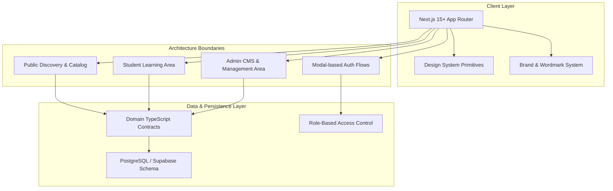

# TopVeda Architecture & System Design Document

## 1. System Overview

**TopVeda** is a production-grade e-learning platform engineered with **Next.js (App Router)**, **TypeScript**, and **Tailwind CSS**. 

The platform is designed around a strictly extensible, database-driven educational taxonomy capable of supporting any educational board, class level, subject, course, chapter, test, or learning resource without hardcoding specific curricula into code.



---

## 2. Directory Architecture & Conventions

The codebase uses a clear, modular folder structure under `src/`:

```
TopVeda/
├── docs/                        # Architecture, database schema, design system, roadmap
│   ├── ARCHITECTURE.md
│   ├── DATABASE_SCHEMA.md
│   ├── DESIGN_SYSTEM.md
│   └── ROADMAP.md
├── public/                      # Static assets & favicons
├── src/
│   ├── app/                     # Next.js App Router
│   │   ├── (public)/            # Future Public website & course catalog
│   │   ├── (student)/           # Future Student learning dashboard
│   │   ├── (admin)/             # Future Admin management panel
│   │   ├── globals.css          # Centralized Design System CSS variables & tokens
│   │   ├── layout.tsx           # Root layout with fonts & metadata
│   │   └── page.tsx             # Phase 1 Foundation & Design System Showcase
│   ├── components/              # Modular Component Tree
│   │   ├── brand/               # Official Wordmark & temporary brand glyph
│   │   │   ├── glyph.tsx
│   │   │   └── wordmark.tsx
│   │   └── ui/                  # Reusable UI Primitives
│   │       ├── badge.tsx
│   │       ├── button.tsx
│   │       ├── card.tsx
│   │       ├── container.tsx
│   │       ├── input.tsx
│   │       └── modal.tsx
│   ├── config/                  # Global site & brand configuration
│   │   └── site.config.ts
│   ├── constants/               # System constants & permission sets
│   │   └── roles.ts
│   ├── lib/                     # Core utilities
│   │   └── utils.ts             # cn class merger
│   └── types/                   # Strict domain type contracts
│       ├── admin.types.ts       # CMS & landing config entities
│       ├── assessment.types.ts  # Tests, questions, attempts, results
│       ├── auth.types.ts        # Role & user session contracts
│       ├── education.types.ts   # Board, Class, Subject, Course, Lesson
│       └── student.types.ts     # Profile, Enrollment, Progress, Doubts
├── .env.example                 # Safe environment blueprint
├── next.config.ts               # Next.js build configuration
├── package.json                 # Dependency definitions & scripts
├── postcss.config.mjs           # PostCSS Tailwind processor
├── tailwind.config.ts           # Tailwind configuration
└── tsconfig.json                # TypeScript compiler configuration
```

---

## 3. Extensible Educational Taxonomy

TopVeda avoids hardcoding educational tiers. All academic entities are represented hierarchically and managed dynamically:

```
Board (e.g. CBSE, BSEB, ICSE)
  └── ClassLevel (e.g. Class 10, Class 11, Class 12)
        └── Subject (e.g. Mathematics, Science, Social Science)
              └── Course (e.g. Class 10 Board Mastery Batch)
                    ├── Chapter (e.g. Real Numbers, Light: Reflection)
                    │     ├── Lesson (Video, Live, Reading)
                    │     └── LearningResource (PDF Notes, Sample Papers, Formula Sheets)
                    └── Test (Chapter Quiz, Mock Exam, Live Test)
                          └── Question
                                └── QuestionOption
```

---

## 4. Role-Based Access Control (RBAC) Strategy

The application defines two foundational user roles:

1. **`STUDENT`**:
   - Access student-facing features, explore courses, enroll, track lesson progress, attempt tests, view results, raise doubts, and manage profile.
2. **`ADMIN`**:
   - Comprehensive CMS and curriculum management: boards, classes, subjects, courses, chapters, lessons, resources, tests, questions, and students.
   - Dynamic landing page configuration (featured courses, categories, FAQs, platform highlight metrics, and social media links).

**Route Protection Model (Planned for Phase 3/4/5)**:
- Server-side middleware checks the authenticated user's JWT role claims before rendering `/admin/*` or `/student/*` routes.
- Strict PostgreSQL Row-Level Security (RLS) ensures students can only read published content and write to their own attempts/progress.

---

## 5. Performance, SEO & Accessibility Standards

- **Typography**: Next.js Google Font optimization via `next/font/google` (`Plus_Jakarta_Sans` and `Inter`) with zero layout shift (`font-display: swap`).
- **Semantic HTML**: Proper `<header>`, `<main>`, `<section>`, `<nav>`, `<button>`, and `<h1>`-`<h6>` hierarchy.
- **Accessibility**: Full ARIA support on interactive primitives (`Modal`, `Input`, `Button`), high contrast ratios exceeding WCAG AA standards, and native `@media (prefers-reduced-motion)` suppression for motion-sensitive users.
