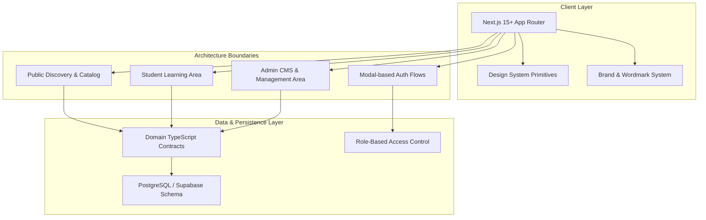

# TopVeda Architecture & System Design Document

## 1. System Overview

**TopVeda** is a production-grade e-learning platform engineered with **Next.js (App Router)**, **TypeScript**, and **Tailwind CSS**. 

The platform is designed around a strictly extensible, database-driven educational taxonomy capable of supporting any educational board, class level, subject, course, chapter, test, or learning resource without hardcoding specific curricula into code.



---

## 2. Directory Architecture & Conventions

The codebase uses a clear, modular folder structure under `src/`:

```
TopVeda/
├── docs/                        # Architecture, database schema, design system, roadmap
│   ├── ARCHITECTURE.md
│   ├── DATABASE_SCHEMA.md
│   ├── DESIGN_SYSTEM.md
│   └── ROADMAP.md
├── public/                      # Static assets & favicons
├── src/
│   ├── app/                     # Next.js App Router
│   │   ├── (public)/            # Future Public website & course catalog
│   │   ├── (student)/           # Future Student learning dashboard
│   │   ├── (admin)/             # Future Admin management panel
│   │   ├── globals.css          # Centralized Design System CSS variables & tokens
│   │   ├── layout.tsx           # Root layout with fonts & metadata
│   │   └── page.tsx             # Phase 1 Foundation & Design System Showcase
│   ├── components/              # Modular Component Tree
│   │   ├── brand/               # Official Wordmark & temporary brand glyph
│   │   │   ├── glyph.tsx
│   │   │   └── wordmark.tsx
│   │   └── ui/                  # Reusable UI Primitives
│   │       ├── badge.tsx
│   │       ├── button.tsx
│   │       ├── card.tsx
│   │       ├── container.tsx
│   │       ├── input.tsx
│   │       └── modal.tsx
│   ├── config/                  # Global site & brand configuration
│   │   └── site.config.ts
│   ├── constants/               # System constants & permission sets
│   │   └── roles.ts
│   ├── lib/                     # Core utilities
│   │   └── utils.ts             # cn class merger
│   └── types/                   # Strict domain type contracts
│       ├── admin.types.ts       # CMS & landing config entities
│       ├── assessment.types.ts  # Tests, questions, attempts, results
│       ├── auth.types.ts        # Role & user session contracts
│       ├── education.types.ts   # Board, Class, Subject, Course, Lesson
│       └── student.types.ts     # Profile, Enrollment, Progress, Doubts
├── .env.example                 # Safe environment blueprint
├── next.config.ts               # Next.js build configuration
├── package.json                 # Dependency definitions & scripts
├── postcss.config.mjs           # PostCSS Tailwind processor
├── tailwind.config.ts           # Tailwind configuration
└── tsconfig.json                # TypeScript compiler configuration
```

---

## 3. Extensible Educational Taxonomy

TopVeda avoids hardcoding educational tiers. All academic entities are represented hierarchically and managed dynamically:

```
Board (e.g. CBSE, BSEB, ICSE)
  └── ClassLevel (e.g. Class 10, Class 11, Class 12)
        └── Subject (e.g. Mathematics, Science, Social Science)
              └── Course (e.g. Class 10 Board Mastery Batch)
                    ├── Chapter (e.g. Real Numbers, Light: Reflection)
                    │     ├── Lesson (Video, Live, Reading)
                    │     └── LearningResource (PDF Notes, Sample Papers, Formula Sheets)
                    └── Test (Chapter Quiz, Mock Exam, Live Test)
                          └── Question
                                └── QuestionOption
```

---

## 4. Authentication & Role-Based Access Control (RBAC) Architecture (Phase 3 Implemented)

TopVeda distinguishes cleanly between **Authentication** ("Who is the user?") and **Authorization** ("What is the user allowed to do?"):

```mermaid
graph TD
    A[User Client / Browser] -->|Credentials: Gmail / +91 Phone + Password| B[Supabase Auth Engine]
    B -->|Issues Secure Cookie Session| A
    B -->|Trigger: on_auth_user_created| C[PostgreSQL public.profiles]
    C -->|Default Role: STUDENT| C
    A -->|Next.js Requests| D[Next.js Middleware]
    D -->|Validates Session & Role| E{Route Guard}
    E -->|Valid Session| F[/student Foundation]
    E -->|Valid Session + ADMIN or SUPER_ADMIN Role| G[/admin Foundation]
    E -->|Unauthenticated / Unauthorized| H[Redirect to /?auth=login]
    F -->|RLS-Protected Queries| C
    G -->|RLS-Protected Queries| C
```

### 4.1 Authentication Identity (Supabase Auth)
- `auth.users` serves as the sole source of truth for identity, password verification, session cookies, email verification links, and password reset tokens.
- Strict registration validation: Full Name (letters & spaces only), Gmail addresses only (`@gmail.com`), 10-digit Indian mobile numbers (`+91XXXXXXXXXX`), strong password rules (8+ chars, uppercase, lowercase, number, special char), and Terms acceptance.

### 4.2 Application Profiles & Database-Side Creation
- `public.profiles` stores application profile metadata linked via `id UUID PRIMARY KEY REFERENCES auth.users(id) ON DELETE CASCADE`.
- Database trigger `handle_new_user()` creates profile records automatically on signup, preventing client-side privilege escalation and setting `role = 'STUDENT'`.
- Unique constraints on `LOWER(email)` and `phone` guarantee zero duplicates across accounts.
- Supported roles: `STUDENT`, `ADMIN`, `SUPER_ADMIN`.
- Initial Super Admin account is bootstrapped directly in Supabase by updating an existing verified profile from `STUDENT` to `SUPER_ADMIN`.

### 4.3 Route Protection & Server-Side Authorization
- Next.js Middleware (`src/middleware.ts`) refreshes session cookies on every request via `@supabase/ssr`.
- `/student/*` routes require authenticated sessions.
- `/admin/*` routes require authenticated sessions with role `ADMIN` or `SUPER_ADMIN` verified against `public.profiles`.
- PostgreSQL Row Level Security (RLS) protects `public.profiles` against unauthorized data access or client-side role tampering.


---

## 5. Performance, SEO & Accessibility Standards

- **Typography**: Next.js Google Font optimization via `next/font/google` (`Plus_Jakarta_Sans` and `Inter`) with zero layout shift (`font-display: swap`).
- **Semantic HTML**: Proper `<header>`, `<main>`, `<section>`, `<nav>`, `<button>`, and `<h1>`-`<h6>` hierarchy.
- **Accessibility**: Full ARIA support on interactive primitives (`Modal`, `Input`, `Button`), high contrast ratios exceeding WCAG AA standards, and native `@media (prefers-reduced-motion)` suppression for motion-sensitive users.
