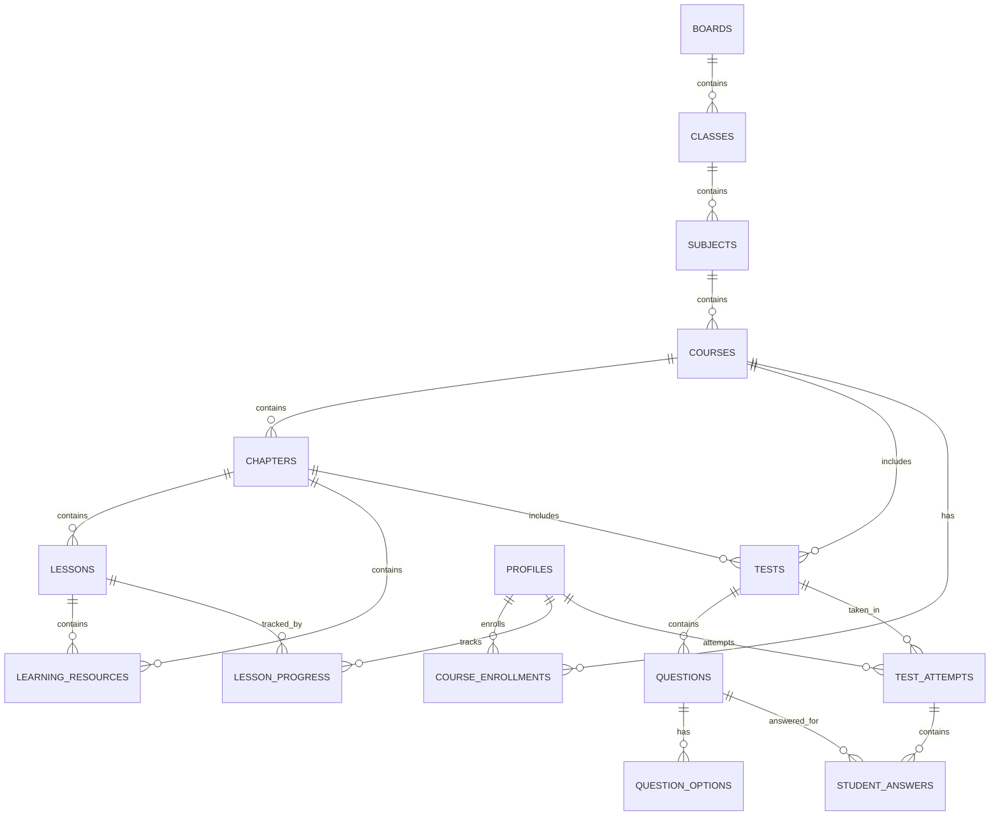

# TopVeda Conceptual Database Architecture & Schema Blueprint

This document details the database schema blueprint planned for implementation with PostgreSQL / Supabase in later phases.

---

## 1. Entity-Relationship Diagram



---

## 2. Table Specifications & DDL Blueprint

### 2.1 Educational Hierarchy Tables

```sql
-- 1. Educational Boards (CBSE, BSEB, ICSE, etc.)
CREATE TABLE public.boards (
    id UUID PRIMARY KEY DEFAULT gen_random_uuid(),
    name VARCHAR(255) NOT NULL,
    code VARCHAR(50) NOT NULL UNIQUE,
    slug VARCHAR(100) NOT NULL UNIQUE,
    description TEXT,
    is_active BOOLEAN DEFAULT TRUE NOT NULL,
    display_order INT DEFAULT 0 NOT NULL,
    created_at TIMESTAMPTZ DEFAULT NOW() NOT NULL,
    updated_at TIMESTAMPTZ DEFAULT NOW() NOT NULL
);

-- 2. Class Levels (Class 10, Class 11, Class 12, etc.)
CREATE TABLE public.class_levels (
    id UUID PRIMARY KEY DEFAULT gen_random_uuid(),
    name VARCHAR(100) NOT NULL,
    code VARCHAR(50) NOT NULL UNIQUE,
    slug VARCHAR(100) NOT NULL UNIQUE,
    description TEXT,
    is_active BOOLEAN DEFAULT TRUE NOT NULL,
    display_order INT DEFAULT 0 NOT NULL,
    created_at TIMESTAMPTZ DEFAULT NOW() NOT NULL,
    updated_at TIMESTAMPTZ DEFAULT NOW() NOT NULL
);

-- 3. Academic Subjects (Mathematics, Science, etc.)
CREATE TABLE public.subjects (
    id UUID PRIMARY KEY DEFAULT gen_random_uuid(),
    name VARCHAR(150) NOT NULL,
    slug VARCHAR(150) NOT NULL UNIQUE,
    code VARCHAR(50),
    icon_name VARCHAR(100),
    is_active BOOLEAN DEFAULT TRUE NOT NULL,
    created_at TIMESTAMPTZ DEFAULT NOW() NOT NULL,
    updated_at TIMESTAMPTZ DEFAULT NOW() NOT NULL
);

-- 4. Courses
CREATE TABLE public.courses (
    id UUID PRIMARY KEY DEFAULT gen_random_uuid(),
    board_id UUID NOT NULL REFERENCES public.boards(id) ON DELETE RESTRICT,
    class_id UUID NOT NULL REFERENCES public.class_levels(id) ON DELETE RESTRICT,
    subject_id UUID NOT NULL REFERENCES public.subjects(id) ON DELETE RESTRICT,
    title VARCHAR(255) NOT NULL,
    slug VARCHAR(255) NOT NULL UNIQUE,
    description TEXT,
    thumbnail_url TEXT,
    is_published BOOLEAN DEFAULT FALSE NOT NULL,
    is_featured BOOLEAN DEFAULT FALSE NOT NULL,
    display_order INT DEFAULT 0 NOT NULL,
    created_at TIMESTAMPTZ DEFAULT NOW() NOT NULL,
    updated_at TIMESTAMPTZ DEFAULT NOW() NOT NULL
);

-- 5. Chapters
CREATE TABLE public.chapters (
    id UUID PRIMARY KEY DEFAULT gen_random_uuid(),
    course_id UUID NOT NULL REFERENCES public.courses(id) ON DELETE CASCADE,
    title VARCHAR(255) NOT NULL,
    slug VARCHAR(255) NOT NULL,
    description TEXT,
    chapter_number INT NOT NULL,
    is_published BOOLEAN DEFAULT FALSE NOT NULL,
    display_order INT DEFAULT 0 NOT NULL,
    created_at TIMESTAMPTZ DEFAULT NOW() NOT NULL,
    updated_at TIMESTAMPTZ DEFAULT NOW() NOT NULL,
    CONSTRAINT uq_course_chapter_slug UNIQUE (course_id, slug)
);

-- 6. Lessons
CREATE TABLE public.lessons (
    id UUID PRIMARY KEY DEFAULT gen_random_uuid(),
    chapter_id UUID NOT NULL REFERENCES public.chapters(id) ON DELETE CASCADE,
    title VARCHAR(255) NOT NULL,
    slug VARCHAR(255) NOT NULL,
    description TEXT,
    lesson_type VARCHAR(50) DEFAULT 'video' NOT NULL CHECK (lesson_type IN ('video', 'live', 'interactive', 'reading')),
    content_url TEXT,
    duration_seconds INT DEFAULT 0,
    is_free_preview BOOLEAN DEFAULT FALSE NOT NULL,
    display_order INT DEFAULT 0 NOT NULL,
    created_at TIMESTAMPTZ DEFAULT NOW() NOT NULL,
    updated_at TIMESTAMPTZ DEFAULT NOW() NOT NULL,
    CONSTRAINT uq_chapter_lesson_slug UNIQUE (chapter_id, slug)
);

-- 7. Learning Resources (Notes, Sample Papers, Formula Sheets)
CREATE TABLE public.learning_resources (
    id UUID PRIMARY KEY DEFAULT gen_random_uuid(),
    chapter_id UUID REFERENCES public.chapters(id) ON DELETE CASCADE,
    lesson_id UUID REFERENCES public.lessons(id) ON DELETE CASCADE,
    title VARCHAR(255) NOT NULL,
    resource_type VARCHAR(50) NOT NULL CHECK (resource_type IN ('pdf', 'notes', 'sample_paper', 'formula_sheet', 'solution')),
    file_url TEXT NOT NULL,
    file_size_bytes BIGINT,
    download_count INT DEFAULT 0 NOT NULL,
    created_at TIMESTAMPTZ DEFAULT NOW() NOT NULL,
    updated_at TIMESTAMPTZ DEFAULT NOW() NOT NULL
);
```

---

### 2.2 Assessment & Test Engine Tables

```sql
-- 8. Tests & Exams
CREATE TABLE public.tests (
    id UUID PRIMARY KEY DEFAULT gen_random_uuid(),
    course_id UUID REFERENCES public.courses(id) ON DELETE SET NULL,
    chapter_id UUID REFERENCES public.chapters(id) ON DELETE SET NULL,
    title VARCHAR(255) NOT NULL,
    slug VARCHAR(255) NOT NULL UNIQUE,
    description TEXT,
    test_type VARCHAR(50) DEFAULT 'chapter_quiz' NOT NULL CHECK (test_type IN ('chapter_quiz', 'mock_exam', 'sample_paper_test', 'live_test')),
    duration_minutes INT NOT NULL,
    total_marks INT NOT NULL,
    passing_marks INT NOT NULL,
    is_published BOOLEAN DEFAULT FALSE NOT NULL,
    created_at TIMESTAMPTZ DEFAULT NOW() NOT NULL,
    updated_at TIMESTAMPTZ DEFAULT NOW() NOT NULL
);

-- 9. Questions
CREATE TABLE public.questions (
    id UUID PRIMARY KEY DEFAULT gen_random_uuid(),
    test_id UUID NOT NULL REFERENCES public.tests(id) ON DELETE CASCADE,
    question_text TEXT NOT NULL,
    question_type VARCHAR(50) DEFAULT 'single_choice' NOT NULL CHECK (question_type IN ('single_choice', 'multiple_choice', 'numerical', 'assertion_reason')),
    marks NUMERIC(4, 2) DEFAULT 1.00 NOT NULL,
    negative_marks NUMERIC(4, 2) DEFAULT 0.00 NOT NULL,
    explanation TEXT,
    display_order INT DEFAULT 0 NOT NULL,
    created_at TIMESTAMPTZ DEFAULT NOW() NOT NULL
);

-- 10. Question Options
CREATE TABLE public.question_options (
    id UUID PRIMARY KEY DEFAULT gen_random_uuid(),
    question_id UUID NOT NULL REFERENCES public.questions(id) ON DELETE CASCADE,
    option_label VARCHAR(10) NOT NULL, -- 'A', 'B', 'C', 'D'
    option_text TEXT NOT NULL,
    is_correct BOOLEAN DEFAULT FALSE NOT NULL,
    display_order INT DEFAULT 0 NOT NULL
);

-- 11. Student Test Attempts
CREATE TABLE public.test_attempts (
    id UUID PRIMARY KEY DEFAULT gen_random_uuid(),
    student_id UUID NOT NULL REFERENCES auth.users(id) ON DELETE CASCADE,
    test_id UUID NOT NULL REFERENCES public.tests(id) ON DELETE CASCADE,
    started_at TIMESTAMPTZ DEFAULT NOW() NOT NULL,
    submitted_at TIMESTAMPTZ,
    total_questions INT DEFAULT 0 NOT NULL,
    attempted_questions INT DEFAULT 0 NOT NULL,
    correct_answers INT DEFAULT 0 NOT NULL,
    incorrect_answers INT DEFAULT 0 NOT NULL,
    score NUMERIC(6, 2) DEFAULT 0.00 NOT NULL,
    max_score NUMERIC(6, 2) NOT NULL,
    percentage NUMERIC(5, 2) DEFAULT 0.00 NOT NULL,
    status VARCHAR(50) DEFAULT 'in_progress' NOT NULL CHECK (status IN ('in_progress', 'submitted', 'evaluated', 'abandoned'))
);

-- 12. Student Question Answers
CREATE TABLE public.student_answers (
    id UUID PRIMARY KEY DEFAULT gen_random_uuid(),
    attempt_id UUID NOT NULL REFERENCES public.test_attempts(id) ON DELETE CASCADE,
    question_id UUID NOT NULL REFERENCES public.questions(id) ON DELETE CASCADE,
    selected_option_ids UUID[] DEFAULT '{}',
    numerical_answer TEXT,
    is_correct BOOLEAN,
    marks_awarded NUMERIC(4, 2) DEFAULT 0.00 NOT NULL,
    time_spent_seconds INT DEFAULT 0
);
```

---

### 2.3 Student Profile, Enrollment & Progress Tables

```sql
-- 13. Student Profiles
CREATE TABLE public.profiles (
    id UUID PRIMARY KEY REFERENCES auth.users(id) ON DELETE CASCADE,
    full_name VARCHAR(255) NOT NULL,
    email VARCHAR(255) NOT NULL,
    phone VARCHAR(50),
    role VARCHAR(50) DEFAULT 'STUDENT' NOT NULL CHECK (role IN ('STUDENT', 'ADMIN')),
    target_board_id UUID REFERENCES public.boards(id) ON DELETE SET NULL,
    target_class_id UUID REFERENCES public.class_levels(id) ON DELETE SET NULL,
    avatar_url TEXT,
    created_at TIMESTAMPTZ DEFAULT NOW() NOT NULL,
    updated_at TIMESTAMPTZ DEFAULT NOW() NOT NULL
);

-- 14. Course Enrollments
CREATE TABLE public.course_enrollments (
    id UUID PRIMARY KEY DEFAULT gen_random_uuid(),
    student_id UUID NOT NULL REFERENCES public.profiles(id) ON DELETE CASCADE,
    course_id UUID NOT NULL REFERENCES public.courses(id) ON DELETE CASCADE,
    status VARCHAR(50) DEFAULT 'active' NOT NULL CHECK (status IN ('active', 'completed', 'paused', 'expired')),
    enrolled_at TIMESTAMPTZ DEFAULT NOW() NOT NULL,
    completed_at TIMESTAMPTZ,
    CONSTRAINT uq_student_course_enrollment UNIQUE (student_id, course_id)
);

-- 15. Lesson Progress
CREATE TABLE public.lesson_progress (
    id UUID PRIMARY KEY DEFAULT gen_random_uuid(),
    student_id UUID NOT NULL REFERENCES public.profiles(id) ON DELETE CASCADE,
    lesson_id UUID NOT NULL REFERENCES public.lessons(id) ON DELETE CASCADE,
    course_id UUID NOT NULL REFERENCES public.courses(id) ON DELETE CASCADE,
    status VARCHAR(50) DEFAULT 'not_started' NOT NULL CHECK (status IN ('not_started', 'in_progress', 'completed')),
    progress_percentage INT DEFAULT 0 NOT NULL,
    last_watched_second INT DEFAULT 0,
    completed_at TIMESTAMPTZ,
    updated_at TIMESTAMPTZ DEFAULT NOW() NOT NULL,
    CONSTRAINT uq_student_lesson_progress UNIQUE (student_id, lesson_id)
);
```

---

### 2.4 Admin CMS & Platform Settings Tables

```sql
-- 16. Dynamic Platform Settings & CMS Content
CREATE TABLE public.platform_settings (
    id UUID PRIMARY KEY DEFAULT gen_random_uuid(),
    key VARCHAR(100) NOT NULL UNIQUE,
    value JSONB NOT NULL,
    description TEXT,
    updated_at TIMESTAMPTZ DEFAULT NOW() NOT NULL
);

-- 17. FAQs
CREATE TABLE public.faq_items (
    id UUID PRIMARY KEY DEFAULT gen_random_uuid(),
    question TEXT NOT NULL,
    answer TEXT NOT NULL,
    category VARCHAR(50) DEFAULT 'general' NOT NULL,
    display_order INT DEFAULT 0 NOT NULL,
    is_active BOOLEAN DEFAULT TRUE NOT NULL,
    created_at TIMESTAMPTZ DEFAULT NOW() NOT NULL
);
```

---

## 3. Row Level Security (RLS) Policy Strategy (Planned for Phase 3)

- **Public Access**: Any unauthenticated client can read published boards, classes, subjects, courses, chapters, and lessons marked `is_published = true`.
- **Student Access**: Authenticated users with role `STUDENT` can insert test attempts, submit answers, update their own lesson progress, and read their own profiles.
- **Admin Access**: Authenticated users with role `ADMIN` bypass read restrictions and possess full write privileges across all curriculum and CMS tables.
