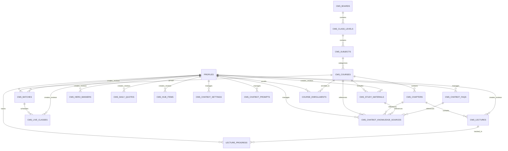

# TopVeda — Phase 4.1 Super Admin Content Management System (CMS) Architecture Specification

> **Document Version:** 4.0 (Production-Ready CMS & AI Chatbot Architecture Specification)  
> **Phase:** 4.1 (Super Admin CMS & AI Chatbot Governance)  
> **Target Audience:** Super Admin, Lead System Architect, Full-Stack Engineering Team  
> **Safety Notice:** This document is an **architectural specification**. No database tables, migrations, RLS policies, storage buckets, or application code are implemented until this architecture is reviewed and approved.

---

## 1. Executive Summary & Objective

The primary objective of **Phase 4.1** is to design and establish the **Super Admin Content Management System (CMS)** architecture that dynamically powers:
1. The approved **TopVeda Student Home discovery portal** (`/student`).
2. The **TopVeda AI Chatbot** (`FloatingChatbot` on Student Home) and its authoritative knowledge governance pipeline.

Phase 4 delivered the approved Student Home UI, floating AI chatbot interface, and client-side design system. Phase 4.1 establishes the data persistence models, content lifecycle state machine, storage/video delivery pipelines, per-entity review queues, AI chatbot knowledge governance, and authorization policies that enable TopVeda Super Administrators to create, curate, review, categorize, reorder, and publish content without altering frontend UI components.

```
┌─────────────────────────────────────────────────────────────────────────────┐
│                          1. CONTENT CREATION & INGEST                       │
│  - Super Admin direct authoring (Hero, Batches, Live, Quotes, Hub, Chatbot) │
│  - Admin / Teacher submissions (Lectures, Notes, Materials)                 │
└──────────────────────────────────────┬──────────────────────────────────────┘
                                       │
                                       ▼
┌─────────────────────────────────────────────────────────────────────────────┐
│                         2. CONTENT APPROVAL & REVIEW                        │
│  - Per-entity review metadata (submitted_by, reviewed_by, review_note)      │
│  - Super Admin Review Queue (/admin/cms/reviews) via unified SQL view       │
│  - Status: DRAFT → PENDING_REVIEW → APPROVED/REJECTED → PUBLISHED           │
│  - Critical Rule: APPROVED content NEVER automatically displays on Home    │
│  - Critical Rule: Teacher submissions NEVER become AI Chatbot knowledge     │
│    until Super Admin review and explicit publication.                       │
└──────────────────────────────────────┬──────────────────────────────────────┘
                                       │
                                       ▼
┌─────────────────────────────────────────────────────────────────────────────┐
│                   3. DATABASE, STORAGE, VIDEO & AI KNOWLEDGE                │
│  - Supabase PostgreSQL: Normalized schema, RLS, section-specific ordering   │
│  - Media Storage: Supabase Storage (CDN Edge Cached) for images/documents   │
│  - Cloudflare Stream: HLS/DASH adaptive bitrate video delivery & webhooks   │
│  - Chatbot Governance: Settings, Prompts, FAQs, and Knowledge Source Graph  │
└──────────────────────────────────────┬──────────────────────────────────────┘
                                       │
                                       ▼
┌─────────────────────────────────────────────────────────────────────────────┐
│                 4. TYPED STUDENT HOME AGGREGATION SERVICE                   │
│  - Modular domain services: getPublishedHeroSlides(), getPublishedBatches(),│
│    getPublishedLectures(), getPublicChatbotConfig(), etc.                   │
│  - Aggregated parallel retrieval with graceful static fallback              │
└──────────────────────────────────────┬──────────────────────────────────────┘
                                       │
                                       ▼
┌─────────────────────────────────────────────────────────────────────────────┐
│                    5. DYNAMIC STUDENT HOME (Existing UI)                    │
│  - StudentHeroBanner       - FeaturedBatchesSection                         │
│  - OngoingBatchesSection   - LiveClassesSection                             │
│  - LatestLecturesSection   - ExploreCoursesSection                          │
│  - StudentPortalHub        - StudentSidebar (Daily Quote)                   │
│  - FloatingChatbot (Dynamic Welcome, Starter Prompts, Public Config)        │
└─────────────────────────────────────────────────────────────────────────────┘
```

---

## 2. Core Architectural Principles

1. **Presentation Layer Preservation**: The existing Phase 4 Student Home components (`src/components/student/*`) remain completely unchanged in markup, design tokens, and CSS layout. The CMS dynamically feeds typed data into existing component props.
2. **Strict Content Lifecycle Isolation**:
   - `APPROVED` content is an internal governance milestone and **NEVER** appears on the public/student portal.
   - Only records with `status = 'PUBLISHED'`, `is_visible = TRUE`, and active schedule windows (`starts_at <= NOW() AND (ends_at IS NULL OR ends_at >= NOW())`) are queryable by students.
3. **Authoritative AI Chatbot Knowledge Pipeline**:
   - Only approved/published TopVeda content serves as authoritative student-facing knowledge.
   - Teacher/Admin submissions must pass Super Admin approval before being indexed or referenced by the AI service layer.
4. **Normalized Per-Entity Review Architecture**: Review, audit, and ownership metadata reside directly on each entity table rather than a generic polymorphic table, ensuring strict foreign key integrity, simplified RLS policies, and zero schema drift.
5. **Separation of Storage & AI Concerns**:
   - **Relational Metadata & Chatbot Rules**: PostgreSQL (Supabase)
   - **Static Media & Documents**: Object Storage with CDN Edge Caching
   - **Video Ingest & Streaming**: Cloudflare Stream (Adaptive HLS/DASH)
   - **AI Model Keys & Provider Config**: Server-side runtime secrets only (never exposed to student clients)
6. **Modular Typed Aggregation Layer**: Instead of one monolithic raw SQL query, a typed service layer executes parallel domain queries with graceful fallback to `src/config/student-home.config.ts`.

---

## 3. Content Lifecycle & State Machine

```
                  ┌────────────────────────────────────────┐
                  │                 DRAFT                  │
                  │   (Created by Super Admin or Teacher)  │
                  └───────────────────┬────────────────────┘
                                      │
                         Teacher submits for approval
                                      ▼
                  ┌────────────────────────────────────────┐
                  │            PENDING_REVIEW              │
                  │       (Visible in Review Queue)        │
                  └───────────────┬────────┬───────────────┘
                                  │        │
               Super Admin Rejects│        │Super Admin Approves
                                  ▼        ▼
┌──────────────────────────────────┐      ┌──────────────────────────────────┐
│             REJECTED             │      │             APPROVED             │
│ (Returned with feedback reason)  │      │ (Approved internally; NOT on Home│
│                                  │      │  Needs explicit publish action)  │
└──────────────────────────────────┘      └────────────────┬─────────────────┘
                                                           │
                                                  Super Admin Publishes
                                                           ▼
                                          ┌──────────────────────────────────┐
                                          │            PUBLISHED             │
                                          │ (Live on Student Home if visible │
                                          │  and within scheduled window;    │
                                          │  Eligible for Chatbot Knowledge) │
                                          └────────────────┬─────────────────┘
                                                           │
                                                  Super Admin Archives
                                                           ▼
                                          ┌──────────────────────────────────┐
                                          │             ARCHIVED             │
                                          │   (Removed from Student Portal   │
                                          │    and Chatbot Knowledge Index)  │
                                          └──────────────────────────────────┘
```

### Lifecycle Transition Rules

| Transition | Allowed Roles | Pre-conditions | Post-actions |
| :--- | :--- | :--- | :--- |
| `DRAFT` $\rightarrow$ `PENDING_REVIEW` | `ADMIN` (Teacher), `SUPER_ADMIN` | Required fields populated (title, media URL/Stream ID, subject). | Sets `submitted_by = auth.uid()`, logs submission timestamp. |
| `PENDING_REVIEW` $\rightarrow$ `APPROVED` | `SUPER_ADMIN` only | Verified syllabus alignment, video quality, and thumbnail. | Sets `reviewed_by = auth.uid()`, `reviewed_at = NOW()`. **NOT visible on Home**. |
| `PENDING_REVIEW` $\rightarrow$ `REJECTED` | `SUPER_ADMIN` only | Requires `review_note` explaining rejection reason. | Sets `reviewed_by = auth.uid()`, `reviewed_at = NOW()`. Teacher can edit and resubmit. |
| `APPROVED` $\rightarrow$ `PUBLISHED` | `SUPER_ADMIN` only | Display order and category assigned. | Sets `status = 'PUBLISHED'`. Content becomes live on Student Home and eligible for chatbot knowledge sync. |
| `DRAFT` $\rightarrow$ `PUBLISHED` | `SUPER_ADMIN` only | Direct authoring bypass for Super Admin. | Immediate publication without intermediate queue. |
| `PUBLISHED` $\rightarrow$ `ARCHIVED` | `SUPER_ADMIN` only | Content retired or batch completed. | Removed from Student Home queries; de-indexed from chatbot active knowledge. |

---

## 4. Entity-Relationship Model (ERD)



---

## 5. Normalized Database Schema Blueprint (DDL)

### 5.1 Enumerations & Standard Columns Pattern

Every CMS table implements the **Standard Ownership, Governance & Scheduling Contract**:

```sql
-- Standard CMS Audit & Governance Columns:
-- created_by     UUID REFERENCES public.profiles(id) ON DELETE SET NULL
-- updated_by     UUID REFERENCES public.profiles(id) ON DELETE SET NULL
-- submitted_by   UUID REFERENCES public.profiles(id) ON DELETE SET NULL
-- reviewed_by    UUID REFERENCES public.profiles(id) ON DELETE SET NULL
-- reviewed_at    TIMESTAMPTZ
-- review_note    TEXT
-- status         public.content_status DEFAULT 'DRAFT' NOT NULL
-- display_order  INT DEFAULT 0 NOT NULL
-- is_visible     BOOLEAN DEFAULT TRUE NOT NULL
-- starts_at      TIMESTAMPTZ
-- ends_at        TIMESTAMPTZ
-- created_at     TIMESTAMPTZ DEFAULT NOW() NOT NULL
-- updated_at     TIMESTAMPTZ DEFAULT NOW() NOT NULL
```

```sql
-- Publication status enum
CREATE TYPE public.content_status AS ENUM (
    'DRAFT',
    'PENDING_REVIEW',
    'REJECTED',
    'APPROVED',
    'PUBLISHED',
    'ARCHIVED'
);

-- Badge variant enum
CREATE TYPE public.batch_badge_variant AS ENUM (
    'orange',
    'pink',
    'green',
    'purple'
);

-- Live class status enum
CREATE TYPE public.live_class_status AS ENUM (
    'SCHEDULED',
    'LIVE',
    'COMPLETED',
    'CANCELLED'
);

-- Hub category enum
CREATE TYPE public.hub_category AS ENUM (
    'announcement',
    'material',
    'live',
    'tip'
);

-- Chatbot AI Provider enum (For future model configuration)
CREATE TYPE public.chatbot_model_provider AS ENUM (
    'openai',
    'anthropic',
    'gemini',
    'cloudflare_workers_ai',
    'custom'
);

-- Chatbot Knowledge Source Type enum
CREATE TYPE public.chatbot_source_type AS ENUM (
    'COURSE',
    'CHAPTER',
    'STUDY_MATERIAL',
    'FAQ',
    'CURRICULUM_SPEC'
);

-- Chatbot Sync Status enum
CREATE TYPE public.chatbot_sync_status AS ENUM (
    'PENDING',
    'SYNCED',
    'FAILED',
    'EXCLUDED'
);
```

---

### 5.2 Academic Structure & Discovery Tables

```sql
-- 1. Educational Boards (CBSE, BSEB, ICSE, JEE, NEET)
CREATE TABLE public.cms_boards (
    id UUID PRIMARY KEY DEFAULT gen_random_uuid(),
    name VARCHAR(255) NOT NULL,
    code VARCHAR(50) NOT NULL UNIQUE,
    slug VARCHAR(100) NOT NULL UNIQUE,
    description TEXT,
    icon_name VARCHAR(100),
    display_order INT DEFAULT 0 NOT NULL,
    is_visible BOOLEAN DEFAULT TRUE NOT NULL,
    status public.content_status DEFAULT 'PUBLISHED' NOT NULL,
    created_by UUID REFERENCES public.profiles(id) ON DELETE SET NULL,
    updated_by UUID REFERENCES public.profiles(id) ON DELETE SET NULL,
    submitted_by UUID REFERENCES public.profiles(id) ON DELETE SET NULL,
    reviewed_by UUID REFERENCES public.profiles(id) ON DELETE SET NULL,
    reviewed_at TIMESTAMPTZ,
    review_note TEXT,
    starts_at TIMESTAMPTZ,
    ends_at TIMESTAMPTZ,
    created_at TIMESTAMPTZ DEFAULT NOW() NOT NULL,
    updated_at TIMESTAMPTZ DEFAULT NOW() NOT NULL
);

-- 2. Class Levels (Class 10, Class 11, Class 12, Foundation, Dropper)
CREATE TABLE public.cms_class_levels (
    id UUID PRIMARY KEY DEFAULT gen_random_uuid(),
    name VARCHAR(100) NOT NULL,
    code VARCHAR(50) NOT NULL UNIQUE,
    slug VARCHAR(100) NOT NULL UNIQUE,
    display_order INT DEFAULT 0 NOT NULL,
    is_visible BOOLEAN DEFAULT TRUE NOT NULL,
    status public.content_status DEFAULT 'PUBLISHED' NOT NULL,
    created_by UUID REFERENCES public.profiles(id) ON DELETE SET NULL,
    updated_by UUID REFERENCES public.profiles(id) ON DELETE SET NULL,
    submitted_by UUID REFERENCES public.profiles(id) ON DELETE SET NULL,
    reviewed_by UUID REFERENCES public.profiles(id) ON DELETE SET NULL,
    reviewed_at TIMESTAMPTZ,
    review_note TEXT,
    starts_at TIMESTAMPTZ,
    ends_at TIMESTAMPTZ,
    created_at TIMESTAMPTZ DEFAULT NOW() NOT NULL,
    updated_at TIMESTAMPTZ DEFAULT NOW() NOT NULL
);

-- 3. Academic Subjects (Mathematics, Science, Physics, Chemistry, Biology, English)
CREATE TABLE public.cms_subjects (
    id UUID PRIMARY KEY DEFAULT gen_random_uuid(),
    name VARCHAR(150) NOT NULL,
    slug VARCHAR(150) NOT NULL UNIQUE,
    code VARCHAR(50),
    icon_name VARCHAR(100),
    icon_color VARCHAR(50) DEFAULT 'text-brand-orange',
    icon_bg VARCHAR(50) DEFAULT 'bg-brand-bg-peach',
    display_order INT DEFAULT 0 NOT NULL,
    is_visible BOOLEAN DEFAULT TRUE NOT NULL,
    status public.content_status DEFAULT 'PUBLISHED' NOT NULL,
    created_by UUID REFERENCES public.profiles(id) ON DELETE SET NULL,
    updated_by UUID REFERENCES public.profiles(id) ON DELETE SET NULL,
    submitted_by UUID REFERENCES public.profiles(id) ON DELETE SET NULL,
    reviewed_by UUID REFERENCES public.profiles(id) ON DELETE SET NULL,
    reviewed_at TIMESTAMPTZ,
    review_note TEXT,
    starts_at TIMESTAMPTZ,
    ends_at TIMESTAMPTZ,
    created_at TIMESTAMPTZ DEFAULT NOW() NOT NULL,
    updated_at TIMESTAMPTZ DEFAULT NOW() NOT NULL
);

-- 4. Explore Courses Catalog (Section 5 on Student Home)
CREATE TABLE public.cms_courses (
    id UUID PRIMARY KEY DEFAULT gen_random_uuid(),
    board_id UUID REFERENCES public.cms_boards(id) ON DELETE RESTRICT,
    class_id UUID REFERENCES public.cms_class_levels(id) ON DELETE RESTRICT,
    subject_id UUID REFERENCES public.cms_subjects(id) ON DELETE RESTRICT,
    title VARCHAR(255) NOT NULL, -- e.g. "Class 10"
    category VARCHAR(100) NOT NULL, -- e.g. "Mathematics", "Science"
    slug VARCHAR(255) NOT NULL UNIQUE,
    short_description TEXT,
    thumbnail_url TEXT,
    icon_type VARCHAR(50) DEFAULT 'school',
    icon_color VARCHAR(50) DEFAULT 'text-brand-orange',
    icon_bg VARCHAR(50) DEFAULT 'bg-rose-50 border-rose-100',
    display_order INT DEFAULT 0 NOT NULL,
    is_visible BOOLEAN DEFAULT TRUE NOT NULL,
    is_featured BOOLEAN DEFAULT FALSE NOT NULL,
    status public.content_status DEFAULT 'DRAFT' NOT NULL,
    created_by UUID REFERENCES public.profiles(id) ON DELETE SET NULL,
    updated_by UUID REFERENCES public.profiles(id) ON DELETE SET NULL,
    submitted_by UUID REFERENCES public.profiles(id) ON DELETE SET NULL,
    reviewed_by UUID REFERENCES public.profiles(id) ON DELETE SET NULL,
    reviewed_at TIMESTAMPTZ,
    review_note TEXT,
    starts_at TIMESTAMPTZ,
    ends_at TIMESTAMPTZ,
    created_at TIMESTAMPTZ DEFAULT NOW() NOT NULL,
    updated_at TIMESTAMPTZ DEFAULT NOW() NOT NULL
);

-- 5. Batches (Section 1: Featured Batches & Section 2: Ongoing Batches)
CREATE TABLE public.cms_batches (
    id UUID PRIMARY KEY DEFAULT gen_random_uuid(),
    course_id UUID REFERENCES public.cms_courses(id) ON DELETE SET NULL,
    board_id UUID REFERENCES public.cms_boards(id) ON DELETE RESTRICT,
    class_id UUID REFERENCES public.cms_class_levels(id) ON DELETE RESTRICT,
    title VARCHAR(255) NOT NULL, -- e.g. "Mathematics", "Physics + Chemistry"
    slug VARCHAR(255) NOT NULL UNIQUE,
    board_label VARCHAR(100) NOT NULL, -- e.g. "Class 10 CBSE", "Class 12 Science"
    subtitle VARCHAR(255) NOT NULL, -- e.g. "Complete Board Preparation"
    description TEXT,
    badge_text VARCHAR(50), -- e.g. "New", "Popular"
    badge_variant public.batch_badge_variant DEFAULT 'orange' NOT NULL,
    is_featured BOOLEAN DEFAULT FALSE NOT NULL, -- Controls appearance in Section 1 (Featured) vs Section 2 (Ongoing)
    is_ongoing BOOLEAN DEFAULT TRUE NOT NULL,
    status_type VARCHAR(50) DEFAULT 'ongoing' CHECK (status_type IN ('live', 'ongoing')),
    educator_name VARCHAR(255) NOT NULL,
    educator_avatar_url TEXT NOT NULL,
    lead_educator_id UUID REFERENCES public.profiles(id) ON DELETE SET NULL,
    bg_gradient VARCHAR(255) DEFAULT 'from-sky-50/70 via-blue-50/40 to-indigo-50/30',
    border_color VARCHAR(100) DEFAULT 'border-sky-100',
    icon_type VARCHAR(50) DEFAULT 'math',
    icon_bg VARCHAR(100) DEFAULT 'bg-emerald-50 border-emerald-100 text-emerald-600',
    icon_color VARCHAR(50) DEFAULT 'text-emerald-600',
    cta_text VARCHAR(50) DEFAULT 'Explore →',
    cta_link VARCHAR(255) DEFAULT '/student/batches',
    display_order INT DEFAULT 0 NOT NULL,
    is_visible BOOLEAN DEFAULT TRUE NOT NULL,
    status public.content_status DEFAULT 'DRAFT' NOT NULL,
    created_by UUID REFERENCES public.profiles(id) ON DELETE SET NULL,
    updated_by UUID REFERENCES public.profiles(id) ON DELETE SET NULL,
    submitted_by UUID REFERENCES public.profiles(id) ON DELETE SET NULL,
    reviewed_by UUID REFERENCES public.profiles(id) ON DELETE SET NULL,
    reviewed_at TIMESTAMPTZ,
    review_note TEXT,
    starts_at TIMESTAMPTZ,
    ends_at TIMESTAMPTZ,
    created_at TIMESTAMPTZ DEFAULT NOW() NOT NULL,
    updated_at TIMESTAMPTZ DEFAULT NOW() NOT NULL
);
```

---

### 5.3 Lectures, Cloudflare Video & Chapters

```sql
-- 6. Chapters / Modules
CREATE TABLE public.cms_chapters (
    id UUID PRIMARY KEY DEFAULT gen_random_uuid(),
    course_id UUID NOT NULL REFERENCES public.cms_courses(id) ON DELETE CASCADE,
    batch_id UUID REFERENCES public.cms_batches(id) ON DELETE SET NULL,
    title VARCHAR(255) NOT NULL,
    slug VARCHAR(255) NOT NULL,
    chapter_number INT NOT NULL,
    description TEXT,
    display_order INT DEFAULT 0 NOT NULL,
    is_visible BOOLEAN DEFAULT TRUE NOT NULL,
    status public.content_status DEFAULT 'PUBLISHED' NOT NULL,
    created_by UUID REFERENCES public.profiles(id) ON DELETE SET NULL,
    updated_by UUID REFERENCES public.profiles(id) ON DELETE SET NULL,
    submitted_by UUID REFERENCES public.profiles(id) ON DELETE SET NULL,
    reviewed_by UUID REFERENCES public.profiles(id) ON DELETE SET NULL,
    reviewed_at TIMESTAMPTZ,
    review_note TEXT,
    starts_at TIMESTAMPTZ,
    ends_at TIMESTAMPTZ,
    created_at TIMESTAMPTZ DEFAULT NOW() NOT NULL,
    updated_at TIMESTAMPTZ DEFAULT NOW() NOT NULL,
    CONSTRAINT uq_chapter_slug_per_course UNIQUE (course_id, slug)
);

-- 7. Latest Lectures (Section 4 on Student Home)
CREATE TABLE public.cms_lectures (
    id UUID PRIMARY KEY DEFAULT gen_random_uuid(),
    chapter_id UUID REFERENCES public.cms_chapters(id) ON DELETE SET NULL,
    batch_id UUID REFERENCES public.cms_batches(id) ON DELETE SET NULL,
    title VARCHAR(255) NOT NULL, -- e.g. "Trigonometry Basics"
    slug VARCHAR(255) NOT NULL,
    subject VARCHAR(100) NOT NULL, -- e.g. "Mathematics", "Science"
    teacher_name VARCHAR(255) NOT NULL, -- e.g. "Rohit Sharma"
    educator_id UUID REFERENCES public.profiles(id) ON DELETE SET NULL,
    duration_seconds INT DEFAULT 0 NOT NULL,
    duration_formatted VARCHAR(20) DEFAULT '45:00' NOT NULL, -- e.g. "45:00"
    duration_human VARCHAR(50) DEFAULT '45 min' NOT NULL, -- e.g. "45 min"
    thumbnail_url TEXT NOT NULL, -- Stored in Object Storage
    thumbnail_bg VARCHAR(255) DEFAULT 'from-[#0F2042] via-[#162D59] to-[#0A162B]',
    category_tag VARCHAR(100) NOT NULL, -- e.g. "TRIGONOMETRY BASICS"
    video_stream_id VARCHAR(255), -- Cloudflare Stream Video UID
    video_playback_url TEXT, -- HLS / DASH manifest URL
    video_upload_status VARCHAR(50) DEFAULT 'ready', -- 'uploading', 'processing', 'ready', 'failed'
    is_home_featured BOOLEAN DEFAULT FALSE NOT NULL, -- Controls appearance on Student Home carousel
    is_free_preview BOOLEAN DEFAULT TRUE NOT NULL,
    display_order INT DEFAULT 0 NOT NULL,
    is_visible BOOLEAN DEFAULT TRUE NOT NULL,
    status public.content_status DEFAULT 'DRAFT' NOT NULL,
    created_by UUID REFERENCES public.profiles(id) ON DELETE SET NULL,
    updated_by UUID REFERENCES public.profiles(id) ON DELETE SET NULL,
    submitted_by UUID REFERENCES public.profiles(id) ON DELETE SET NULL,
    reviewed_by UUID REFERENCES public.profiles(id) ON DELETE SET NULL,
    reviewed_at TIMESTAMPTZ,
    review_note TEXT,
    starts_at TIMESTAMPTZ,
    ends_at TIMESTAMPTZ,
    created_at TIMESTAMPTZ DEFAULT NOW() NOT NULL,
    updated_at TIMESTAMPTZ DEFAULT NOW() NOT NULL
);
```

---

### 5.4 Live Classes, Hero Banners, Quotes & Portal Hub

```sql
-- 8. Live Classes (Section 3 on Student Home)
CREATE TABLE public.cms_live_classes (
    id UUID PRIMARY KEY DEFAULT gen_random_uuid(),
    batch_id UUID REFERENCES public.cms_batches(id) ON DELETE SET NULL,
    subject VARCHAR(100) NOT NULL, -- e.g. "Mathematics"
    topic VARCHAR(255) NOT NULL, -- e.g. "Trigonometry Basics"
    educator_name VARCHAR(255) NOT NULL, -- e.g. "By Rohit Sir"
    educator_avatar_url TEXT NOT NULL,
    educator_id UUID REFERENCES public.profiles(id) ON DELETE SET NULL,
    scheduled_start TIMESTAMPTZ NOT NULL,
    scheduled_end TIMESTAMPTZ,
    time_display VARCHAR(50) NOT NULL, -- e.g. "6:00 PM"
    is_live BOOLEAN DEFAULT FALSE NOT NULL,
    status_text VARCHAR(20) DEFAULT 'UPCOMING' NOT NULL, -- 'LIVE' | 'UPCOMING'
    live_status public.live_class_status DEFAULT 'SCHEDULED' NOT NULL,
    cta_text VARCHAR(50) DEFAULT 'Reminder' NOT NULL,
    stream_room_url TEXT,
    display_order INT DEFAULT 0 NOT NULL,
    is_visible BOOLEAN DEFAULT TRUE NOT NULL,
    status public.content_status DEFAULT 'PUBLISHED' NOT NULL,
    created_by UUID REFERENCES public.profiles(id) ON DELETE SET NULL,
    updated_by UUID REFERENCES public.profiles(id) ON DELETE SET NULL,
    submitted_by UUID REFERENCES public.profiles(id) ON DELETE SET NULL,
    reviewed_by UUID REFERENCES public.profiles(id) ON DELETE SET NULL,
    reviewed_at TIMESTAMPTZ,
    review_note TEXT,
    starts_at TIMESTAMPTZ,
    ends_at TIMESTAMPTZ,
    created_at TIMESTAMPTZ DEFAULT NOW() NOT NULL,
    updated_at TIMESTAMPTZ DEFAULT NOW() NOT NULL
);

-- 9. Hero Carousel Banners (Hero Banner on Student Home)
CREATE TABLE public.cms_hero_banners (
    id UUID PRIMARY KEY DEFAULT gen_random_uuid(),
    tagline VARCHAR(150) DEFAULT 'TOPVEDA ACADEMIC DISCOVERY' NOT NULL,
    title VARCHAR(255) NOT NULL, -- e.g. "Learn. Practice. Grow."
    subtitle TEXT NOT NULL, -- e.g. "Your future is built by what you do today."
    cta_text VARCHAR(100) DEFAULT 'Keep Learning →' NOT NULL,
    cta_link VARCHAR(255) DEFAULT '#featured-batches' NOT NULL,
    quote_text TEXT DEFAULT 'Better Students\nBrighter Futures',
    character_image_url TEXT NOT NULL,
    bg_gradient VARCHAR(255) DEFAULT 'from-[#081326] via-[#0E2044] to-[#1B3A72]',
    display_order INT DEFAULT 0 NOT NULL,
    is_visible BOOLEAN DEFAULT TRUE NOT NULL,
    status public.content_status DEFAULT 'PUBLISHED' NOT NULL,
    created_by UUID REFERENCES public.profiles(id) ON DELETE SET NULL,
    updated_by UUID REFERENCES public.profiles(id) ON DELETE SET NULL,
    submitted_by UUID REFERENCES public.profiles(id) ON DELETE SET NULL,
    reviewed_by UUID REFERENCES public.profiles(id) ON DELETE SET NULL,
    reviewed_at TIMESTAMPTZ,
    review_note TEXT,
    starts_at TIMESTAMPTZ,
    ends_at TIMESTAMPTZ,
    created_at TIMESTAMPTZ DEFAULT NOW() NOT NULL,
    updated_at TIMESTAMPTZ DEFAULT NOW() NOT NULL
);

-- 10. Daily Motivational Quotes (Sidebar widget)
CREATE TABLE public.cms_daily_quotes (
    id UUID PRIMARY KEY DEFAULT gen_random_uuid(),
    quote TEXT NOT NULL,
    author VARCHAR(150) DEFAULT 'TopVeda' NOT NULL,
    is_active BOOLEAN DEFAULT FALSE NOT NULL,
    scheduled_for_date DATE,
    display_order INT DEFAULT 0 NOT NULL,
    is_visible BOOLEAN DEFAULT TRUE NOT NULL,
    status public.content_status DEFAULT 'PUBLISHED' NOT NULL,
    created_by UUID REFERENCES public.profiles(id) ON DELETE SET NULL,
    updated_by UUID REFERENCES public.profiles(id) ON DELETE SET NULL,
    submitted_by UUID REFERENCES public.profiles(id) ON DELETE SET NULL,
    reviewed_by UUID REFERENCES public.profiles(id) ON DELETE SET NULL,
    reviewed_at TIMESTAMPTZ,
    review_note TEXT,
    starts_at TIMESTAMPTZ,
    ends_at TIMESTAMPTZ,
    created_at TIMESTAMPTZ DEFAULT NOW() NOT NULL,
    updated_at TIMESTAMPTZ DEFAULT NOW() NOT NULL
);

-- 11. Student Portal Hub ("What's Happening on TopVeda?" Section 6)
CREATE TABLE public.cms_hub_items (
    id UUID PRIMARY KEY DEFAULT gen_random_uuid(),
    category public.hub_category DEFAULT 'announcement' NOT NULL,
    badge_text VARCHAR(50) NOT NULL, -- e.g. "NEW BATCH", "REVISION NOTES"
    badge_variant VARCHAR(50) DEFAULT 'orange' NOT NULL, -- 'orange', 'sky', 'purple', 'emerald'
    title VARCHAR(255) NOT NULL,
    description TEXT NOT NULL,
    cta_text VARCHAR(100) DEFAULT 'Explore Batch' NOT NULL,
    cta_link VARCHAR(255) DEFAULT '/student/batches' NOT NULL,
    icon_type VARCHAR(50) DEFAULT 'megaphone' NOT NULL,
    display_order INT DEFAULT 0 NOT NULL,
    is_visible BOOLEAN DEFAULT TRUE NOT NULL,
    status public.content_status DEFAULT 'PUBLISHED' NOT NULL,
    created_by UUID REFERENCES public.profiles(id) ON DELETE SET NULL,
    updated_by UUID REFERENCES public.profiles(id) ON DELETE SET NULL,
    submitted_by UUID REFERENCES public.profiles(id) ON DELETE SET NULL,
    reviewed_by UUID REFERENCES public.profiles(id) ON DELETE SET NULL,
    reviewed_at TIMESTAMPTZ,
    review_note TEXT,
    starts_at TIMESTAMPTZ,
    ends_at TIMESTAMPTZ,
    created_at TIMESTAMPTZ DEFAULT NOW() NOT NULL,
    updated_at TIMESTAMPTZ DEFAULT NOW() NOT NULL
);

-- 12. Study Materials (Notes, NCERT Solutions, Formula Sheets)
CREATE TABLE public.cms_study_materials (
    id UUID PRIMARY KEY DEFAULT gen_random_uuid(),
    course_id UUID REFERENCES public.cms_courses(id) ON DELETE SET NULL,
    chapter_id UUID REFERENCES public.cms_chapters(id) ON DELETE SET NULL,
    title VARCHAR(255) NOT NULL,
    material_type VARCHAR(50) DEFAULT 'formula_sheet' CHECK (material_type IN ('formula_sheet', 'notes', 'ncert_solution', 'pyq_paper')),
    file_url TEXT NOT NULL,
    file_size_bytes BIGINT,
    page_count INT,
    download_count INT DEFAULT 0 NOT NULL,
    display_order INT DEFAULT 0 NOT NULL,
    is_visible BOOLEAN DEFAULT TRUE NOT NULL,
    status public.content_status DEFAULT 'DRAFT' NOT NULL,
    created_by UUID REFERENCES public.profiles(id) ON DELETE SET NULL,
    updated_by UUID REFERENCES public.profiles(id) ON DELETE SET NULL,
    submitted_by UUID REFERENCES public.profiles(id) ON DELETE SET NULL,
    reviewed_by UUID REFERENCES public.profiles(id) ON DELETE SET NULL,
    reviewed_at TIMESTAMPTZ,
    review_note TEXT,
    starts_at TIMESTAMPTZ,
    ends_at TIMESTAMPTZ,
    created_at TIMESTAMPTZ DEFAULT NOW() NOT NULL,
    updated_at TIMESTAMPTZ DEFAULT NOW() NOT NULL
);
```

---

### 5.5 AI Chatbot Database Schema Blueprint

```sql
-- 13. AI Chatbot Singleton Global Settings & Behavior Configuration
CREATE TABLE public.cms_chatbot_settings (
    id UUID PRIMARY KEY DEFAULT gen_random_uuid(),
    is_enabled BOOLEAN DEFAULT TRUE NOT NULL, -- Global chatbot master switch
    name VARCHAR(100) DEFAULT 'TopVeda AI' NOT NULL, -- Chatbot display name
    greeting VARCHAR(255) DEFAULT 'TopVeda AI Assistant' NOT NULL,
    welcome_message TEXT DEFAULT 'TopVeda AI Assistant is coming soon!' NOT NULL,
    placeholder_text TEXT DEFAULT 'Your 24/7 personal academic tutor is currently undergoing training to assist you with doubt-solving, instant concept explanations, and personalized revision.' NOT NULL,
    external_url TEXT, -- Optional redirection URL for beta/external bot
    system_instructions TEXT DEFAULT 'You are TopVeda AI, an encouraging and academically rigorous tutor for Indian school students (CBSE/BSEB/ICSE) preparing for board and competitive exams. Answer strictly using approved TopVeda knowledge.' NOT NULL,
    academic_scope JSONB DEFAULT '{"boards": ["CBSE", "BSEB", "ICSE"], "classes": ["10", "11", "12"], "subjects": ["Mathematics", "Science", "Physics", "Chemistry", "Biology"]}'::jsonb NOT NULL,
    portal_visibility JSONB DEFAULT '{"student_home": true, "batch_room": false, "doubt_section": false}'::jsonb NOT NULL,
    maintenance_mode BOOLEAN DEFAULT FALSE NOT NULL,
    maintenance_message TEXT DEFAULT 'TopVeda AI is undergoing scheduled academic knowledge updates. It will be back shortly.' NOT NULL,
    rate_limit_per_minute INT DEFAULT 10 NOT NULL,
    max_daily_queries_per_student INT DEFAULT 50 NOT NULL,
    model_provider public.chatbot_model_provider DEFAULT 'cloudflare_workers_ai' NOT NULL,
    model_name VARCHAR(100) DEFAULT '@cf/meta/llama-3.1-8b-instruct' NOT NULL,
    temperature NUMERIC(3,2) DEFAULT 0.20 NOT NULL,
    max_tokens INT DEFAULT 1024 NOT NULL,
    status public.content_status DEFAULT 'PUBLISHED' NOT NULL,
    created_by UUID REFERENCES public.profiles(id) ON DELETE SET NULL,
    updated_by UUID REFERENCES public.profiles(id) ON DELETE SET NULL,
    submitted_by UUID REFERENCES public.profiles(id) ON DELETE SET NULL,
    reviewed_by UUID REFERENCES public.profiles(id) ON DELETE SET NULL,
    reviewed_at TIMESTAMPTZ,
    review_note TEXT,
    starts_at TIMESTAMPTZ,
    ends_at TIMESTAMPTZ,
    created_at TIMESTAMPTZ DEFAULT NOW() NOT NULL,
    updated_at TIMESTAMPTZ DEFAULT NOW() NOT NULL
);

-- 14. AI Chatbot Suggested / Promotional Starter Questions & Pills
CREATE TABLE public.cms_chatbot_prompts (
    id UUID PRIMARY KEY DEFAULT gen_random_uuid(),
    prompt_text VARCHAR(255) NOT NULL, -- e.g. "Explain Pythagoras Theorem with an example", "How to prepare for Class 10 Science boards?"
    category_tag VARCHAR(100) DEFAULT 'General' NOT NULL, -- e.g. "Math", "Exam Tips", "Doubts"
    icon_name VARCHAR(50) DEFAULT 'Sparkles' NOT NULL,
    display_order INT DEFAULT 0 NOT NULL,
    is_visible BOOLEAN DEFAULT TRUE NOT NULL,
    status public.content_status DEFAULT 'PUBLISHED' NOT NULL,
    created_by UUID REFERENCES public.profiles(id) ON DELETE SET NULL,
    updated_by UUID REFERENCES public.profiles(id) ON DELETE SET NULL,
    submitted_by UUID REFERENCES public.profiles(id) ON DELETE SET NULL,
    reviewed_by UUID REFERENCES public.profiles(id) ON DELETE SET NULL,
    reviewed_at TIMESTAMPTZ,
    review_note TEXT,
    starts_at TIMESTAMPTZ,
    ends_at TIMESTAMPTZ,
    created_at TIMESTAMPTZ DEFAULT NOW() NOT NULL,
    updated_at TIMESTAMPTZ DEFAULT NOW() NOT NULL
);

-- 15. AI Chatbot FAQs & Platform Knowledge (Authoritative Q&A pairs)
CREATE TABLE public.cms_chatbot_faqs (
    id UUID PRIMARY KEY DEFAULT gen_random_uuid(),
    question TEXT NOT NULL,
    answer TEXT NOT NULL,
    category VARCHAR(100) DEFAULT 'Academics' NOT NULL, -- 'Academics', 'Platform', 'Batches', 'Exam Guidance'
    search_tags TEXT[] DEFAULT '{}' NOT NULL,
    display_order INT DEFAULT 0 NOT NULL,
    is_visible BOOLEAN DEFAULT TRUE NOT NULL,
    status public.content_status DEFAULT 'PUBLISHED' NOT NULL,
    created_by UUID REFERENCES public.profiles(id) ON DELETE SET NULL,
    updated_by UUID REFERENCES public.profiles(id) ON DELETE SET NULL,
    submitted_by UUID REFERENCES public.profiles(id) ON DELETE SET NULL,
    reviewed_by UUID REFERENCES public.profiles(id) ON DELETE SET NULL,
    reviewed_at TIMESTAMPTZ,
    review_note TEXT,
    starts_at TIMESTAMPTZ,
    ends_at TIMESTAMPTZ,
    created_at TIMESTAMPTZ DEFAULT NOW() NOT NULL,
    updated_at TIMESTAMPTZ DEFAULT NOW() NOT NULL
);

-- 16. AI Chatbot Approved Knowledge Sources Index
CREATE TABLE public.cms_chatbot_knowledge_sources (
    id UUID PRIMARY KEY DEFAULT gen_random_uuid(),
    source_type public.chatbot_source_type NOT NULL, -- 'COURSE', 'CHAPTER', 'STUDY_MATERIAL', 'FAQ', 'CURRICULUM_SPEC'
    source_id UUID NOT NULL, -- References id in cms_courses, cms_chapters, cms_study_materials, or cms_chatbot_faqs
    title VARCHAR(255) NOT NULL,
    description TEXT,
    sync_status public.chatbot_sync_status DEFAULT 'PENDING' NOT NULL,
    last_synced_at TIMESTAMPTZ,
    sync_error_message TEXT,
    is_active BOOLEAN DEFAULT TRUE NOT NULL,
    created_by UUID REFERENCES public.profiles(id) ON DELETE SET NULL,
    updated_by UUID REFERENCES public.profiles(id) ON DELETE SET NULL,
    submitted_by UUID REFERENCES public.profiles(id) ON DELETE SET NULL,
    reviewed_by UUID REFERENCES public.profiles(id) ON DELETE SET NULL,
    reviewed_at TIMESTAMPTZ,
    review_note TEXT,
    created_at TIMESTAMPTZ DEFAULT NOW() NOT NULL,
    updated_at TIMESTAMPTZ DEFAULT NOW() NOT NULL,
    CONSTRAINT uq_chatbot_knowledge_source UNIQUE (source_type, source_id)
);
```

---

### 5.6 Unified Super Admin Review Queue SQL View

Super Admins query a consolidated review queue across all submitted entity types:

```sql
CREATE OR REPLACE VIEW public.cms_pending_reviews_view AS
SELECT 
    'LECTURE' AS entity_type,
    id AS entity_id,
    title,
    subject,
    teacher_name AS author_name,
    thumbnail_url AS media_preview_url,
    video_playback_url AS video_stream_url,
    status,
    submitted_by,
    created_at AS submitted_at,
    review_note
FROM public.cms_lectures
WHERE status = 'PENDING_REVIEW'

UNION ALL

SELECT 
    'STUDY_MATERIAL' AS entity_type,
    id AS entity_id,
    title,
    material_type AS subject,
    (SELECT full_name FROM public.profiles WHERE id = cms_study_materials.submitted_by) AS author_name,
    file_url AS media_preview_url,
    NULL AS video_stream_url,
    status,
    submitted_by,
    created_at AS submitted_at,
    review_note
FROM public.cms_study_materials
WHERE status = 'PENDING_REVIEW'

UNION ALL

SELECT 
    'BATCH' AS entity_type,
    id AS entity_id,
    title,
    board_label AS subject,
    educator_name AS author_name,
    educator_avatar_url AS media_preview_url,
    NULL AS video_stream_url,
    status,
    submitted_by,
    created_at AS submitted_at,
    review_note
FROM public.cms_batches
WHERE status = 'PENDING_REVIEW';
```

---

## 6. AI Chatbot CMS Management & Knowledge Governance Architecture

### 6.1 Super Admin Chatbot Governance Capabilities

The Super Admin CMS equips administrators with full control over the AI tutor:

1. **Global Master Toggle**: Instant enable/disable switch (`is_enabled`) affecting the student portal floating widget.
2. **Branding & Messaging**: Custom chatbot name (`name`), floating tooltip, modal greeting (`greeting`), and detailed welcome message (`welcome_message`, `placeholder_text`).
3. **Promotional & Suggested Prompts**: Curated starter chips/pills (`cms_chatbot_prompts`) displayed inside the chatbot preview modal.
4. **System Instructions & Guardrails**: Global system prompt (`system_instructions`) dictating persona, pedagogical tone (Socratic method, concise formulas), language style, and safety boundaries.
5. **Academic Content Scope**: JSON configuration specifying which boards, classes, and subjects the bot is permitted to tutor.
6. **Maintenance Mode**: Toggle (`maintenance_mode`) and customizable student-facing banner (`maintenance_message`) when training updates or knowledge re-indexing occurs.
7. **Portal Visibility Rules**: Granular placement rules across student portal routes (`portal_visibility`).
8. **Usage Limits & Rate Throttling**: Limits per minute and daily query quotas per student to protect service availability.
9. **Knowledge Source Curation**: Explicit selection and linking of approved TopVeda courses, chapters, study materials, and FAQs into the bot's authoritative knowledge base (`cms_chatbot_knowledge_sources`).
10. **Model Provider Configuration**: Configurable AI provider and model identifier (`model_provider`, `model_name`, `temperature`, `max_tokens`) with all API keys and credentials secured strictly server-side.

---

### 6.2 Knowledge Flow Pipeline & Verification Invariant

```
Student Portal (/student)
         │
         ▼
[Floating AI Chatbot UI]
         │ (Student Query)
         ▼
[AI Service Layer (Edge Worker / Next.js Server API)]
         │
         ├───────────────────────────────────────────────────────┐
         │                                                       │
         ▼                                                       ▼
[Authoritative Knowledge Graph]                         [Blocked / Unapproved Content]
         │                                                       │
         ├─► cms_chatbot_faqs (PUBLISHED only)                   ├─► DRAFT materials (BLOCKED)
         ├─► cms_courses (PUBLISHED only)                        ├─► PENDING_REVIEW submissions (BLOCKED)
         ├─► cms_chapters (PUBLISHED only)                       ├─► REJECTED content (BLOCKED)
         ├─► cms_study_materials (PUBLISHED only)                └─► Teacher drafts (BLOCKED)
         └─► cms_chatbot_knowledge_sources (is_active = TRUE)
         │
         ▼
[Authoritative, Grounded Response] ───► [Delivered to Student]
```

#### The Knowledge Integrity Invariant
> [!IMPORTANT]
> **Strict Content Approval Rule**: Under NO circumstances does teacher- or admin-submitted content enter the AI chatbot knowledge base while in `DRAFT`, `PENDING_REVIEW`, or `REJECTED` status. Only items explicitly approved and published by a Super Admin (`status = 'PUBLISHED'` and `is_active = TRUE` in `cms_chatbot_knowledge_sources`) are accessible by the AI retrieval pipeline.

---

### 6.3 Security, Secret Isolation & Role Access Matrix

| Role | Permissions & Capabilities | Security Isolation Boundary |
| :--- | :--- | :--- |
| **`STUDENT`** | Chatbot usage only. Read-only access to public configuration (`is_enabled`, `name`, `greeting`, `welcome_message`, `prompts`, `faqs`) when `is_enabled = TRUE`. | **Zero access** to `system_instructions`, model provider settings, API keys, or raw knowledge embeddings. |
| **`ADMIN` (Teacher)** | No chatbot configuration or publishing access. Submissions must undergo Super Admin review before entering knowledge sources. | Cannot alter chatbot settings, prompt pills, or FAQs. |
| **`SUPER_ADMIN`** | Full CRUD on `cms_chatbot_settings`, `cms_chatbot_prompts`, `cms_chatbot_faqs`, and `cms_chatbot_knowledge_sources`. | Authenticated via `is_super_admin()` security definer function. |
| **AI Secrets / API Keys** | Ingested via Cloudflare Worker Secrets / server-side environment variables (`CF_AI_TOKEN`, `OPENAI_API_KEY`). | **Never sent to client browsers or exposed in public Next.js bundles.** |

---

### 6.4 Future AI Service Layer Contract Blueprint (Phase 4.3+)

> [!NOTE]
> **Phase 4.1 Scope Boundary**: Phase 4.1 designs the data schema, CMS admin interface, and database relationships. **No AI provider APIs, vector embeddings, or vector databases are implemented in Phase 4.1.** The interface contract below defines how future phases will consume the schema:

```typescript
// Type definition for future AI Service Layer integration (Phase 4.3+)
export interface ChatbotPublicConfig {
  enabled: boolean;
  name: string;
  greeting: string;
  welcomeMessage: string;
  placeholderText: string;
  externalUrl?: string;
  maintenanceMode: boolean;
  maintenanceMessage?: string;
  suggestedPrompts: Array<{
    id: string;
    text: string;
    category: string;
    icon: string;
  }>;
}

export interface ChatbotAdminSettings {
  id: string;
  isEnabled: boolean;
  name: string;
  greeting: string;
  welcomeMessage: string;
  placeholderText: string;
  externalUrl?: string;
  systemInstructions: string;
  academicScope: Record<string, string[]>;
  portalVisibility: Record<string, boolean>;
  maintenanceMode: boolean;
  maintenanceMessage: string;
  rateLimitPerMinute: number;
  maxDailyQueriesPerStudent: number;
  modelProvider: "openai" | "anthropic" | "gemini" | "cloudflare_workers_ai" | "custom";
  modelName: string;
  temperature: number;
  maxTokens: number;
}
```

---

## 7. Storage Architecture: Supabase Storage vs Cloudflare R2 Tradeoff Analysis

| Evaluation Dimension | **Supabase Storage (S3-Compatible)** | **Cloudflare R2 (S3-Compatible)** | **TopVeda Architectural Recommendation** |
| :--- | :--- | :--- | :--- |
| **1. Images & Hero Banners** | Native SDK integration, built-in image transform API (`resize`, `quality`, `format`). | Excellent global edge integration; requires custom worker for on-the-fly resizing. | **Supabase Storage**: Native URL generation and automatic WebP transformations fit directly into Next.js Image component. |
| **2. Lecture Thumbnails** | Seamless client uploads via Supabase SDK; authenticated upload tokens. | High throughput; requires custom presigned URL generation endpoint. | **Supabase Storage**: Direct client upload support with built-in metadata tracking. |
| **3. PDF Notes & Documents** | Good performance up to 50MB; standard S3 bucket storage. | **Zero egress fees**; exceptional economics for heavy PDF downloads. | **Cloudflare R2** for large downloadable student PDFs, or **Supabase Storage** with Cloudflare CDN caching. |
| **4. Private Access & Gating** | **Native PostgreSQL RLS policies** (`auth.uid()` checks in SQL). | Requires custom Cloudflare Worker authentication logic and cookie validation. | **Supabase Storage**: Instant RLS enforcement tied directly to student enrollment status without extra auth proxies. |
| **5. Signed URLs & Tokenization**| Supported via `createSignedUrl(path, expiresIn)`. | Supported via standard AWS S3 SDK v3 presigned URL methods. | **Supabase Storage** for standard documents; **Cloudflare Stream** for tokenized videos. |
| **6. CDN Delivery & Edge Caching**| Proxied behind Cloudflare Workers / Cloudflare CDN (`Cache-Control: public, max-age=2592000`). | Native Cloudflare CDN edge integration with zero egress cost. | Both leverage Cloudflare's global edge network (India PoPs in Mumbai, Delhi, Chennai, Bangalore). |
| **7. Upload Flow Complexity** | 2 lines of code with `@supabase/supabase-js`. | Requires custom `/api/upload/presigned-url` endpoint in Next.js/Vinext. | **Supabase Storage** significantly reduces API complexity for Admin UI. |
| **8. Cost Model** | 1GB free, $0.021/GB storage, $0.09/GB egress after free tier. | $0.015/GB storage, **$0.00 Egress fees**. | **Cloudflare R2** has superior download cost; **Supabase Storage** has superior operational developer velocity. |
| **9. RLS & Security Policy** | Direct SQL policies in Supabase Studio & migrations. | IAM / Token based access control. | **Supabase Storage** aligns 100% with the existing Phase 3 user authorization matrix. |
| **10. Worker / Vinext Deployment**| Works natively across SSR and client environments. | Supported via Cloudflare Worker bindings (`env.MY_BUCKET`). | **Supabase Storage** works universally across Node.js, Next.js dev, and Vinext Workers. |

### Final Storage Strategy Recommendation
- **Primary Media Engine for Phase 4.1**: **Supabase Storage** (`cms-banners`, `lecture-thumbnails`, `avatars`, `study-materials`) configured behind Cloudflare CDN caching with PostgreSQL RLS security policies.
- **Future Large Document Scaling (Phase 5+)**: Cloudflare R2 may be introduced via Worker bindings for high-volume PDF downloads if bandwidth exceeds 500GB/month.
- **Bucket Provisioning**: **NO buckets are created in this phase.**

---

## 8. Cloudflare Stream Video Architecture

### 8.1 Video Ingest, Transcoding & Delivery Pipeline

```
[Teacher / Super Admin Uploads Video in CMS]
                  │ 1. Requests Direct Upload Token from /api/admin/video/upload-url
                  ▼
[Next.js API Handler] ────► [Cloudflare Stream API] (Creates TUS Upload Endpoint)
                  │                                        │
                  ▼                                        ▼
[Browser Upload Client] ───(TUS Resumable Upload)───► [Cloudflare Stream Ingest]
                                                           │
                                                           │ 2. Automated Adaptive Transcoding
                                                           │    (360p, 480p, 720p, 1080p HLS/DASH)
                                                           ▼
[Cloudflare Stream Webhook: `video.ready`] ────────► [/api/webhooks/cloudflare-stream]
                                                           │
                                                           │ 3. Updates cms_lectures:
                                                           │    - duration_seconds
                                                           │    - duration_formatted
                                                           │    - video_playback_url
                                                           │    - video_upload_status = 'ready'
                                                           ▼
                                            [Supabase Database (cms_lectures)]
                                                           │
                                                           │ 4. Super Admin Review & Approval
                                                           ▼
                                            [Super Admin Clicks "PUBLISH"]
                                                           │
                                                           ▼
                                            [Live on Student Home / Classroom]
                                                           │ (Tokenized HLS Playback)
                                                           ▼
                                            [Student Video Player / Mobile App]
```

### 8.2 Webhook Payload Structure (`video.ready`)
```json
{
  "uid": "6b72a9128f1b490897e416a901a8ef12",
  "status": {
    "state": "ready"
  },
  "meta": {
    "name": "Class 10 Trigonometry Basics - Rohit Sir",
    "lectureId": "a1b2c3d4-e5f6-7890-abcd-ef1234567890"
  },
  "duration": 2700.45,
  "thumbnail": "https://videodelivery.net/6b72a9128f1b490897e416a901a8ef12/thumbnails/thumbnail.jpg",
  "playback": {
    "hls": "https://videodelivery.net/6b72a9128f1b490897e416a901a8ef12/manifest/video.m3u8",
    "dash": "https://videodelivery.net/6b72a9128f1b490897e416a901a8ef12/manifest/video.mpd"
  }
}
```

---

## 9. Row-Level Security (RLS) & Access Policy Model

### 9.1 Granular Operations Matrix

| Entity Table | Operation | `ANON` / Public | `STUDENT` | `ADMIN` (Teacher) | `SUPER_ADMIN` |
| :--- | :---: | :---: | :---: | :---: | :---: |
| `cms_hero_banners` | `SELECT` | Published only | Published only | Published only | All records |
| | `INSERT` / `UPDATE` / `DELETE` | ❌ Denied | ❌ Denied | ❌ Denied | ✅ Allowed |
| `cms_batches` | `SELECT` | Published only | Published only | Published + Assigned | All records |
| | `INSERT` / `UPDATE` | ❌ Denied | ❌ Denied | Drafts only | ✅ Allowed |
| | `DELETE` / `PUBLISH` | ❌ Denied | ❌ Denied | ❌ Denied | ✅ Allowed |
| `cms_lectures` | `SELECT` | Published only | Published only | Published + Own | All records |
| | `INSERT` / `UPDATE` | ❌ Denied | ❌ Denied | Own Drafts only | ✅ Allowed |
| | `DELETE` / `PUBLISH` | ❌ Denied | ❌ Denied | ❌ Denied | ✅ Allowed |
| `cms_live_classes` | `SELECT` | Published only | Published only | Published + Own | All records |
| | `INSERT` / `UPDATE` / `DELETE` | ❌ Denied | ❌ Denied | Assigned sessions | ✅ Allowed |
| `cms_daily_quotes` | `SELECT` | Active only | Active only | Active only | All records |
| | `INSERT` / `UPDATE` / `DELETE` | ❌ Denied | ❌ Denied | ❌ Denied | ✅ Allowed |
| `cms_hub_items` | `SELECT` | Published only | Published only | Published only | All records |
| | `INSERT` / `UPDATE` / `DELETE` | ❌ Denied | ❌ Denied | ❌ Denied | ✅ Allowed |
| `cms_chatbot_settings` | `SELECT` | Public cols only | Public cols only | Public cols only | All records |
| | `INSERT` / `UPDATE` / `DELETE` | ❌ Denied | ❌ Denied | ❌ Denied | ✅ Allowed |
| `cms_chatbot_prompts` | `SELECT` | Published only | Published only | Published only | All records |
| | `INSERT` / `UPDATE` / `DELETE` | ❌ Denied | ❌ Denied | ❌ Denied | ✅ Allowed |
| `cms_chatbot_faqs` | `SELECT` | Published only | Published only | Published only | All records |
| | `INSERT` / `UPDATE` / `DELETE` | ❌ Denied | ❌ Denied | ❌ Denied | ✅ Allowed |
| `cms_chatbot_knowledge_sources` | `SELECT` | ❌ Denied | ❌ Denied | ❌ Denied | All records |
| | `INSERT` / `UPDATE` / `DELETE` | ❌ Denied | ❌ Denied | ❌ Denied | ✅ Allowed |

### 9.2 Security Definer SQL Helper Functions & Policies
```sql
-- Helper function to check if current session is SUPER_ADMIN
CREATE OR REPLACE FUNCTION public.is_super_admin()
RETURNS BOOLEAN
LANGUAGE sql
SECURITY DEFINER
SET search_path = public
STABLE
AS $$
  SELECT EXISTS (
    SELECT 1 FROM public.profiles
    WHERE id = auth.uid() AND role = 'SUPER_ADMIN'
  );
$$;

-- Helper function to check if current session is ADMIN or SUPER_ADMIN
CREATE OR REPLACE FUNCTION public.is_admin_or_super_admin()
RETURNS BOOLEAN
LANGUAGE sql
SECURITY DEFINER
SET search_path = public
STABLE
AS $$
  SELECT EXISTS (
    SELECT 1 FROM public.profiles
    WHERE id = auth.uid() AND role IN ('ADMIN', 'SUPER_ADMIN')
  );
$$;

-- Standard Public/Student Read Policy for CMS Batches
CREATE POLICY "student_read_published_batches" ON public.cms_batches
  FOR SELECT USING (
    status = 'PUBLISHED' AND
    is_visible = TRUE AND
    (starts_at IS NULL OR starts_at <= NOW()) AND
    (ends_at IS NULL OR ends_at >= NOW())
  );

-- Standard Public/Student Read Policy for CMS Lectures
CREATE POLICY "student_read_published_lectures" ON public.cms_lectures
  FOR SELECT USING (
    status = 'PUBLISHED' AND
    is_visible = TRUE AND
    (starts_at IS NULL OR starts_at <= NOW()) AND
    (ends_at IS NULL OR ends_at >= NOW())
  );

-- Chatbot Public Read Policy (Settings)
CREATE POLICY "public_read_chatbot_settings" ON public.cms_chatbot_settings
  FOR SELECT USING (
    is_enabled = TRUE AND
    status = 'PUBLISHED' AND
    (starts_at IS NULL OR starts_at <= NOW()) AND
    (ends_at IS NULL OR ends_at >= NOW())
  );

-- Chatbot Prompts Public Read Policy
CREATE POLICY "public_read_chatbot_prompts" ON public.cms_chatbot_prompts
  FOR SELECT USING (
    is_visible = TRUE AND
    status = 'PUBLISHED' AND
    (starts_at IS NULL OR starts_at <= NOW()) AND
    (ends_at IS NULL OR ends_at >= NOW())
  );

-- Super Admin Full Access Policy for Chatbot Settings
CREATE POLICY "super_admin_manage_chatbot_settings" ON public.cms_chatbot_settings
  FOR ALL TO authenticated
  USING (public.is_super_admin())
  WITH CHECK (public.is_super_admin());

-- Super Admin Full Access Policy for Chatbot Prompts
CREATE POLICY "super_admin_manage_chatbot_prompts" ON public.cms_chatbot_prompts
  FOR ALL TO authenticated
  USING (public.is_super_admin())
  WITH CHECK (public.is_super_admin());

-- Super Admin Full Access Policy for Chatbot Knowledge Sources
CREATE POLICY "super_admin_manage_chatbot_knowledge" ON public.cms_chatbot_knowledge_sources
  FOR ALL TO authenticated
  USING (public.is_super_admin())
  WITH CHECK (public.is_super_admin());
```

---

## 10. Typed Student Home Aggregation & Service Layer

Rather than issuing one monolithic raw query, a typed **Student Home Aggregation Service** (`src/lib/services/student-home.service.ts`) coordinates individual domain queries in parallel with `Promise.allSettled()`, ensuring resilience and static fallback:

```typescript
// src/lib/services/student-home.service.ts (Phase 4.1 Architecture)

import {
  HERO_SLIDES,
  FEATURED_BATCHES,
  ONGOING_BATCHES,
  LIVE_CLASSES_TODAY,
  LATEST_LECTURES,
  EXPLORE_COURSES,
  WHATS_HAPPENING_ITEMS,
  DAILY_MOTIVATION_QUOTE,
  CHATBOT_CONFIG,
} from "@/config/student-home.config";
import {
  HeroSlide,
  FeaturedBatch,
  OngoingBatch,
  LiveClass,
  Lecture,
  CourseItem,
  HubItem,
  DailyQuote,
  ChatbotConfig,
} from "@/types/student-home.types";

export interface StudentHomeAggregatedData {
  heroSlides: HeroSlide[];
  featuredBatches: FeaturedBatch[];
  ongoingBatches: OngoingBatch[];
  liveClassesToday: LiveClass[];
  latestLectures: Lecture[];
  exploreCourses: CourseItem[];
  whatsHappening: HubItem[];
  dailyQuote: DailyQuote;
  chatbotConfig: ChatbotConfig;
}

export async function getStudentHomeData(): Promise<StudentHomeAggregatedData> {
  try {
    const [
      heroResult,
      featuredBatchesResult,
      ongoingBatchesResult,
      liveClassesResult,
      lecturesResult,
      coursesResult,
      hubResult,
      quoteResult,
      chatbotResult,
    ] = await Promise.allSettled([
      fetchPublishedHeroBanners(),
      fetchPublishedFeaturedBatches(),
      fetchPublishedOngoingBatches(),
      fetchPublishedLiveClasses(),
      fetchPublishedLatestLectures(),
      fetchPublishedCourses(),
      fetchPublishedHubItems(),
      fetchActiveDailyQuote(),
      fetchPublicChatbotConfig(),
    ]);

    return {
      heroSlides: heroResult.status === "fulfilled" && heroResult.value.length > 0
        ? heroResult.value
        : HERO_SLIDES,
      featuredBatches: featuredBatchesResult.status === "fulfilled" && featuredBatchesResult.value.length > 0
        ? featuredBatchesResult.value
        : FEATURED_BATCHES,
      ongoingBatches: ongoingBatchesResult.status === "fulfilled" && ongoingBatchesResult.value.length > 0
        ? ongoingBatchesResult.value
        : ONGOING_BATCHES,
      liveClassesToday: liveClassesResult.status === "fulfilled" && liveClassesResult.value.length > 0
        ? liveClassesResult.value
        : LIVE_CLASSES_TODAY,
      latestLectures: lecturesResult.status === "fulfilled" && lecturesResult.value.length > 0
        ? lecturesResult.value
        : LATEST_LECTURES,
      exploreCourses: coursesResult.status === "fulfilled" && coursesResult.value.length > 0
        ? coursesResult.value
        : EXPLORE_COURSES,
      whatsHappening: hubResult.status === "fulfilled" && hubResult.value.length > 0
        ? hubResult.value
        : WHATS_HAPPENING_ITEMS,
      dailyQuote: quoteResult.status === "fulfilled" && quoteResult.value
        ? quoteResult.value
        : DAILY_MOTIVATION_QUOTE,
      chatbotConfig: chatbotResult.status === "fulfilled" && chatbotResult.value
        ? chatbotResult.value
        : CHATBOT_CONFIG,
    };
  } catch (error) {
    console.error("[StudentHomeService] Database fallback activated:", error);
    return {
      heroSlides: HERO_SLIDES,
      featuredBatches: FEATURED_BATCHES,
      ongoingBatches: ONGOING_BATCHES,
      liveClassesToday: LIVE_CLASSES_TODAY,
      latestLectures: LATEST_LECTURES,
      exploreCourses: EXPLORE_COURSES,
      whatsHappening: WHATS_HAPPENING_ITEMS,
      dailyQuote: DAILY_MOTIVATION_QUOTE,
      chatbotConfig: CHATBOT_CONFIG,
    };
  }
}
```

---

## 11. Super Admin CMS UI Structure (`src/app/admin/cms/`)

```
src/app/admin/cms/
│
├── layout.tsx                      ── Super Admin CMS layout with top navigation & CMS sidebar
├── page.tsx                        ── CMS Overview: Publication metrics, active hero preview, quick switches
│
├── hero/
│   ├── page.tsx                    ── Hero Banners table: Order index, active toggle, edit, delete
│   └── new/page.tsx                ── Hero Banner builder: Image upload, title, subtitle, CTA URL, preview
│
├── batches/
│   ├── page.tsx                    ── Batches catalog: Filter by Board/Class, Featured vs Ongoing switch
│   └── [id]/page.tsx               ── Batch editor: Badge variant, educator allocation, gradients, CTA
│
├── lectures/
│   ├── page.tsx                    ── Lectures library: Home Featured toggle, thumbnail preview, durations
│   └── [id]/page.tsx               ── Lecture editor: Video stream ID, thumbnail upload, chapter association
│
├── live-classes/
│   ├── page.tsx                    ── Live Class scheduler: Today's schedule, LIVE trigger button, stream room
│
├── courses/
│   ├── page.tsx                    ── Explore Courses manager: Quick-select pills, icons, categories
│
├── quotes/
│   ├── page.tsx                    ── Daily Motivation quotes library: Set active quote, schedule dates
│
├── hub/
│   ├── page.tsx                    ── "What's Happening on TopVeda?" announcements, notes alerts, study tips
│
├── chatbot/
│   ├── page.tsx                    ── AI Chatbot Overview: Master toggle, maintenance mode, usage metrics
│   ├── settings/page.tsx           ── Bot Persona & Configuration: Name, greeting, system prompt, model selector
│   ├── prompts/page.tsx            ── Starter Prompts Manager: Add/reorder/toggle promotional question pills
│   ├── faqs/page.tsx               ── Chatbot FAQ Manager: Curate authoritative Q&A pairs and search tags
│   └── knowledge/page.tsx          ── Knowledge Sources Graph: Link approved courses/chapters/materials to bot
│
├── reviews/
│   ├── page.tsx                    ── Content Review Queue: Pending submissions from Teachers/Admins
│   └── [id]/page.tsx               ── Review Inspector: Video playback preview, metadata editor, approve/reject
│
└── preview/
    └── page.tsx                    ── Live simulation of /student Home with draft preview toggle overlay
```

---

## 12. Implementation Sequence & Milestones

The execution of Phase 4.1 will proceed in the following strict order:

```
Step 1: Database Migrations
        └── Create 20260922000000_phase_4_1_cms.sql with cms_* tables (including cms_chatbot_*), audit columns, indexes.

Step 2: Row-Level Security (RLS) Policies
        └── Apply security definer functions, public read filters, and Super Admin full access policies.

Step 3: Storage Configuration
        └── Provision Supabase Storage buckets (cms-banners, lecture-thumbnails, study-materials).

Step 4: CMS Backend Services & API Handlers
        └── Create typed domain service functions (fetchPublishedHeroBanners, fetchPublishedBatches, fetchPublicChatbotConfig, etc.).

Step 5: Cloudflare Stream Webhook Integration
        └── Implement /api/webhooks/cloudflare-stream to update video durations and ready status.

Step 6: Super Admin CMS UI (/admin/cms/*)
        └── Build overview, section managers, review queue, chatbot settings/prompts/faqs/knowledge, and editor forms.

Step 7: Student Home Aggregation Service Integration
        └── Connect src/app/student/page.tsx and floating-chatbot.tsx to getStudentHomeData() with zero visual layout shift.

Step 8: End-to-End Verification & Production Deployment
        └── Run typecheck, lint, build:cf, vinext check, and verify live deployment on https://topveda.in/.
```

---

## 13. Safety & Rollback Strategy

1. **Additive Schema Only**: All Phase 4.1 tables use the `cms_` prefix. No modifications are made to Phase 3 authentication (`users`, `profiles`, `admin_applications`) or existing security triggers.
2. **AI Provider Decoupling**: The chatbot schema manages configuration, prompt pills, FAQs, and knowledge links in SQL without depending on external AI provider availability.
3. **Resilient Fallback**: If Supabase queries fail or return empty arrays, `getStudentHomeData()` gracefully serves the typed static data in `src/config/student-home.config.ts`, ensuring zero student portal downtime.
4. **No Downtime Rollback**: Reverting to static mode requires a single boolean toggle in the service layer without database rollback.

---

*Architectural Plan Refined & Complete. Ready for User Review.*
